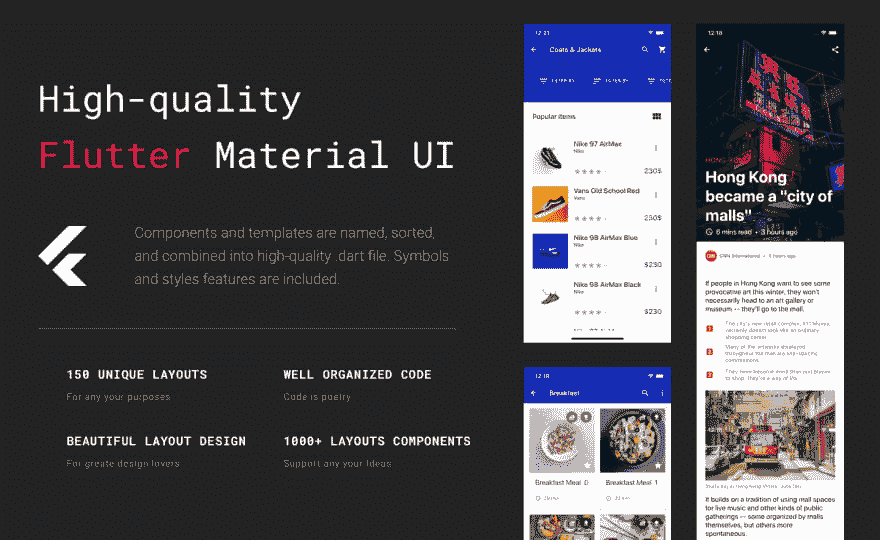
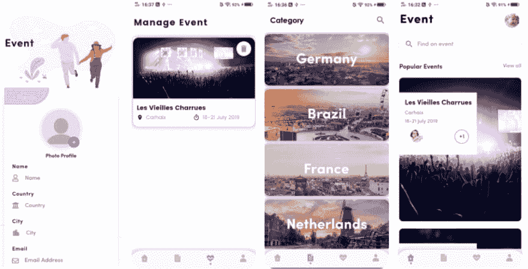
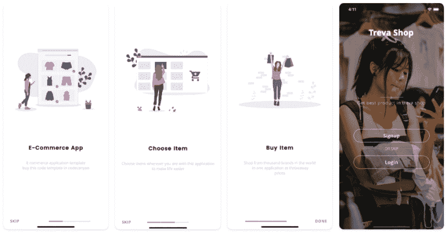
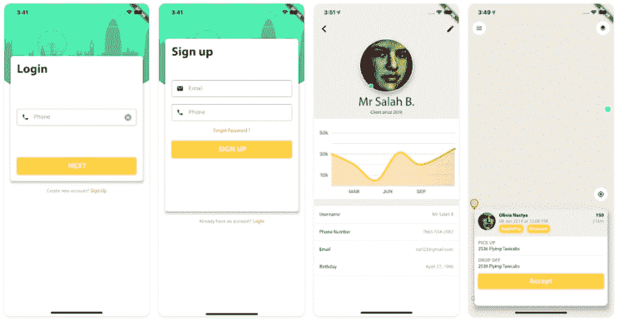
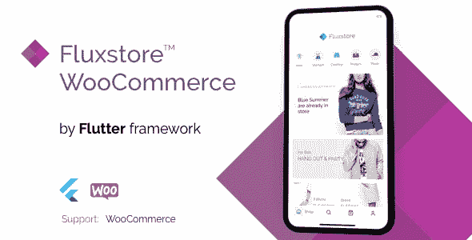
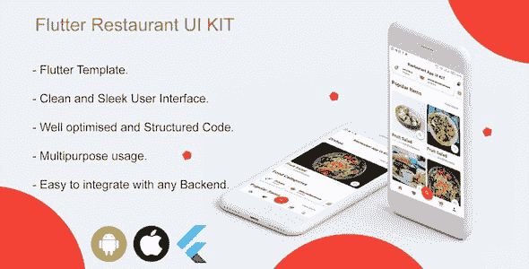

# 最佳 Flutter 应用模板

> 原文：<https://dev.to/pablonax/best-flutter-app-templates-o64>

介绍:6 个最好的应用程序模板。由 Google 驱动的流行的移动应用程序开发框架。Flutter 很快在开发人员中流行起来，因为它允许您为两个操作系统编写一次代码，具有与自己的应用程序相同的高性能，并且还具有为任何设计灵活定制用户界面的能力。这里有一些模板可供选择:

  

## [1)基于材料设计的多用途颤振模板](https://code.market/product/flutter-material-design-ui/?utm_source=dev&utm_medium=article&utm_campaign=best_flutter_apps)

 基于材料设计库的现成多用途颤振模板，用于个人和商业项目。所有组件和布局都基于谷歌在材料设计指南中描述的原则。
多用途颤振模板是最大的移动模板，用户流量贴心，设计现代清新。此模板是为连接在线商店的后端而准备的。
这个颤振模板是设计、便利性和技术的折中！

  

## [2)事件国家–事件管理颤振模板与 firebase 后端](https://code.market/product/event-country-event-management-flutter-template-with-firebase-backend/)

Event Country–Flutter 事件应用程序模板可用于 Android 和 iOS 设备中的事件管理应用程序，易于设置和上手。这将节省 1000 多个小时的开发时间来创建 UI、前端和后端。

  

## [3) Treva Shop -电子商务 UI 套件使用旋舞](https://code.market/product/treva-shop-e-commerce-ui-kit-using-flutter/)

Treva Shop 是一个用于所有电子商务任务的完整的 flutter 用户界面。现成的导航符合现代在线商店和应用程序的标准。电子商务需要的屏幕都有。非凡的功能中，甚至实现了聊天屏幕，也有下载图片的占位符。

  

## [4)旋舞出租车司机应用 UI 套件](https://code.market/product/flutter-taxi-app-driver-ui-kit/)

Flutter Taxi App Driver 是一个完整的 UI 套件应用程序，用于接收运送乘客的订单。该应用程序有一个内置的导航器，供司机通过谷歌方向服务方向连接。已经建立了一个包含司机出行统计数据的个人账户。有一个通知和支付屏幕系统。要将地图和导航器连接到应用程序，只需将 API 键插入到准备好的文件中。

  

## [5)flux store woo commerce-完整的旋舞电子商务 App](https://code.market/product/fluxstore-woocommerce-flutter-e-commerce-full-app/)

完整的电子商务应用程序与您的 WooCommerce 商店兼容。

有现成的脸书登录系统和短信注册系统。firebase 提供分析和推送通知系统。与服务器即时同步。引入了商品类别和属性过滤器，开发了订购系统。

## [6)旋舞手机餐厅 UI 套件](https://code.market/product/flutter-mobile-restaurant-ui-kit/)

Flutter 移动餐厅 UI KIT 是一个标准的精心设计的餐厅 app 模板。简单直观的设计，具有餐馆应用程序所需的基本功能。有许多基本功能，如登录系统和菜肴选择，以及订单交付和支付。应用程序准备连接后端。

更多[颤振模板](https://code.market/category/flutter/)。

### 如何将您的商品纳入我们的选择范围？

1.  在此提交你在市场上的物品[。](https://code.market/submit/)
2.  我们按照优先顺序向系列中添加新产品。