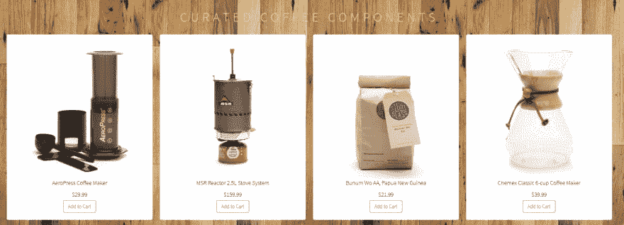
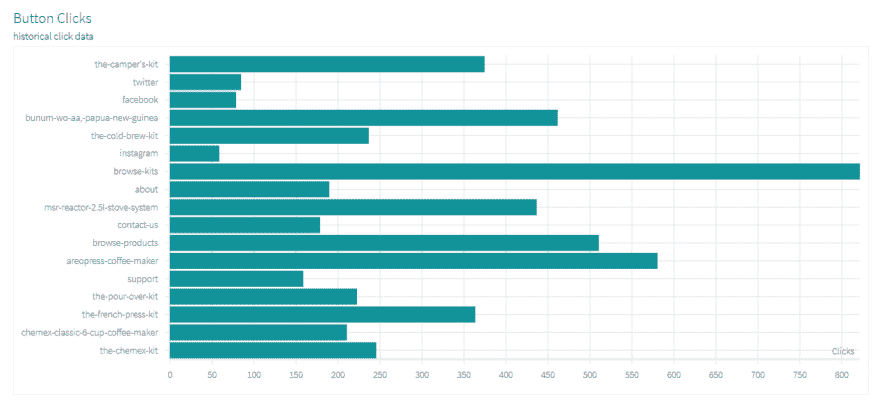

# 事件驱动的微服务架构的最佳实践

> 原文：<https://dev.to/heroku/best-practices-for-event-driven-microservice-architecture-2lh7>

如果您是一名企业架构师，您可能听说过并使用过微服务架构。虽然您过去可能使用 REST 作为服务通信层，但是越来越多的项目正在转向事件驱动的架构。让我们深入探讨这种流行架构的优缺点，它所包含的一些关键设计选择，以及常见的反模式。

## 什么是事件驱动的微服务架构？

在事件驱动架构中，当一个服务执行一些其他服务可能感兴趣的工作时，该服务会产生一个事件——所执行操作的记录。其他服务使用这些事件，这样它们就可以执行事件所需的任何自己的任务。与 REST 不同，创建请求的服务不需要知道使用请求的服务的细节。

这里有一个简单的例子:当在电子商务网站上下单时，会产生一个“下单”事件，然后由几个微服务消费:

1)可以将订单记录写入数据库的订单服务
2)可以创建客户记录的客户服务，以及
3)可以处理付款的付款服务。

事件可以通过多种方式发布。例如，它们可以被发布到一个队列中，该队列保证将事件传递给适当的消费者，或者它们可以被发布到一个“发布/订阅”模型流中，该模型流发布事件并允许所有相关方访问。在这两种情况下，生产者发布事件，消费者接收事件，并做出相应的反应。请注意，在某些情况下，这两个角色也可以称为发布者(生产者)和订阅者(消费者)。

## 为什么使用事件驱动架构

与 REST 相比，事件驱动架构有几个优势，包括:

*   异步——基于事件的架构是异步的，没有阻塞。这允许资源在他们的工作单元完成后自由地移动到下一个任务，而不用担心之前发生了什么或者接下来会发生什么。它们还允许对事件进行排队或缓冲，这可以防止消费者对生产者施加反压力或阻止他们。

*   松散耦合——服务不需要(也不应该)了解或依赖于其他服务。当使用事件时，服务独立运行，不知道其他服务，包括它们的实现细节和传输协议。事件模型下的服务可以更容易地独立更新、测试和部署。

*   易于扩展——由于服务在事件驱动的架构下是分离的，并且服务通常只执行一项任务，因此跟踪特定服务的瓶颈并扩展该服务(并且仅扩展该服务)变得很容易。

*   恢复支持——带有队列的事件驱动架构可以通过“重放”过去的事件来恢复丢失的工作。当消费者需要恢复时，这对于防止数据丢失很有价值。

当然，事件驱动架构也有缺点。通过分离关注点，它们很容易被过度工程化，当紧密耦合时，关注点可能更简单；可能需要大量前期投资；并且经常导致基础设施、服务合同或模式、多语言构建系统和依赖图的额外复杂性。

也许最大的缺点和挑战是数据和事务管理。由于它们的异步特性，事件驱动模型必须小心地处理服务之间不一致的数据、不兼容的版本、注意重复的事件，并且通常不支持 ACID 事务，而是支持[最终一致性](https://en.wikipedia.org/wiki/Eventual_consistency)，这可能更难以跟踪或调试。

即使有这些缺点，事件驱动架构通常是企业级微服务系统的更好选择。优点——可扩展、松散耦合、开发运营友好的设计——超过了缺点。

## 什么时候使用 REST

然而，有时候 REST/web 界面可能仍然是更好的:

*   您需要一个同步请求/回复接口
*   对于强大的事务，您需要方便的支持
*   你的 API 是公开的
*   您的项目很小(REST 的设置和部署要简单得多)

## 您最重要的设计选择–消息传递框架

一旦你决定了一个事件驱动的架构，是时候选择你的事件框架了。事件的产生和消费方式是系统中的一个关键因素。有许多成熟的框架和选择，选择正确的需要时间和研究。

您的基本选择归结为消息处理或流处理。

### 消息处理

在传统的消息处理中，组件创建一条消息，然后将它发送到一个特定的(通常是单一的)目的地。一直处于空闲和等待状态的接收组件接收消息并相应地采取行动。通常，当消息到达时，接收组件执行单个进程。然后，邮件被删除。

消息处理体系结构的一个典型例子是消息队列。尽管大多数较新的项目使用流处理(如下所述)，但是使用消息(或事件)队列的架构仍然很流行。消息队列通常使用代理的“存储和转发”系统，事件在代理之间传递，直到到达适当的消费者。ActiveMQ 和 [RabbitMQ](https://www.rabbitmq.com/) 是消息队列框架的两个流行例子。这两个项目都有多年的使用经验和成熟的社区。

### 流处理

另一方面，在流处理中，组件在达到某个状态时会发出事件。其他感兴趣的组件监听事件流中的这些事件，并做出相应的反应。事件不针对某个接收者，而是对所有感兴趣的组件可用。

在流处理中，组件可以同时对多个事件做出反应，并对多个流和事件应用复杂的操作。有些流包含持久性，事件在流中停留的时间视需要而定。

通过流处理，系统可以再现事件的历史，在事件发生后联机并对其做出反应，甚至执行滑动窗口计算。例如，它可以从每秒事件流中计算每分钟的平均 CPU 使用率。

最流行的流处理框架之一是 Apache Kafka。Kafka 是许多项目使用的成熟稳定的解决方案。它可以被认为是一个首选的工业级流处理解决方案。Kafka 有一个庞大的用户群，一个有用的社区，和一个进化的工具集。

### 其他选择

还有其他框架，它们要么提供流和消息处理的组合，要么提供自己独特的解决方案。例如，Apache 的新产品 [Pulsar](https://pulsar.apache.org/) 是一个开源的发布/订阅消息系统，支持流和事件队列，都具有极高的性能。Pulsar 功能丰富，提供多租户和地理复制，因此也很复杂。据说 Kafka 的目标是高吞吐量，而 Pulsar 的目标是低延迟。

[NATS](https://nats.io/) 是一个具有“合成”队列的替代发布/订阅消息系统。NATS 是为发送小而频繁的信息而设计的。它提供了高性能和低延迟。然而，NATS 认为一定程度的数据丢失是可以接受的，性能优先于交付保证。

## 其他设计注意事项

一旦你选择了你的事件框架，这里有几个其他的挑战需要考虑:

*   活动采购

    很难实现松散耦合的服务、不同的数据存储和原子事务的组合。一个可能有帮助的模式是[事件源](https://martinfowler.com/eaaDev/EventSourcing.html)。在事件源中，从不直接对数据执行更新和删除；相反，实体的状态变化被保存为一系列事件。

*   CQRS

    上述事件源引入了另一个问题:由于状态需要从一系列事件中构建，查询可能会很慢且复杂。命令查询责任分离( [CQRS](https://www.martinfowler.com/bliki/CQRS.html) )是一种设计解决方案，它要求插入操作和读取操作有独立的模型。

*   发现事件信息

    事件驱动架构中最大的挑战之一是对服务和事件进行编目。在哪里可以找到事件描述和细节？一个事件的原因是什么？什么团队创造了这个事件？他们正在积极努力吗？

*   应对变化

    事件模式会改变吗？如何在不中断其他服务的情况下更改事件模式？随着服务和活动数量的增加，如何回答这些问题变得至关重要。成为一个好的事件消费者意味着为变化的模式编码。成为一个好的事件生产者意味着认识到您的模式变化如何影响其他服务，并创建设计良好的事件，并清楚地记录下来。

*   内部部署与托管部署

    不管您的事件框架如何，您还需要决定是自己在本地部署框架(消息代理的操作并不简单，尤其是在高可用性的情况下)，还是使用托管服务，比如 Heroku 上的 [Apache Kafka。](https://www.heroku.com/kafka)

## 反模式

和大多数架构一样，事件驱动的架构有自己的一套反模式。这里有一些需要注意的地方。

*   好事过头反成坏事

    注意不要对创建事件过于兴奋。创建太多的事件会在服务之间产生不必要的复杂性，增加开发人员的认知负荷，使部署和测试更加困难，并导致事件消费者的拥挤。不是每个方法都需要成为一个事件。

*   一般事件

    无论是在名称上还是在目的上，都不要使用通用事件。您希望其他团队了解您的活动为什么存在，它应该用于什么，以及应该在什么时候使用。事件应该有特定的目的，并相应地命名。具有通用名称的事件，或者具有混淆标志的通用事件会导致问题。

*   复杂依赖图

    注意相互依赖的服务，它们会创建复杂的依赖图或反馈循环。每个网络跃点都会给原始请求增加额外的延迟，尤其是离开数据中心的北/南网络流量。

*   取决于保证订单、交付或副作用

    事件是异步的；因此，包含顺序或重复的假设不仅会增加复杂性，而且会抵消基于事件的体系结构的许多关键优势。如果您的使用者有副作用，比如在数据库中添加值，那么您可能无法通过重放事件来恢复。

*   过早优化

    大多数产品开始时规模很小，随着时间的推移而增长。虽然您可能梦想将来需要扩展到一个大型复杂的组织，但是如果您的团队很小，那么事件驱动架构增加的复杂性实际上可能会降低您的速度。相反，考虑用简单的体系结构设计您的系统，但包括必要的关注点分离，以便您可以随着需求的增长而替换它。

*   期待事件驱动来修复一切

    从技术层面来说，不要指望事件驱动架构能解决所有问题。虽然这种架构肯定可以改善许多领域的技术功能障碍，但它无法修复核心问题，如缺乏自动化测试、团队沟通不畅或过时的开发-运营实践。

## 了解更多

理解事件驱动架构的优点和缺点，以及一些最常见的设计决策和挑战，是创建最佳设计的重要部分。

如果您想了解更多，请查看这个[事件驱动的参考架构](https://devcenter.heroku.com/articles/event-driven-microservices-with-apache-kafka)，它允许您在 Heroku 上只需点击一下鼠标就可以部署一个工作项目。这个参考架构创建了一个销售虚拟咖啡产品的网络商店。

产品点击作为事件被跟踪并存储在 Kafka 中。然后，它们由报告仪表板使用。

代码是开源的，所以你可以根据你的需要修改它，并运行你自己的实验。