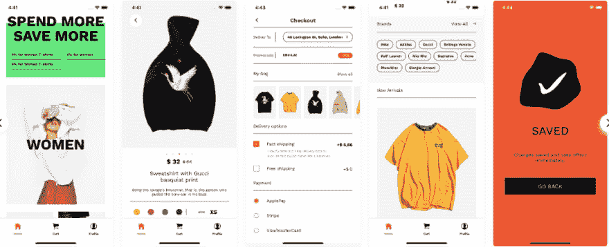
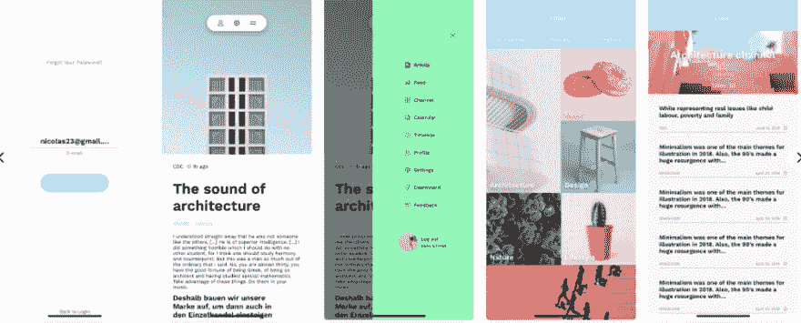
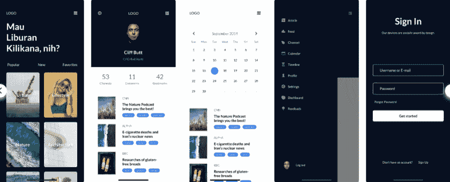
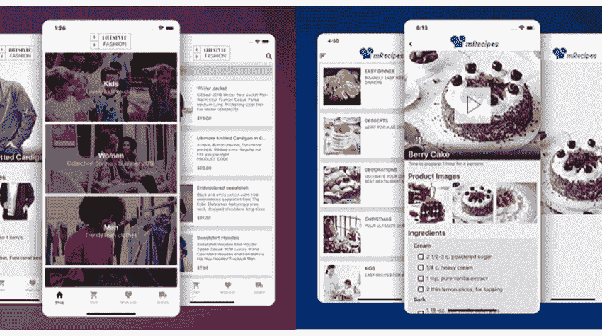

# 最佳反应本地模板 2020[更新]

> 原文：<https://dev.to/pablonax/best-react-native-templates-2019-3b1d>

React Native 因一个显而易见的动机而名声大噪:它允许构建者在完全不同的细胞工作程序中编写代码。这意味着你不需要从零开始为 iOS 和 Android 开发相同的应用程序，也不需要专注于一个或相反的工作系统。现在你可以用构建网络应用程序所用的高效 JavaScript 应用科学为每个平台编写应用程序。在本文中，我们将向您展示最好的 [react 原生模板](https://code.market/category/react-native/)和初学者工具包 2020

由 Fb 首创并作为开放供应推出的 [React Native](https://facebook.github.io/react-native/) 正被 Fb、Instagram、网飞、Airbnb 和许多其他应用程序使用。，可能只是从一种能量到另一种能量。
Best react 本地模板和初学者工具包 2020 可在 [code.market](http://code.market) 购买

### [Airmart - react 原生电商 app 模板](https://code.market/product/airmart-ecommerce-app-template/)

这是 React Native 有史以来最大的电子商务应用程序模板。开发人员最大限度地利用了 WooCoomerce 经典功能带来的机会，为移动应用市场创造了新的标准。应用程序模板通过几次点击连接到 WordPress 和 WooCoomerce，并开始开箱即用。应用程序模板支持购物车、配置文件、基本 WooCommerce 用户文件柜、再订购功能、产品属性。如果你用 WooCommerce。

### [Mira–React 本地模板&初学者工具包](https://code.market/product/mira-react-native-template-starter-kit/)

Mira–React 本机模板。有一个面向移动应用开发者的入门模板。该模板是开发人员入门应用程序的理想选择。

它的设计使得在您的项目中尽可能容易地使用初学者工具包的现成组件。这里很容易改变颜色，它们被缝入变量。米拉初学者工具包容易改变你所需要的。这是一个非常快速的应用程序，没有缓慢和滞后。

### [Gala–React 本地引导模板](https://code.market/product/gala-react-native-bootstrap-template/)

gala–React 原生模板有一个面向移动应用开发者的入门模板。这个模板是用 bootstrap react 本地框架创建的，它允许完全自定义设计和可视化。

### [MStore 专业版](https://code.market/product/mstore-pro-complete-react-native-template-for-e-commerce/)

MStore Professional 是 code.market 上提供的一个重要的广泛使用的 React 本机应用程序模板，它允许客户将他们目前的在线商店转变为手机零售商应用程序。

MStore professional finest react 原生模板

模板不需要编码专业知识，定制起来非常简单。它完全内置了 WordPress 和 WooCommerce，帮助 PayPal、Stripe 和 COD，并允许客户使用他们的 Fb 帐户登录。人阿比巴维斯说:“上乘的产品，不错的帮助！热爱代码的标准，以及最终的输出。我想我可以给超过 5 颗星！”]

### [App 平台](https://code.market/product/app-platform-all-in-one-react-native-universal-mobile-app/)

Platform solely 于 1 月份上市，但已经是今年 Code Marketplace 上最畅销的应用模板之一。这完全有可能是因为它是许多应用程序的捆绑包，符合相同的设计和编码样本，它允许构建者创建任何种类的应用程序以及食谱、餐厅、场合和/或购买应用程序。

]  App 平台—最优秀的 react 原生模板

作为这个捆绑包的一部分，开发者还可以获得 Firebase 管理面板来管理所有的应用程序。从这里你可以处理应用程序的内容材料，结构和设计，发送推送通知，并处理订单。

### [BeoNews](https://code.market/product/beonews-pro-react-native-mobile-app-for-wordpress/)

目前，这是该课程中最畅销和评价最高的模板之一。BeoNews 允许客户转换其 WordPress 网站上的任何内容材料。连同视频、照片和博客，都集成到一个手机应用程序中。BeoNews 在 Firebase 上销售消费者知识，并通过小工具进行同步。

BeoNews—最好的 react 原生模板

人牛科技说:

“光荣的帮助！代码优秀清晰。最好的 WordPress 来应对市场上现有的本地风险。”

## [图图](https://code.market/product/tudu-a-react-native-todo-list/)

随着我们高要求的工作和繁忙的家庭生活，生产力应用程序成为众多最热门的手机应用程序也就不足为奇了。

Tudu–React 原生模板
这个巧妙命名的 Tudu React 原生应用模板旨在帮助构建者创建一个简单、高效的应用程序，吸引广大客户。该应用程序包括一个闪屏显示屏幕，离线存储，完成或带走小工具的滑动动作，见解图表和额外的。

### [吉卡普](https://code.market/product/gikapp-react-native-mobile-app-for-wordpress/)

如果建议快速简单地将 WordPress 或 Shopify 网站转换成熟练且功能齐全的手机应用程序，gikApp React 原生手机应用程序模板是不错的选择。

gik app–React 原生模板
创作者呈现一步一步的视频指导。如果你碰巧确定这款应用最适合你，你可能会从免费试用中受益，并在购买前试用一下。

**模板消费者** phowr **说:**

> 我决定利用 gikApp 为我的 spa 企业构建一个单元。像景点一样工作。非常容易，没有滞后。

### [防污](https://code.market/product/antiqueruby-react-native-material-design-ui-components/)

Vintage ruby 是每个应用开发者的梦想。该应用程序模板是市场上的另一个新人，旨在通过为开发者提供时尚智能的用户界面和 UX 部件来定制他们的应用程序，从而节省他们的劳动时间。

 仿古——反应原生成分

利用材料设计创建，并提供超过 140 个轮廓屏幕。登录、注册、社交媒体、导航和许多其他功能。毫不奇怪，Antiqueruby 已经成为所有 CodeMarket 畅销书中的一员。

### [ListApp](https://code.market/product/listapp-listing-directory-mobile-app-by-react-native/)

ListApp 是一个很好的 React 原生应用程序模板，适用于试图创建任何包含内容材料的应用程序的构建者。它接受列表的类型。如果你真的想为最高级的餐饮场所、商店、景点等创建一个应用程序。在一个特定的空间，这可以成为你的模板。

ListApp–React 原生模板
该应用程序提供的一些关键选项包括地图和预订选项。社交登录，以及追踪预订的能力。

人称 harik567 的人说:

> 设计实际上是好的，而精确的 UIUX 需要一些工作。完全可定制，构建在稳定的代码基础上。要开发的产品正在构建一个库存清单。

### [beui](https://code.market/product/beostore-complete-mobile-ui-template-for-react-native/)

BeoUI 是一款面向电子商务的 React 原生应用模板。该模板侧重于创建一个易于使用的漂亮的消费者界面。

其最大的选择是具有视差效果的介绍网页，它的记录或两列视图的替代方案。产品幻灯片，其选择的类别，以及个人资料网页。消费者可以监控他们的订单、获得通知或创建想要的记录的地方。

### [仪表板](https://code.market/product/beonboard-complete-onboarding-template-for-react-native-app/)

第一印象依赖于。用 BeOnboard 修饰你的应用程序的初步外观。一套 18 个 React 原生应用程序模板，设计用于任何应用程序。向新客户阐明应用的性能。

该模板易于定制和使用，旨在提供令人难以置信的消费者界面和专业知识。

### 结论

这些应用程序模板只是简单地在 code.market 上搜索商品。如果没有一个能引起你的兴趣，那里有许多不同的好选择来满足你的好奇心。如果你想提高你的专业知识，建造[反应自然](https://code.market/category/react-native/)的目的。试试我们提供的非常有用的免费教程。