# 最佳 Visual Studio 代码扩展

> 原文：<https://dev.to/thomasardal/best-visual-studio-code-extensions-1eeb>

扩展你的 IDE 是新的趋势，我们在日常工作中每天都会使用很多扩展。以前，我们使用了许多不同的开发工具(与 Visual Studio 一起)，但当微软推出了 [Visual Studio 代码](https://code.visualstudio.com/)时，这种情况发生了变化。我们还没有取代 Visual Studio，但它对我们开发过程的某些方面很有帮助。我们使用代码快速预览文件，编写 markdown，非 C#编程，快速原型，等等。这篇文章总结了我们发现的所有能让代码更好的不同扩展。

扩展名是按名称排序的，因为我不知道我最喜欢哪个😂

* * *

## [自动关闭标签](https://marketplace.visualstudio.com/items?itemName=formulahendry.auto-close-tag)和[自动重命名标签](https://marketplace.visualstudio.com/items?itemName=formulahendry.auto-rename-tag)

我一般不会用 VSCode 写 HTML，因为 Visual Studio 2017 中的 HTML 编辑器相当牛逼。然而，使用这两个来自韩军的扩展，会给你很多相同的代码体验。自动关闭标签会自动添加一个关闭标签，随着时间的推移，这可以为您节省大量的击键次数，而自动重命名标签会自动重命名关闭的标签。令人惊讶的是，像这样微小的改进却能带来巨大的变化。

[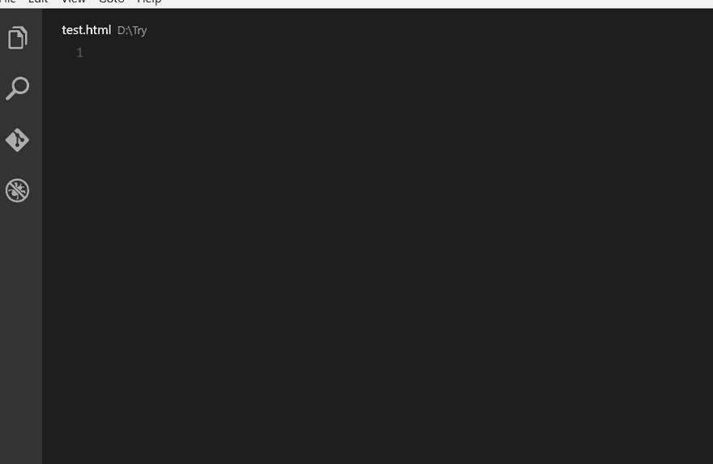](https://res.cloudinary.com/practicaldev/image/fetch/s--Ko9gmpEJ--/c_limit%2Cf_auto%2Cfl_progressive%2Cq_66%2Cw_880/https://blog.elmah.io/conteimg/2018/05/auto-close-tag.gif)

[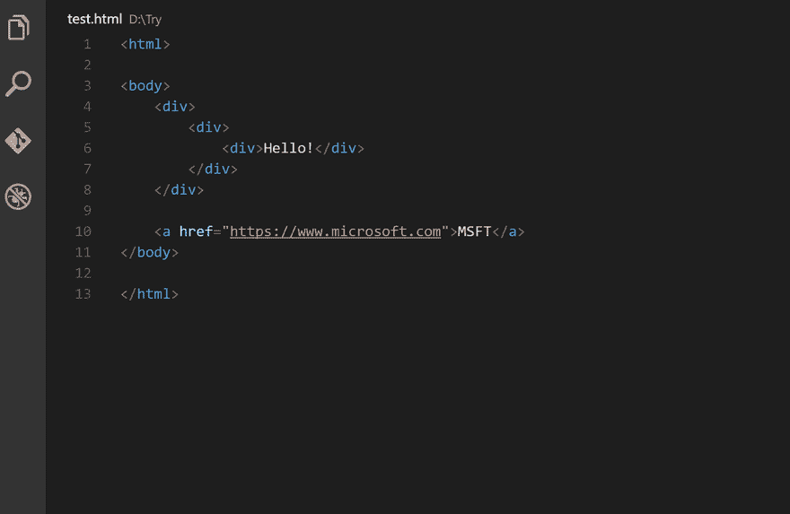](https://res.cloudinary.com/practicaldev/image/fetch/s--payaN27g--/c_limit%2Cf_auto%2Cfl_progressive%2Cq_66%2Cw_880/https://blog.elmah.io/conteimg/2018/05/auto-rename-tag.gif)

* * *

## [天蓝色功能](https://marketplace.visualstudio.com/items?itemName=ms-azuretools.vscode-azurefunctions)

很多 elmah.io 内部都是作为 Azure 函数编写的。我不会在这里详细介绍函数，除了告诉你它们有多棒(我们已经写了一系列关于开发和登录 Azure 函数的文章)。我们仍然使用 Visual Studio 来维护功能，因为工具更好，但我可以看到微软在代码支持方面的发展方向。

[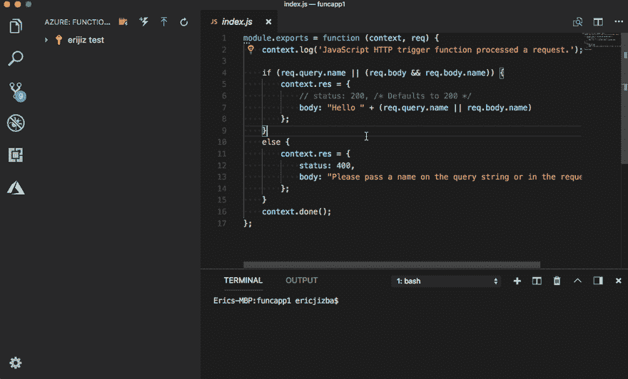](https://res.cloudinary.com/practicaldev/image/fetch/s--GSyzJEIx--/c_limit%2Cf_auto%2Cfl_progressive%2Cq_66%2Cw_880/https://blog.elmah.io/conteimg/2018/05/azure-functions.gif)

* * *

## [C#](https://marketplace.visualstudio.com/items?itemName=ms-vscode.csharp)

等一下！用代码开发 C#需要扩展？由于代码支持多种编程语言，C#支持就像任何其他语言的扩展。这很可能是你作为. NET dev 安装的第一个扩展；)

* * *

## [电码奔跑者](https://marketplace.visualstudio.com/items?itemName=formulahendry.code-runner)

韩军开发了另一个有用的扩展，叫做 Code Runner。我经常发现自己需要尝试几行 C#或 JavaScript 代码。与启动 LINQPad for C#或 Chrome dev tools for JavaScript 不同，Code Runner 可以在代码中执行一行或多行突出显示的代码。体验不如在 LINQPad 中那么棒，但触手可及。

* * *

## [代码拼写检查器](https://marketplace.visualstudio.com/items?itemName=streetsidesoftware.code-spell-checker)

有些人不介意，有些人介意。我总是犯拼写错误，我喜欢它们被纠正，即使是在代码中。代码拼写检查器适用于大多数代码文件，甚至是 Markdown。

[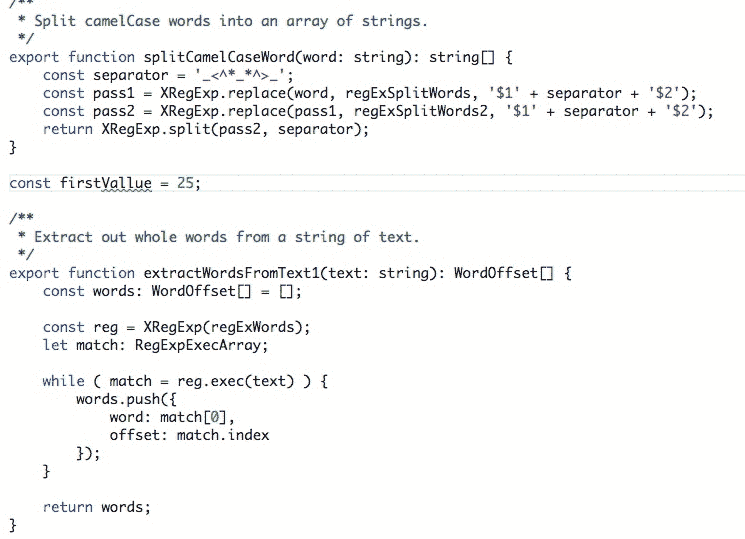](https://res.cloudinary.com/practicaldev/image/fetch/s--9w1UvlcF--/c_limit%2Cf_auto%2Cfl_progressive%2Cq_66%2Cw_880/https://blog.elmah.io/conteimg/2018/05/code-spell-checker.gif)

* * *

## [Chrome 的调试器](https://marketplace.visualstudio.com/items?itemName=msjsdiag.debugger-for-chrome)

如果需要调试 JavaScript，不需要留下代码。调试器 Chrome(微软发布)，让你直接在代码中调试你的源文件。Visual Studio 中也有类似的解决方案，但整个体验在代码中要流畅得多。

* * *

## [德拉库拉主题](https://marketplace.visualstudio.com/items?itemName=dracula-theme.theme-dracula)

代码中的一个优点是可以定制用户界面。Visual Studio 中也有主题，但除了微软提供的主题之外，它从未真正发挥作用。我不知道确切的原因，但我不断回到德古拉主题(在许多 ide 中有效),代码也不例外。看，妈妈，我穿着德古拉的皮肤真漂亮。

[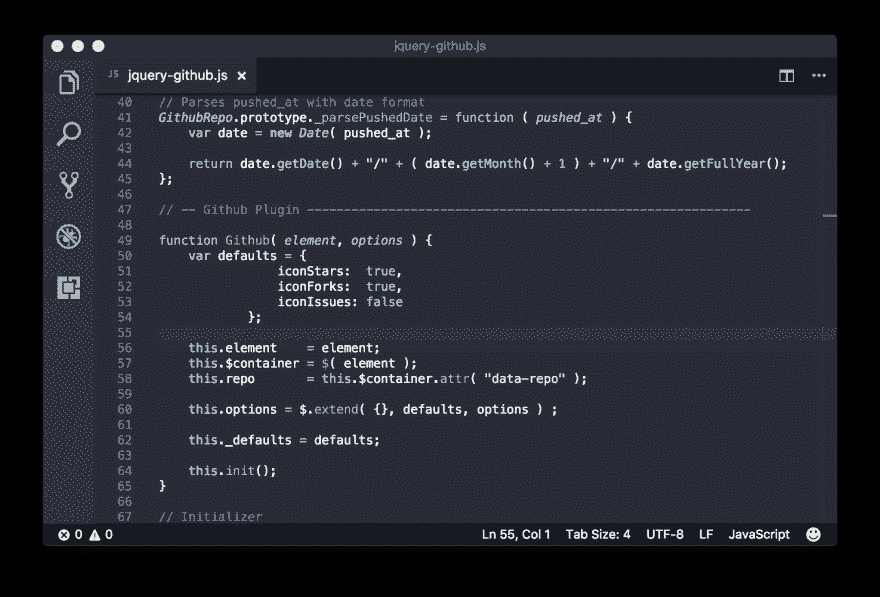](https://res.cloudinary.com/practicaldev/image/fetch/s--D9I_XTsj--/c_limit%2Cf_auto%2Cfl_progressive%2Cq_auto%2Cw_880/https://blog.elmah.io/conteimg/2018/05/dracula.png)

* * *

## [VS 代码的编辑配置](https://marketplace.visualstudio.com/items?itemName=EditorConfig.EditorConfig)

在整个团队或组织中共享代码样式设置，在 Visual Studio 中总是一团糟。几年前，我试着写一个指南，但是现在的解决方案仍然是手持的。EditorConfig 通过将配置提取到一个可以添加到源代码控制的配置文件中来解决这个问题。这个扩展增加了对 EditorConfig 内部代码的支持。

## [GitLens](https://marketplace.visualstudio.com/items?itemName=eamodio.gitlens)

我必须承认，我没有在代码或 Visual Studio 中使用 Git。我不是一个命令提示迷，但是 PoshGit 这些年来对我来说非常有用。GitLens 希望在代码中引入一些不错的 Git 特性，所以计划在某个时候检验一下。

[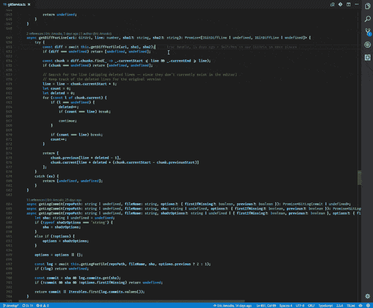](https://res.cloudinary.com/practicaldev/image/fetch/s--9rPVL51J--/c_limit%2Cf_auto%2Cfl_progressive%2Cq_66%2Cw_880/https://blog.elmah.io/conteimg/2018/05/gitlens.gif)

* * *

## [图标字体](https://marketplace.visualstudio.com/items?itemName=idleberg.icon-fonts)

精彩的 Visual Studio 扩展 Glyphfriend 不能用于代码，但幸运的是，有人制作了图标字体。它带来了 IntelliSense，用于在代码中引用常见的图标字体，如 FontAwesome 和 Glyphicons。

[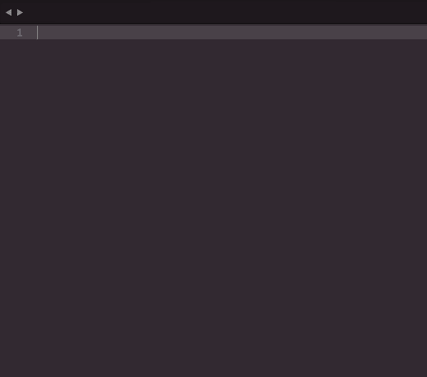](https://res.cloudinary.com/practicaldev/image/fetch/s--SoZybO-f--/c_limit%2Cf_auto%2Cfl_progressive%2Cq_66%2Cw_880/https://blog.elmah.io/conteimg/2018/05/icon-fonts.gif)

* * *

## [HTML 中 CSS 类名的智能感知](https://marketplace.visualstudio.com/items?itemName=Zignd.html-css-class-completion)

在代码中进行 HTML 开发的另一个有用的扩展是 CSS 智能感知扩展。显示可用 CSS 类的弹出窗口是 Visual Studio 的内置功能，作为一名 web 开发人员，您会在代码中错过这一功能。这个扩展也将 CSS 智能感知引入到代码中。

[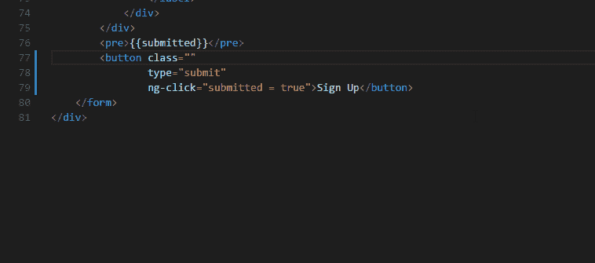](https://res.cloudinary.com/practicaldev/image/fetch/s--YXDKfEgv--/c_limit%2Cf_auto%2Cfl_progressive%2Cq_66%2Cw_880/https://blog.elmah.io/conteimg/2018/05/css-intellisense.gif)

* * *

## [jshint](https://marketplace.visualstudio.com/items?itemName=dbaeumer.jshint)

编写 JavaScript 可能很难(是的，它可以！).幸运的是，有 JSHint 这样的工具可用。JSHint 是一个 JavaScript 代码质量工具，可以突出代码中的潜在问题。使用 jshint 扩展，JSHint 的输出在代码内部是可见的。

* * *

## [打开文件](https://marketplace.visualstudio.com/items?itemName=Fr43nk.seito-openfile)

代码有`Ctrl` +👆Word 内置的导航功能，如 HTML 和 Markdown 等编辑器。当鼠标悬停在一个链接上时，您可以点击`Ctrl`并点击鼠标导航到该链接。我一直在寻找一个扩展，使这在任何编辑器和支持网址和文件系统路径。我见过的最接近的，是弗兰克·斯图泽开发的 Open file。您必须标记路径并使用上下文菜单，但这很有效。任何更好的建议，将不胜感激！

[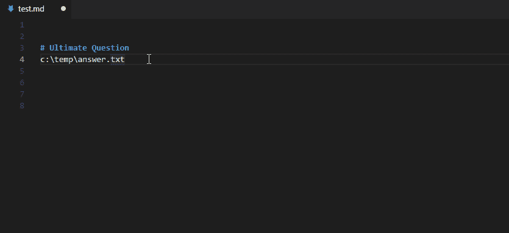](https://res.cloudinary.com/practicaldev/image/fetch/s--L4Biq79V--/c_limit%2Cf_auto%2Cfl_progressive%2Cq_66%2Cw_880/https://blog.elmah.io/conteimg/2018/08/open-file.gif)

* * *

## [粘贴 JSON 为代码](https://marketplace.visualstudio.com/items?itemName=quicktype.quicktype)

Visual Studio 中“老”的将 JSON 作为代码粘贴的特性也出现在代码中。将 JSON 粘贴为 C#(或其他受支持的语言之一)可能不是您每天都需要做的事情。但是当你这样做的时候，这是一个很好的小工具。

[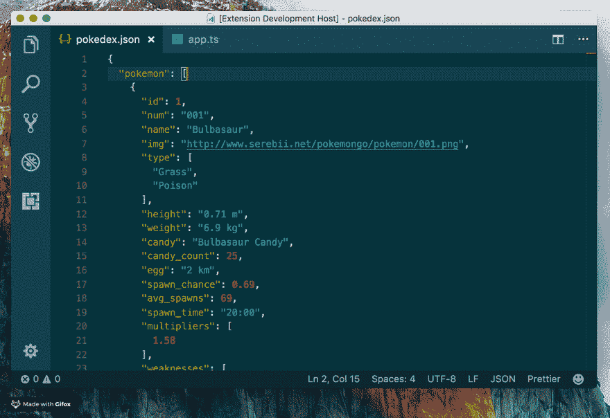](https://res.cloudinary.com/practicaldev/image/fetch/s--N6IxLexJ--/c_limit%2Cf_auto%2Cfl_progressive%2Cq_66%2Cw_880/https://blog.elmah.io/conteimg/2018/05/paste-json-as-code.gif)

* * *

## [休息客户端](https://marketplace.visualstudio.com/items?itemName=humao.rest-client)

我是 Postman 的忠实粉丝，用它来处理大多数需要测试的 HTTP 请求。但是 REST Client 实际上是拥有内部代码的一个很好的选择。REST 客户端提供了许多与 Postman 相同的特性，响应可以直接在代码中看到。

* * *

## [待办事宜高亮](https://marketplace.visualstudio.com/items?itemName=wayou.vscode-todo-highlight)

我完全承认！我有时会在代码中写 TODO 和 FIXME，然后就忘得一干二净。几个月后，我发现了一个确实应该修复的待办事项。有了待办事项高亮显示，实际看到待办事项会有更好的变化。

[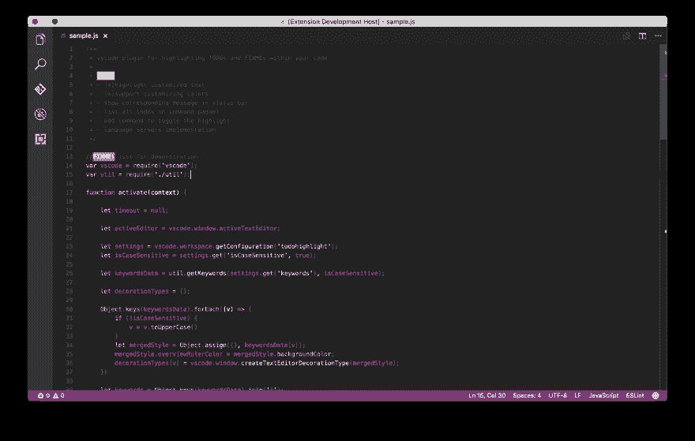](https://res.cloudinary.com/practicaldev/image/fetch/s--X3c9BpFW--/c_limit%2Cf_auto%2Cfl_progressive%2Cq_auto%2Cw_880/https://blog.elmah.io/conteimg/2018/05/todo.png)

* * *

## [Visual Studio 键盘图](https://marketplace.visualstudio.com/items?itemName=ms-vscode.vs-keybindings)

微软的另一个扩展，将你的 Visual Studio 键盘快捷键带入代码中。更改 IDE 最常见的问题之一是学习一套全新的快捷方式(多年前从 Eclipse 切换到 Visual Studio 仍然是噩梦)。使用 Visual Studio 键映射，代码对所有重叠的功能使用相同的快捷键。如果您是从代码开始，我不推荐这样做，但是对于像我一样的老一代 Visual Studio 用户来说，这是一个非常棒的扩展。

* * *

## [vscode-icons](https://marketplace.visualstudio.com/items?itemName=robertohuertasm.vscode-icons)

与我们为 Visual Studio 强调的文件图标扩展非常相似，vscode-icons 将文件类型图标引入代码中。你可能认为这没关系，但那只是在你试过之后。文件图标让你导航更快。

* * *

你怎么想呢?你最喜欢的代码扩展是什么？有什么我忘在单子上的吗？通过右下角的支持窗口联系我，我可能会把你的扩展添加到:D 邮报

你可能也喜欢[棒极了。参加](https://blog.elmah.io/great-dot-net-conferences-to-attend/)和[的网络会议。网志跟随——终极清单](https://blog.elmah.io/net-blogs-to-follow-the-ultimate-list/)。

## 你的用户会喜欢更少的错误吗？

elmah.io 是一个简单的错误记录和正常运行时间监控服务。NET web 和日志框架。

➡️ [错误监控。NET 网络应用](https://elmah.io/?utm_source=devto&utm_medium=social&utm_campaign=devtoposts) ⬅️

这篇文章最初出现在 elmah.io 的博客上，时间是[https://blog.elmah.io/best-visual-studio-code-extensions/](https://blog.elmah.io/best-visual-studio-code-extensions/)