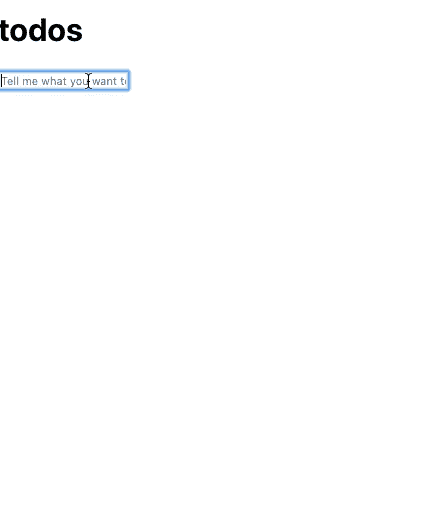

# 使用 React 钩子进行状态管理的最佳方式

> 原文：<https://dev.to/theodesp/best-ways-to-use-react-hooks-for-state-management-44h3>

[**阅读原文**](https://codethat.today/article/react-hooks-state-management/)

React 钩子已经存在一段时间了，所以我借此机会探索我们如何用它们来处理状态管理。我的目的是了解当我们计划在实践中大规模使用它们时，什么是有效的，什么是无效的。

我已经回顾了一些选项和技术，连同一些解释和批评。你可以在这个 [GitHub Repo](https://github.com/theodesp/react-hook-state-management) 中找到一些这样的例子。

## 基数举例

在开始之前，让我们描述一下我们将在后续部分中使用的初始组件。

假设我们有一个 Todo 应用程序。我们有以下简化的容器和组件结构:

首先是包含 TodoList 输入表单的`Header`。

```
type HeaderProps = {
  addTodo?: (text: string) => void;
}

const Header = ({ addTodo }: HeaderProps ) => {
  const onSave = (text: string) => {
    if (text.length !== 0) {
      addTodo && addTodo(text);
    }
  };
  return (
    <header className="header">
      <h1>todos</h1>
      <TodoTextInput
        newTodo={true}
        onSave={onSave}
        placeholder="Tell me what you want to do!"
      />
    </header>
  )
} 
```

Enter fullscreen mode Exit fullscreen mode

其中:

```
type TodoTextInputProps = {
  text?: string
  editing?: boolean;
  placeholder?: string;
  onSave: (text: string) => void;
  newTodo: boolean;
}
type TodoTextInputState = {
  text: string;
}

export class TodoTextInput extends React.Component<TodoTextInputProps, TodoTextInputState> {
  state = {
    text: this.props.text || ''
  };

  handleSubmit = (e: React.KeyboardEvent<any>) => {
    const text = e.currentTarget.value.trim();
    if (e.which === 13) { // Enter Key
      this.props.onSave(text);
      if (this.props.newTodo) {
        this.setState({ text: '' });
      }
    }
  };

  handleChange = (e: React.FormEvent<HTMLInputElement>) => {
    this.setState({ text: e.currentTarget.value });
  };

  handleBlur = (e: React.FormEvent<HTMLInputElement>) => {
    if (!this.props.newTodo) {
      this.props.onSave(e.currentTarget.value);
    }
  };

  render() {
    return (
      <input
        className={classnames({
          edit: this.props.editing,
          "new-todo": this.props.newTodo
        })}
        type="text"
        placeholder={this.props.placeholder}
        autoFocus={true}
        value={this.state.text}
        onBlur={this.handleBlur}
        onChange={this.handleChange}
        onKeyDown={this.handleSubmit}
      />
    );
  }
} 
```

Enter fullscreen mode Exit fullscreen mode

然后我们有`MainSection`来显示待办事项:

```
type MainSectionProps = {
    todos: Todo[];
    deleteTodo: (id: number) => void;
    editTodo: (id: number, text: string) => void;
    toggleTodo: (id: number) => void;
  }

  const MainSection = ({
    todos,
    deleteTodo,
    editTodo,
    toggleTodo,
  }: MainSectionProps) => {
    return (
      <section className="main">
        <TodoList
          todos={todos}
          deleteTodo={deleteTodo}
          editTodo={editTodo}
          toggleTodo={toggleTodo}
        />
      </section>
    );
  };

type TodoListProps = MainSectionProps

  const TodoList = ({ todos, editTodo, deleteTodo, toggleTodo }: TodoListProps) => (
    <ul className="todo-list">
      {todos.map((todo: Todo) => (
        <TodoItem
          key={todo.id}
          todo={todo}
          editTodo={editTodo}
          toggleTodo={toggleTodo}
          deleteTodo={deleteTodo}
        />
      ))}
    </ul>
  ); 
```

Enter fullscreen mode Exit fullscreen mode

其中:

```
type TodoItemProps = Pick<MainSectionProps, 'toggleTodo' | 'deleteTodo' | 'editTodo'> & {
    todo: Todo;
  }
  type TodoItemPropsState = {
    editing: boolean;
  }

  export class TodoItem extends React.Component<TodoItemProps, TodoItemPropsState> {
    state = {
      editing: false
    };

    handleDoubleClick = () => {
      this.setState({ editing: true });
    };

    handleSave = (id: number, text: string) => {
      if (text.length === 0) {
        this.props.deleteTodo(id);
      } else {
        this.props.editTodo(id, text);
      }
      this.setState({ editing: false });
    };

    render() {
      const { todo, toggleTodo, deleteTodo } = this.props;

      let element;
      if (this.state.editing) {
        element = (
          <TodoTextInput
            text={todo.text}
            editing={this.state.editing}
            onSave={text => this.handleSave(todo.id, text)}
            newTodo={false}
          />
        );
      } else {
        element = (
          <div className="view">
            <input
              className="toggle"
              type="checkbox"
              checked={todo.completed}
              onChange={() => toggleTodo(todo.id)}
            />
            <label onDoubleClick={this.handleDoubleClick}>{todo.text}</label>
            <button className="destroy" onClick={() => deleteTodo(todo.id)} />
          </div>
        );
      }

      return (
        <li
          className={classnames({
            completed: todo.completed,
            editing: this.state.editing
          })}
        >
          {element}
        </li>
      );
    }
  } 
```

Enter fullscreen mode Exit fullscreen mode

这段代码非常典型，你可以在任何在线的 TodoMVC 例子中找到。注意，我们使用回调将任何逻辑委托给更高的组件。

现在让我们看看使用 React 钩子进行状态管理的最流行的方式。

### **自定义挂钩状态**

这是最直接的方法。我们提供了一个[定制钩子](https://reactjs.org/docs/hooks-custom.html)，它将提供容器需要的所有必要的业务逻辑，例如:

```
type Todo = {
  id: number;
  completed: boolean;
  text: string;
}

const useTodos = () => {
  const [todos, setTodos] = useState<Todo[]>([]);

  const addTodo = (text: string) => {
    setTodos([
      ...todos,
      {
        id: todos.reduce((maxId, todo) => Math.max(todo.id, maxId), -1) + 1,
        completed: false,
        text
      }
    ]);
  };

  const deleteTodo = (id: number) => {
    setTodos(todos.filter(todo => todo.id !== id));
  };

  const editTodo = (id: number, text: string) => {
    setTodos(todos.map(todo => (todo.id === id ? { ...todo, text } : todo)));
  };

  const toggleTodo = (id: number) => {
    setTodos(
      todos.map(
        todo =>
          todo.id === id ? { ...todo, completed: !todo.completed } : todo
      )
    );
  };

  return [
    todos,
    {
      addTodo,
      deleteTodo,
      editTodo,
      toggleTodo,
    }
  ];
};

const App = () => {
  const [
    todos,
    { addTodo, deleteTodo, editTodo, toggleTodo }
  ]: any = useTodos();

  return (
    <div>
      <Header addTodo={addTodo} />
      <MainSection
        todos={todos}
        deleteTodo={deleteTodo}
        editTodo={editTodo}
        toggleTodo={toggleTodo}
      />
    </div>
  );
}; 
```

Enter fullscreen mode Exit fullscreen mode

这里所有的状态管理逻辑都封装在一个可重用的`useTodos`钩子中。我们返回 todos 列表和它们附带的操作列表。当我们调用其中一个修改函数时，todos 列表被更新，整个列表被重新呈现，如下例所示:

[](https://res.cloudinary.com/practicaldev/image/fetch/s--E0XVMbks--/c_limit%2Cf_auto%2Cfl_progressive%2Cq_66%2Cw_880/https://thepracticaldev.s3.amazonaws.com/i/hjej8cmmyapwha6lj7fv.gif)

我喜欢的东西:简单。没有中央存储或复杂的配置。我们只是拿着它用它。

**我不喜欢的东西:**简单。在大型应用程序中或者当我们有一个复杂的数据集时，它可能无法很好地扩展。对于处理小范围领域的小程序来说，它是完美的。

### **自定义钩子+ React 上下文**

这是建立在这篇[文章](https://ricostacruz.com/til/state-management-with-react-hooks)中解释的思想之上的。我们使用一个自定义钩子的组合来管理状态:

```
import React from "react";
import { useState, useMemo, useContext } from "react";
import { Todo } from "../Example5";

const AppContext = React.createContext({});

/**
 * Our custom React hook to manage state
 */

type AppState = {
  todos: Todo[];
};

const useAppState = () => {
  const initialState: AppState = { todos: [] };
  // Manage the state using React.useState()
  const [state, setState] = useState<AppState>(initialState);

  // Build our actions. We'll use useMemo() as an optimization,
  // so this will only ever be called once.
  const actions = useMemo(() => getActions(setState), [setState]);

  return { state, actions };
};

// Define your actions as functions that call setState().
// It's a bit like Redux's dispatch(), but as individual
// functions.
const getActions = (
  setState: React.Dispatch<React.SetStateAction<AppState>>
) => ({
  deleteTodo: (id: number) => {
    setState((prevState: AppState) => ({
      ...prevState,
      todos: prevState.todos.filter((todo: Todo) => todo.id !== id)
    }));
  },
  editTodo: (id: number, text: string) => {
    setState((prevState: AppState) => ({
      ...prevState,
      todos: prevState.todos.map((todo: Todo) =>
        todo.id === id ? { ...todo, text } : todo
      )
    }));
  },
  toggleTodo: (id: number) => {
    setState((prevState: AppState) => ({
      ...prevState,
      todos: prevState.todos.map((todo: Todo) =>
        todo.id === id ? { ...todo, completed: !todo.completed } : todo
      )
    }));
  },
  addTodo: (text: string) => {
    setState((prevState: AppState) => ({
      ...prevState,
      todos: [
        ...prevState.todos,
        {
          id:
            prevState.todos.reduce(
              (maxId, todo) => Math.max(todo.id, maxId),
              -1
            ) + 1,
          completed: false,
          text
        }
      ]
    }));
  }
});

// Sub-components can use this function. It will pick up the
// `state` and `actions` given by useAppState() higher in the
// component tree.
const useAppContext = (): any => {
  return useContext(AppContext);
};

export { AppContext, useAppState, useAppContext }; 
```

Enter fullscreen mode Exit fullscreen mode

那我们可以这样用:

```
 const TodoList: React.FC = () => {
  const { state, actions } = useAppContext();

  return (
    <div>
      <Header addTodo={actions.addTodo} />
      <MainSection
        todos={state.todos}
        deleteTodo={actions.deleteTodo}
        editTodo={actions.editTodo}
        toggleTodo={actions.toggleTodo}
      />
    </div>
  );
};

const App: React.FC = () => {
  const { state, actions } = useAppState();
  return (
    <AppContext.Provider value={{ state, actions }}>
      <div>
        <TodoList />
      </div>
    </AppContext.Provider>
  );
};

export default App; 
```

Enter fullscreen mode Exit fullscreen mode

在上面的例子中，我们将动作从状态中分离出来，并使用一个全局`AppContext`作为这些值的提供者。然后，任何组件都可以调用`useAppContext`来检索上下文以供使用。

**我喜欢的东西:**把行动和状态分开。使用`React.Context` API 作为上一个例子的改进。

我不喜欢的东西:我们可能需要进一步定制。例如，我们需要对动作或状态进行逻辑命名。总的来说，这是一个很好的解决方案。

### **Redux+Hooks+proxy**

最后一个例子是基于这篇
[文章](https://frontarm.com/daishi-kato/redux-custom-hooks/)中解释的观点。在这里，我们保存了我们所有的 Redux，初始状态等等:

```
import { createStore } from 'redux';
import { Todo } from './models';

export type AppState = {
  todos: Todo[];
};

const reducer = (state = AppState, action: any) => {
  switch (action.type) {
    case 'ADD_TODO':
      return { ...state, todos: [
        ...state.todos,
        {
          id: state.todos.reduce((maxId: number, todo: Todo) => Math.max(todo.id, maxId), -1) + 1,
          completed: false,
          text: action.text
        }
      ] };
    case 'DELETE_TODO':
      return { ...state, todos: state.todos.filter((todo: Todo) => todo.id !== action.id) };
    case 'TOGGLE_TODO':
      return { ...state, todos: state.todos.map((todo: Todo) =>
        todo.id === action.id ? { ...todo, completed: !todo.completed } : todo
      ) };
    case 'EDIT_TODO':
      return { ...state, todos: state.todos.map((todo: Todo) =>
        todo.id === action.id ? { ...todo, text: action.text } : todo
      ) };
    default:
      return state;
  }
};

const store = createStore(reducer);

export default store; 
```

Enter fullscreen mode Exit fullscreen mode

然后，我们需要创建以下执行所有逻辑的晦涩难懂的代码:

```
import React, { useContext, useEffect, useReducer, useRef, useMemo } from 'react';

const ReduxStoreContext = React.createContext({});

export const ReduxProvider = ({ store, children }: any) => (
  <ReduxStoreContext.Provider value={store}>
    {children}
  </ReduxStoreContext.Provider> );

export const useReduxDispatch = () => {
  const store: any = useContext(ReduxStoreContext);
  return store.dispatch;
};

const forcedReducer = (state: any) => !state;
const useForceUpdate = () => useReducer(forcedReducer, false)[1];

export const useReduxState = () => { 
  const forceUpdate: any = useForceUpdate();
  const store: any = useContext(ReduxStoreContext);
  const state = useRef(store.getState());
  const used: any = useRef({});
  const handler = useMemo(() => ({
    get: (target: any, name: any) => {
      used.current[name] = true;
      return target[name];
    },
  }), []);
  useEffect(() => {
    const callback = () => {
      const nextState = store.getState();
      const changed = Object.keys(used.current)
        .find(key => state.current[key] !== nextState[key]);
      if (changed) {
        state.current = nextState;
        forceUpdate();
      }
    };
    const unsubscribe = store.subscribe(callback);
    return unsubscribe;
  }, []);
  return new Proxy(state.current, handler);
}; 
```

Enter fullscreen mode Exit fullscreen mode

教程文章上写了详细的解释。一旦我们有了这个逻辑，我们可以这样使用它:

```
const App: React.FC = () => (
  <ReduxProvider store={store}>
    <TodoList />
  </ReduxProvider> );

const TodoList: React.FC = () => {
  const state = useReduxState();
  const dispatch = useReduxDispatch();

  const addTodo = useCallback((text: string) => dispatch({ type: 'ADD_TODO', text: text, }), []);
  const deleteTodo = useCallback((id: number) => dispatch({ type: 'DELETE_TODO', id: id, }), []);
  const editTodo = useCallback((id: number, text: string) => 
    dispatch({ type: 'EDIT_TODO', id: id, text: text }), []);
  const toggleTodo = useCallback((id: number) => dispatch({ type: 'TOGGLE_TODO', id: id }), []);

  return (
    <div>
      <Header addTodo={addTodo} />
      <MainSection
        todos={state.todos}
        deleteTodo={deleteTodo}
        editTodo={editTodo}
        toggleTodo={toggleTodo}
      />
    </div>
  );
}; 
```

Enter fullscreen mode Exit fullscreen mode

当然，我们可以在一个单独的地方提取所有的调度操作，使用选择器等，但大多数功能是相似的。

**喜欢的东西:**和现有的 Redux 商店，动作，还原器玩的很好。

我不喜欢的东西:那边那个胡言乱语的东西看起来很奇怪。我们不确定这对性能有什么影响。IE11 中没有代理。

就这样，我希望这篇文章已经揭开了 React 钩子用于管理状态的神秘面纱。总的来说，我认为在处理状态时，React 钩子在适用性和便利性方面补充了 Redux。在这三个例子中，我有点喜欢最后一个例子，因为它让我保留了 redux 商店。

那你呢？你能展示一些可以分享的或者你认为更好的带有 React 钩子的可伸缩状态管理的例子吗？