# 更长的电池续航时间，支持愉快的粒子部署

> 原文：<https://dev.to/jaredwolff/better-battery-life-for-delightful-particle-deployments-5afm>

[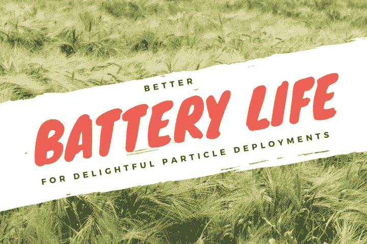](https://res.cloudinary.com/practicaldev/image/fetch/s--kWQRpsw5--/c_limit%2Cf_auto%2Cfl_progressive%2Cq_auto%2Cw_880/https://www.jaredwolff.com/better-battery-life-for-delightful-particle-deploymenimg/post.png)

物联网设备(几乎)总是需要电池。对于这些电池，需要考虑一些重要的事情:

*   你的设备能用多久。
*   您的设备在环境中的表现。
*   当电池没电时，你将如何充电或更换电池

在这篇文章中，你将了解我是如何优化基于粒子氙的运动传感器所使用的每一个微安的。您将了解我遇到的障碍、修复方法以及如何让您的设计实现低功耗！

准备好了吗？

## 套索开始

在研究了项目的方向后，我决定保持简单。只有一个传感器。传感器？PIR。

PIR 代表被动红外传感器。你有没有走进一栋建筑，在它的上角看到一个闪烁的盒子？我的朋友，那是一个 PIR 传感器。它们用于安全系统和灯光控制的运动检测。

[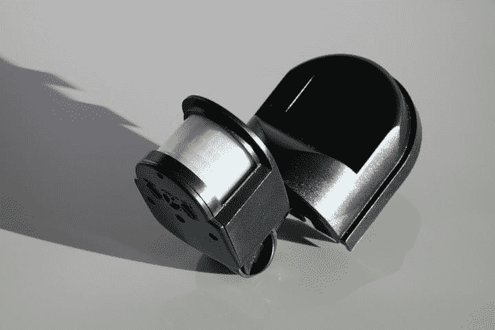](https://res.cloudinary.com/practicaldev/image/fetch/s--aXAKdfsp--/c_limit%2Cf_auto%2Cfl_progressive%2Cq_auto%2Cw_880/https://www.jaredwolff.com/better-battery-life-for-delightful-particle-deploymenimg/black-88039_1920.jpg)

如果我们能改进这种传感器并赋予它更多的功能。比如说，把它连上互联网？这又打开了几扇门。

如果你读过我最近的其他文章，你就会知道我是粒子的忠实粉丝。尤其是他们的网状平台。以至于我正在写一本关于它的指南。在这个项目中，我们将使用粒子氙来使我们的运动传感器变得智能。这样，你就可以随时随地收到即时运动警报。

运动传感器板的最终设计采用 TI TLV8544PWR。这是一款超低功耗轨到轨运算放大器。其主要目的是 PIR 传感器的信号处理。典型情况下，大约消耗 1.2 A(！！)当所有运算放大器都有效时。

该设计还采用了 PCF85063ATL/1，这是一个独立的低功耗实时时钟。该设备与 PIR 一起，可以将粒子网格设备从睡眠中唤醒。就本项目而言，它用于在新的 PIR 事件发生时限制消息数量。即每 2 分钟仅允许一次 PIR 中断。

[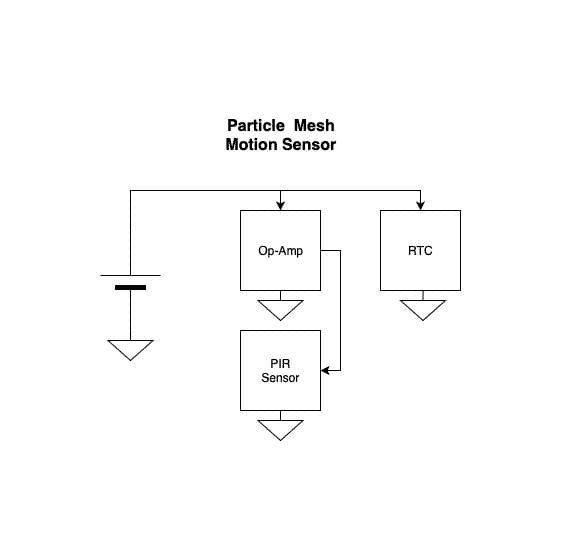](https://res.cloudinary.com/practicaldev/image/fetch/s--U1i8oYjB--/c_limit%2Cf_auto%2Cfl_progressive%2Cq_auto%2Cw_880/https://www.jaredwolff.com/better-battery-life-for-delightful-particle-deploymenimg/Untitled_Diagram-203613a0-4223-4a38-8468-0eb6a6a77159.jpg)

组合中还有其他各种部件，但上面的框图是该板的本质。

### 组装

主要问题出现在我不得不实际组装设备的时候。我在国外，没有工具。幸运的是，附近有一个私人实验室，允许我使用他们的工具。(好家伙，我很感激)

这里有几张组装过程的图片。

[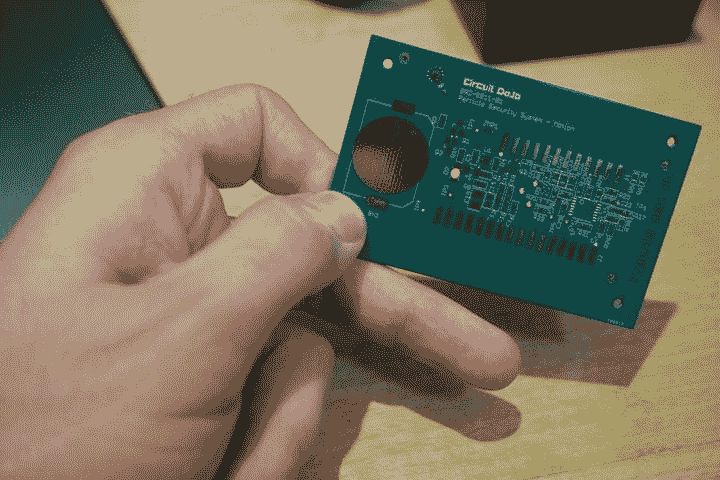](https://res.cloudinary.com/practicaldev/image/fetch/s--xgbeFsVy--/c_limit%2Cf_auto%2Cfl_progressive%2Cq_auto%2Cw_880/https://www.jaredwolff.com/better-battery-life-for-delightful-particle-deploymenimg/DSC01555-3a9254be-baf0-4669-b586-a2f360434abd.jpeg)

我也没有夹具来固定板子。因此，在 Fusion360 中的快速草图和激光切割机上的一些时间产生了一些奇妙的结果！

[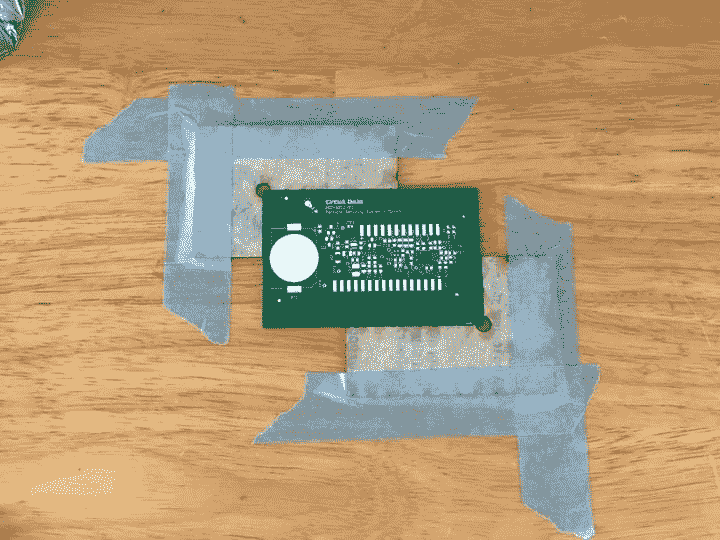](https://res.cloudinary.com/practicaldev/image/fetch/s--gIfsrLoR--/c_limit%2Cf_auto%2Cfl_progressive%2Cq_auto%2Cw_880/https://www.jaredwolff.com/better-battery-life-for-delightful-particle-deploymenimg/IMG_2289-5321b6fb-78a8-42b5-b387-6a126b675130.jpeg)

这块板也是我第一次使用金属模板。哦，伙计，这是一场梦吗？与基于 Kapton 的模板相比，它更加一致。

[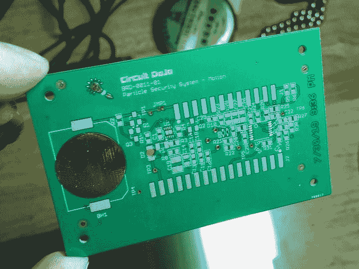](https://res.cloudinary.com/practicaldev/image/fetch/s--tWkX9otq--/c_limit%2Cf_auto%2Cfl_progressive%2Cq_auto%2Cw_880/https://www.jaredwolff.com/better-battery-life-for-delightful-particle-deploymenimg/IMG_2292-9e960972-83a8-4cf8-8f8a-56a61472eecf.jpeg)

这是组装后的电路板。我在运算放大器周围桥接时遇到了一些问题，但用一些助焊剂和热烙铁就可以轻松解决。

[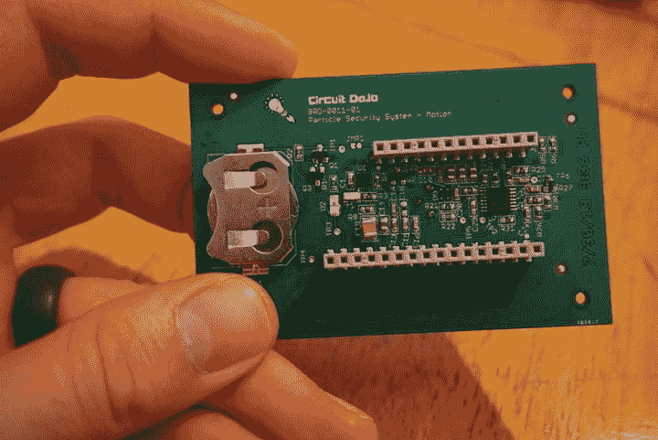](https://res.cloudinary.com/practicaldev/image/fetch/s--_Zj0QkMV--/c_limit%2Cf_auto%2Cfl_progressive%2Cq_auto%2Cw_880/https://www.jaredwolff.com/better-battery-life-for-delightful-particle-deploymenimg/DSC01582-688cd2f3-b8d5-4cb9-8ea5-03b7107b37f7.jpeg)

这是设计的正面。除了 PIR 什么都没有！

[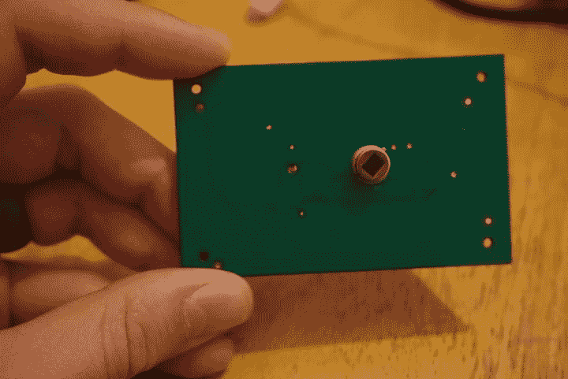](https://res.cloudinary.com/practicaldev/image/fetch/s--3AP0vsyY--/c_limit%2Cf_auto%2Cfl_progressive%2Cq_auto%2Cw_880/https://www.jaredwolff.com/better-battery-life-for-delightful-particle-deploymenimg/DSC01583-27e958a7-6387-4651-ba60-0c025c6a1fa9.jpeg)

如果你真的发现自己在组装这样的板子，这里有一些建议:

*   大多数 PIR 传感器对热极其敏感。这意味着你在使用烙铁时必须小心。数据表规定温度必须为 350°C，并且不要使用超过 3 秒的尖端。
*   在这个设计中有一些小零件。通常你可以用显微镜来组装。如果你不在镇上，就像我组装这些板的时候，你可以用你的手机。使用相机的缩放功能来检查器件方向和引脚之间的短路。
*   在这种设计中，PIR 传感器的输入端有**吨**的大电容。这需要一段时间来充电，尤其是如果你使用一个 100 f 的大电容。在下一个设计中，运动板将能够监控该电压。这样，粒子网格设备将知道 PIR 何时稳定。

现在我们有了一些硬件，是时候弄清楚如何让它全部工作起来，并且尽可能地降低功耗了。我们将在下一节讨论实现这一点的一些方法。

## 瞌睡时间

睡眠模式允许您将设备置于低功耗状态。当粒子网格空闲时，经常使用它。主要目标是保存尽可能多的电池电量。

有两种不同的睡眠模式。我们将在下面讨论它们:

### 停止模式睡眠

“停止模式”是任何粒子网格设备的标准睡眠模式。它会关闭网络，并且在配置后可以从中断中唤醒。一旦设备被唤醒，它将从停止的地方继续执行。

您可以通过几种不同的方式触发睡眠模式。第一种方式是通过设置一个引脚中断:

```
 System.sleep(D2, RISING); 
```

这将使器件进入停止模式，并等待`D2`的上升中断。您可以连接一个传感器 IC，当它完成传感器读数时触发`D2`。这不仅会提醒设备读数可用，而且还会将设备从睡眠中唤醒！

当您指定第三个参数时，粒子网格设备可以使用唤醒超时。这里有一个例子:

```
 System.sleep(D2, RISING, 60); 
```

第三个参数表示设备将保持睡眠状态的时间，以秒为单位。如果没有发生引脚中断，器件将在该间隔后重新唤醒。在这种情况下，如果`D2`没有事件发生，设备将在 60 秒后被唤醒。

### 深度睡眠

还有另一个低功耗选项:

*沉睡。*

像停止模式，深度睡眠模式将断开您的设备，不保留内存。当设备唤醒时，从应用程序的开头开始执行。内存中的任何变量都将被重置。EEPROM 等非易失性存储器中的数据不受影响。

它也有一个“唤醒针”，但不同于停止模式，你不能选择针。(默认为`D8`)

您可以通过运行执行以下函数来进入深度睡眠。

```
 System.sleep(SLEEP_MODE_DEEP); 
```

### 测量值

[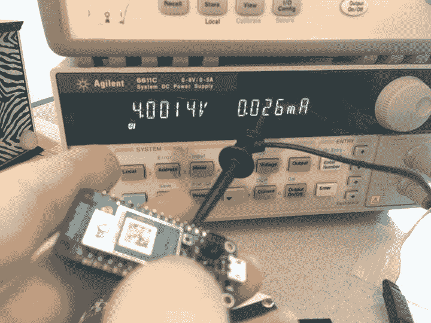](https://res.cloudinary.com/practicaldev/image/fetch/s--kFO8r5VQ--/c_limit%2Cf_auto%2Cfl_progressive%2Cq_auto%2Cw_880/https://www.jaredwolff.com/better-battery-life-for-delightful-particle-deploymenimg/IMG_2128-a908d417-5f58-41af-b93a-c53fc9700cfe.jpeg)

那么，所有这些模式之间的实际区别是什么？下面是所有粒子网格设备和上面讨论的两种模式的表格。

| 李@ 3.4V(毫安) | 深度睡眠 | 停止模式(uA) |
| --- | --- | --- |
| 氙 | Eight hundred and thirty-four | Eight hundred and forty-six |
| 硼 | One thousand three hundred and eighty-seven | One thousand nine hundred and seventy-eight |
| 氩 | Eight hundred and forty-six | One thousand three hundred and thirty-three |

**附注:**这些测量值来自设置为 3.4V 的 Agilent 6611C 电源。6611C 具有低电流测量模式。换句话说，它可以在没有串联电流表的情况下测量电流。

结果呢？不是特别印象深刻。在深度睡眠模式下，0.834 毫安的电量可在 225 毫安的电池上持续使用约 11.24 天。一定有更好的方法。

知道 NRF52 系列在睡眠模式下吸电流，解决方案在别的地方。所以在仔细阅读了原理图后，罪魁祸首变得清晰了。这是所有的电源管理电路(下面突出)！😬

[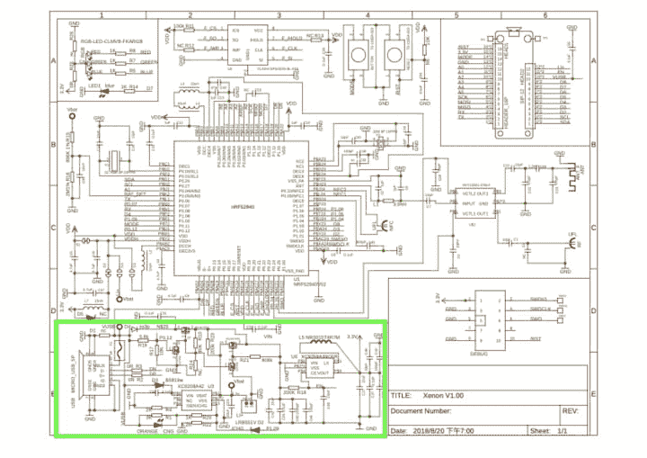](https://res.cloudinary.com/practicaldev/image/fetch/s--QnMAC5uy--/c_limit%2Cf_auto%2Cfl_progressive%2Cq_auto%2Cw_880/https://www.jaredwolff.com/better-battery-life-for-delightful-particle-deploymenimg/Untitled-893d00be-e26b-47c1-9d13-5d49985b4961.png)

不过，有一种方法可以解决这个问题。解决办法？

绕过这一切。

## 旁路旁路旁路

旁路的主要风险是有可能对这些电路反向供电。这可能导致意外操作，甚至高静态电流。然而在我的案例中，这些都没有。我看到了**明显的**改善。

当旁路时，氙气从 846 安培到 46 安培。这是 17 倍的**系数！**使用运动感应板时，大约为 49 安。这意味着使用 225 毫安的电池，这种设置可以持续大约 0.52 年。

虽然绕过带来了一些额外的关注。比如，“电路板能承受从 3.3V 到 2.6V 不等的纽扣电池电压吗？”是时候做些研究了。

### 研究

所以，我们绕过了所有的监管机构。这意味着，随着时间的推移，3.3V 可以变成 2.6V。粒子网板上的所有电路都可以处理 3.3V 到 2.6V 的电压吗？

让我们看一下原理图，看看有哪些器件值得关注。

[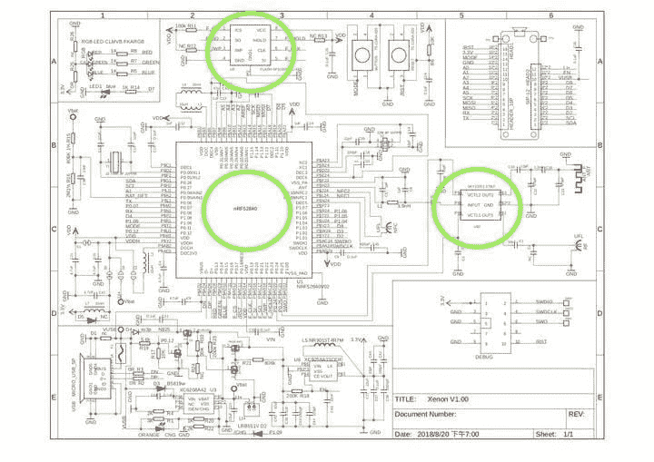](https://res.cloudinary.com/practicaldev/image/fetch/s--L6058Roc--/c_limit%2Cf_auto%2Cfl_progressive%2Cq_auto%2Cw_880/https://www.jaredwolff.com/better-battery-life-for-delightful-particle-deploymenimg/xenon-v1-6d65d0d2-0c20-4b77-aed7-89676e69bec3.00-schematic.jpg)

圈出的设备是我们关心的设备。

这给了我们一个列表

*   NRF52840
*   SKY13351-378LF
*   MX25L1606E

现在，我们可以去研究它们，以了解它们可以工作的功率范围。在这种情况下，每个器件必须在 3.3V 和 2.6V 下工作

那么，这些部件如何工作的最佳来源在哪里呢？数据表。

这是 flash 部分的一个例子:

[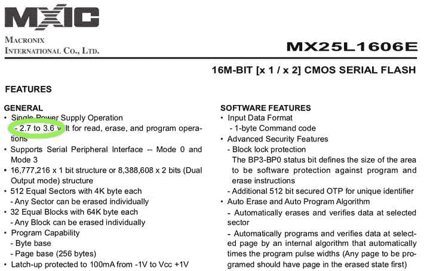](https://res.cloudinary.com/practicaldev/image/fetch/s--azFDF75z--/c_limit%2Cf_auto%2Cfl_progressive%2Cq_auto%2Cw_880/https://www.jaredwolff.com/better-battery-life-for-delightful-particle-deploymenimg/MX25L1606E_Voltage_Requirements-b33c1b63-a2ad-4db0-9b5f-32a05c498bb6.jpg)

对于北欧的 NRF52840，

[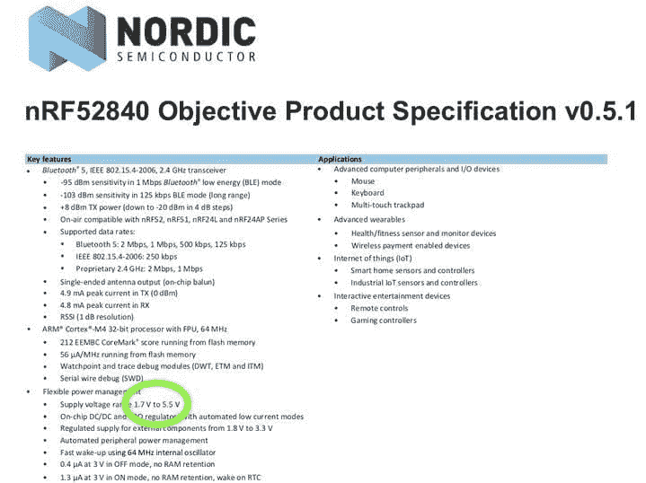](https://res.cloudinary.com/practicaldev/image/fetch/s--vlfveDrs--/c_limit%2Cf_auto%2Cfl_progressive%2Cq_auto%2Cw_880/https://www.jaredwolff.com/better-battery-life-for-delightful-particle-deploymenimg/NRF52840-d794e377-5617-44b8-87c9-367e7baf491f.jpg)

对于天线开关:

[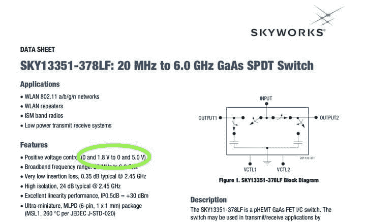](https://res.cloudinary.com/practicaldev/image/fetch/s--IwSml66l--/c_limit%2Cf_auto%2Cfl_progressive%2Cq_auto%2Cw_880/https://www.jaredwolff.com/better-battery-life-for-delightful-particle-deploymenimg/rf_switch-9fc65ce2-4085-4704-8d10-09186111c667.jpg)

搜索花了几分钟时间，往返了 3 趟 DuckDuckGo，但我们已经找到了我们需要的信息。所有设备都可以在我们寻找的范围内工作。(闪存芯片略有例外。在这个例子中，没有使用它，所以我们可以安全地忽略它)

所以，随着障碍的排除，是时候写一些固件了。

## 让它变聪明

[](https://res.cloudinary.com/practicaldev/image/fetch/s--YLmIyUub--/c_limit%2Cf_auto%2Cfl_progressive%2Cq_auto%2Cw_880/https://www.jaredwolff.com/better-battery-life-for-delightful-particle-deploymenimg/Apple_iPhone_6s_Gold_-_Alerts-c20439a2-d898-4ee4-b56e-12340cdbdf6f.png)

该过程的最后一步是尽可能优化固件。即大部分时间保持设备处于睡眠模式。

在第一轮测试中，使用了*停止睡眠模式*。*

```
 // Sleep differently depending on the situtation
    if( !pirReady ) {
      System.sleep(D2, FALLING, 2000);
    } else if( rtcReadyForMotion ) {
      System.sleep({A5, D2}, {CHANGE, FALLING});
    } else {
      System.sleep(D2, FALLING);
    } 
```

此外，设备的状态决定了睡眠模式的工作方式。例如，如果设备没有准备好运动中断，它将忽略 PIR 输入。这将阻止设备在该唤醒的时候唤醒。

此外，这个想法是使用`Particle.publish()`到云。不幸的是，早期并发症使这变得困难。有时设备会立即连接。有时它会坐在那里，什么也不做。最后，我把`Particle.publish()`改成了`Mesh.publish()`。

这又要求网状网络中的另一个设备订阅消息，并将其转发到云。作为边缘路由器运行的 Argon 非常适合这个目的。

有趣的是，我确实注意到当调用`Mesh.connect()`时，`Mesh.publish()`有时会工作。在`Mesh.connect()`之后我增加了一些延迟，从那以后设置就像岩石一样坚固。代码现在看起来是这样的:

```
 // If A5 is high then we have an event.
    if (pirEventOccurred && pirReady) {

      // Reset variable
      pirEventOccurred = false;
      publishInProgress = true;

      // Start connection
      // TODO: fix this. This is a hack. I'm getting unreliable messages *without a delay*. :|
      Mesh.connect();

      // Blink RED led
      digitalWrite(D3,LOW);
      delay(250);
      digitalWrite(D3,HIGH);

      Log.trace("event occurred");
    } 
```

**边注:** `System.sleep`导致颗粒板断开。因此，当您准备好发布时，需要重新连接到网状网络。

此外，本着设计低功耗固件的精神，使用 RGB LED 是过时的。尤其是当它在围栏里时，你是看不见的！您可以通过打开手动控制来禁用它:

```
 // Turn off RGB Led
    RGB.control(true); 
```

一旦固件看起来是在一个好的地方，是时候把一切都放在一起了。不幸的是，传感器+粒子网格组合还没有准备好合作。

### 神秘重启

经过一些测试，我注意到设备停止工作。我将其从塑料中取出，发现 RGB LED 呈白色闪烁。我最大的猜测？处理器一直在重新启动。

所以在一番挠头之后，我把电池连到了示波器上。我看着电路板启动，并试图连接到网状网络。事实上，电池电压会迅速下降。这对于任何类型的基于电池的设计都是典型的。意想不到的部分？只要电池电压低于 2.8V，Xenon 就会进行完全的硬件重置

是什么导致了这些重置？是另一部分吗？(像 flash 部分无法沟通？)是 NRF52 吗？

在数据表和原理图中搜索答案后，结果是 NRF52。更确切地说，**供电主管。**

[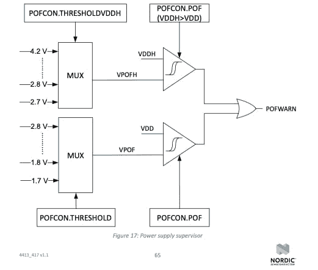](https://res.cloudinary.com/practicaldev/image/fetch/s--o0F-izdH--/c_limit%2Cf_auto%2Cfl_progressive%2Cq_auto%2Cw_880/https://www.jaredwolff.com/better-battery-life-for-delightful-particle-deploymenimg/Untitled-aaef396e-78ff-4de3-b595-d192ad0386ae.png)

在 DeviceOS 代码中，电源监控器被设置为在 NRF52 低于 2.8V 时重启 NRF 52。

[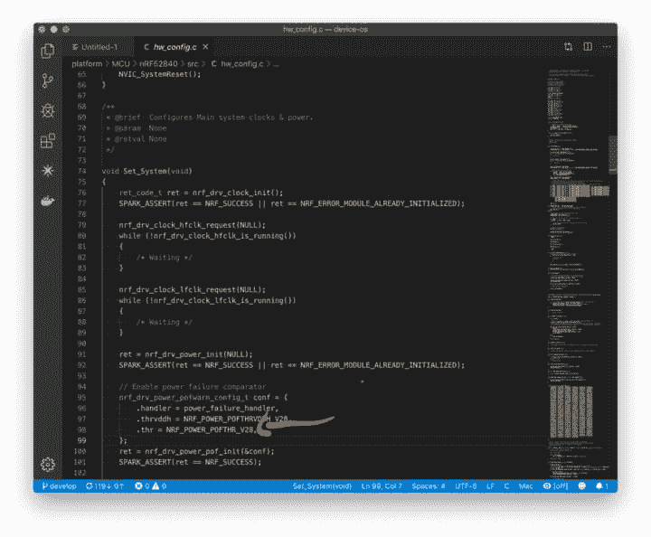](https://res.cloudinary.com/practicaldev/image/fetch/s--URdiZZVH--/c_limit%2Cf_auto%2Cfl_progressive%2Cq_auto%2Cw_880/https://www.jaredwolff.com/better-battery-life-for-delightful-particle-deploymenimg/Screen_Shot_2019-09-23_at_6-eb212e99-848e-4d50-9564-3bb23e7b8467.20.41_PM.png)

宾果是他的名字。

解决方案是使用`STARTUP`宏并运行`sd_power_pof_threshold_set`。然后使用许多选项中的一个来设置新的阈值:

```
 /** @brief Power failure comparator thresholds. */
    typedef enum
    {
        NRF_POWER_POFTHR_V21 = POWER_POFCON_THRESHOLD_V21, /**< Set threshold to 2.1&nbsp;V */
        NRF_POWER_POFTHR_V23 = POWER_POFCON_THRESHOLD_V23, /**< Set threshold to 2.3&nbsp;V */
        NRF_POWER_POFTHR_V25 = POWER_POFCON_THRESHOLD_V25, /**< Set threshold to 2.5&nbsp;V */
        NRF_POWER_POFTHR_V27 = POWER_POFCON_THRESHOLD_V27, /**< Set threshold to 2.7&nbsp;V */
    #if defined(POWER_POFCON_THRESHOLD_V17) || defined(__NRFX_DOXYGEN__)
        NRF_POWER_POFTHR_V17 = POWER_POFCON_THRESHOLD_V17, /**< Set threshold to 1.7&nbsp;V */
        NRF_POWER_POFTHR_V18 = POWER_POFCON_THRESHOLD_V18, /**< Set threshold to 1.8&nbsp;V */
        NRF_POWER_POFTHR_V19 = POWER_POFCON_THRESHOLD_V19, /**< Set threshold to 1.9&nbsp;V */
        NRF_POWER_POFTHR_V20 = POWER_POFCON_THRESHOLD_V20, /**< Set threshold to 2.0&nbsp;V */
        NRF_POWER_POFTHR_V22 = POWER_POFCON_THRESHOLD_V22, /**< Set threshold to 2.2&nbsp;V */
        NRF_POWER_POFTHR_V24 = POWER_POFCON_THRESHOLD_V24, /**< Set threshold to 2.4&nbsp;V */
        NRF_POWER_POFTHR_V26 = POWER_POFCON_THRESHOLD_V26, /**< Set threshold to 2.6&nbsp;V */
        NRF_POWER_POFTHR_V28 = POWER_POFCON_THRESHOLD_V28, /**< Set threshold to 2.8&nbsp;V */
    #endif // defined(POWER_POFCON_THRESHOLD_V17) || defined(__NRFX_DOXYGEN__)
    } nrf_power_pof_thr_t; 
```

在这种情况下，我将其设置为`NRF_POWER_THRESHOLD_V20`

```
 STARTUP(sd_power_pof_threshold_set(NRF_POWER_THRESHOLD_V20)); 
```

只有在实施了这个修复之后，整个设备的运行时间才超过几分钟！现在它已经开始工作了，是时候把所有东西都装进一个抛光的外壳里了。我们将在下一节讨论这个步骤。

## 圈地

第一步不是将原始电路板贴在墙上，而是找到或创建一个外壳。不幸的是，我不是产品设计师。设计一个外壳需要大量的时间，而我却没有。那么下一个最佳选择是什么？

*使用预先存在的外壳。*

Digikey 充满了各种形状和大小的外壳。幸运的是，我的箱子里有一些额外的东西，看起来符合要求。

盒子是巴德工业公司的 CU-1941。它的尺寸为 83.01 毫米 x 54.00mm 毫米，高度为 30.51 毫米。这是放置电路板和颗粒网板的完美尺寸。

[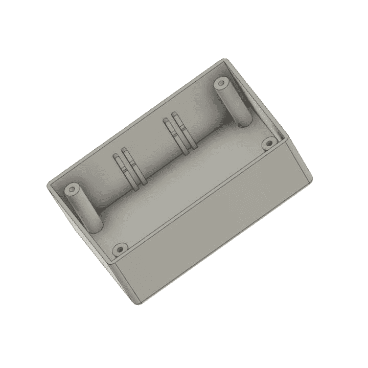](https://res.cloudinary.com/practicaldev/image/fetch/s--2Xi-_mb1--/c_limit%2Cf_auto%2Cfl_progressive%2Cq_auto%2Cw_880/https://www.jaredwolff.com/better-battery-life-for-delightful-particle-deploymenimg/hbcu1941_v1-7e09cf3a-cac9-4f96-8e46-5713cdcb5ce7.png)

它也恰好是用于容纳修改版本的 [uCurrent Gold](https://oshpark.com/shared_projects/z10WdMjx) 的同一个外壳。这是一张我在不久前建造的照片:

[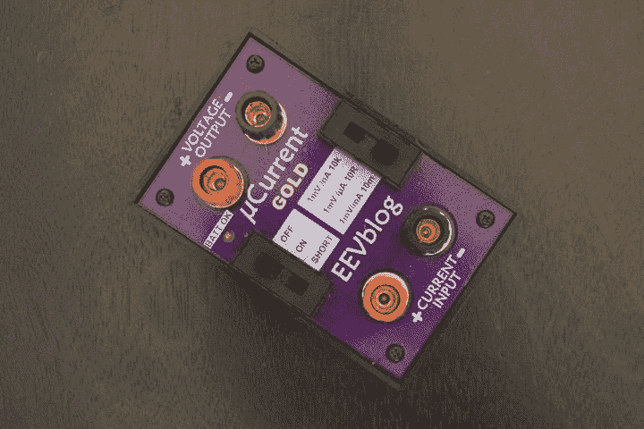](https://res.cloudinary.com/practicaldev/image/fetch/s--dz-tttrf--/c_limit%2Cf_auto%2Cfl_progressive%2Cq_auto%2Cw_880/https://www.jaredwolff.com/better-battery-life-for-delightful-particle-deploymenimg/DSC01227-e31112b5-c712-489c-be28-d8e28e98ad0f.jpeg)

我联系了巴德，向他们要 STEP 文件。他们答应了，在开发电子产品的同时，我能够在 Fusion360 中模拟设计。

[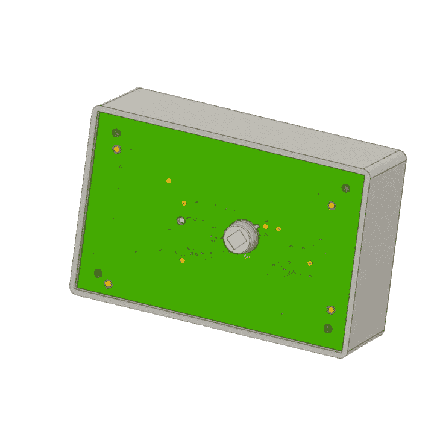](https://res.cloudinary.com/practicaldev/image/fetch/s--BbT8nx1D--/c_limit%2Cf_auto%2Cfl_progressive%2Cq_auto%2Cw_880/https://www.jaredwolff.com/better-battery-life-for-delightful-particle-deploymenimg/security-motion-assembly_v18-67ed8059-87a8-4293-92da-05a50a340a74.png)

**专业提示:**无论何时你使用现成的设计，你都需要尽职调查。这意味着检查各个方向是否合适。我主要关心的是确保板的配合高度足够小。这样，它们就能适应围栏的高度。

下面是运动感应板最高部分的截面分析:

[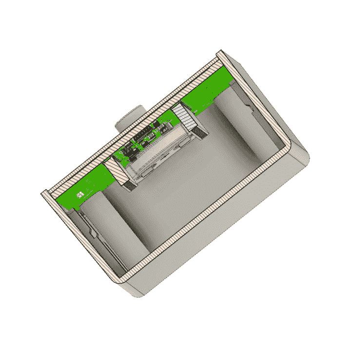](https://res.cloudinary.com/practicaldev/image/fetch/s--BEtVyqgy--/c_limit%2Cf_auto%2Cfl_progressive%2Cq_auto%2Cw_880/https://www.jaredwolff.com/better-battery-life-for-delightful-particle-deploymenimg/security-motion-assembly_v17-36e6dec3-e730-4331-93e9-706dba0dd1bf.png)

而且非常合身！(有一些额外的空间启动)我甚至可以在那里放一个大得多的电池，仍然有空间。这是所有东西都配对后的样子:

[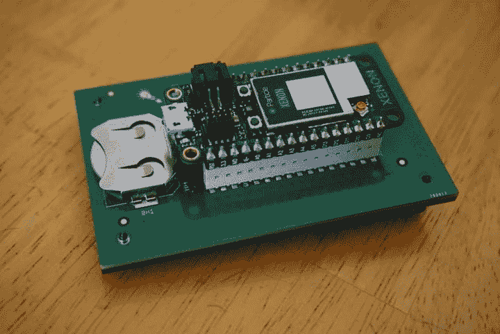](https://res.cloudinary.com/practicaldev/image/fetch/s--97vJfn1l--/c_limit%2Cf_auto%2Cfl_progressive%2Cq_auto%2Cw_880/https://www.jaredwolff.com/better-battery-life-for-delightful-particle-deploymenimg/DSC01585.jpeg)

这个过程需要一些时间，但非常值得。当你将电路板组装到位时，这尤其令人满意。不管一切进展如何顺利，下一个版本总会有改进。

## 成品？

[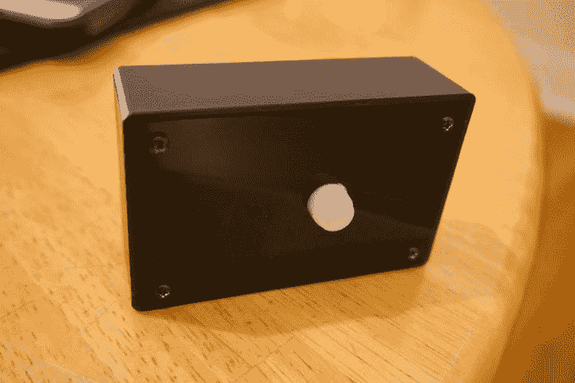](https://res.cloudinary.com/practicaldev/image/fetch/s--Wi0Fssny--/c_limit%2Cf_auto%2Cfl_progressive%2Cq_auto%2Cw_880/https://www.jaredwolff.com/better-battery-life-for-delightful-particle-deploymenimg/DSC01577-1f727b60-f3b1-4e49-9f7d-e3e87100143e.jpeg)

尽管做了一些机械上的调整(钻一个稍微大一点的洞，等等)，这个项目还是完成了。另外，它看起来像是你从网上的间谍商店买来的东西！

尽管它看起来很精致，但有一个明显的因素。

**功率**

该设备消耗 49 安培的电流，尽管每半年更换一次电池对钱包和垃圾填埋场来说都是不公平的。

我们如何让电流更低？

正如你现在所知道的，氙气板占据了睡眠能量的 94%。那么，为什么不把它完全排除在外呢？

从组合中移除处理器就像在睡眠模式下移除设备电源一样简单。我们可以通过 3.3V 引脚控制粒子网板的电源。

[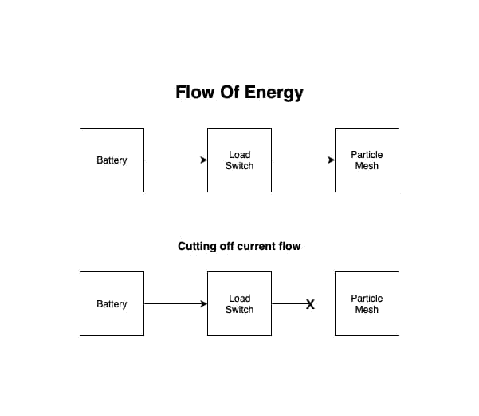](https://res.cloudinary.com/practicaldev/image/fetch/s--kHpL3P0c--/c_limit%2Cf_auto%2Cfl_progressive%2Cq_auto%2Cw_880/https://www.jaredwolff.com/better-battery-life-for-delightful-particle-deploymenimg/Untitled_Diagram-e1f54fa0-d628-40d2-853d-62a394487883.png)

这将我们的 49 A 睡眠电流变成 3 A。这是 0.5 年和 8 年待机电流的差异！

## 结论

创造低功耗硬件来节省电池寿命有时会令人沮丧。只要你保持创造力，你就可以延长你部署的设备的电池寿命。

想了解更多？我有更多像这样的内容即将推出。另外，如果你还没有，你可以注册更新我即将发布的[粒子网格终极指南](https://www.jaredwolff.com/the-ultimate-guide-to-particle-mesh/)。我正在分享一些内幕内容，并只列出你不想错过的独家新闻！

此外，使用本[之前的教程，学习如何向您的手机发送推送通知。](https://www.jaredwolff.com/how-to-location-tracking-using-particle-mesh/#configuring-webhook)

**想要一块这样的运动传感器板吗？**

[在这里加入等候名单](https://www.jaredwolff.com/motion-sense-board/)，你会第一个知道它们何时在我的网站上可用。*这个特殊的版本只对异种有效。*

最后，感谢阅读这篇文章。听到你们谈论你们正在建设的项目总是很棒。这是我前进的动力和灵感。

下次见！

## 资源

*   [TI TLV8544PWR](https://www.ti.com/product/TLV8544)
*   PCF 85063 atl/1
*   [粒子氙](https://docs.particle.io/datasheets/mesh/xenon-datasheet/)
*   [巴德工业公司 CU-1941](https://www.digikey.com/product-detail/en/bud-industries/CU-1941/377-2068-ND/439228)