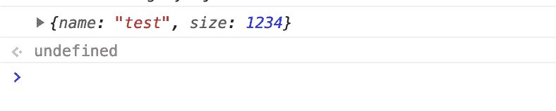
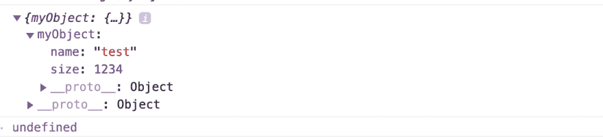

# Javascript 中更好的控制台调试

> 原文：<https://dev.to/jose/better-console-debug-in-javascript-48b4>

当在 Javascript 中调试一个对象时，你通常会做这样的事情:

```
console.log(myObject); 
```

Enter fullscreen mode Exit fullscreen mode

甚至:

```
console.debug(myObject); 
```

Enter fullscreen mode Exit fullscreen mode

如果我们用
创建对象

```
myObject = {
    name: 'test',
    size: 1234,
} 
```

Enter fullscreen mode Exit fullscreen mode

从代码中的某个地方执行 console.debug，在控制台中您会看到:

[](https://res.cloudinary.com/practicaldev/image/fetch/s--p2FBSaxU--/c_limit%2Cf_auto%2Cfl_progressive%2Cq_auto%2Cw_880/https://josemdev.cimg/better-console-debug-js.png)

所以可能不清楚你在处理哪个物体。要解决这个问题，你可以做:

```
console.debug({myObject}); 
```

Enter fullscreen mode Exit fullscreen mode

结果是打印出对象的名称和完整的对象:

[](https://res.cloudinary.com/practicaldev/image/fetch/s--GGKzPniY--/c_limit%2Cf_auto%2Cfl_progressive%2Cq_auto%2Cw_880/https://josemdev.cimg/better-console-debug-js-2.png)

这来自于 ES6，它通常被称为[简写属性名](https://developer.mozilla.org/en-US/docs/Web/JavaScript/Reference/Operators/Object_initializer#Property_definitions)，它工作是因为键和对象变量有相同的名字。

这跟俗话说的是一回事:

```
console.debug({myObject: myObject}); 
```

Enter fullscreen mode Exit fullscreen mode

但如你所见更方便。😉