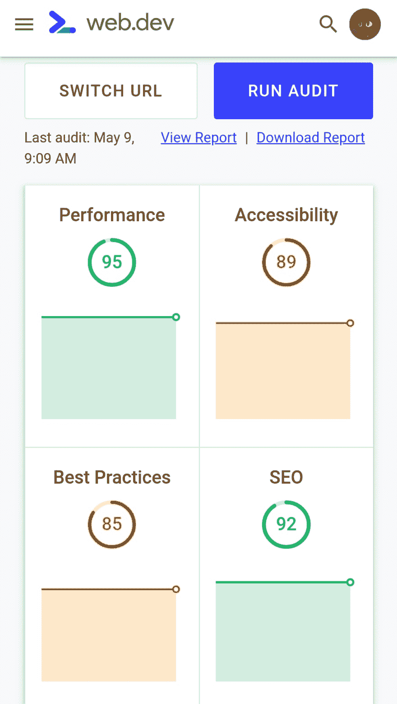
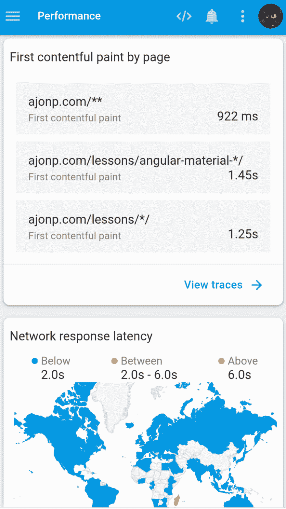
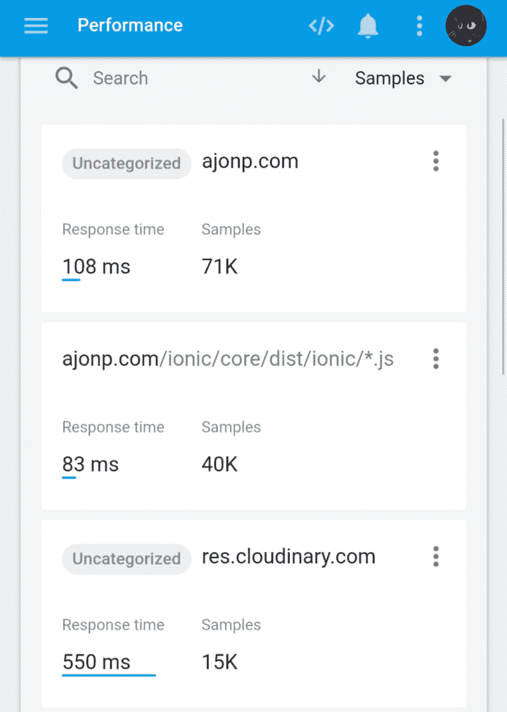
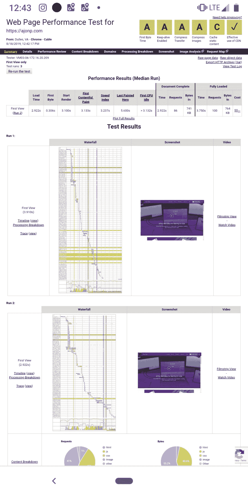
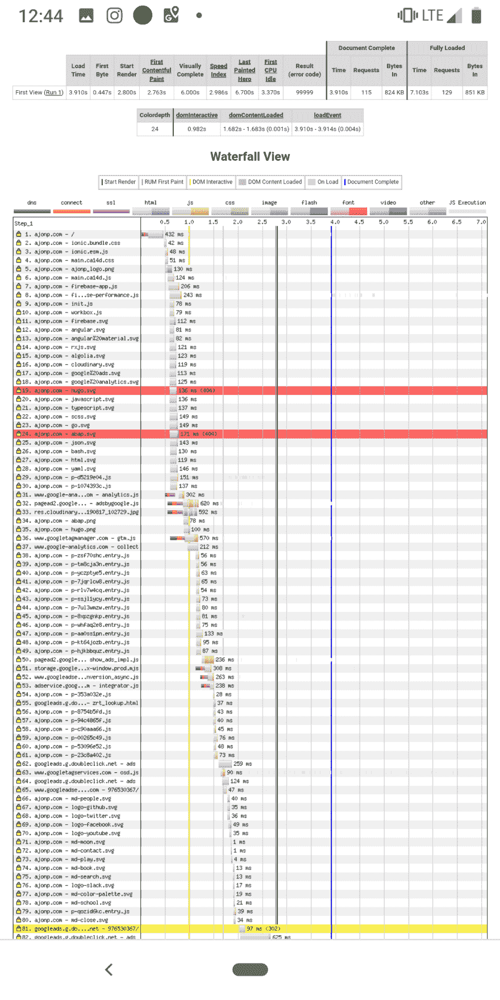
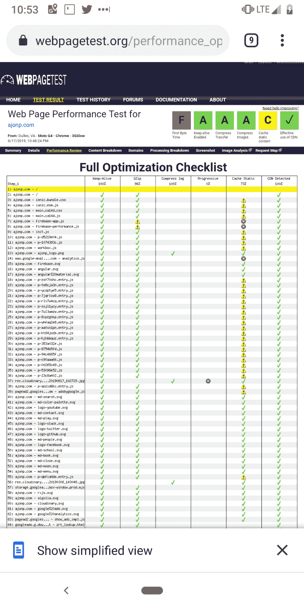
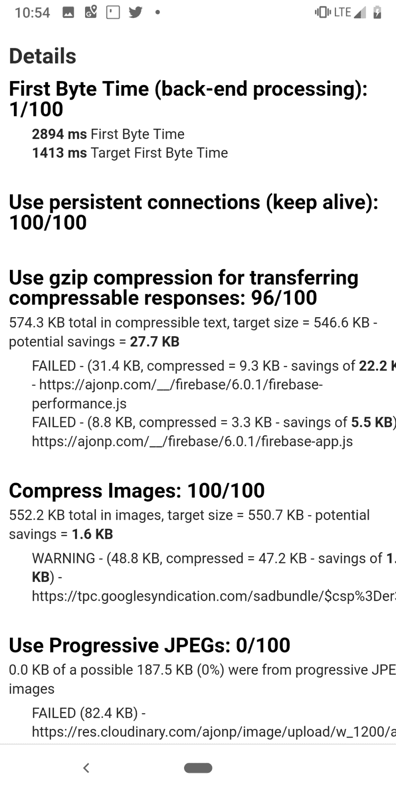

# 通过分析提高性能。

> 原文：<https://dev.to/codingcatdev/better-performance-through-analysis-482m>

> 原帖:[https://ajonp.com/blog/better-performance-through-analysis./](https://ajonp.com/blog/better-performance-through-analysis./)
> 
> 请注意，我是开了 6 个小时的车在手机上写的，所以我希望能更新得更详细。有趣的事实是，我现在知道如何从 Android 远程递归😆

# 通过分析获得更好的性能

当前初始页面加载的 web 标准是 2.0 秒。这只是性能故事的一部分。让我们深入一点，看看我们还能如何提高性能。就数据缩减和用户体验而言，有时这些事情并不那么明显。

## Web.dev

Web.dev learning 是提高网站性能的最佳资源之一。

<video controls=""><source src="https://res.cloudinary.com/ajonp/video/upload/v1566057653/ajonp-ajonp-com/blog/20190817_115842.mp4" type="video/mp4"></video> 

[视频链接](https://res.cloudinary.com/ajonp/video/upload/v1566057653/ajonp-ajonp-com/blog/20190817_115842.mp4)

正如你在视频中看到的，他们有几个主题来帮助提高你的网站性能。

实际上，我发现自己在进入学习部分之前使用了[测量](https://web.dev/measure)功能。但是我在学校从来不擅长“看书”，我是一个视觉动手学习者😺。

重复灯塔指标，看看你学到了什么，以及一段时间内的趋势，这很好。

## Firebase 性能监控

Firebase 性能监控文档拥有尽可能好的信息。也就是说，有三个关键要素:

1.  自动测量应用启动时间、HTTP/S 网络请求等
2.  深入了解可以提高应用性能的情况
3.  为您的应用定制性能监控

Firebase 令人惊叹的地方在于，它只需要很少的代码就能为您提供所有这些重要的信息！

在这里你可以看到一个很棒的概述 

你可以看到所有的页面和多少样本决定了平均性能。

## 为什么是 2 秒

谷歌根据算法的许多输入来提高搜索结果的排名，速度是最重要的因素之一！现在，如果你想超越这种检验，谷歌的性能博客。

## 用户感知至关重要

你真的需要让所有页面感觉不到一秒，为什么？人类不能比一秒钟更快地感知事物，但超过一秒钟，他们就会开始认为事情是错的。Google 关心用户，使用 [RAIL 方法](https://developers.google.com/web/fundamentals/performance/rail)。

*   **响应** -浏览器的反应速度
*   动画 -让网站看起来更好的效果
*   **空闲** -稳定下来，这样浏览器就不必处理
*   **加载** -这个页面的加载速度有多快

## 附加工具

正如谷歌的帖子所指出的

Google Chrome 内置的开发者工具。对页面加载或运行时发生的一切进行深入分析。

[Lighthouse](https://developers.google.com/web/fundamentals/performance/rail#lighthouse) 在 Chrome DevTools 中可用，作为 Chrome 扩展，作为 Node.js 模块，在 WebPageTest 中。你给它一个 URL，它模拟一个 3G 连接缓慢的中档设备，在页面上运行一系列审计，然后给你一个负载性能的报告，以及如何改进的建议。还提供审计以提高可访问性，使页面更容易维护，成为一个进步的 Web 应用程序，等等。

你给它一个网址，它就能在一个真正的 Moto G4 设备上加载页面，该设备有一个缓慢的 3G 连接，然后给你一份关于页面加载性能的详细报告。您还可以将其配置为包含 Lighthouse 审计。

## 区别于你所测试的

如果您的大多数用户都使用桌面，那么您可能更关心桌面测试。然而，如果你正在寻找建立一个更广泛的用户群，尤其是在发展中国家，你最好检查低端移动结果！

### 桌面为 AJonP

我试图得到一个全 A 的评级，但这显示了更小的项目，你可以修复。

它能让你真正深入细节。

### 手机低端为 AJonP

一个我可以提高低端设备性能的例子。

