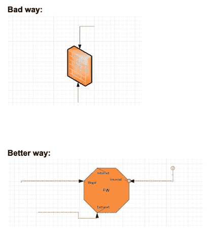

# 更好的安全架构图

> 原文：<https://dev.to/aheil/better-security-architecture-diagrams-12fp>

在过去的几年里，我看到了许多所谓的“架构”图，包括那些遭受不一致的符号，不清楚的描述，缺乏信息和含糊不清。

最糟糕的情况发生在我的上一份工作中，我负责公司范围内的应用程序集成。每个团队都有自己绘制(或不绘制)安全架构的方式。指导方针？没有。如果出了问题，每天都会精神崩溃？绝对的。

因此，他/她(名字不详)创建了一个相当全面的 PDF 指南，帮助您绘制更精确的安全相关架构图。绝对值得一看。

链接:[https://github . com/Chao cipher/junk drawer/blob/master/Security % 20 diagraming % 20 guidance % 20(2019)。pdf](https://github.com/chaocipher/JunkDrawer/blob/master/Security%20Diagramming%20Guidance%20(2019).pdf)