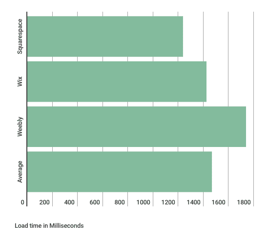
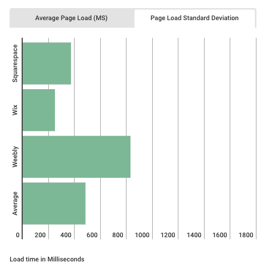
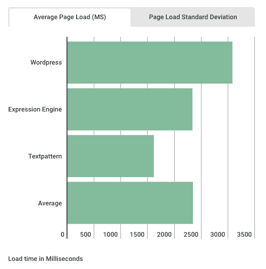
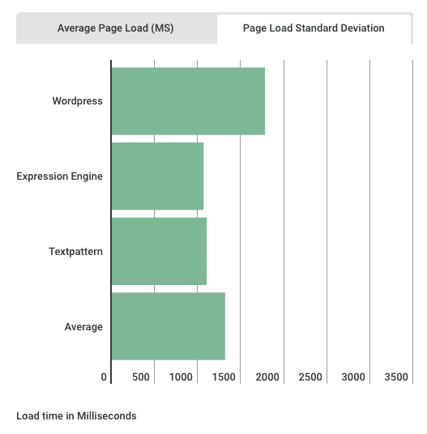
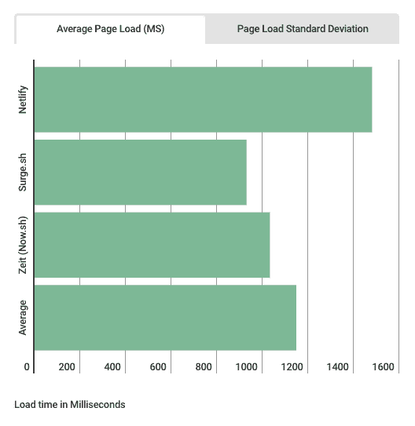
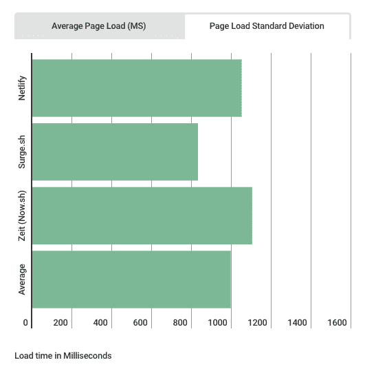
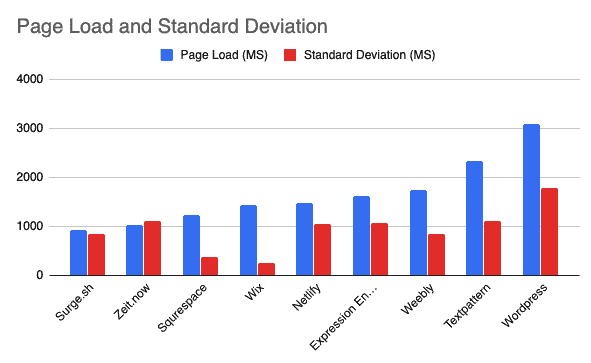

# 我进行了一项研究，看看谁的页面加载速度最快:静态、托管或动态网站。以下是我学到的。

> 原文：<https://dev.to/levinunnink/between-static-dynamic-and-hosted-websites-who-has-fastest-page-load-times-the-results-are-unexpected-54ap>

现在基本上有三种不同的方式来发布一个网站。

*   托管:像 Squarespace、Weebly、Wix 和无数其他服务都打着“托管”的旗号。吸引力在于你可以不用知道如何编码就能建立一个网站。缺点是这些网站的可定制性有限，如果一个功能不存在，通常就没有办法添加进来。(例如，试着弄清楚如何自动上传到 Squarespace。)因为这些服务都依赖于专有技术，所以很难知道它们在幕后是如何运作的。它们很容易使用，但它们在网站上相当于住在人造房屋里。
*   动态:这些网站由内容管理系统驱动，使用 PHP 之类的解释语言，并将内容存储在 MySQL 之类的数据库中。WordPress 无疑是这个群体中的庞然大物，据估计[有 7500 万个网站，或者说 27%的互联网是由 WordPress](https://www.whoishostingthis.com/compare/wordpress/stats/) 驱动的！2019 年，这绝对是最流行的一种网站部署方式。
*   虽然这类网站和互联网一样古老，但部署 100%静态网站正重新流行起来。与动态网站相比，静态网站在安全性方面有一些很大的架构优势，而且与托管网站相比，它们可以无限定制。从理论上讲，它们应该比其他任何选择都要快得多。但事实是这样吗...？

我正在为设计师建立一个[静态托管服务，我想让它快速加载页面；比 WordPress 快，比 Squarespace 快。但我想看看这是否是一个现实的期望。我决定对这些不同的方法进行一些测试。](https://wunderbucket.io)

通过在 [Censys](https://censys.io/) 上谷歌和搜索，我能够整理出一个按服务分类的网站样本组。接下来的问题就是让他们一个一个地通过 [Pingdom 的速度测试](https://tools.pingdom.com)服务，然后编辑结果。这是我的发现。

## 托管站点

老实说，我预计这些表现最差。托管的、模板化的网站对我来说总是感觉很慢。但是结果还不错。我调查的网站的平均页面负载是 1467 毫秒。但是托管服务真正闪光的地方是一致性。当您对页面加载时间运行标准偏差计算时，托管站点仅显示 485 毫秒的平均偏差。这是为了各种不同的内容，图像重，文本重等

平均页面加载时间最短的服务是 [Squarespace](https://squarespace.com) ，加载时间最一致(标准偏差最小)的服务是 [Wix](https://wix.com) 。

**👉结论:**托管服务在页面加载时间上是体面的，并且它们是最一致的。也就是说，由于他们的约束，他们是最难*真正搞砸的*。

[在 Infogram 上查看托管站点统计数据](https://infogram.com/bar-chart-1h7v4pq1m05d6k0?live)

## 动态站点

在过去，我建立了大量的 Wordpress 网站，我建立了少量的 TextPattern 网站，我想我在十年前建立了一个 ExpressionEngine 网站。我在这里包括 TextPattern 和 ExpressionEngine，因为在架构上它们类似于 WordPress，并且我需要更多的数据作为基线。我原以为这组网站加载速度最慢，这次我是对的。

动态网站的平均加载时间为 2343 毫秒。WordPress 是最高的，平均需要 3081 秒来加载。动态站点的标准偏差也高得多:

WordPress 的标准偏差为 1780 毫秒，是我调查过的所有服务中最高的。

**👉结论:**尽管很受欢迎，动态网站是最慢的，并且最依赖于个人配置(例如，主机提供商，插件，缓存等)。).这部分是由于它们复杂的解释语言架构和每次页面加载时都会发生的数据库查找。一旦你混合了大量质量不一的插件，就很难阻止网站变慢。如果速度是你网站的一个主要考虑因素，去别处看看或者*小心行事*。

[在 Infogram 上查看动态网站统计数据](https://infogram.com/dynamic-sites-1h1749jyd5ed6zj?live)

## 静态站点

这是让我兴奋的部分。与动态网站相比，静态网站是美丽的。所有的工作都发生在本地或构建机器上，所以当它到达服务器时，它唯一要做的就是提供一个 HTML 页面——没有数据库查询，没有语言解释，没有模板编译。通过 CDN 服务，这应该会非常快。而且我测试的时候是。有几分地...

(因为静态网站没有太多的指纹来显示谁主持了这个网站，所以很难找到网站作为调查的样本。我使用了 Netlify 的本周网站，然后在 Censys 上进行了一些搜索，以找到这三种服务的样本。)

Surge.sh 和 [Zeit Now](https://zeit.co) 在所有静态服务中以最快的速度平手，Surge 险胜 Zeit。 [Netlify](https://netlify.com) 的页面加载速度比我预期的要慢一点(甚至被 Squarespace 打败)。标准差结果很有趣:

静态网站再次击败了动态网站，但是*以很大的优势输给了托管选项*。

**👉结论:**静态站点是服务站点*最快的方式，但它不是灵丹妙药*。如果您不构建 HTML 来利用静态托管，您可能会失去这种优势。如果速度是您的主要考虑因素，请确保除了为静态站点提供服务之外，您还遵循了其他优化页面加载的最佳实践。

[在 Infogram 上查看静态网站统计数据](https://infogram.com/static-sites-1h7v4pq1edyq6k0?live)

## 最终结果

获胜者是...

*   **🏆最快网站加载时间:** [Surge.sh](https://surge.sh) 。亚军: [Zeit](https://zeit.co) 。
*   **🏆最一致的网站加载时间:** [Wix](https://wix.com) 。亚军: [Squarespace](https://squarespace.com)

失败者是:

*   **😖最慢网站加载时间:** [。亚军:](https://wordpress.com) [Textpattern](https://textpattern.com) 。
*   **😖最不一致的网站加载时间:** [。亚军:](https://wordpress.com) [Zeit](https://zeit.co)

[查看信息图表上的所有统计数据](https://infogram.com/all-sites-1hnq41jdl5zd43z?live)

**最终想法:**

如果你喜欢网站，你应该对 WordPress 又爱又恨。我喜欢 WordPress，因为它让数百万用户可以建立网站。我喜欢 WordPress，因为它尊重用户，不会欺骗他们使用某个产品来窃取他们的数据。从很多方面来说，这是一个很棒的产品。但是我讨厌 WordPress，因为对于它运行的许多网站来说，它是错误的架构，正因为如此，这些网站运行起来慢得让人无法忍受。我敢说，数以百万计的 WordPress 站点(甚至可能是大多数 WordPress 站点)应该被重建为静态站点。

这就是为什么我对 Netlify、Zeit 和 Surge 等服务如此兴奋。这就是为什么我要建立自己的静态托管服务。我希望更多的人拥有网站，但我希望他们是快速网站。未来不属于像 T4 公司这样的模板工厂，也不应该属于。静态网站的前景非常光明，但是*我们需要让目前使用 WordPress 建立网站的开发者更容易使用它。*

===

🤓如果你想和我一起为有创造力的人建立一个静态的网络主机，[注册 wunderbucket beta](https://wunderbucket.io)。让我知道你来自 dev.to 社区，我一定会把你放在队伍的最前面。

**免责声明:**不要用一个人的结果代替合法的科学研究。除了您使用的方法/框架之外，还有很多因素会影响页面加载时间。任何框架都可以加载得很快，最好的框架可以加载得很慢。