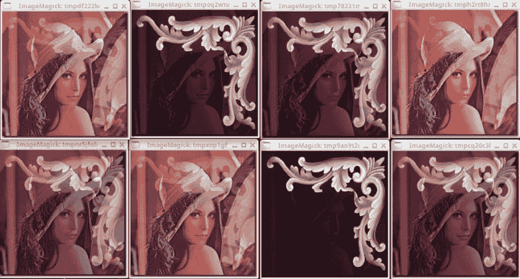

# 用 python 混合图像

> 原文：<https://dev.to/petercour/blend-images-with-python-1i1i>

比如图像？你可以用 Python 来玩图像。PIL 是 Python 的图像库。有时它被称为 Pillow 或 Python 图像库。

你可以做各种各样的效果，比如模糊，调整大小等等。你知道你还可以融合两幅图像吗？等待..什么是勾兑？

[](https://res.cloudinary.com/practicaldev/image/fetch/s--SZjUGc4r--/c_limit%2Cf_auto%2Cfl_progressive%2Cq_66%2Cw_880/https://media1.tenor.cimg/0db32ecc30337a58755b39ae4073f895/tenor.gif)

### 融合图像

想象一下将两张图片叠加在一起。那一定很难做到，对吗？

不完全是。你需要两张图片。在这种情况下，我选择了这两个:

[](https://res.cloudinary.com/practicaldev/image/fetch/s--H2VdmnS7--/c_limit%2Cf_auto%2Cfl_progressive%2Cq_auto%2Cw_880/https://thepracticaldev.s3.amazonaws.com/i/g2hz4o83759xdp0lfpde.jpg)

[](https://res.cloudinary.com/practicaldev/image/fetch/s--WafNiOy5--/c_limit%2Cf_auto%2Cfl_progressive%2Cq_auto%2Cw_880/https://thepracticaldev.s3.amazonaws.com/i/itu28jklzl1tbja138rx.jpg)

在代码中变成:

```
#!/usr/bin/python3
from PIL import Image

Im = Image.open("lena.jpg")
print(Im.mode,Im.size,Im.format)
Im.show()

newIm = Image.new ("RGBA", (640, 480), (255, 0, 0))
Im2 = Image.open("flower.jpg").convert(Im.mode)
Im2 = Im2.resize(Im.size)
Im2.show()

img = Image.blend(Im,Im2,0.2)
img.show() 
```

运行它以查看混合图像:

[](https://res.cloudinary.com/practicaldev/image/fetch/s--2om6w1tn--/c_limit%2Cf_auto%2Cfl_progressive%2Cq_auto%2Cw_880/https://thepracticaldev.s3.amazonaws.com/i/j43q5py2gaund4ahqdse.png)

图像不保存，只显示 img.show()。任何两个图像可以混合，但他们必须是相同的大小。这通过调整大小来确保:

```
Im2 = Im2.resize(Im.size) 
```

所以混合是通过:

```
img = Image.blend(Im,Im2,0.2) 
```

前两个参数是图像。有两种方法可以找到答案。

*   无聊的方式(阅读文档)
*   更改参数

所以你选择了第三条路？多读书。好的，这是阿尔法值。

```
alpha – The interpolation alpha factor. 
If alpha is 0.0, a copy of the first image is returned. 
If alpha is 1.0, a copy of the second image is returned. 
```

[](https://res.cloudinary.com/practicaldev/image/fetch/s--lGkH9He2--/c_limit%2Cf_auto%2Cfl_progressive%2Cq_auto%2Cw_880/https://thepracticaldev.s3.amazonaws.com/i/107em1z2hoaxd6sd78io.png)

相关链接:

*   [枕头:图像库](https://python-pillow.org/)
*   [Python 教程](https://pythonprogramminglanguage.com/)
*   [使用 Python 的 GUI](https://pythonprogramminglanguage.com/pyqt-tutorials)