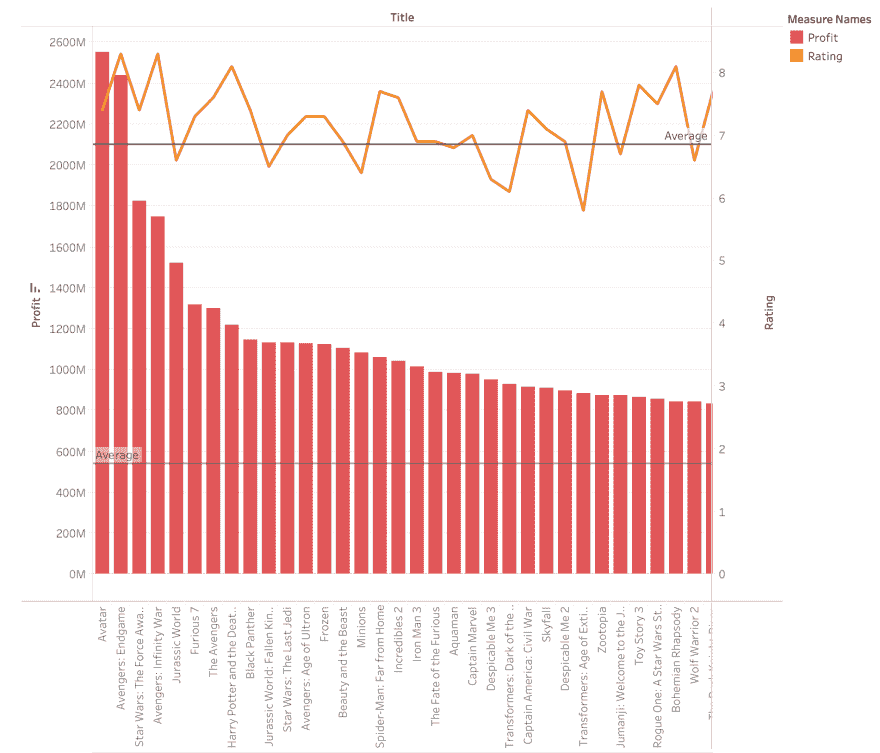
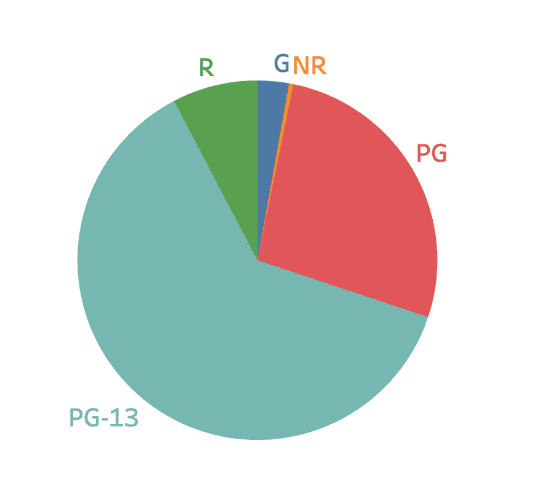
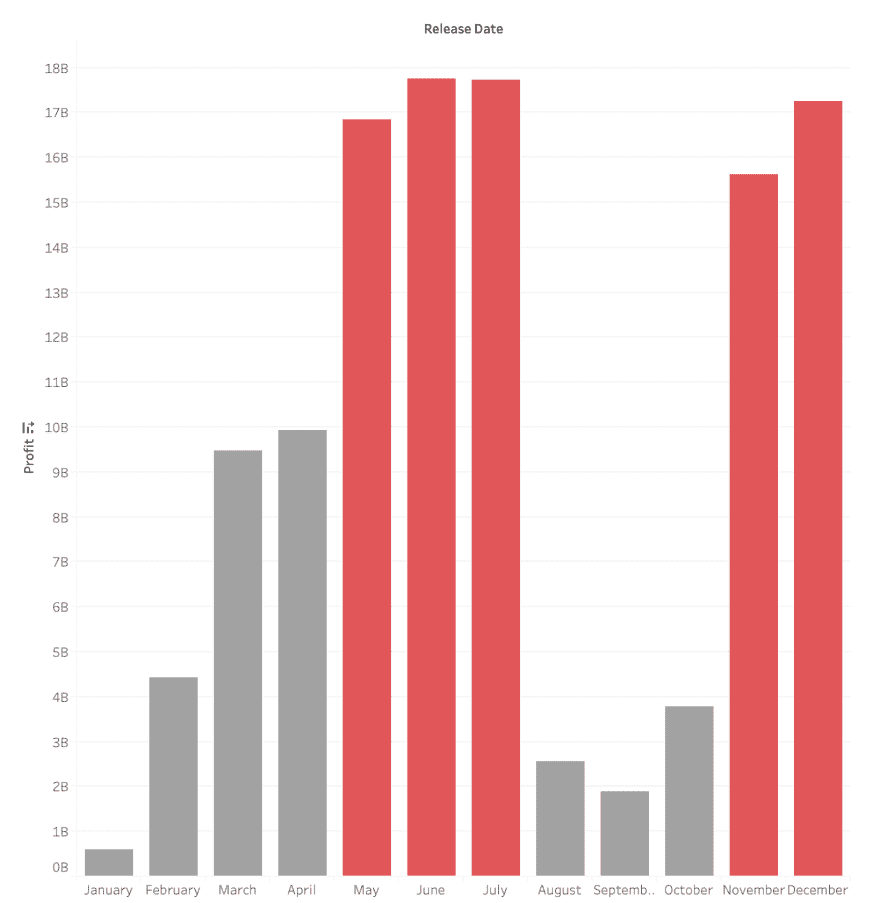
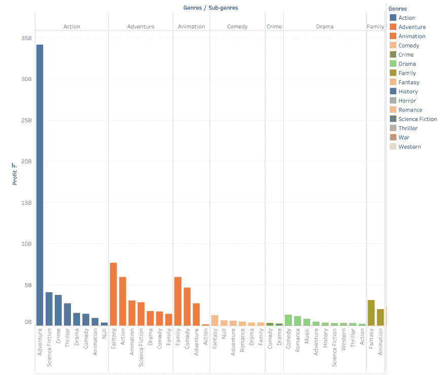
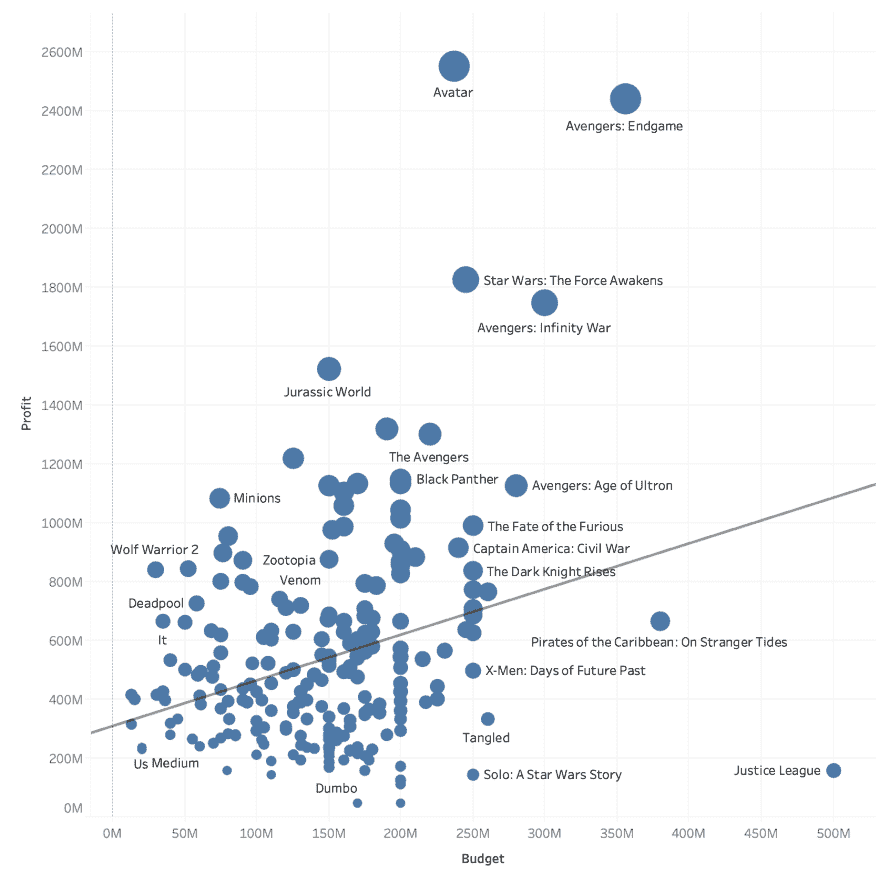
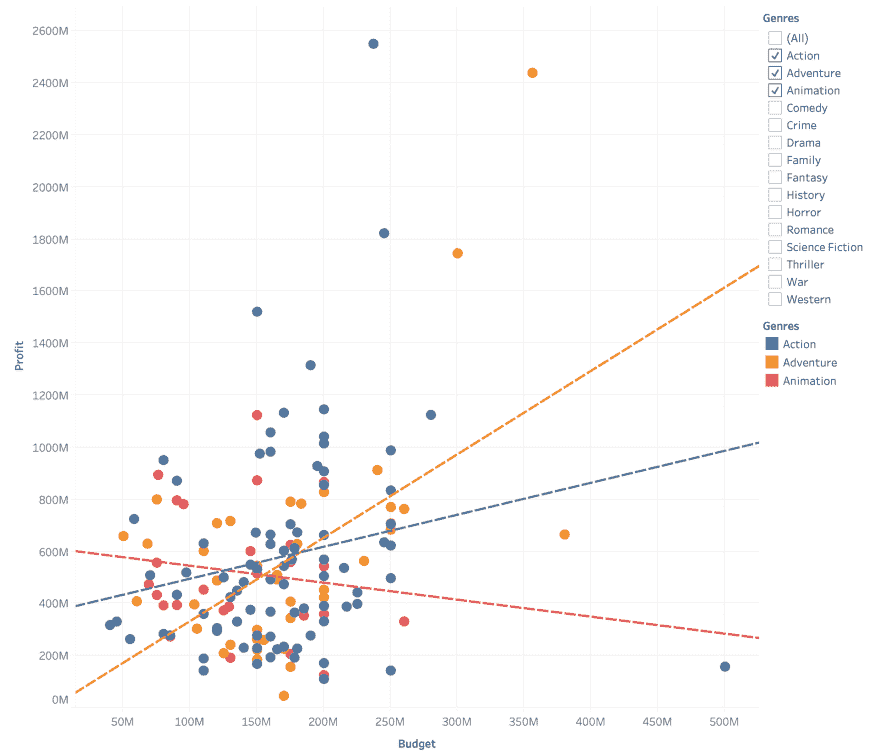
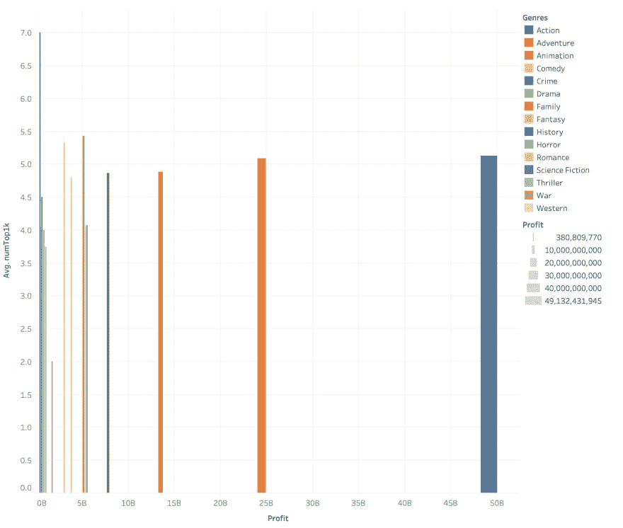

# 大片电影趋势

> 原文：<https://dev.to/williamhuybui/blockbuster-movie-trends-h94>

想象一下，你是微软这样的万亿美元公司的 CEO。有一天晚上，你和女朋友在 AMC 看完电影后，你想到了进入好莱坞行业，为你的公司赚很多钱。在此之前，你需要了解一下当前的电影市场。因此，您咨询了一位数据科学家，以下是他的资料:

## 数据

这个项目的目标是发现美国流行电影的趋势。这个博客将通过可视化来解释数据，这不需要任何技术知识来理解。然而， [GitHub 知识库](https://github.com/williamhuybui/Blockbuster-Movie-Trends)是为那些对这个项目在数据科学方面的技术细节感兴趣的人提供的。

这些数据来自 2009 年至 2019 年的 220 部总收入最高的电影。这是通过来自[电影数据库](https://www.themoviedb.org/)的 API 请求获得的。此外，从 [imdb](https://imdb.com/) 收集 1000 名最佳男演员的名单。
程序用 Python 编写，由 Tableau 呈现。

## 问题

### 1)平均利润和评级是多少？

平均评分为 6.845，从 4.8(独立日)到 8.3(盗梦空间)。

不出所料，复仇者联盟 4：终局之战以 24 亿美元的利润创造了历史上最大的票房。最低的是黑凤凰，为 4500 万美元。这 220 部电影的平均利润为 5.38 亿美元。

### 2)哪个美国电影协会评分最吸引观众？

青少年喜爱的电影，PG-13(T1)，在美国电影协会(美国电影协会)的评级中高居榜首，占据了电影市场票房收入的 50%以上。原因很简单，它拥有最广泛的受众。

### 3)什么时候上映电影最好？

票房最好的月份有:
暑期大片:**5 月、6 月、7 月**。
感恩节和圣诞节时间:**十一月，十二月**。

### 4)最佳投资流派

第一名:动作冒险片，如《神奇女侠》、《美国队长》、《饥饿游戏》。
No 2: **动作奇幻**比如《指环王》、《玛琳菲森》、《星球大战》。
No 3: **动画-家族**比如狮子王，Inside Out，Wall-E。

### 5)预期利润

线性回归线用公式显示你的利润和投资之间的相关性:**profit=1.55*budget+3.08*10^8**。

例如，让我们假设从营销、制作、领导到选择合适的工作室的每一步都近乎完美，如果你的公司投资 1 亿美元，那么你应该期望看到 4.55 亿美元的回报！

还值得一提的是一些特例:
**《阿凡达》**是有史以来最赚钱的电影，其盈利能力来自于利润/预算比率。原因之一是《阿凡达》是在电影院上映的第一部 3D 电影《T4》。

**复仇者联盟:残局**是下一个大纲。该系列是 11 年来发行的 22 部电影的高潮！

所以，新技术或者精心的续作策划才是游戏改变者！

正义联盟是另一个极端。这部电影由于其领导的失败而落在名单的底部。更多信息请点击。

### 6)流派与利润的关联

仔细看看最好的三个流派。趋势线表明，如果预算是:

*   **少于 1.25 亿美元**，你应该投资**动画**。
*   **在 125 美元到 182 美元**之间，你应该投资**行动**。
*   **超过 1.82 亿美元**，你应该投资**冒险**。

### 7)我们应该雇佣多少好演员？

演员是我们计算中的一个重要因素。雇用受欢迎的演员可以显著增加观众的期待/注意力。一个令人震惊的盖尔·加朵瞬间可能会在网上疯传几周。
[T3】](https://res.cloudinary.com/practicaldev/image/fetch/s--Po-gdtT4--/c_limit%2Cf_auto%2Cfl_progressive%2Cq_66%2Cw_880/https://thepracticaldev.s3.amazonaws.com/i/9c7kq5qy5sza2u14p8il.gif)

我们还想雇佣能让观众情绪起伏不定的演员。1000 名最佳演员名单囊括了所有这些特征。名单上的一些人是杰克·尼克尔森，莱昂纳多·迪卡普里奥，摩根·弗里曼。

图表显示，动作片、冒险片和家庭片平均拥有 5 A 级演员。有意思的是，历史片最多，平均 7 个演员。尽管如此，事实证明视觉效果会盖过表演技巧。

## 总结:

*   高票房电影的前三大类型是动作片、动画和冒险片，其中动作片排名最高。盈利能力也**取决于预算范围**。
*   在**夏季**和**寒假**之前和期间上映电影。
*   雇佣至少 5 个电影明星。
*   额定为 **PG13** 。