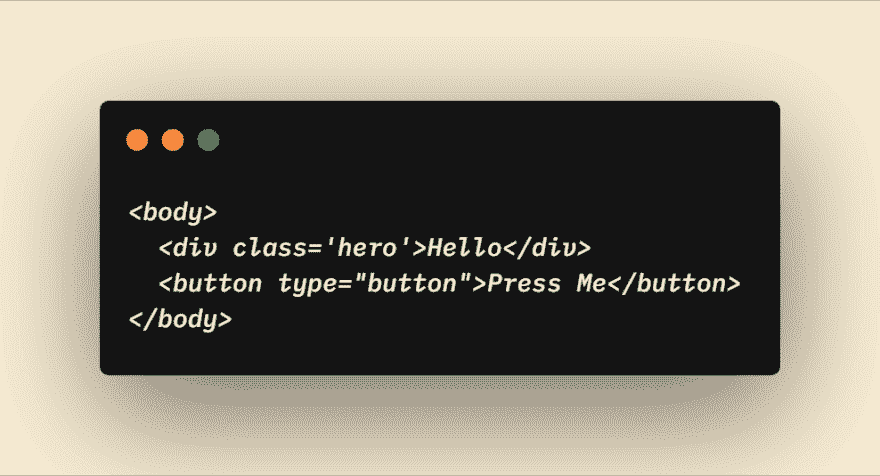
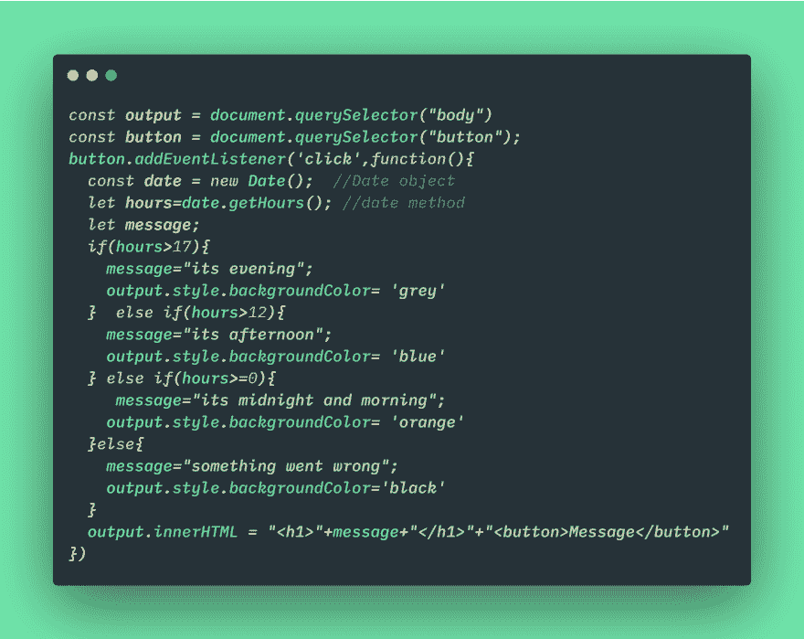

# 日期对象的正文背景颜色变化

> 原文：<https://dev.to/yashwanthambati/body-backgroundcolor-change-using-date-object-309h>

如果您想在 javascript 中尝试 Date 对象，这是一个完美的例子。

日期对象有不同的方法。我使用了 **getHours()** 方法来根据时间改变颜色。
下面是 html 代码

这里的代码为 javascript 代码

*   如果你想玩/实现，这里是代码笔[链接](https://codepen.io/yashwan46084805/pen/GVjopq)。
*   如果您想更深入地了解日期方法，那么可以看看 MDN [docs](https://developer.mozilla.org/en-US/docs/Web/JavaScript/Reference/Global_Objects/Date) 。
*   在评论中发表你对约会的最佳利用，并乐于看到你的。希望你喜欢这个例子。

**好东西**