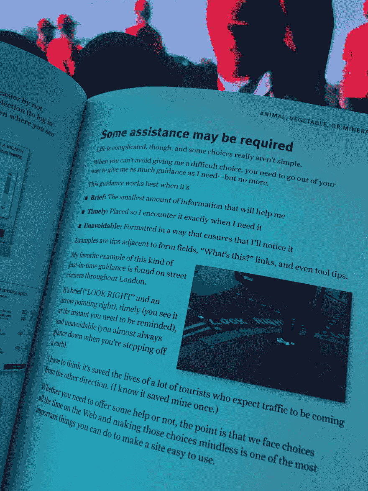
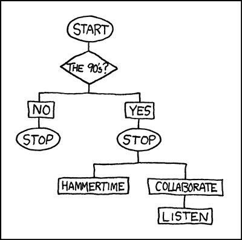
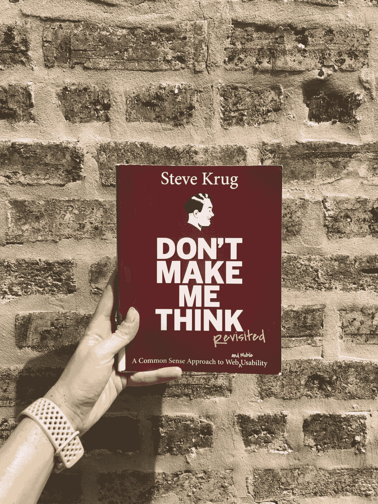

# 书评:别让我胡思乱想！

> 原文：<https://dev.to/desi/book-review-don-t-make-me-think-329k>

史蒂夫·克鲁格基本上是可用性测试和用户研究的教父。当我开始为我的团队接管用户研究时，我们的 UX 设计师建议阅读他的书[火箭手术变得容易](https://amzn.to/2SZk06V)，以熟悉测试中的原则。这本书对它进行了分解，以便任何人都可以做，提供了脚本和时间表，并就如何向您的团队介绍它以将其构建到您的流程中提出了建议。他写这本书的后续， *[不要让我思考！](https://amzn.to/317tCiW)* ，这是一个以易访问性和可用性为设计理念的基本轮廓。

我觉得这本书应该是开发、工程或设计领域的任何人的必读之作，但是我的观点真正重要吗？😉谁知道设计 web 表单如此复杂？这两本书都有很多价值，所以我将在这里分享我在*不要让我思考*中的一些笔记。

## 什么是可用性？

> 书籍定义:一个能力和经验一般(甚至低于一般水平)的人可以想出如何使用这个东西来完成某件事，而不会带来更多麻烦。
> 
> Desi 定义:这个东西应该被大多数用户无意识地使用。

即使用户发现一个产品很难，他们可能会坚持使用它，因为“你知道的魔鬼”哲学:竞争会不会不那么令人沮丧？还是会更糟？

#### 既然用户是习惯性的生物，并且会继续努力使用他们熟悉的产品，那么让产品变得可用有什么价值或好处呢？

*   让用户更容易找到他们想要的产品对用户和你都有好处:他们找到了他们想要的，你看起来可靠且有帮助，受益于重复使用和潜在的口碑营销
*   一个可用的网站或产品可以让他们了解你提供的一切，而不是他们仅仅抓住或寻找的东西，这可能会给他们带来更多的价值，给你带来更多的销售
*   你可以引导他们去你希望他们去的地方，而不仅仅是他们想去的地方
*   一个可用的产品帮助用户感觉更聪明，更有控制力，这将使他们回来，并赋予他们权力。人们希望感觉自己很聪明，并会反复使用能让他们有这种感觉的产品

#### 考虑到这一点，人们如何学习如何使用产品，以及如何在实践中使用它们？

1.  我们不读页面，我们扫描它们。(我阅读这本书的方式尤其如此——它的布局非常易于扫描，每页只显示最重要的内容，分为要点、粗体文本和其他视觉信号。)
2.  我们不做最佳选择，我们“满足”。如果某样东西“足够好”，我们会满足于它。
3.  我们不知道事情是如何运作的。我们蒙混过关——即使有教程，人们也不太可能看或读它。他们更有可能勇往直前，点击按钮，期待最好的结果。他们希望依靠直觉(因为他们相信自己很聪明)而不是指令。

### 为了便于使用，我们可以制定哪些可用性规则？

*   保持低调(只包括最相关的信息，如果有必要的话，可以链接出来让有兴趣的人了解更多)
*   将页面分成明确定义的区域-这有助于支持扫描。使用短段落、列表、粗体和大标题，省略不必要的词，尤其是无用的词——很多营销文案都是“无用的”,很容易(也很无情地)编辑。想想可可·香奈儿的哲学:“出门前，照照镜子，脱下一件东西。”
*   在提供指导时，应该简短、及时、到位。将事物分解成树，而不是一次呈现所有的选择，在构建时，列出用户在流程中可能遇到的所有可能的选择或想法。这听起来熟悉吗？😉)
*   不要耗尽善意的源泉。用户会原谅一些事情——点击错误的链接、破损的图片、混乱的文字——但是如果容器是空的，他们就会放弃并离开。做一些用户测试，看看你的产品和用户的界限在哪里

 
*[来源](https://www.xkcd.com/210/)*

## 有四个问题需要用户马上回答:

> “这是什么？他们这里有什么？我在这里能做什么？为什么我应该在这里，而不是在别的地方？”

您可以从自己的网站上收集数据，并使用这些数据来确定正确的问题(例如，“人们喜欢单选按钮吗”与“在这种情况下和这种背景下，单选按钮是否能为大多数*用户提供良好的体验”)。可用性背后的理念是让*大多数*用户在使用产品时无需动脑。*

原书于 2000 年出版，2014 年发布了更新版，其中包含了对手机设计的建议。不要让我认为很棒，不仅因为他打破原则的简单方式，还因为它充满了现实生活中相关的例子。其中最具启发性的部分是史蒂夫谈到他为什么不在手机上使用某个特定的网站，以及他的解决办法(从该网站获得提醒，谷歌搜索新闻条目，并找到不同的新闻服务阅读)。)在这次更新中，他谈到了“移动优先”设计的理念(以及为什么这并不总是解决移动可用性问题)和响应式设计。

## 提高可访问性的四件事

1.  修复困扰所有人的可用性问题
2.  以用户阅读的方式阅读文章(使用屏幕阅读器、移动设备、RSS 阅读器等)。)
3.  读书
4.  去摘容易摘到的水果。几个简单的解决办法:给图片添加`alt`标签，使用合适的`h`标签来表明重要性，或者[阅读林赛关于这个话题的一篇文章](https://dev.to/lkopacz/3-simple-tips-to-improve-keyboard-accessibility-5hc8)！

 
*[来源](https://www.smithsonianmag.com/science-nature/new-research-suggests-dr-seuss-modeled-lorax-on-this-real-life-monkey-180969692/)*

在书的结尾，他提到了苏斯博士。Lorax 是一个“为树木说话”的角色，史蒂夫建议我们成为用户的 Lorax。通常，管理和业务分析师与用户脱节，只关注“底线”，使用这些信息来规划路线图。为了替你的用户说话，学习如何用商业术语解释用户的需求和愿望，以影响或说服利益相关者和决策者，向他们展示为什么这对他们有益。这可以通过展示 ROI，或者运行可用性测试来获得数据。(分析师热爱数据。)您也可以对它们进行主干测试——这可能是展示可用性原则的好方法！

## 我的外卖

*   [求支持](https://dev.to/desi/developers-delight-your-users-and-support-team-in-just-one-day-per-year-2e8d)。您的支持团队是您与用户互动的第一道防线。他们知道痛点、期望以及常见的可用性和可访问性问题
*   导航很重要——如果它不见了或者用户认为它不见了，你的网站就无法使用
*   确定什么样的权衡是值得的。坚持让链接看起来像普通文本一样，没有明显的区别，并可能让用户找不到他们想要的东西，这值得吗？或者这是你可以做出的让步？
*   了解你的用户。如果可能的话，做可用性测试，如果不行，再做一次...*与你的支持团队交谈*
*   遵循最佳实践和标准——不要重复提交按钮。如果用户熟悉一个界面，用他们熟悉的方式设计
*   取悦你的用户。什么是快乐？能定义一下吗？一个产品能在各个方面都令人愉悦吗？
*   以用户*实际*使用产品的方式提供产品。如果你的关于在出租车上使用盲文的长篇文章不能被屏幕阅读器找到，那么你被访问的次数可能并不重要
*   做洛拉克斯。除了在管理上支持用户，还要支持你的团队。如果某个东西的开发方式会让用户感到吃力，那就提出来，试着用不同的方式来谈论它

除了所有真正有帮助和有用的信息，这是一个简单的阅读-明智的设计，快速，紧凑。史蒂夫以一种非正式、随意的语气写作，并以“显而易见”的方式分解原则和概念。这本书(和*Rocket Surgery Easy*)是无价的资源，其中的原则可以在产品过程的所有阶段提供帮助，值得一读！(_ 如果他们说没有时间，就给他们发这个帖子😉)

书中提到的进一步阅读:

*   [放开文字](https://amzn.to/2SYnh6r)
*   [有效的表单:为可用性设计 Web 表单](https://amzn.to/335v3A8)
*   [人人共享的网站:设计无障碍用户体验](https://amzn.to/2K9t4TW)
*   [网页可访问性:网页标准和法规合规性](https://amzn.to/2LTXpZ1)
*   这是我们的研究
*   [一个用户体验团队](https://amzn.to/2LV0O9X)
*   [影响力:说服心理学，如何让人们做事](https://amzn.to/2YFB2MA)
*   [邪恶的设计](https://amzn.to/2LScJFn)
*   [互联网时代的企业文化](https://www.strategy-business.com/article/10374?gko=6de40)
*   [你说“土豆”，我说“焦点小组”](http://someslightlyirregular.com/blog/2011/08/12/you-say-potato)
*   [xcd . com](https://www.xkcd.com)