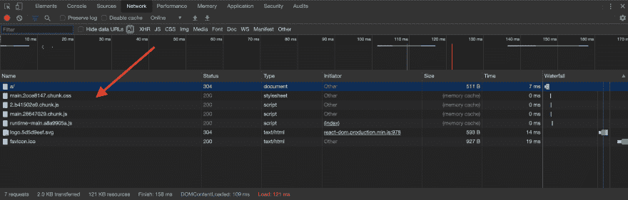

# 通过基于哈希的内容缓存提升 React 应用的 UX。

> 原文：<https://dev.to/matsilva/boost-the-ux-of-your-react-app-with-hash-based-content-caching-2h8g>

## 我们在努力解决什么问题？

假设您有一个 JavaScript 应用程序，在`http://mysite.com/js/myapp.js`提供。一个典型的性能优化是告诉浏览器缓存`myapp.js`，这样用户就不必在每次使用应用时重新下载资产。如果你练习连续交付，你遇到的问题是交付新的应用程序更新。如果`myapp.js`被缓存，用户将不会得到新的更新，直到 a)他们清除缓存或 b)最大年龄到期。

*来自谷歌开发文档:*

> 理想情况下，您应该尽可能长时间地在客户机上缓存尽可能多的响应，并为每个响应提供验证标记，以实现高效的重新验证。

在本指南中，我们要做的是想出一种尽可能长时间缓存应用程序资产的方法:永远！算是吧..我们将使用基于哈希的内容缓存策略，google dev docs 提到它能给你两全其美:客户端缓存和快速更新。

### 创建-反应-应用入门

首先，我们将使用优秀的 ole [create react app](https://github.com/facebook/create-react-app) 快速建立一个新的单页面应用程序。

让我们创建一个新的应用程序，`create-react-app content-cache`

所以在一个新的目录中，`~/code`，让我们运行这个:

```
npx create-react-app content-cache
cd content-cache 
```

所以现在你会在`~/code/content-cache`中有一个新的应用程序设置，你现在应该在`content-cache`目录中。

现在我们可以运行`npm run build`，它将在`./build`中为您的应用程序输出所有资产。现在有了这些资产，让我们看看如何用 nginx 服务这些资产。

### engine+dock = yayyy

让我们继续创建一个新文件，`touch ~/code/content-cache/Dockerfile`，其内容如下:

```
FROM nginx:1.13-alpine

RUN apk add --no-cache bash curl

COPY nginx/ /

CMD ["/docker-entrypoint.sh", "nginx", "-g", "daemon off;"]

EXPOSE 8080

COPY build/static/ /usr/share/nginx/html/

COPY package.json / 
```

您会注意到我们遗漏了一些东西:

*   正在复制的`nginx/`文件夹。
*   `docker-entrypoint.sh`脚本。

现在让我们继续添加这些内容。

创建一个新目录`mkdir -p ~/code/content-cache/nginx/etc/nginx`，然后创建一个新文件`touch ~/code/content-cache/nginx/etc/nginx/nginx.conf`。

然后打开文件，将以下内容复制到其中:

```
user  nginx;
worker_processes  1;

error_log  /var/log/nginx/error.log warn;
pid        /var/run/nginx.pid;

events {
    worker_connections  1024;
}

http {
    include       /etc/nginx/mime.types;
    default_type  application/octet-stream;

    sendfile        on;

    keepalive_timeout  65;

    gzip  on;
    gzip_types text/plain application/xml application/javascript text/css;

    include /etc/nginx/conf.d/*.conf;
} 
```

这大部分是样板 nginx 配置，所以我不打算花时间解释它，你可以从 [nginx 文档](https://docs.nginx.com/nginx/admin-guide/web-server)中了解更多。请注意，我们包含了`/etc/nginx/conf.d/*.conf`，它包含了我们接下来要创建的`default.conf`文件。

让我们继续创建文件`touch ~/code/content-cache/nginx/etc/nginx/conf.d/default.conf`，并向其中添加以下内容:

```
server {
    listen       8080;

    # include the hash based content
    include /etc/nginx/conf.d/app/*.conf;

    location ~ ^/$ {
        # we are serving the app at `/a/`
        return 303 a/;
    }

    # serve other static assets
    location / {
        root   /usr/share/nginx/html;
        index  /index.html;
        try_files $uri /index.html;
        include /etc/nginx/conf.d/app/preload.headers;
    }
} 
```

我们将在`/a/`为该应用提供服务，这是一种策略，用于在处理对位于同一域的后端 API 的反向代理时，使生活变得更简单。

所以，请注意我们包含了`/etc/nginx/conf.d/app/*.conf;`，这是我们基于哈希的内容。

现在让我们继续创建一个新文件`touch ~/code/content-cache/nginx/docker-entrypoint.sh`,神奇的事情就发生在这里。

粘贴以下内容:

```
#!/usr/bin/env bash

mkdir -p /etc/nginx/conf.d/app
pushd /usr/share/nginx/html/js/ > /dev/null

APP_JS=/app/js/app.js
for js in main.*.*.js
do
    cat  > /etc/nginx/conf.d/app/js.conf <<EOF
location ~* ^/app/js/main.js([.]map)?\$ {
    expires off;
    add_header Cache-Control "no-cache";
    return 303 ${js}\$1;
}
location ~* ^/app/js/(main[.][a-z0-9][a-z0-9]*[.]js(?:[.]map)?)\$ {
    alias   /usr/share/nginx/html/js/\$1;
    expires max;
    add_header Cache-Control "public; immutable";
}
EOF
    APP_JS="/js/${js}"
    break;
done
RUNTIME_JS=/app/js/runtime.js
for js in runtime~main.*.js
do
    cat  > /etc/nginx/conf.d/app/js.conf <<EOF
location ~* ^/app/js/runtime~main.js([.]map)?\$ {
    expires off;
    add_header Cache-Control "no-cache";
    return 303 ${js}\$1;
}
location ~* ^/app/js/(runtime~main[.][a-z0-9][a-z0-9]*[.]js(?:[.]map)?)\$ {
    alias   /usr/share/nginx/html/js/\$1;
    expires max;
    add_header Cache-Control "public; immutable";
}
EOF
    RUNTIME_JS="/js/${js}"
    break;
done
VENDOR_JS=/app/js/vendor.js
for js in 2.*.*.js
do
    cat >> /etc/nginx/conf.d/app/js.conf <<EOF
location ~* ^/app/js/2[.]js([.]map)?\$ {
    expires off;
    add_header Cache-Control "no-cache";
    return 303 ${js}\$1;
}
location ~* ^/app/js/(2[.][a-z0-9][a-z0-9]*[.]js(?:[.]map)?)\$ {
    alias   /usr/share/nginx/html/js/\$1;
    expires max;
    add_header Cache-Control "public; immutable";
}
EOF
    VENDOR_JS="/js/${js}"
    break;
done

cd ../css
APP_CSS=/app/css/main.css
for css in main.*.*.css
do
    cat > /etc/nginx/conf.d/app/css.conf <<EOF
location ~* ^/app/css/main.css([.]map)?\$ {
    expires off;
    add_header Cache-Control "no-cache";
    return 303 ${css}\$1;
}
location ~* ^/app/css/(main[.][a-z0-9][a-z0-9]*[.]css(?:[.]map)?)\$ {
    alias   /usr/share/nginx/html/css/\$1;
    expires max;
    add_header Cache-Control "public; immutable";
}
EOF
    APP_CSS="/css/${css}"
done

cd ..

cat > /etc/nginx/conf.d/app/preload.headers <<EOF
add_header Cache-Control "public; must-revalidate";
add_header Link "<${APP_CSS}>; rel=preload; as=style; type=text/css; nopush";
add_header Link "<${VENDOR_JS}>; rel=preload; as=script; type=text/javascript; nopush";
add_header Link "<${APP_JS}>; rel=preload; as=script; type=text/javascript; nopush";
add_header X-Frame-Options "SAMEORIGIN" always;
EOF

cat > index.html <<EOF
<!DOCTYPE html>
<html lang="en">
<head>
    <meta charset="UTF-8"/>
    <meta name="viewport" content="width=device-width, initial-scale=1.0"/>
    <meta http-equiv="X-UA-Compatible" content="ie=edge"/>
    Create React app
    <link href="${APP_CSS}" rel="stylesheet">
</head>
<body>
    <div id="root"></div>
    <script type="text/javascript" src="${VENDOR_JS}"></script>
    <script type="text/javascript" src="${APP_JS}"></script>
    <script type="text/javascript" src="${RUNTIME_JS}"></script>
</body>
</html>
EOF

popd > /dev/null

exec "$@" 
```

让我们继续一点一点地分解它。

```
mkdir -p /etc/nginx/conf.d/app
pushd /usr/share/nginx/html/js/ > /dev/null 
```

这将创建一个新目录，并使用`pushd`CD 到`/usr/share/nginx/html/js`目录，同时将输出重定向到`/dev/null`，这样控制台就不会发出噪音。

```
APP_JS=/a/js/app.js
for js in main.*.*.js
do
    cat  > /etc/nginx/conf.d/app/js.conf <<EOF 
```

这是一个 for 循环，它遍历匹配`main.*.*.js`的 javascript 文件，这是我们散列内容文件的模式。然后，它将位置块连接成一个文件`/etc/nginx/conf.d/app/js.conf`。

```
location ~* ^/a/js/main.js([.]map)?\$ {
    expires off;
    add_header Cache-Control "no-cache";
    return 303 ${js}\$1;
} 
```

我们也将任何对`/a/js/main.js`的请求重定向到匹配的基于散列的文件。

```
location ~* ^/a/js/(main[.][a-z0-9][a-z0-9]*[.]js(?:[.]map)?)\$ { 
```

还要注意我们正在匹配`.map`文件，这样我们也可以加载源地图文件。

```
 alias   /usr/share/nginx/html/js/\$1; 
```

然后，我们最大限度地缓存那些基于哈希的文件！

```
 expires max;
    add_header Cache-Control "public; immutable";
}
EOF 
```

然后，我们将散列的资产文件存储在`APP_JS`中，以便稍后在脚本中使用。

```
 APP_JS="/js/${js}"
    break;
done 
```

接下来的三个 for 循环做的和上面一样，但是针对不同的资产文件。运行时文件`runtime~main.*.js`，供应商文件`2.*.*.js`，以及 css 文件`main.*.*.css`。

接下来我们设置我们的`preload.headers`。

```
cat > /etc/nginx/conf.d/app/preload.headers <<EOF
add_header Cache-Control "public; must-revalidate";
add_header Link "<${APP_CSS}>; rel=preload; as=style; type=text/css; nopush";
add_header Link "<${VENDOR_JS}>; rel=preload; as=script; type=text/javascript; nopush";
add_header Link "<${APP_JS}>; rel=preload; as=script; type=text/javascript; nopush";
add_header X-Frame-Options "SAMEORIGIN" always;
EOF 
```

这告诉浏览器预加载这些资产并将这些文件存储在 http 缓存中。我们指定了`nopush`,这样服务器就知道我们现在只想预加载它。

然后我们动态地创建我们的`index.html`文件:

```
cat > index.html <<EOF
<!DOCTYPE html>
<html lang="en">
<head>
    <meta charset="UTF-8"/>
    <meta name="viewport" content="width=device-width, initial-scale=1.0"/>
    <meta http-equiv="X-UA-Compatible" content="ie=edge"/>
    Create React app
    <link href="${APP_CSS}" rel="stylesheet">
</head>
<body>
    <div id="root"></div>
    <script type="text/javascript" src="${VENDOR_JS}"></script> 
```

我们使用`APP_JS`变量来设置 js 文件的 src。我们也为其他资产文件做同样的事情。

```
 <script type="text/javascript" src="${APP_JS}"></script>
    <script type="text/javascript" src="${RUNTIME_JS}"></script>
</body>
</html>
EOF 
```

然后我们用`popd > /dev/null`变回原来的目录，然后执行传递给这个脚本`exec "$@"`的任何参数。这很重要，否则在我们的 Dockerfile 命令:`CMD ["/docker-entrypoint.sh", "nginx", "-g", "daemon off;"]`中，`"/docker-entrypoint.sh"`后面的参数将不起作用。

### 让我们看看这一切的行动

我们将构建并运行 Docker 容器。

在`~/code/content-cache`中，运行:

*   `chmod +x ./nginx/docker-entrypoint.sh` -使脚本可执行。
*   这建立了图像。
*   运行 docker 容器。

现在你的应用程序正在运行，进入 [http://localhost:8080](http://localhost:8080) 。在您的开发工具中打开 network 选项卡并刷新页面。您应该看到 JavaScript 和 CSS 资产现在应该被缓存了。它应该是这样的:

[](https://res.cloudinary.com/practicaldev/image/fetch/s--d7TKEYUt--/c_limit%2Cf_auto%2Cfl_progressive%2Cq_auto%2Cw_880/https://thepracticaldev.s3.amazonaws.com/i/hywwhoqnzlaoeat5qeeb.png)

看起来不错！现在让我们做另一个构建，以确保它按预期工作。通过按 ctr + c，然后运行`docker rm nginx-test-app`，终止当前 docker 容器。

现在运行`npm run build && docker build -t nginx/test .`然后`docker run --name="nginx-test-app" -p 8080:8080 nginx/test`，打开 [http://localhost:8080](http://localhost:8080) 并检查网络选项卡以确认资产文件来自最新的构建。

[](https://res.cloudinary.com/practicaldev/image/fetch/s--d7TKEYUt--/c_limit%2Cf_auto%2Cfl_progressive%2Cq_auto%2Cw_880/https://thepracticaldev.s3.amazonaws.com/i/hywwhoqnzlaoeat5qeeb.png)

🤘现在我们正在谈话！在这一点上，现在，我们有最好的两个世界的设置: **最大内容缓存和快速更新** 当我们的应用程序的新版本部署。

您可以随意使用这种技术，并根据自己的需要进行修改。回购的链接如下。

#### 资源:

*   [github 回购](https://github.com/matsilva/nginx-hash-cache)

#### 学分:

*   [@connolly_s](https://twitter.com/connolly_s) -用这个策略让我看到了光明🤣