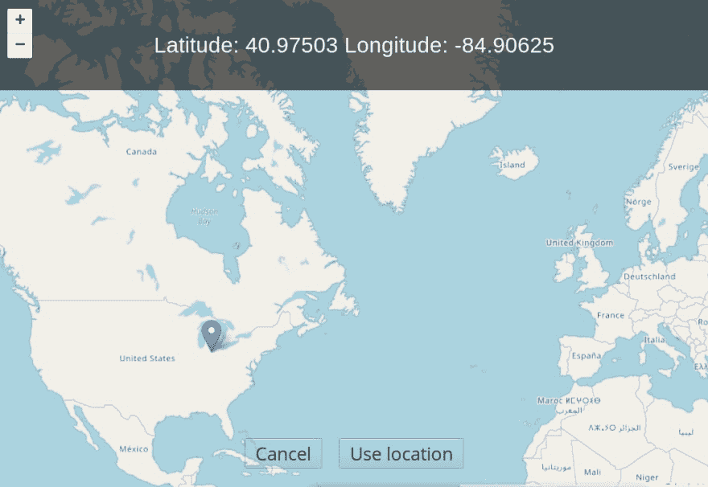

# 使用纤巧的 3 组件提升您的传统应用

> 原文：<https://dev.to/jimutt/boost-your-legacy-apps-with-svelte-3-components-2ab>

最近，苗条身材的周围确实出现了一些理所应当的模糊现象，但也许还不够？这是一个惊人的轻量级框架，没有繁重的运行时间，开销也很小。这使得它不仅仅是 spa 和同构 web 应用程序的合适选择。

您知道吗，您可以创建一个苗条的组件，而且几乎不需要额外的步骤就可以分发——并通过一个全局构造函数(`let myComponent = new MyComponent()`)像使用任何经典的旧 Javascript 库一样使用它？

默认情况下，苗条的组件编译成标准的 JavaScript 类，所以你只需要用你的组件添加一个生命构建。我将简要地向您展示 Rollup 是如何完成的，以及如何使用该组件。这与官方的应用启动模板([https://github.com/sveltejs/template](https://github.com/sveltejs/template))没有太大的区别，但我认为人们很容易忽略 Svelte 对于分发和消费单个组件是多么方便。

我将使用我的一个简单的示例组件来演示。它呈现一个传单地图，让用户选择一个位置。当所选位置改变时(例如，可用于更新表格字段)发出事件，并且地图允许用于配置例如初始纬度/lng 和缩放级别的道具。

组件可以在这里找到:[https://github.com/jimutt/svelte-pick-a-place](https://github.com/jimutt/svelte-pick-a-place)

也可以安装 npm: `npm install svelte-pick-a-place`

*(该组件主要是为实验用途而创建的，简单到足以证明使用 Svelte 来构建可能是多余的)*

如果你在一个苗条的应用程序中使用它，它可能看起来像这样:

```
<script>
  import PickAPlace from 'svelte-pick-a-place';
</script>

<PickAPlace leaflet={leaflet} on:update={() => console.log('Update!')} on:save={() =>
console.log('On save!')} /> 
```

[](https://res.cloudinary.com/practicaldev/image/fetch/s--1i09O_W---/c_limit%2Cf_auto%2Cfl_progressive%2Cq_auto%2Cw_880/https://thepracticaldev.s3.amazonaws.com/i/5r42c0yhtvwo1uod9o2c.png)

但是如果我们想在一个遗留的应用程序中使用它，比如用 Bootstrap 3 和大量的 jQuery 构建而没有 Node.js 的迹象，那该怎么办呢？没问题！我们将使用 IIFE build 并通过其全局构造函数实例化组件类:

```
<link rel="stylesheet" href="https://unpkg.com/svelte-pick-a-place@latest/dist/pick-a-place.css">
<script src="https://unpkg.com/svelte-pick-a-place@latest/dist/pick-a-place.min.js"></script> 
```

```
let pickAPlace = new PickAPlace({
  target: document.getElementById('map'),
  props: {
    leaflet: window.L,
    buttons: false
  }
});

// Listen to events through component.$on('eventName', callback)
pickAPlace.$on('update', ({ detail }) => {
  console.log('New position: ', detail);
  // Here we could for example populate an input field with the new value
});

// Update a prop with $set, or set the 'accessors' compiler option
// to true to automatically generate getters and setters for all props
pickAPlace.$set({ buttons: true }); 
```

带引导程序的 Codepen 演示:[https://codepen.io/jimutt/pen/ZgaYBP](https://codepen.io/jimutt/pen/ZgaYBP)

如你所见，道具和事件可以通过 API 类轻松访问。不幸的是，目前还没有一种方便的方法来添加槽内容。

## 构建配置

对于取货组件，生产构建入口点是文件**src/components/components . module . js**:

```
export { default } from './PickAPlace.svelte'; 
```

它包含带有 PickAPlace 组件的默认导出。如果你要在同一个包中导出多个组件，并且想要实例化它们，比如使用`new MyPackageName.Component1()`命名空间，你可以使用命名导出。

该文件在`rollup.config.js` :
中被指定为生产构建的输入

```
//rollup.config.js
input: !production ? 'src/main.js' : 'src/components/components.module.js', 
```

在 [rollup.config.js](https://github.com/jimutt/svelte-pick-a-place/blob/master/rollup.config.js) 中，我们添加了几个输出来支持消费组件的多种方式:

```
//rollup.config.js
output: [
   { file: 'dist/index.min.mjs', format: 'es' },
   { file: 'dist/index.min.js', format: 'umd', name },
   { file: 'dist/pick-a-place.min.js', format: 'iife', name }
]
// "name" is set to PickAPlace 
```

您可能已经发现，这是遗留应用程序应该使用的最后一个输出定义。通过上面的输出配置，我们允许从基于 Node.js 环境的现代应用程序和遗留应用程序中使用组件。

PickAPlace 组件是从这个项目模板创建的，然后稍作修改:[https://github.com/YogliB/svelte-component-template](https://github.com/YogliB/svelte-component-template)

这就是我要说的！只是想发布一个关于 Svelte 的多功能性的快速提醒，它不仅仅是完整的网络应用程序的一个很好的选择！