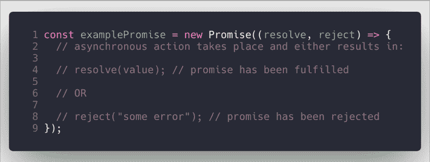
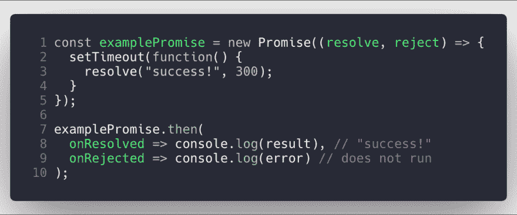
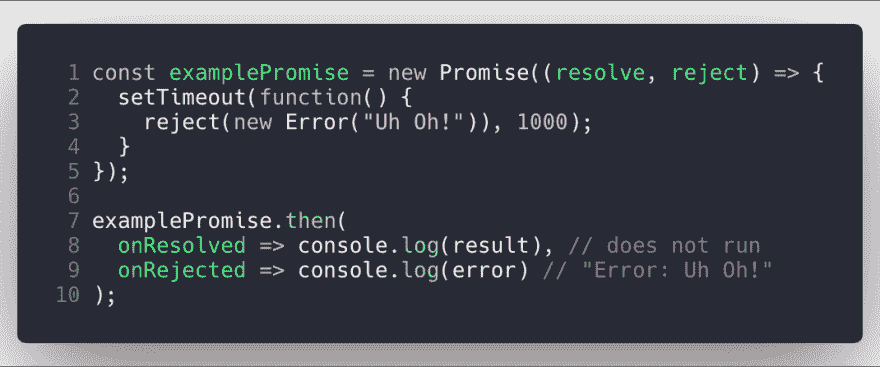
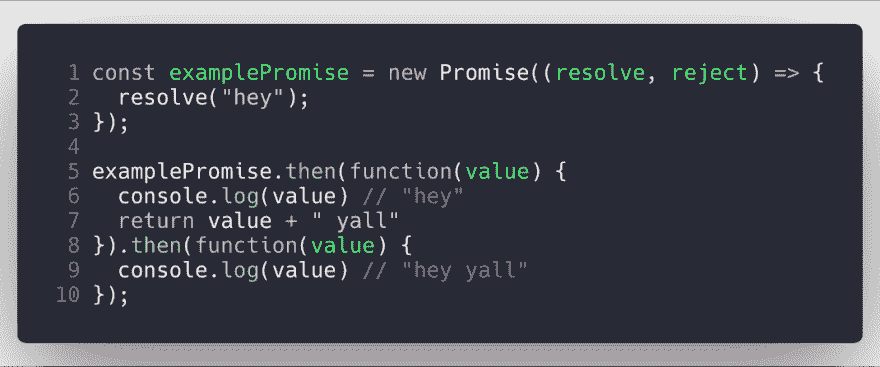
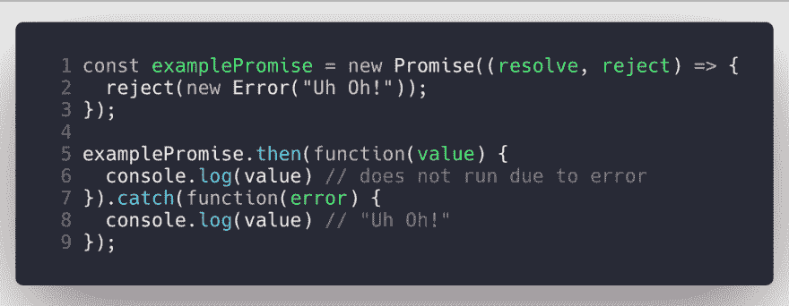
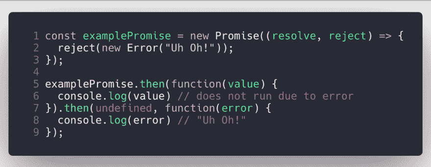

# 打破 ES6:承诺

> 原文：<https://dev.to/torianne02/breaking-down-es6-promises-4o6f>

本周，我决定让你们来决定我将在我的*分解 ES6* 系列的这一期中涵盖哪个主题。我给出了 ES6 引入承诺或默认参数的选项。从标题可以看出，**承诺赢了**！

现在，我以前使用过承诺，对它们的运作有一个表面的了解，但是我不知道所有的细节。在这篇博文中，我会边研究边写作。会很热闹的，所以我们开始吧。

## 什么是承诺？

在寻找承诺的具体定义时，我发现每个人使用不同的措辞，但都有相同的潜在含义。我发现的我最喜欢的定义恰好来自于 [MDN web docs](https://developer.mozilla.org/en-US/docs/Web/JavaScript/Guide/Using_promises) 。

> **承诺**是代表异步操作最终完成或失败的对象。

他们的定义简短而甜蜜，却传达了什么是承诺的确切信息。承诺是一个对象，充当异步操作的未来结果的占位符。一个很好的现实世界的例子来自我在研究时发现的一篇文章。我非常喜欢这个例子，所以我要在这里与你分享。

> 例如，你订了一张去印度的机票，去美丽的大吉岭山站旅游。预订后，你得到一张票。那张*机票*是航空公司的承诺，保证你在出发当天会得到一个座位。本质上，票是未来值、名字、座位的占位符。

既然我们已经讨论了什么是承诺，我将告诉你使用承诺的有用术语。

### 有用的术语

承诺有 3 种不同的可能状态:**履行**、**拒绝**和**待定**。让我们讨论一下每一个都意味着什么。

###### 履行完毕——相关动作已经成功，意味着承诺已经成功完成。

###### 拒绝-相关动作已失败，表示承诺无法成功完成。

###### Pending -相关动作尚未完成或拒绝，表示承诺仍在等待完成。

澄清一下，当我说“相关行动”时，我指的是与承诺相关的行动。所以，总而言之，这些术语是不言自明的。

## 创造承诺

promise 是通过使用 Promise 构造函数创建的，它使用了一个熟悉的关键字`new`。这个构造函数接受一个函数作为参数，更好的说法是“executer function”，它接受两个函数作为参数，`resolve`和`reject`。

当异步操作成功完成并返回结果时，调用`resolve`。

当异步操作失败并返回一个错误对象时，调用`reject`。

## 利用承诺

现在开始使用承诺！作为开发人员，为了访问由`resolve`或`reject`返回的值，我们需要使用 Promise `.then()`方法。用最简单的术语来说，`.then()`方法返回承诺。`.then()`有两个参数，它们都是负责承诺成功或失败的处理函数。

`.then()`的第一个论点运行在承诺兑现，收到结果的时候。

`.then()`的第二个参数是一个函数，它在承诺被拒绝并收到错误时运行。

一旦函数被实现或拒绝，相应的处理函数将被异步调用。说到这里，我想指出一个承诺的重要特征:

一个承诺只能成功**或**失败一次。意思是承诺没有能力从成功转换到失败或者相反。

### 链接

`then()`方法的一大优点是它允许方法链接。这意味着您有能力获取第一个`.then()`方法返回的结果，并在下面的`.then()`方法中使用它。

## 错误处理——捕捉承诺

之前我们讨论过`.then()`如何接受两个参数，一个代表成功，另一个代表失败。嗯，还有另一种方法来编码错误，这就是使用`.catch()`。根据我找到的许多文章，`.catch()`并没有什么特别之处，它只是让代码更具可读性。`.catch()`是`then(undefined, func)`的语法糖。

这与相同

与`.then()`一样，`.catch()`也可以被链接，因为它返回一个承诺。

### 最后的想法

哇，为你们写这篇文章，我确实学到了很多关于承诺的东西。老实说，这可能是我写博客时最纠结的一次。这正是我喜欢写技术文章的原因，因为它能帮助我更深入地理解我所写的主题。

请记住，**我是一个初级开发人员，还在学习**，所以如果我在这里**发生了什么错误，请在下面的评论中让我知道**，这样我就可以解决它。我不想这里有不正确的信息，就像你不想读它一样。让我们帮助彼此变得更好！

不管怎样，我真的希望我能帮助哪怕只是一个人理解 JavaScript 承诺，或者教一些他们不知道的新东西。

附注——我决定开始把我在旅途中拍摄的照片作为我博客文章的封面图片。这张火地岛日出时的照片拍摄于危地马拉的阿卡坦南戈火山山顶。

#### 来源

[一个简单的 Guid 对 ES6 的承诺](https://codeburst.io/a-simple-guide-to-es6-promises-d71bacd2e13a)
[JavaScript 承诺:一个简介](https://developers.google.com/web/fundamentals/primers/promises)
[承诺](https://javascript.info/promise-basics)
[承诺](https://developer.mozilla.org/en-US/docs/Web/JavaScript/Reference/Global_Objects/Promise)
[承诺. prototype.then()](https://developer.mozilla.org/en-US/docs/Web/JavaScript/Reference/Global_Objects/Promise)