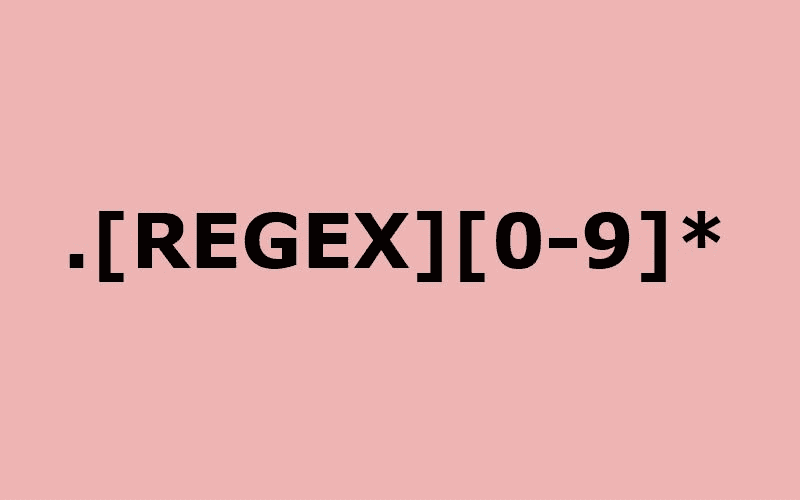

# 分解正则表达式[0] —一次一步

> 原文：<https://dev.to/bagadia/breaking-down-regular-expressions-0-one-step-at-a-time-3m2h>

### 分解正则表达式——一步一步来

对于这篇文章，我将从头开始构建这一切。阅读本文的您可能是一名经验丰富的开发人员，一名对名字的含义有所了解的大学生，或者不是程序员但想知道术语**正则表达式**是什么的人。欢迎任何人和任何人。

在继续之前，我想说明一些事情，那就是我不能为一个模式写正则表达式。有时，我会忘记在 **regex** (正则表达式的较短形式)中编写特定元素的最基本语法。这就是为什么，这更多的是给我自己而不是给公众的一份文件。当我阅读我自己写的东西时，比查找某个主题的分布式资源时，我学得更好。如果我要写一篇关于正则表达式的详细文章，为什么不像写文章一样写呢？

请随意添加建议或提供反馈(建设性的，请)。

### 餐厅场景

让我们先从一个场景开始。你旅行到一个新的城市，你进入一家非常受欢迎的餐馆吃午饭。如此受欢迎以至于他们有 50 页的菜单。你把菜单拿在手里，然后呆住了。你以前没有去过那个地方，你不知道那个地方供应什么，而且你很饿。非常饿。

你很幸运，餐馆的工作人员非常乐于助人。你会想，这就是它们最初变得流行的原因。你不需要仔细检查菜单上的每一个项目，这实际上是不可能的，你只需要问一些你想要的食物的基本成分。

你叫来了服务员，让他们给你送来一些既有奶酪又有豌豆的东西。现在因为(a)工作人员非常友好——他们接受你的请求，这不完全是命令,( b)工作人员非常有才华，非常了解他们的菜单——所以他们会给你一份既有奶酪又有豌豆的菜单。

太好了！这个清单相对来说比较小，你现在可以浏览菜单，决定你想要什么，然后下订单。

如果您理解了上面的场景，那么您现在对什么是正则表达式有了一个基本的概念。我来打个比方。

### 并行

当你第一次要求(*询问*)服务员给你带有奶酪和豌豆的食物时，你给了他们你想要的*配料组合*或*图案*(你可以要求烧烤或烘烤的食物，他们仍然会给你一份清单)。服务员现在有了两个输入。他们有多年来一直在处理的非常大的菜单，以及你想要的组合。

服务员*匹配*你的组合，找到你想要的菜单。

在软件世界里，这没什么不同。在这里，您给一个系统一个字符的**序列**或**模式**，并要求它们返回所有与* 匹配的* *结果。*

让我们把这个和上面的例子联系起来。假设你正在接受一个新服务员的服务。让我们叫她露西吧。露西还没有记住整个菜单，正在努力给你弄完整的菜单。她有其他的桌子要参加，也不能亲自坐下来为你搭配。她的同事们也忙着出席宴会。

但她对电脑很在行。

因为她在一家豪华餐厅工作，他们把菜单数字化储存在电脑里。她编写了一个快速正则表达式来匹配名称中包含奶酪和豌豆的所有菜肴，瞧，她现在已经为您准备好了列表！

这是正则表达式的一个真实用例。你拿着*的组合/图案/文字序列* **【芝士】【豌豆】**，你把它和整个菜单**【芝士蘸豌豆】【芝士蜜&豌豆特色等】**。

现在我们将把上面的例子扩展到另一个真实的用例中，这样我们就可以确信我们理解了正在发生的事情。露西正在浏览菜单，她是新来的船员，她突然注意到一些东西。在记下**“奶酪豌豆丝”**时，她注意到*奶油*被拼错了。因为她现在有了正则表达式的能力，所以她输入搜索*“cream”*——实际的拼写，但没有找到结果。但她确实记得学过几道有奶油的菜。他们在哪里？

然后，她搜索包含“*creem”*的菜肴，它们就在那里。所有的菜都有*奶油*拼错了！再说一次，她对电脑很在行。完成订单后，她找到所有拼错单词*【克里姆】*的菜肴，并用正确的*【奶油】*替换。她后来把这件事通知了管理层，结果是大团圆结局，她后来用奖金给自己买了一台生奶油机。

### 定义

我爱 [**MDN**](https://developer.mozilla.org/en-US/docs/Web/JavaScript/Guide/Regular_Expressions) 的资源，那么我们就来看看他们是如何定义正则表达式的，看看既然知道了正则表达式是什么以及如何使用，我们是否能理解它的技术定义。

> 正则表达式是用于匹配字符串中字符组合的模式。

而且，就是这样。您现在知道正则表达式的用途了。

等一下，停止滚动，将手指从屏幕或鼠标上拿开。现在花一点时间想一些您可以使用正则表达式的真实事件。尽可能让它变得荒谬——在商场里找到所有的蓝色夹克，买黑色或蓝色镶边、中间有花的地毯。

### 该在哪里&为什么是它的一部分

现在你已经考虑过了，我们将通过看一些正则表达式被广泛使用的非常具体的场景来结束这一部分。这将有助于我们对此有一个更技术性的视角。

1.  在填写在线表格时，你有没有遇到过这样的约束条件:“*请只输入数字*”，我的意思是这很糟糕，对吗？不，它们很重要，是通过正则表达式实现的。系统检查输入的值是否与从 0 到 9[0–9]的预定义字符串匹配。我们将在本系列的后面检查类似的例子。

2.  你是否忘记了你把一个文件放在了电脑的什么地方，而且这个文件很重要？但你通常不会惊慌失措，不是吗？您只需点击搜索选项，并键入您确信文件名包含的几个字母。系统接受输入(*奶酪和豌豆*)并试图在你的文件存储系统中找到相关的项目(*菜单*)。

3.  它在 web 抓取中也很有用——当您想使用代码从网页中获取一些信息时。您可以输入要查找的模式，例如，包含单词“NEWS”的标题。正则表达式在 web 抓取中的一个非常非常基本的应用可以在这里找到[一个小型的个人项目。](https://github.com/vidhibagadia/Packt-Tracer)

这篇文章从头开始，对有经验的人来说可能没什么用。这个系列的下一篇文章将很快落下，它将集中在把你的模式和文本变成我们可以使用的实际代码上。所以，如果你愿意的话，可以留下来。

对于那些刚入门的人，要注意的是，我目睹过高级开发人员也在与正则表达式作斗争。在你的第一次、第二次、第三次甚至第七十次尝试中没有抓住它是完全没有问题的。你(我们)在项目中使用得越多，这个概念就变得越友好，老实说，这应该是最终目标。不是掌握它，而是和它交朋友。

我几乎忘记了我使用的每个其他项目的 regex 语法，但是我知道该做什么，只需要验证和修改语法是否正常工作。我也有很长的路要走，但是对于我想在其中包含正则表达式的任何项目来说都是可以的。

你也会没事的。

— — — — — — — — —

如果这能帮助你理解正则表达式，请留下你的评论。如果你想聊些话题，你可以在推特上找到我 [*这里*](https://twitter.com/vidhibagadia) ，或者你可以查看我在 _[*vidhibagadia . me*](https://vidhibagadia.me)*列出的其他链接。*