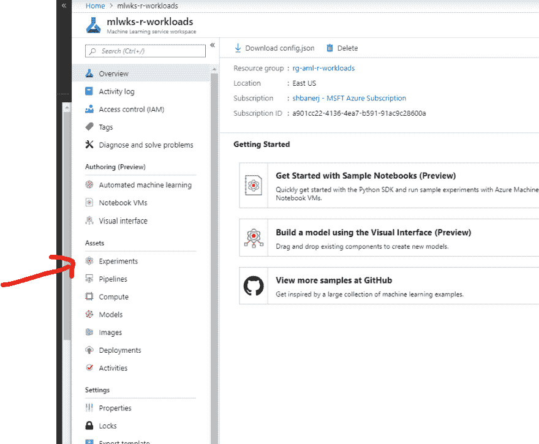
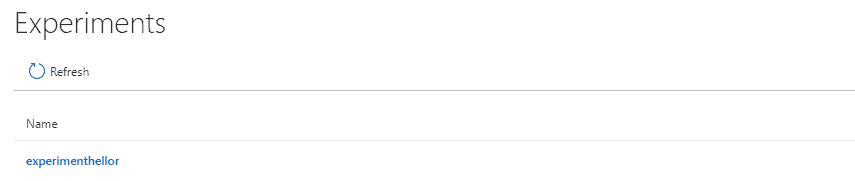
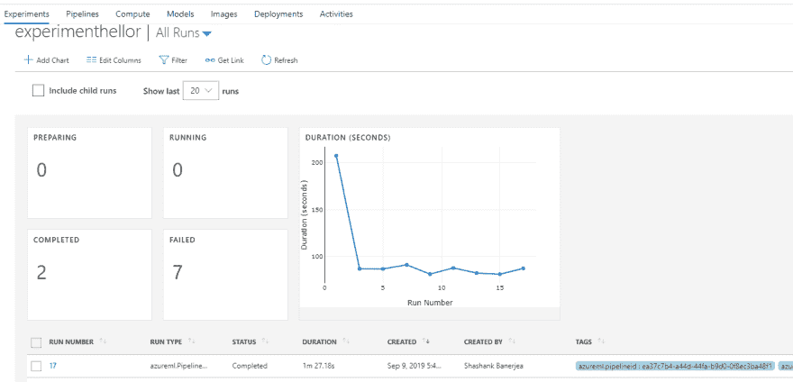
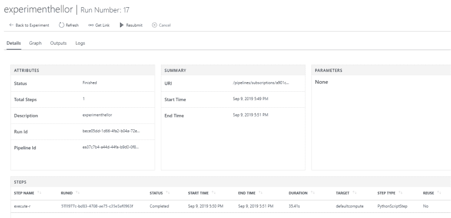
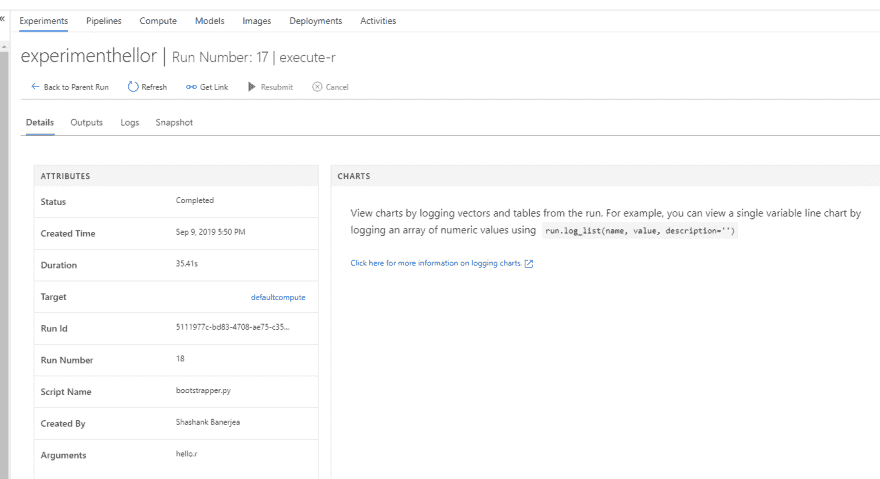
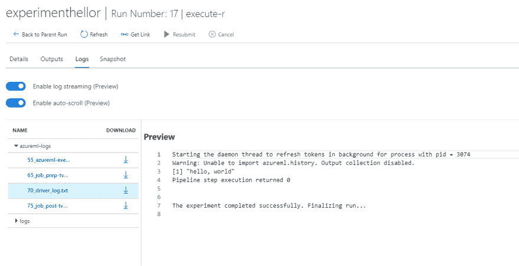

# 将 R 工作负载引入 Azure 机器学习服务

> 原文：<https://dev.to/codepossible/bringing-r-workloads-to-azure-machine-learning-service-2ic>

# 制作案例

最受欢迎的两个数据科学工作负载平台是–R 和 Python。这两个平台都有一个庞大的库和支持生态系统，使开发者和创新者能够快速有效地构建解决方案。然而，更仔细地看，很明显，在学术和研究领域，R 吸引了至少和 Python 一样多的支持者。

Azure 机器学习(AML)服务是一种托管服务，它使组织能够大规模地简化机器学习模型的构建、培训和部署。

Azure Machine Learning 目前提供对 Python 和流行的 ML 框架如 ONNX、PyTorch、scikit-learn 和 TensorFlow 的直接支持。凭借其 Studio 界面和 Juypter 笔记本，Python SDK 还提供了额外的功能。

本文演示了如何使用 AML Python SDK 在 Azure 机器学习管道中运行 R 工作负载。

本文假设读者具备 R 和 Python 语言的基础知识，熟悉 Azure 机器学习服务，并熟悉 Azure 门户的使用。它还要求对 Docker 和容器注册有基本的了解。

# 广义地说

AML 能够在专门构建的 Docker 容器中跨不同的计算选择运行工作负载，这使得在 Azure 上运行 R 工作负载的方法成为可能。

第一步是构建一个可以支持 R 工作负载的 Docker 容器。这个容器打包了执行 R 工作负载所需的 R 运行时和基本库。

容器被构建并发布到容器储存库；在这个例子中，我们将使用 Azure 容器注册。

下一步是将 Docker 容器的执行添加到评估步骤中，这将成为 AML 管道的一部分。在执行之前，R 脚本将被上传到 AML 工作区，并被配置为用 Python 编写的 AML 步骤引导程序的参数。最后，这一新的 AML 渠道将发布给 AML 服务部门执行。

当调用管道时，它将下载 docker 容器，从工作区存储中获取 R 脚本并执行它。

# 配置 Azure 机器学习服务工作区

## Azure ML 工作区

为了能够执行本文中描述的 R 脚本，Azure 机器学习服务(AMLS)工作区应该配置如下:

*   工作区已供应且可用。
*   成功调配的计算选择。本文使用机器学习计算的计算选项

## 创建服务主体

本文使用 Python SDK 对 AML 工作区执行代码，要成功执行代码，还需要:

*   用秘密创建的 Azure 广告服务主体。
*   服务主体以“贡献者”的身份访问 Azure 机器学习工作区。

# R Docker 容器

## 在本地创建容器

由于我们使用 Python 脚本来引导 R 工作负载的执行，docker 容器需要同时支持 R 和 Python。为此，一种流行的基本图像是连续/迷你 conda3:4.6.14

我们在本文中使用的 docker 文件如下:

```
FROM continuumio/miniconda3:4.6.14

WORKDIR /app

RUN apt-get update && yes Y | apt-get install build-essential

RUN conda install -c r r-essentials 
```

要创建 docker 映像，请在与 docker 定义相同的路径中运行以下命令，并将其存储为 Dockerfile。

```
docker build -t aml-r . 
```

## 拉入附加 R 库

可能存在这样的场景，其中可能需要额外的 R 库来执行预期的工作负载。为了实现这一点，可以通过向 Docker 文件添加这样的行来扩展用于执行工作负载的 Docker 映像。

```
RUN R --vanilla -e 'install.packages(c( "RPostgreSQL", \
                                        "DBI",         \
                                        "lubridate",   \
                                        "RSQLite",     \
                                        "magrittr",    \
                                        "zoo",         \
                                        "functional",  \
                                        "moments",     \
                                        "fpc",         \
                                        "RcppRoll",    \
                                        "cowplot",     \
                                        "tsne",        \
                                        "config",      \
                                        "factoextra",  \
                                        "NMF",         \
                                        "ggcorrplot",  \
                                        "umap"), repos="http://cran.r-project.org")' 
```

上面展示了 docker 映像，它是用额外的 R 库构建的，以支持 PostgreSQL、SQLite 和更多高级功能。

## 将 Docker 容器发布到 ACR

这个[链接](https://docs.microsoft.com/en-us/azure/container-registry/container-registry-get-started-docker-cli)提供了将 docker 容器映像发布到 Azure 容器注册中心(ACR)的说明

在通过 Azure Container Registry 进行身份验证之后，根据所提供的说明，运行以下命令(假设 myregistry 是所创建的 ACR 的名称):

```
docker tag aml-r myregistry.azurecr.io/aml-r 
```

这将在本地存储库中为映像创建一个别名。接下来，使用以下命令将映像推送到注册表:

```
docker push myregistry.azurecr.io/aml-r 
```

# 配置 AML 管道引导程序

为了执行 R 脚本，我们使用 Python 编写的初始化器脚本。这个 python 脚本(名为 bootstrapper.py)创建一个 bash shell，并使用提供的 R 脚本名启动 RScript 可执行文件。

bootstrapper.py 的源代码如下:

```
import os
import sys
import subprocess
import uuid

def boot(*args):
  try:
    ret = subprocess.run(args)

    if ret.returncode < 0:
        print("Pipeline step execution was terminated by signal",
             -(ret.returncode),
              file=sys.stderr)
    else:
        print("Pipeline step execution returned",
            ret.returncode,
            file=sys.stderr)

    except OSError as e:
        print("Execution failed:", e, file=sys.stderr)
        return 1

    return ret.returncode

if __name__ == "__main__":
    entry_script = sys.argv[1]
    sys.exit(boot('Rscript', '--no-site-file', '--no-environ', '--no-restore', entry_script)) 
```

# 在 AML 管道中运行 R 代码

为了在 Azure 机器学习管道中运行任意工作负载，Python SDK 为我们提供了两个构造——Estimator 和 EstimatorStep 类。

Estimator 类是为没有 Azure 机器学习预配置评估器的机器学习框架而设计的。它包装了运行配置信息，以帮助简化指定如何执行脚本的任务。

EstimatorStep 类将估算器作为 Azure ML 管道的一部分来执行。

使用 bootstrapper.py 初始化文件和自定义 Docker 映像中的 *hello.r* R 脚本创建估算器和估算器步骤的代码如下所示:

```
r_script='hello.r'

aml_experiment_name='experimenthellor'
aml_compute_target='defaultcompute'
acr_details = ContainerRegistry()
acr_details.address = 'mydockerimageregistry.azurecr.io'
acr_details.username = 'mydockerimageregistry'
acr_details.password = 'mysupersecretacrpassword!'
acr_image = 'aml-r'

estimator = Estimator(source_directory='src',
                          entry_script='bootstrapper.py',
                          compute_target=aml_compute_target,
                          custom_docker_image=acr_image,
                          image_registry_details=acr_details,
                          user_managed=True)

bootstrap_args = [r_script]
inputs = []

step = EstimatorStep(
        name='execute-r',
        estimator=estimator,
        estimator_entry_script_arguments=bootstrap_args,
        inputs=inputs,
        outputs=None,
        compute_target=aml_compute_target,
        allow_reuse=False) 
```

对于本文，初始化器和 R 脚本放在一个名为 src 的子文件夹中。

## 把所有的东西放在一起

创建评估步骤后，创建 AML 管道并作为实验的一部分运行。这是由下面的代码完成的:

```
aml_pipeline = AmlPipeline(
                 workspace=aml_workspace,
                 steps=AmlStepSequence([step]),
                 description='Run R Workloads')

aml_run = published_pipeline.submit(workspace=aml_workspace,
                                       experiment_name=aml_experiment_name)
print(aml_run) 
```

## 跟踪 R 个工作负载的执行情况

作为 AML 实验的一部分，可以从 Azure 门户查看管道的执行。为此，请登录 Azure Portal 并导航至 AML Workspace。单击左侧面板中的“实验”选项。

[](https://res.cloudinary.com/practicaldev/image/fetch/s--8rzK716L--/c_limit%2Cf_auto%2Cfl_progressive%2Cq_auto%2Cw_880/https://thepracticaldev.s3.amazonaws.com/i/68cnuwntapxnt1b73q82.png)

选择为此工作负荷创建的实验。在本文中，我们使用的是“experimenthellor”。

[](https://res.cloudinary.com/practicaldev/image/fetch/s--J9PoY3XF--/c_limit%2Cf_auto%2Cfl_progressive%2Cq_auto%2Cw_880/https://thepracticaldev.s3.amazonaws.com/i/n3pyjfowirfmzsvkq9ty.png)

单击实验名称以获取该实验的运行列表。

[](https://res.cloudinary.com/practicaldev/image/fetch/s--v1exODqx--/c_limit%2Cf_auto%2Cfl_progressive%2Cq_auto%2Cw_880/https://thepracticaldev.s3.amazonaws.com/i/dgc0llsleahmh6xkpqft.png)

单击最近一次成功运行，获取管道运行中的步骤列表。在第一次执行管道期间，计算可能需要时间加速，因此管道运行状态可能显示为“未启动”。

[](https://res.cloudinary.com/practicaldev/image/fetch/s--7CgGnDHR--/c_limit%2Cf_auto%2Cfl_progressive%2Cq_auto%2Cw_880/https://thepracticaldev.s3.amazonaws.com/i/36bmdxg3kztf78tq6vn6.png)

单击管道步骤-“execute-r”，以显示获取该步骤的详细信息。

[](https://res.cloudinary.com/practicaldev/image/fetch/s--uHU2NOE6--/c_limit%2Cf_auto%2Cfl_progressive%2Cq_auto%2Cw_880/https://thepracticaldev.s3.amazonaws.com/i/tcoss12hsj3gm6u3daim.png)

单击“Logs”选项卡，查看“R”脚本执行的详细信息

[](https://res.cloudinary.com/practicaldev/image/fetch/s--NOI9SsYm--/c_limit%2Cf_auto%2Cfl_progressive%2Cq_auto%2Cw_880/https://thepracticaldev.s3.amazonaws.com/i/ds6pvn1u64wlpmrk7ao5.png)

在日志中，您可以看到 hello.r 脚本的输出为“[1] hello，world”。如果有错误，它们会显示在日志中以进行故障排除。

# 结论

除了支持 Python 工作负载，Azure 机器学习服务还可以灵活地支持 R 工作负载的执行。这只是为你的下一个数据科学项目试用 Azure 机器学习服务的又一个原因。虽然该存储库有一个旨在快速部署的简单实现，但对于已装入的卷，更高级的实现是可能的。

# 参考文献

*   [Azure 机器学习服务](https://azure.microsoft.com/en-us/services/machine-learning-service/)
*   [AML Python SDK](https://docs.microsoft.com/en-us/python/api/overview/azure/ml/intro?view=azure-ml-py)

# 学分

这个方案是 Josh Lane (@jplane)设计的。特别感谢 Josh 审阅了存储库和技术指南的内容。

# 代码库

代码可以在 GitHub 上找到。

##  [【代码易失性】](https://github.com/codepossible)/[【azremanechinelerningservicewither】](https://github.com/codepossible/AzureMachineLearningServiceWithR)

### 这个存储库包含在 Azure 机器学习服务中执行 R 工作负载的指南。