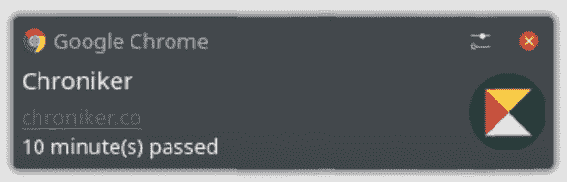

# 浏览器通知 API 示例

> 原文：<https://dev.to/rbreahna/browser-notifications-api-by-example-1ml8>

这篇文章是关于[chroniker.co](https://chroniker.co/)的来龙去脉系列文章的一部分

当处理一项任务时，跟踪你的时间是远远不够的。定步调是让你高效的原因。给自己定步调的一个简单方法是定期检查你已经完成了什么。进入[通知](https://developer.mozilla.org/en-US/docs/Web/API/Notifications_API/Using_the_Notifications_API) API。

最近，这类通知几乎出现在所有主要网站上。它们很容易实现，看起来不错，而且能抓住你的注意力。在 chroniker.co 上，它们用于起搏，同时也作为计时器开启的额外提醒。

[](https://res.cloudinary.com/practicaldev/image/fetch/s--FTfjE4-F--/c_limit%2Cf_auto%2Cfl_progressive%2Cq_auto%2Cw_880/https://thepracticaldev.s3.amazonaws.com/i/3kq2y1s5sh4g96lqwmxm.png)

在 KDE，它们不像在 macOs 或 Windows 上那样令人印象深刻。

在阅读文档和在线查找代码示例时，我决定创建一个 JavaScript 类，它将包装基本功能，并提供一种将其集成到任何应用程序中的简单方法。
我现在的情况是:

```
import Logo from 'assets/img/chroniker.co.png';

class BrowserNotification {
   options = {
     vibrate: [200, 100, 200],
     requireInteraction: false,
     icon: Logo,
     body: 'Sample Text',
   };

  config = {
    title: 'Chroniker',
    timeout: 5000,
  };

  async getRegistration() {
    return navigator.serviceWorker.ready;
  }

  async closeNotifications(timeout = 0) {
    const registration = await this.getRegistration();
    const notifications = await registration.getNotifications();
    setTimeout(() => {
      notifications.map(notification => notification.close());
    }, timeout);
  }

  requestNotificationPermissions = () => {
    const notificationPermissions = async () => {
      const permission = await Notification.requestPermission();
      if (permission === 'granted') {
        await this.closeNotifications();
        const registration = await this.getRegistration();
        await registration.showNotification(this.config.title, this.options);
        await this.closeNotifications(this.config.timeout);
      }
      if (permission === 'denied') {
        alert('Notifications are blocked. Please enable them in your browser settings.');
      }
    };
    notificationPermissions();
  };

  sendNotification = () => {
    const send = async () => {
      if (Notification.permission === 'granted') {
        await this.closeNotifications();
        const registration = await this.getRegistration();
        await registration.showNotification(this.config.title, this.options);
        await this.closeNotifications(this.config.timeout);
      }
    };
    send();
  };
}

export default BrowserNotification; 
```

Enter fullscreen mode Exit fullscreen mode

现在来一点一点剖析这个:

```
options = {
     vibrate: [200, 100, 200],
     requireInteraction: false,
     icon: Logo,
     body: 'Sample Text',
   }; 
```

Enter fullscreen mode Exit fullscreen mode

当您实际推送通知时，您可以传递一个选项对象作为第二个参数，在这里您可以指定通知文本、您的徽标和其他一些东西，完整的列表可以在 mdn 上找到。我很好奇，想试试震动选项，它接受一种“模式”的脉冲，可以让一些设备震动。我还没让它工作。一定是做错了什么。

```
 config = {
    title: 'Chroniker',
    timeout: 5000,
  }; 
```

Enter fullscreen mode Exit fullscreen mode

接下来是这个属性，我用它来存储我的应用程序名，以及这个类内部使用的任何其他值。

```
async getRegistration() {
    return navigator.serviceWorker.ready;
  } 
```

Enter fullscreen mode Exit fullscreen mode

关于这些通知的一切都是异步的，在这里我们确保服务工作者已经向浏览器注册。为了让这些通知在台式机上工作，并不一定要有一个注册的服务人员，但是如果你想让它们也在移动设备上工作，这似乎是目前唯一的方法。

关于如何实现服务工作者，那是另一篇文章的主题。

```
async closeNotifications(timeout = 0) {
    const registration = await this.getRegistration();
    const notifications = await registration.getNotifications();
    setTimeout(() => {
      notifications.map(notification => notification.close());
    }, timeout);
  } 
```

Enter fullscreen mode Exit fullscreen mode

此方法允许我们关闭所有以前部署的通知。建议在发送新邮件之前这样做。这也是您控制弹出窗口在用户屏幕上显示多长时间的方法，因此也是超时的原因。

```
requestNotificationPermissions = () => {
    const notificationPermissions = async () => {
      const permission = await Notification.requestPermission();
      if (permission === 'granted') {
        await this.closeNotifications();
        const registration = await this.getRegistration();
        await registration.showNotification(this.config.title, this.options);
        await this.closeNotifications(this.config.timeout);
      }
      if (permission === 'denied') {
        alert('Notifications are blocked. Please enable them in your browser settings.');
      }
    };
    notificationPermissions();
  };

//Sample use case 

  const notification = new BrowserNotification();
  notification.options.body = 'Notifications are already enabled. To disable, check your browser settings';

 <Button onClick={notification.requestNotificationPermissions} /> 
```

Enter fullscreen mode Exit fullscreen mode

这个方法负责指导用户允许应用程序发送通知，或者在他决定阻止通知的情况下，让他知道如何恢复通知。

```
sendNotification = () => {
    const send = async () => {
      if (Notification.permission === 'granted') {
        await this.closeNotifications();
        const registration = await this.getRegistration();
        await registration.showNotification(this.config.title, this.options);
        await this.closeNotifications(this.config.timeout);
      }
    };
    send();
  }; 
```

Enter fullscreen mode Exit fullscreen mode

最后，这里是实际发送通知本身的方法。如您所见，首先它确保清理通知堆栈。然后它发出一个，并保持在屏幕上，直到超时，它被删除。

下面是我在 chroniker.co 上使用这个类的方法:

```
import BrowserNotification from 'components/notification';

const notification = new BrowserNotification();

 useEffect(() => {
    if (Math.round(totalTime) !== 0 && (Math.round(totalTime) / 60) % interval === 0) {
      notification.options.body = `${interval} minute(s) passed`;
      notification.sendNotification();
    }
  }, [Math.round(totalTime)]); 
```

Enter fullscreen mode Exit fullscreen mode

在“设置”页面上，您会发现一个输入，允许您指定应用程序通知您的频率。以上是每次总时间可以被用户间隔整除时发送通知的实际逻辑。**总时间**和**间隔**变量是从全局状态中提取的，这里没有显示。

通知到此结束，下次再见！

延伸阅读:
[https://developer . Mozilla . org/en-US/docs/Web/API/Notifications _ API/Using _ the _ Notifications _ API](https://developer.mozilla.org/en-US/docs/Web/API/Notifications_API/Using_the_Notifications_API)T3[https://developer . Mozilla . org/en-US/docs/Web/API/Notification](https://developer.mozilla.org/en-US/docs/Web/API/Notification)