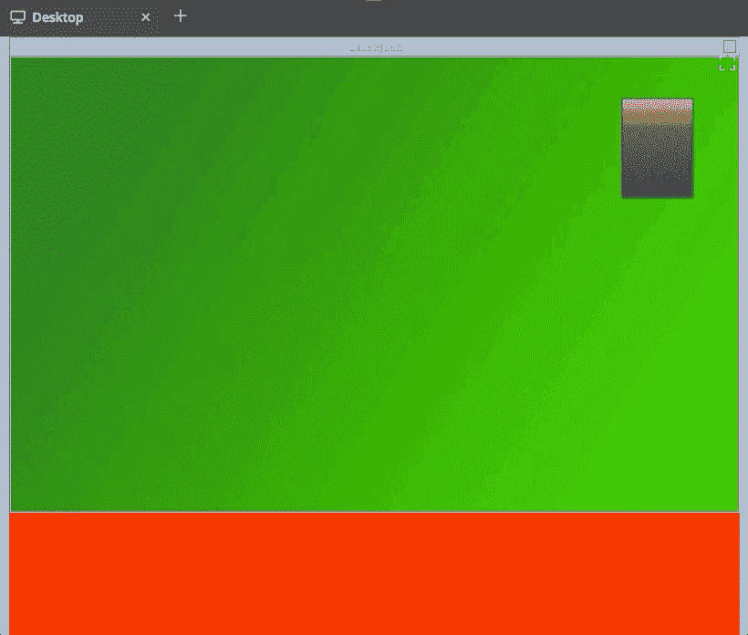

# 21 点 Python 构建了一个 21 点命令行游戏

> 原文：<https://dev.to/nexttech/build-a-blackjack-command-line-game-3o4b>

在本教程中，我们将介绍如何使用 Python 构建一个玩 21 点的命令行游戏！您将从头到尾构建游戏，当您完成后，您将拥有一个可以从命令行运行的全功能游戏。

在构建游戏时，我们将探索一些方便的 Python 概念，例如使用类的面向对象编程以及如何管理游戏循环。本教程也是从使用图形用户环境(GUI)构建 21 点游戏的整个课程中摘录的，如果你感兴趣，可以在这里查看。

听起来有趣吗？我们开始吧！

[](https://res.cloudinary.com/practicaldev/image/fetch/s--hlz0oHTj--/c_limit%2Cf_auto%2Cfl_progressive%2Cq_66%2Cw_880/https://thepracticaldev.s3.amazonaws.com/i/dvf094oqfnunrb0cho5w.gif)

# 什么是二十一点？

二十一点是一种只需要一副牌的赌博游戏。游戏的目标是在庄家翻你的牌时尽可能接近一手值 21 分的牌，但是翻过去你就出局了！

在 21 点游戏中，数字牌(2 到 10)值面值，图片牌(杰克、皇后和国王)值 10，a 值 1 或 11，这取决于你的其他牌。开始一手牌时，玩家下注，并拿到两张正面朝上的牌。当他们试图尽可能接近 21 时，他们可以选择“打”(收到另一张牌)或“坚持”(保持当前的手牌)。如果他们选择击中并超过 21，他们就会“破产”并输掉这手牌(以及他们下注的钱！).

玩家面对庄家，庄家开始时一张牌面朝下，一张牌面朝上。当所有的玩家都选择了坚持或失败，然后庄家翻转他们隐藏的卡，或者击中或坚持，他们的目标是获得比任何玩家都高的牌。

如果庄家破产，他们会向该玩家支付每个玩家的赌注，前提是该玩家尚未破产。如果他们没有拿到比玩家更高的牌，他们也需要付钱。

还有很多其他的规则(当然！)如果你感兴趣的话，你可以在上[阅读，但是以上是你需要知道的构建这个游戏的一切。](https://bicyclecards.com/how-to-play/blackjack/)

好了，让我们开始编码吧！

# 安装 Python

如果你的电脑上还没有安装 Python，你需要根据这里的说明[来安装。如果你想避免这种情况，你可以在这里](https://realpython.com/installing-python/)(需要登录)获得一个在线编码沙箱，其中预装了 Python 和其他必要的库[。](https://nt.dev/python)

# 定义类别

在我们开始为我们的 21 点游戏编码之前，重要的是我们要知道如何使用面向对象编程，因为我们需要为我们的游戏使用类。

我们将从定义用于区分 21 点游戏不同方面的类开始。我们将对游戏的三个组成部分进行建模:

*   `Card`:一张基础扑克牌。该牌属于一种花色(红心♥、方块、黑桃♠或梅花♣),并且具有一定的价值。
*   `Deck`:卡片的集合。卡片组随着抽牌而收缩，包含 52 张独特的卡片。
*   `Hand`:每个玩家分配的牌。一手牌决定了每个玩家的分数，从而决定了谁赢。

让我们从最简单的概念开始:`Card`。

# [T2`Card`阶级](#the-raw-card-endraw-class)

`Card`类将是我们定义的第一个类，因为我们的其他两个类都需要使用它。创建一个名为 *blackjack.py* 的 Python 文件，然后添加以下代码:

```
import random

class Card:
    def __init__(self, suit, value):
        self.suit = suit
        self.value = value

    def __repr__(self):
        return " of ".join((self.value, self.suit)) 
```

Enter fullscreen mode Exit fullscreen mode

我们的游戏唯一需要的导入是`random`模块。这将允许我们在每场游戏开始时洗牌。

我们的第一堂课将是扑克牌表演课。每张牌都有一套花色(红心、方块、黑桃和梅花)和一个数值(a 到 k)。我们定义了`__repr__`函数，以便在调用`print`时改变卡片的显示方式。我们的函数将返回值和套装，例如，`King of Spades`。这就是我们需要为一个`Card`所做的一切！

接下来，我们需要创建这些`Card`类中的`Deck`。

# [T2`Deck`阶级](#the-raw-deck-endraw-class)

`Deck`将需要包含 52 张独特的卡片，并且必须能够自己洗牌。它还需要能够处理卡片，并随着卡片的移除而减小尺寸。使用下面的代码在 *blackjack.py* 文件中创建`Deck`类:

```
class Deck:
    def __init__(self):
        self.cards = [Card(s, v) for s in ["Spades", "Clubs", "Hearts",
                      "Diamonds"] for v in ["A", "2", "3", "4", "5", "6", 
                      "7", "8", "9", "10", "J", "Q", "K"]]

    def shuffle(self):
        if len(self.cards) > 1:
            random.shuffle(self.cards)

    def deal(self):
        if len(self.cards) > 1:
            return self.cards.pop(0) 
```

Enter fullscreen mode Exit fullscreen mode

当创建一个`Deck`的实例时，我们只需要收集所有可能的卡片。我们通过使用一个列表理解来实现这一点，它包含了每一种花色和价值的列表。我们将每个组合传递给我们的`Card`类的初始化，以创建 52 个唯一的`Card`实例。

我们的`Deck`将需要能够被洗牌，以便每个游戏都是不同的。我们使用`random`库中的`shuffle`函数来为我们做这件事(多么合适)。为了避免任何潜在的错误，我们将只洗一副仍有两张或更多牌的牌，因为洗一张或零张牌是没有意义的。

洗牌后，我们也需要发牌。我们利用一个列表的`pop`函数(它是保存我们的牌的数据结构)来返回最上面的牌，并将它从牌堆中移除，这样它就不能再被分发了。

`Deck`课到此结束！为让我们的游戏运行而创建的最后一个实用程序类是`Hand`。所有玩家都有一手牌，每手牌都有一个基于其所含牌的数值。

# [T2`Hand`阶级](#the-raw-hand-endraw-class)

一个`Hand`类需要像`Deck`类一样包含卡片。游戏规则还会根据它包含的牌来给它赋值。由于庄家的手牌应该只显示一张牌，我们还跟踪`Hand`是否属于庄家以适应这一规则。

从下面开始，在 *blackjack.py* 文件中创建`Hand`类:

```
class Hand:
    def __init__(self, dealer=False):
        self.dealer = dealer
        self.cards = []
        self.value = 0

    def add_card(self, card):
        self.cards.append(card) 
```

Enter fullscreen mode Exit fullscreen mode

与`Deck`非常相似，`Hand`将把它的卡片保存为一个`Card`实例的列表。当添加一张牌到手上时，我们简单地将`Card`实例添加到我们的`cards`列表中。

在`Hand`类中，计算当前持有的`cards`值是游戏规则发挥作用最多的地方:

```
 def calculate_value(self):
        self.value = 0
        has_ace = False
        for card in self.cards:
            if card.value.isnumeric():
                self.value += int(card.value)
            else:
                if card.value == "A":
                    has_ace = True
                    self.value += 11
                else:
                    self.value += 10

        if has_ace and self.value > 21:
            self.value -= 10

    def get_value(self):
        self.calculate_value()
        return self.value 
```

Enter fullscreen mode Exit fullscreen mode

> 您可能注意到上面的代码已经缩进了。这是故意的，下面也这么做了！这样，您不需要自己执行缩进，可以专注于阅读指令和代码，而不是追踪空白错误。

在这段代码中，我们首先将手牌的值初始化为`0`，并假设玩家没有 a(因为这是一个特例)。

然后，我们遍历`Card`实例，并尝试使用以下逻辑将它们的值作为一个数字添加到玩家的总数中:

1.  如果卡的值是数字，我们将其值加到这手牌的值上(`self.value`)。
2.  如果不是数值型的，我们检查看这张牌是否是 a。如果是，我们将`11`加到该手牌的值上，并将`has_ace`标志设置为`True`。
3.  如果不是 a，我们就简单的把`10`加到手牌的数值上。

完成后，我们检查是否有 a，并且`11`点的增加使这手牌的价值超过了`21`。如果是这样的话，我们通过从手牌的价值中减去`10`来计算 a 值`1`点。

现在，我们需要游戏显示每手牌的方法，所以我们使用一个简单的函数来打印手中的每张牌，以及玩家手中牌的值。庄家的第一张牌面朝下，所以我们打印`hidden`来代替:

```
 def display(self):
        if self.dealer:
            print("hidden")
            print(self.cards[1])
        else:
            for card in self.cards:
                print(card)
            print("Value:", self.get_value()) 
```

Enter fullscreen mode Exit fullscreen mode

现在我们已经写好了所有的底层数据结构，是时候进行主游戏循环了！

# 游戏循环

我们将在游戏的`play`方法中定义游戏的主循环，这样，要开始一个游戏，你只需要创建一个`Game`类的实例，并对其调用`.play()`:

```
class Game:
    def __init__(self):
        pass

    def play(self):
        playing = True

        while playing:
            self.deck = Deck()
            self.deck.shuffle()

            self.player_hand = Hand()
            self.dealer_hand = Hand(dealer=True)

            for i in range(2):
                self.player_hand.add_card(self.deck.deal())
                self.dealer_hand.add_card(self.deck.deal())

            print("Your hand is:")
            self.player_hand.display()
            print()
            print("Dealer's hand is:")
            self.dealer_hand.display() 
```

Enter fullscreen mode Exit fullscreen mode

上面的代码相当长，所以让我们把它分解一下:

*   我们用一个布尔值(`playing`)开始我们的循环，它将用于跟踪我们是否还在玩游戏。
*   如果是，我们需要一个混洗的`Deck`和两个`Hand`实例——一个给庄家，一个给玩家。
*   我们使用`range`函数给玩家和庄家各发两张牌。我们的`deal`方法将返回一个`Card`实例，该实例被传递给我们的`Hand`实例的`add_card`方法。
*   最后，我们将手牌展示给玩家。我们可以在我们的`Hand`实例上使用`display`方法将它打印到屏幕上。

这标志着需要在每个新游戏开始时运行的代码的结束。现在，我们进入一个循环，这个循环将一直运行到分出胜负。我们再次用一个布尔值(`game_over` ):
来控制它

```
 game_over = False

            while not game_over:
                player_has_blackjack, dealer_has_blackjack = self.check_for_blackjack() 
```

Enter fullscreen mode Exit fullscreen mode

在继续之前，我们首先需要检查 21 点。如果任何一个玩家都拿到了一张 a 和一张图片卡，他们的手牌总数将达到`21`，因此他们自动获胜。让我们创建这样做的方法(在`play`方法下):

```
 def check_for_blackjack(self):
        player = False
        dealer = False
        if self.player_hand.get_value() == 21:
            player = True
        if self.dealer_hand.get_value() == 21:
            dealer = True

        return player, dealer 
```

Enter fullscreen mode Exit fullscreen mode

我们需要跟踪哪个玩家可能有 21 点，所以我们将为玩家(`player`)和庄家(`dealer`)保留一个布尔值。

接下来，回到`play()`方法中的`while not game_over`循环。我们需要检查每手牌的总数是否是`21`，我们将使用两个`if`语句来完成。如果任何一方的手牌值为`21`，则他们的布尔值将变为`True`。

如果布尔函数中有一个是`True`，那么我们就有了一个赢家，并将这个赢家打印到屏幕和`continue`上，这样我们就脱离了游戏循环。为此，在代码的`player_has_blackjack, dealer_has_blackjack = self.check_for_blackjack()`行的正下方添加下面的代码:

```
 if player_has_blackjack or dealer_has_blackjack:
                    game_over = True
                    self.show_blackjack_results(
                        player_has_blackjack, dealer_has_blackjack)
                    continue 
```

Enter fullscreen mode Exit fullscreen mode

我们必须再次暂停来创建方法`show_blackjack_results()`，它将把获胜者打印到屏幕上。我们通过在`check_for_blackjack`方法下面添加下面的代码来做到这一点:

```
 def show_blackjack_results(self, player_has_blackjack, dealer_has_blackjack):
        if player_has_blackjack and dealer_has_blackjack:
            print("Both players have blackjack! Draw!")

        elif player_has_blackjack:
            print("You have blackjack! You win!")

        elif dealer_has_blackjack:
            print("Dealer has blackjack! Dealer wins!") 
```

Enter fullscreen mode Exit fullscreen mode

如果两个玩家都没有 21 点，游戏循环将继续。

玩家现在可以做出选择——是否向他们的手牌中添加更多的牌(击)或提交他们当前的手牌(棍)。为此，将下面的代码添加到`play`方法中:

```
 choice = input("Please choose [Hit / Stick] ").lower()
                while choice not in ["h", "s", "hit", "stick"]:
                    choice = input("Please enter 'hit' or 'stick' (or H/S) ").lower() 
```

Enter fullscreen mode Exit fullscreen mode

我们使用`input`函数来收集用户的选择。这将总是返回一个包含用户在命令行中输入的文本的字符串。

因为我们有一个字符串，我们可以使用`lower`函数将用户的输入转换成小写，以避免在解析他们的回复时必须检查大写和小写的组合。

如果他们的输入没有被识别，我们将简单地再次请求，直到:

```
 if choice in ['hit', 'h']:
                    self.player_hand.add_card(self.deck.deal())
                    self.player_hand.display() 
```

Enter fullscreen mode Exit fullscreen mode

如果玩家选择打，他们需要在手上多加一张牌。这与之前使用`deal()`和`add_card()`方法的方式相同。

由于它们的总数已经改变，我们现在需要检查它们是否超过了允许的限制`21`。现在让我们定义一个方法来做这件事:

```
 def player_is_over(self):
        return self.player_hand.get_value() > 21 
```

Enter fullscreen mode Exit fullscreen mode

这个方法只是检查玩家的手牌值是否超过了`21`，并以布尔值的形式返回信息。

现在，回到`play`方法，在`if choice in ['hit', 'h']`块中添加以下内容:

```
 if self.player_is_over():
                        print("You have lost!")
                        game_over = True 
```

Enter fullscreen mode Exit fullscreen mode

如果玩家的手牌值超过`21`，他们就输了，所以游戏循环需要打破，我们将`game_over`设置为`True`(表示庄家赢了)。

好了，现在让我们来处理玩家决定用手坚持的情况。如果他们这样做，是时候将他们的分数与经销商的分数进行比较了。为此，添加以下与`if choice in ['hit', 'h']`语句对齐的语句:

```
 else:
                    player_hand_value = self.player_hand.get_value()
                    dealer_hand_value = self.dealer_hand.get_value()

                    print("Final Results")
                    print("Your hand:", player_hand_value)
                    print("Dealer's hand:", dealer_hand_value)

                    if player_hand_value > dealer_hand_value:
                        print("You Win!")
                    elif player_hand_value == dealer_hand_value:
                        print("Tie!")
                    else:
                        print("Dealer Wins!")
                    game_over = True 
```

Enter fullscreen mode Exit fullscreen mode

我们在这里使用`else`语句，因为我们已经确定用户的答案是 hit 或 stick，并且我们刚刚检查了 hit。这意味着我们只有在用户想坚持的时候才会进入这个区块。

玩家和庄家手牌的数值都打印到屏幕上，给出最终结果。然后，我们比较每手牌的数值，看哪一手牌的数值更高。

如果玩家的牌比庄家的牌价值高，我们打印`You Win!`。如果分数相等，那么我们打成平手，所以我们打印`Tie!`。否则，庄家的牌肯定比玩家高，所以我们展示`Dealer wins!`。

这就完成了用户玩单个游戏所需的逻辑。现在，让我们通过在`play`方法的末尾，在`while`循环之外添加以下内容，让他们可以玩另一个游戏:

```
 again = input("Play Again? [Y/N] ")
            while again.lower() not in ["y", "n"]:
                again = input("Please enter Y or N ")
            if again.lower() == "n":
                print("Thanks for playing!")
                playing = False
            else:
                game_over = False 
```

Enter fullscreen mode Exit fullscreen mode

我们再次使用`lower`和`while`循环的组合来确保我们的答案是`y`或`n`。如果玩家用`n`回答，我们感谢他们的参与，并将我们的`playing`布尔值设置为`False`，从而使我们脱离主游戏循环并结束程序。如果没有，他们一定回答了`y`，所以我们把`game_over`设置为`False`，让我们的主循环再次运行。这将带我们在`self.deck = Deck()`重回巅峰，建立一个全新的游戏。

# 运行游戏

我们已经完成了游戏！现在，是时候运行这段代码了。为此，我们只需在文件末尾创建一个`Game`类的实例，并调用`play()`方法:

```
if __name__ == "__main__":
    game = Game()
    game.play() 
```

Enter fullscreen mode Exit fullscreen mode

现在我们有了一个游戏，玩一玩吧。你可以通过在命令行中输入`python3 blackjack.py`来开始游戏(或者按下蓝色的“运行”按钮，如果你正在使用前面提到的沙盒的话)。

您应该会在屏幕上看到如下内容:

```
workspace $ python3 blackjack.py
Your hand is:
A of Diamonds
5 of Clubs
Value: 16

Dealer's hand is:
hidden
A of Clubs
Please choose [Hit / Stick] H
A of Diamonds
5 of Clubs
10 of Hearts
Value: 16
Please choose [Hit / Stick] H
A of Diamonds
5 of Clubs
10 of Hearts
2 of Clubs
Value: 18
Please choose [Hit / Stick] S
Final Results
Your hand: 18
Dealer's hand: 16
You Win!
Play Again? [Y/N] N
Thanks for playing! 
```

Enter fullscreen mode Exit fullscreen mode

# 包装完毕

恭喜你完成了本教程！在这篇文章中，我们讲述了如何构建一些方便的概念，比如面向对象编程、游戏流程设计，甚至是 21 点的基础知识。

如果您遇到了困难，可以在[这里](https://gist.github.com/saulcosta/13909e2e51f94ff7b37700c74b885ab6)找到该项目的完整解决方案。你也可以在这里启动预装的在线编码沙箱[。](https://next.tech/projects/94217701d98d/share?ref=ce315f8c)

这个游戏的两个局限是庄家永远不会打，没有下注的概念。如果您愿意，可以随意添加这些功能！因为庄家需要打出或坚持一定的牌价，所以您可以开发一个程序来精确模拟庄家。

如果你愿意，你也可以看看本教程后面的[完整课程](https://c.next.tech/30VhCRH)！