# 使用 React 和 GraphQL-1 构建完整的应用程序

> 原文：<https://dev.to/nabendu82/build-a-complete-app-with-react-and-graphql-1-2i2b>

我们正在开始一个新的系列，它是关于最新的 GraphQL。这里我们构建了一个 App，用 React 在前端，用 GraphQL 代替 REST API。

这个系列的灵感来自于免费代码营的 youtube 教程。我们将使用以下技术。

[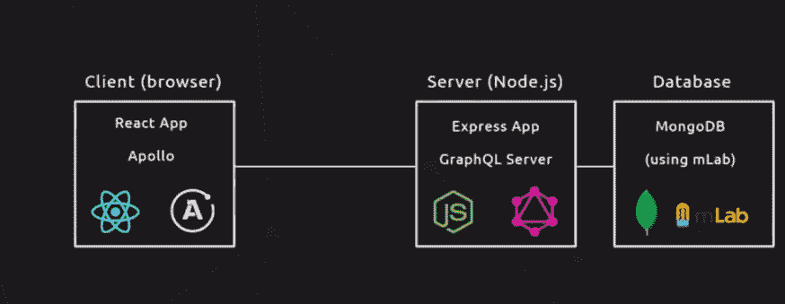 ](https://res.cloudinary.com/practicaldev/image/fetch/s--fmbpzosa--/c_limit%2Cf_auto%2Cfl_progressive%2Cq_auto%2Cw_880/https://cdn-images-1.medium.com/max/2000/1%2AlFAECmMwm3HQs1eydeubKA.png) *我们的理工*

让我们从我们的应用程序开始。打开你的终端，创建一个目录 **react-graphql** ，然后在里面创建一个目录**服务器**。在服务器目录中执行 **npm init** 来创建一个 **package.json** 文件。按回车键选择默认选项。

[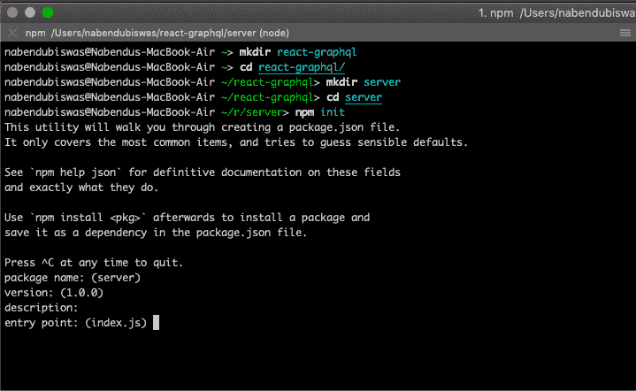 ](https://res.cloudinary.com/practicaldev/image/fetch/s--6mvDvgBK--/c_limit%2Cf_auto%2Cfl_progressive%2Cq_auto%2Cw_880/https://cdn-images-1.medium.com/max/2000/1%2AImRV3T18KzOXrML2qPNLIQ.png) * npm 初始化*

接下来我们将安装 express。

[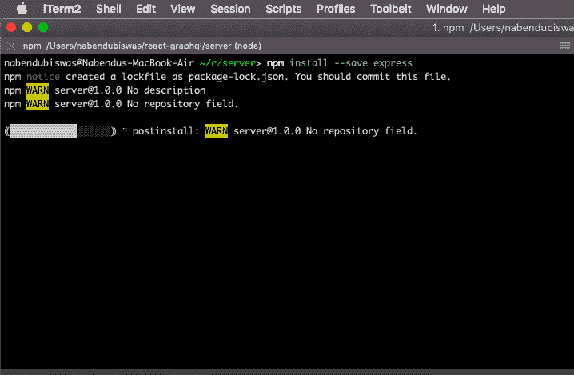 ](https://res.cloudinary.com/practicaldev/image/fetch/s--Mlq2cj7C--/c_limit%2Cf_auto%2Cfl_progressive%2Cq_auto%2Cw_880/https://cdn-images-1.medium.com/max/2000/1%2A5e1mYGOeLhcsZDKIvqGj6w.png) *安装快递*

现在，打开代码编辑器，在**服务器**目录下创建一个新文件 **app.js** 。相同的内容如下。

```
 const express = require('express');

    const app = express();

    app.listen(4000, () => {
        console.log('Listening at port 4000');
    }); 
```

之后，转到您的终端，通过 **node app.js** 启动服务器

[ ](https://res.cloudinary.com/practicaldev/image/fetch/s--ppEusfSj--/c_limit%2Cf_auto%2Cfl_progressive%2Cq_auto%2Cw_880/https://cdn-images-1.medium.com/max/2000/1%2ANbKJJvGPAnVYhz35KS5cXA.png) *快递服务器*

但是，我们不会按节点运行 express server，而是运行一个名为 **nodemon** 的 npm 包。这个包跟踪我们的服务器代码的任何变化，并重启服务器。

[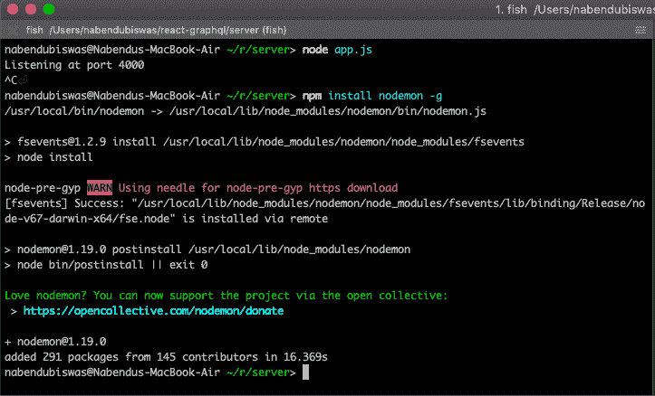](https://res.cloudinary.com/practicaldev/image/fetch/s--RGaIwln1--/c_limit%2Cf_auto%2Cfl_progressive%2Cq_auto%2Cw_880/https://cdn-images-1.medium.com/max/2000/1%2AxZbgb_pSJpQeTAZeGxp9_A.png)T3】安装 nodemon

我们将通过 **nodemon app.js** 再次启动我们的服务器

[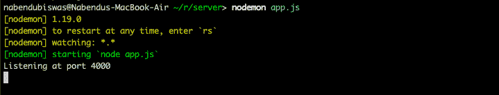](https://res.cloudinary.com/practicaldev/image/fetch/s--fTRKIcPW--/c_limit%2Cf_auto%2Cfl_progressive%2Cq_auto%2Cw_880/https://cdn-images-1.medium.com/max/2000/1%2AqQk4G5zXMxR4zC1EdLEzmQ.png)*nodemon app . js*

接下来，我们将安装另外两个包 **graphql** 和 **express-graphql**

[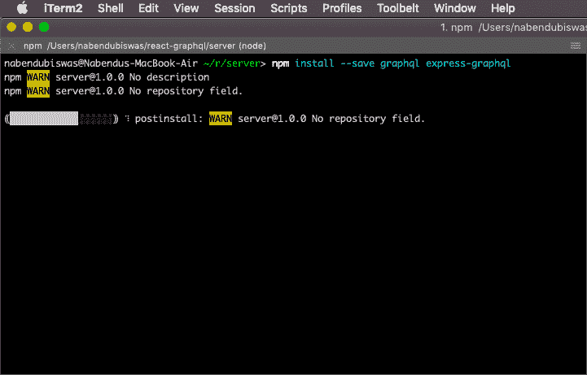 ](https://res.cloudinary.com/practicaldev/image/fetch/s--dnFbp36Y--/c_limit%2Cf_auto%2Cfl_progressive%2Cq_auto%2Cw_880/https://cdn-images-1.medium.com/max/2000/1%2A37Dp7_A9eQRgMvPRnkv6mQ.png) * graphql*

现在，在**服务器**中创建一个新文件夹 **schema** ，然后在其中创建一个新文件 **schema.js** 。

[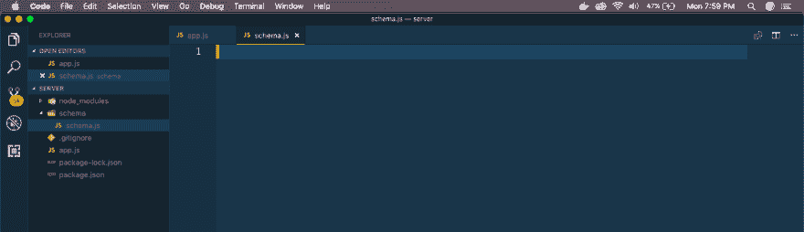](https://res.cloudinary.com/practicaldev/image/fetch/s--UXJ2UwUs--/c_limit%2Cf_auto%2Cfl_progressive%2Cq_auto%2Cw_880/https://cdn-images-1.medium.com/max/2880/1%2AFowWcJ-jupy6x-qYGrS3bA.png)T3】schema . js

在 **schema.js** 中放入以下代码。这里，我们首先定义一个类型 **BookType** ，然后定义一个名为 **RootQuery** 的查询来查询它。

```
 const graphql = require('graphql');

    const { GraphQLObjectType, GraphQLString, GraphQLSchema } = graphql;

    const BookType = new GraphQLObjectType({
        name: 'Book',
        fields: ( ) => ({
            id: { type: GraphQLString },
            name: { type: GraphQLString },
            genre: { type: GraphQLString }
        })
    });

    const RootQuery = new GraphQLObjectType({
        name: 'RootQueryType',
        fields: {
            book: {
                type: BookType,
                args: { id: { type: GraphQLString } },
                resolve(parent, args){
                    // code from Database

                }
            }
        }
    });

    module.exports = new GraphQLSchema({
        query: RootQuery
    }); 
```

现在，我们将在我们的 **app.js**
中使用相同的

```
 const express = require('express');
    const graphqlHTTP = require('express-graphql');
    const schema = require('./schema/schema');

    const app = express();

    app.use('/graphql', graphqlHTTP({
        schema
    }));

    app.listen(4000, () => {
        console.log('Listening at port 4000');
    }); 
```

接下来，我们将在我们的 **schema.js** 中添加一些虚拟数据，因为我们的数据库还没有准备好。此外，在我们的解析中，我们将使用 find 返回 id 作为参数传递的图书。

```
 const graphql = require('graphql');

    const { GraphQLObjectType, GraphQLString, GraphQLSchema } = graphql;

    // Dummy data
    var books = [
        { name: 'Name of the Wind', genre: 'Fantasy', id: '1' },
        { name: 'Two States', genre: 'Drama', id: '2' },
        { name: 'The Long Earth', genre: 'Sci-Fi', id: '3' },
    ];

    const BookType = new GraphQLObjectType({
        name: 'Book',
        fields: ( ) => ({
            id: { type: GraphQLString },
            name: { type: GraphQLString },
            genre: { type: GraphQLString }
        })
    });

    const RootQuery = new GraphQLObjectType({
        name: 'RootQueryType',
        fields: {
            book: {
                type: BookType,
                args: { id: { type: GraphQLString } },
                resolve(parent, args){
                    // code from Database - right now dummy data
                    return books.find(item => item.id === args.id);

                }
            }
        }
    });

    module.exports = new GraphQLSchema({
        query: RootQuery
    }); 
```

接下来，我们将使用惊人的 **graphiql** 工具来检查我们的查询，因为我们的前端还没有准备好。我们需要先在
进行配置

```
 const express = require('express');
    const graphqlHTTP = require('express-graphql');
    const schema = require('./schema/schema');

    const app = express();

    app.use('/graphql', graphqlHTTP({
        schema,
        graphiql: true
    }));

    app.listen(4000, () => {
        console.log('Listening at port 4000');
    }); 
```

接下来，在浏览器中进入[http://localhost:4000/graphql](http://localhost:4000/graphql)，你会看到 graph QL 工具。

[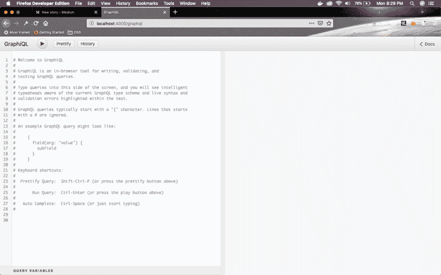 ](https://res.cloudinary.com/practicaldev/image/fetch/s--pfCJjY7n--/c_limit%2Cf_auto%2Cfl_progressive%2Cq_auto%2Cw_880/https://cdn-images-1.medium.com/max/2880/1%2Ao5qexjGEvT_zg_NwZDQvaQ.png) *图形 ql*

点击右上角的**文档**，您将获得该服务器可用的查询文档。

现在，我们可以在 **GraphQL** 服务器中查询 id 为 **2** 的图书，它将返回该图书。我们需要在编辑器中更新查询并按下**播放**按钮。

[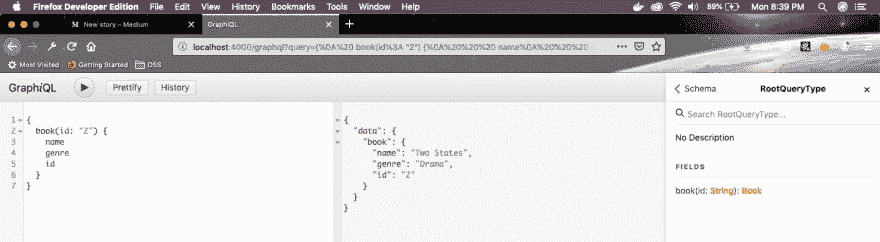 ](https://res.cloudinary.com/practicaldev/image/fetch/s--F2IhzdvR--/c_limit%2Cf_auto%2Cfl_progressive%2Cq_auto%2Cw_880/https://cdn-images-1.medium.com/max/2880/1%2AeIL69x_PyWVSIwvvG_V-Ow.png) * id 2*

同样适用于 id 为 3 的，但不希望 id 出现在 return 语句中。

[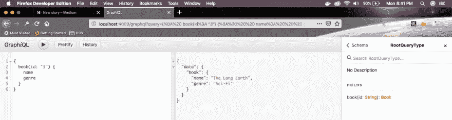 ](https://res.cloudinary.com/practicaldev/image/fetch/s--ika1qQyg--/c_limit%2Cf_auto%2Cfl_progressive%2Cq_auto%2Cw_880/https://cdn-images-1.medium.com/max/2880/1%2AKT2lVUooJAvXnLaj7zE7hQ.png) * id 3*

如果我们查询一个不存在的 id，那么我们将得到空值

[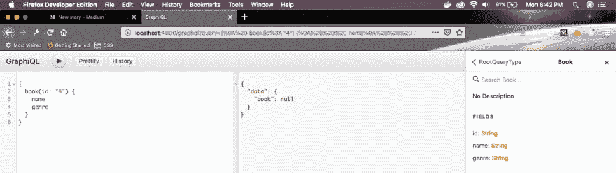 ](https://res.cloudinary.com/practicaldev/image/fetch/s--n3xd_hxF--/c_limit%2Cf_auto%2Cfl_progressive%2Cq_auto%2Cw_880/https://cdn-images-1.medium.com/max/2880/1%2AiYIvO6wPd7wbFduVOTVIag.png) *子虚乌有 id 4*

本系列的第 1 部分到此结束。你可以在 github [链接](https://github.com/nabendu82/react-graphql)中找到代码。