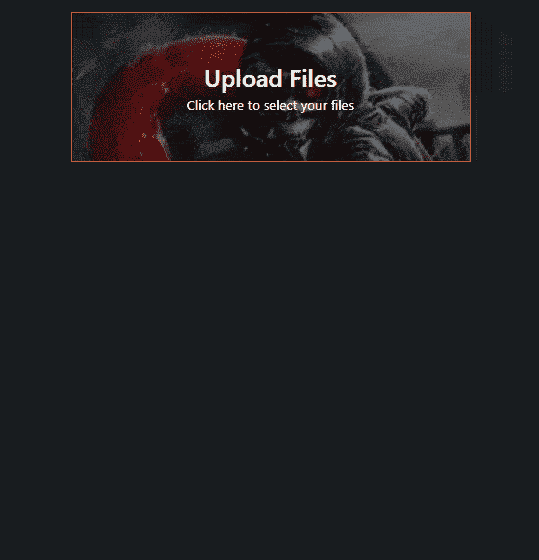
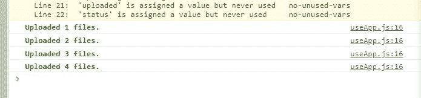
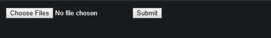
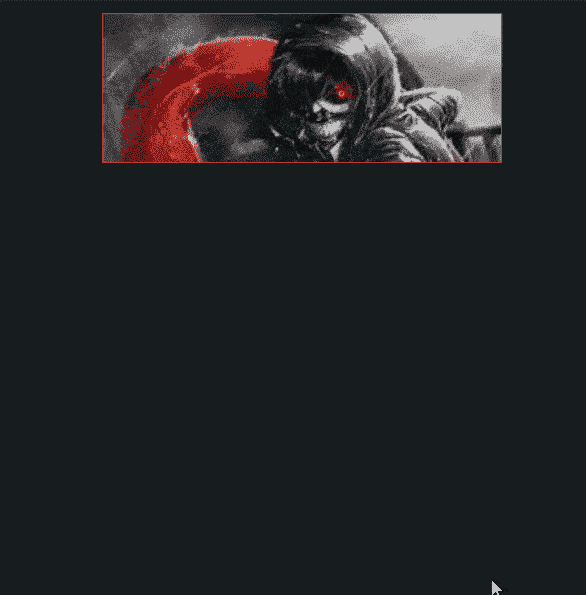
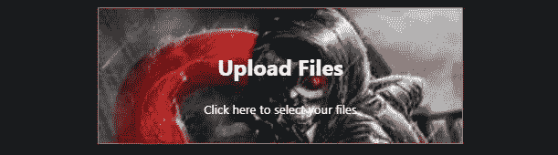
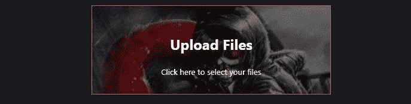
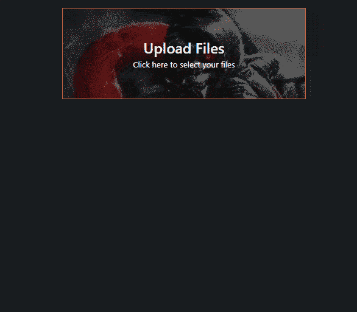

# 在 React 中用普通 CSS 构建一个现代化的、定制的文件上传用户界面

> 原文：<https://dev.to/jsmanifest/build-a-complex-customized-file-uploading-user-interface-in-react-with-plain-css-5539>

在[媒体](https://medium.com/@jsmanifest)上找到我。

围绕文件输入组件构建用户界面是一项非常方便的学习技能，因为你可以从 90 年代的外观到更现代的外观来赞美依赖它的网页——特别是当[我们不能像任何普通的 HTML 元素](https://coderwall.com/p/uer3ow/total-input-type-file-style-control-with-pure-css)一样设计它的时候。当用户使用你的技术时，他们不仅仅是*在使用它——他们很可能在你不知道的情况下对你的应用和技术进行评判。*

事情是这样的:我们可以很容易地向他们显示文件输入，让他们使用默认的 html 元素选择文件，然后让他们提交文件并结束工作。但是*在*之间发生了什么？当事情发生时，用户喜欢看到什么？一个什么都不告诉他们的界面，还是一个告诉他们*一切*的界面？

用户的互联网断了怎么办？如果服务器没有任何响应怎么办？如果 14 个文件中的第 8 个对他们来说很大呢？如果用户等待上传过程完成 10 分钟，并想看看已经完成了多少，该怎么办？或者哪些文件已经上传了？

在之前的教程中(如果你搜索我的帖子就能找到)，我回顾了构建这个 api 的逻辑*的过程。那篇文章的目的是教授逻辑。您可以就此打住，用它来围绕它构建您自己的定制用户界面。或者你也可以自己构建逻辑部分，阅读这篇文章，了解如何为任何文件上传组件实现 UX。创建这些帖子有两个不同的原因，但完全兼容。我将在这篇文章中提供逻辑，这样我们就可以专注于用户界面。决定权在你:)*

当我编写用户界面的时候，时间变得很长，我在考虑是否应该减少组件的数量，展示一个基本的 UX 版本。然而，现在很多帖子都没有深入探讨。因此，我想借此机会开心一下，更深入地了解一下实现。

我正在决定是否使用我最喜欢的 CSS 库 *styled-components* 来制作这个教程，但是我最终选择不做，因为我想展示一个复杂的用户界面可以在没有任何额外工具的情况下构建。这些工具只是一种便利。你只需要学习一点点 *CSS* ，*而不是*这些工具。

最后但同样重要的是，这是我们将在这篇文章中构建的预览:

[](https://res.cloudinary.com/practicaldev/image/fetch/s--icX3lAO5--/c_limit%2Cf_auto%2Cfl_progressive%2Cq_66%2Cw_880/https://jsmanifest.s3-us-west-1.amazonaws.com/posts/build-complex-custom-file-uploading-ui-in-react-with-plain-css/entire-result.gif)

事不宜迟，我们开始吧！

在本教程中，我们将使用 [create-react-app](https://github.com/facebook/create-react-app) 快速生成一个 react 项目。

继续使用下面的命令创建一个项目。对于本教程，我将我们的项目称为*上传应用*。

```
npx create-react-app upload-app 
```

Enter fullscreen mode Exit fullscreen mode

一旦完成，现在进入目录:

```
cd upload-app 
```

Enter fullscreen mode Exit fullscreen mode

我承诺只提供文件上传实现的逻辑，这样我们就可以立即开始构建用户界面。所以这里有一个我们将要使用的定制钩子，叫做`useApp.js`:

> src/useapp . js〔t0〕

```
import { useCallback, useEffect, useReducer, useRef } from 'react'

// mock upload func
const api = {
  uploadFile({ timeout = 550 }) {
    return new Promise((resolve) => {
      setTimeout(() => {
        resolve()
      }, timeout)
    })
  },
}

const logUploadedFile = (num, color = 'green') => {
  const msg = `%cUploaded ${num} files.`
  const style = `color:${color};font-weight:bold;`
  console.log(msg, style)
}

// Constants
const LOADED = 'LOADED'
const INIT = 'INIT'
const PENDING = 'PENDING'
const FILES_UPLOADED = 'FILES_UPLOADED'
const UPLOAD_ERROR = 'UPLOAD_ERROR'
const initialState = {
  files: [],
  pending: [],
  next: null,
  uploading: false,
  uploaded: {},
  status: 'idle',
}

const reducer = (state, action) => {
  switch (action.type) {
    case 'load':
      return { ...state, files: action.files, status: LOADED }
    case 'submit':
      return { ...state, uploading: true, pending: state.files, status: INIT }
    case 'next':
      return {
        ...state,
        next: action.next,
        status: PENDING,
      }
    case 'file-uploaded':
      return {
        ...state,
        next: null,
        pending: action.pending,
        uploaded: {
          ...state.uploaded,
          [action.prev.id]: action.prev.file,
        },
      }
    case 'files-uploaded':
      return { ...state, uploading: false, status: FILES_UPLOADED }
    case 'set-upload-error':
      return { ...state, uploadError: action.error, status: UPLOAD_ERROR }
    default:
      return state
  }
}

const useApp = () => {
  const [state, dispatch] = useReducer(reducer, initialState)
  const onSubmit = useCallback(
    (e) => {
      e.preventDefault()
      if (state.files.length) {
        dispatch({ type: 'submit' })
      } else {
        window.alert("You don't have any files loaded.")
      }
    },
    [state.files.length],
  )

  const onChange = (e) => {
    if (e.target.files.length) {
      const arrFiles = Array.from(e.target.files)
      const files = arrFiles.map((file, index) => {
        const src = window.URL.createObjectURL(file)
        return { file, id: index, src }
      })
      dispatch({ type: 'load', files })
    }
  }

  // Sets the next file when it detects that its ready to go
  useEffect(() => {
    if (state.pending.length && state.next == null) {
      const next = state.pending[0]
      dispatch({ type: 'next', next })
    }
  }, [state.next, state.pending])

  const countRef = useRef(0)

  // Processes the next pending thumbnail when ready
  useEffect(() => {
    if (state.pending.length && state.next) {
      const { next } = state
      api
        .uploadFile(next)
        .then(() => {
          const prev = next
          logUploadedFile(++countRef.current)
          const pending = state.pending.slice(1)
          dispatch({ type: 'file-uploaded', prev, pending })
        })
        .catch((error) => {
          console.error(error)
          dispatch({ type: 'set-upload-error', error })
        })
    }
  }, [state])

  // Ends the upload process
  useEffect(() => {
    if (!state.pending.length && state.uploading) {
      dispatch({ type: 'files-uploaded' })
    }
  }, [state.pending.length, state.uploading])
  return {
    ...state,
    onSubmit,
    onChange,
  }
}

export default useApp 
```

Enter fullscreen mode Exit fullscreen mode

## 解释:

这里有一个正在发生的事情的快速总结:

当用户选择文件时，调用 *onChange* 处理程序。 *e* 参数包含我们想要的文件，可以通过 *e.target.files* 访问。这些将是在界面中一个接一个呈现的文件。然而，这个*文件*对象不是一个数组——它实际上是一个[文件列表](https://developer.mozilla.org/en-US/docs/Web/API/FileList)。这是一个问题，因为我们不能简单地映射它，否则我们会得到一个错误。所以我们将它转换为一个数组，并将其附加到 state.files，允许 UI 在 UI 中逐行呈现它们。当用户提交表单时，调用 *onSubmit* 处理程序。它分派一个动作，该动作向一个或多个 *useEffects* 发送一个信号，表示该开始了。有几种使用效果，每一种都有不同的任务和条件。一个用于*开始流程*，一个用于*继续流程*，一个用于*结束流程*。

我们接下来要做的是打开`App.js`文件，用以下代码替换默认代码:

> src/App.js

```
import React from 'react'
import useApp from './useApp'
import './styles.css'

const Input = (props) => (
  <input
    type="file"
    accept="image/*"
    name="img-loader-input"
    multiple
    {...props}
  />
)

const App = ({ children }) => {
  const {
    files,
    pending,
    next,
    uploading,
    uploaded,
    status,
    onSubmit,
    onChange,
  } = useApp()

  return (
    <form className="form" onSubmit={onSubmit}>
      <div>
        <Input onChange={onChange} />
        <button type="submit">Submit</button>
      </div>
      <div>
        {files.map(({ file, src, id }, index) => (
          <div key={`file-row${index}`}>
            
            <div>{file.name}</div>
          </div>
        ))}
      </div>
    </form>
  )
}

export default App 
```

Enter fullscreen mode Exit fullscreen mode

这是我们的起始 CSS 文件:

> src/styles.css

```
body {
  padding: 12px;
  background: #171c1f;
  color: #fff;
  margin: 0;
  font-family: -apple-system, BlinkMacSystemFont, 'Segoe UI', 'Roboto', 'Oxygen',
    'Ubuntu', 'Cantarell', 'Fira Sans', 'Droid Sans', 'Helvetica Neue',
    sans-serif;
  -webkit-font-smoothing: antialiased;
  -moz-osx-font-smoothing: grayscale;
}
h1,
h2,
h3,
h4,
h5,
h6 {
  margin: 0;
  font-weight: 500;
}

button {
  transition: all 0.2s ease-out;
  margin: 4px;
  cursor: pointer;
  background: rgb(116, 20, 63);
  border: 0;
  color: #fff;
  min-width: 90px;
  padding: 8px 12px;
  outline: none;
  text-transform: uppercase;
  letter-spacing: 1.3px;
  font-size: 0.6rem;
  border: 1px solid #fff;
}

button:hover {
  background: none;
  color: #fff;
}

button:active {
  background: #fa3402;
} 
```

Enter fullscreen mode Exit fullscreen mode

如果您运行该应用程序，它将如下所示:

[](https://res.cloudinary.com/practicaldev/image/fetch/s--8K6k8j5O--/c_limit%2Cf_auto%2Cfl_progressive%2Cq_66%2Cw_880/https://jsmanifest.s3-us-west-1.amazonaws.com/posts/build-complex-custom-file-uploading-ui-in-react-with-plain-css/1.gif)

这是非常基本的。真的没有关于这些图像的信息可以展示，用户界面看起来像 90 年代的页面。

当您单击 submit 时，您可以在控制台消息中看到这些消息正在被逐一处理，以确保:

[](https://res.cloudinary.com/practicaldev/image/fetch/s--36jEFnXX--/c_limit%2Cf_auto%2Cfl_progressive%2Cq_auto%2Cw_880/https://jsmanifest.s3-us-west-1.amazonaws.com/posts/build-complex-custom-file-uploading-ui-in-react-with-plain-css/2.jpg)

但是一旦它完成了，你可以继续应用程序的流程，比如重定向用户到一个成功的页面，或者以一种模式显示狗的图片。

问题是用户不知道发生了什么。他们可能会等待 10 分钟，而页面仍然保持不变。

所以我们要稍微改变一下，让他们从实例化的时刻到上传过程的结束，都与*的一切*保持同步。

我们将继续对*文件输入*进行*定制*，使其看起来更漂亮。我们希望我们的用户认为我们是独一无二的，是最好的。所以我们必须超越:)

目前，我们的文件输入如下所示:

[](https://res.cloudinary.com/practicaldev/image/fetch/s--SYwyeaJm--/c_limit%2Cf_auto%2Cfl_progressive%2Cq_auto%2Cw_880/https://jsmanifest.s3-us-west-1.amazonaws.com/posts/build-complex-custom-file-uploading-ui-in-react-with-plain-css/3.jpg)

现在，由于我们不希望用户点击退出按钮，永远不再回来，我们必须进一步设计。有几种方法可以自定义文件输入。

我们接下来要制作的这个文件输入组件实际上并不是真正的输入元素，但是它会通过允许用户点击它时打开文件浏览器来伪装成输入元素。

创建一个名为`FileUploader.js`的文件，并将这段代码放入其中:

```
import React from 'react'

const FileUploader = ({ children, triggerInput, inputRef, onChange }) => {
  let hiddenInputStyle = {}
  // If user passes in children, display children and hide input.
  if (children) {
    hiddenInputStyle = {
      position: 'absolute',
      top: '-9999px',
    }
  }

  return (
    <div className="cursor-pointer" onClick={triggerInput}>
      <input
        style={hiddenInputStyle}
        ref={inputRef}
        type="file"
        accept="image/*"
        multiple
        onChange={onChange}
      />
      <div className="uploader">{children}</div>
    </div>
  )
}

export default FileUploader 
```

Enter fullscreen mode Exit fullscreen mode

真正的文件输入的*是这里的*根 div 元素*的子元素。 *triggerInput* 将是一个函数，允许我们接入附加到*文件输入*元素的*输入 Ref* ref。(我们马上会在钩子中看到这一点)。*

现在，如果我们呈现这个组件并传入一个*子组件*,*hiddenInputStyle*将被应用到实际的文件输入中，以便它将我们的定制组件强制显示到 UI 中。*这就是我们如何覆盖界面*中的默认文件输入。

在我们的钩子内部，我们定义了内部的 *triggerInput* 处理程序:

> src/useapp . js〔t0〕

```
const triggerInput = (e) => {
  e.persist()
  inputRef.current.click()
} 
```

Enter fullscreen mode Exit fullscreen mode

在结束时返回它，以便调用方可以访问它:

> src/useapp . js〔t0〕

```
return {
  ...state,
  onSubmit,
  onChange,
  triggerInput,
} 
```

Enter fullscreen mode Exit fullscreen mode

太好了！现在我们要制作一个组件，它将把自己伪装成真正的文件输入。它可以是任何东西，但是对于本教程来说，它将是用户的一个迷你的*屏幕*——引导他们上传他们的文件，并通过使用图形和文本更新将他们带到下一个屏幕。由于我们在*文件上传器*的渲染方法中渲染了*的孩子*，我们可以将这个屏幕渲染为文件上传器的*孩子。我们希望整个*屏幕*能够在我们需要的时候打开文件浏览器。*

这个*屏幕*将显示带有背景的文本。我将通过在`src`目录中创建一个名为`images`的文件夹来使用一个图像作为背景。我将把整个教程中使用的图像放在这里，并从中导入图像。

制作另一个名为`FileUploaderScreen.js`的文件:

> src/FileUploaderScreen.js

```
import React from 'react'
import idleSrc from img/jade_input_bg.jpg'

const FileUploaderScreen = (props) => (
  <div className="uploader-input">
    <div
      style={{ backgroundImage: `url("${idleSrc}")` }}
      className="uploader-overlay"
    />
  </div>
)

export default FileUploaderScreen 
```

Enter fullscreen mode Exit fullscreen mode

以下是我为组件使用的样式:

```
.form {
  max-width: 400px;
  margin: auto;
}

.uploader {
  display: flex;
  justify-content: center;
  flex-direction: column;
  width: 100%;
  box-sizing: border-box;
}

.uploader-input {
  position: relative;
  transition: all 3s ease-out;
  box-sizing: border-box;
  width: 100%;
  height: 150px;
  border: 1px solid rgb(194, 92, 67);
  display: flex;
  align-items: center;
  justify-content: center;
  color: #fff;
}

.uploader-input:hover {
  filter: brightness(100%) contrast(90%);
  border: 1px solid rgb(223, 80, 44);
}

.uploader-input:active {
  filter: brightness(70%);
}

.uploader-input-content {
  color: #fff;
  height: 100%;
  display: flex;
  justify-content: center;
  align-items: center;
}

.uploader-overlay {
  transition: all 2s ease-out;
  width: 100%;
  height: 100%;
  position: absolute;
  top: 0;
  left: 0;
  right: 0;
  bottom: 0;
  z-index: -1;
  background-size: cover;
}

.uploader-overlay:hover {
  filter: brightness(75%);
}

.uploader-overlay:active {
  filter: brightness(40%);
}
.cursor-pointer {
  cursor: pointer;
} 
```

Enter fullscreen mode Exit fullscreen mode

因为我们被允许将导入的图像作为字符串传递给 *backgroundImage* style 属性，所以我将它用作背景图像的值。

我们提到过，我们希望这个屏幕在单击时打开一个文件浏览器，所以我们必须在 FileUploader 中渲染这个。

现在让我们把这个*文件上传器*和*文件上传器屏幕*放到我们的`App.js`文件中:

> src/App.js

```
import React from 'react'
import useApp from './useApp'
import FileUploader from './FileUploader'
import FileUploaderScreen from './FileUploaderScreen'
import './styles.css'

const App = ({ children }) => {
  const inputRef = React.createRef()
  const {
    files,
    pending,
    next,
    uploading,
    uploaded,
    status,
    onSubmit,
    onChange,
    triggerInput,
  } = useApp({ inputRef })

  return (
    <form className="form" onSubmit={onSubmit}>
      <FileUploader
        triggerInput={triggerInput}
        inputRef={inputRef}
        onChange={onChange}
      >
        <FileUploaderScreen />
      </FileUploader>
      <div>
        {files.map(({ file, src, id }, index) => (
          <div key={`file-row${index}`}>
            
            <div>{file.name}</div>
          </div>
        ))}
      </div>
    </form>
  )
}

export default App 
```

Enter fullscreen mode Exit fullscreen mode

现在，当您点击*文件上传屏幕*时，您应该能够选择文件:

[](https://res.cloudinary.com/practicaldev/image/fetch/s--PnzWtn9O--/c_limit%2Cf_auto%2Cfl_progressive%2Cq_66%2Cw_880/https://jsmanifest.s3-us-west-1.amazonaws.com/posts/build-complex-custom-file-uploading-ui-in-react-with-plain-css/4.gif)

当用户选择文件时，让背景图像切换到不同的图像。

我们如何做到这一点？

这就是我们必须使用之前在自定义钩子中定义的 *status* state 属性的地方:

```
const initialState = {
  files: [],
  pending: [],
  next: null,
  uploading: false,
  uploaded: {},
  status: IDLE,
} 
```

Enter fullscreen mode Exit fullscreen mode

如果你回头看看我们的 useEffects 和 reducer，你会发现我们是根据正在发生的事情来进行 useEffects 调度操作的:

> src/useapp . js〔t0〕

```
const reducer = (state, action) => {
  switch (action.type) {
    case 'load':
      return { ...state, files: action.files, status: LOADED }
    case 'submit':
      return { ...state, uploading: true, pending: state.files, status: INIT }
    case 'next':
      return {
        ...state,
        next: action.next,
        status: PENDING,
      }
    case 'file-uploaded':
      return {
        ...state,
        next: null,
        pending: action.pending,
        uploaded: {
          ...state.uploaded,
          [action.prev.id]: action.prev.file,
        },
      }
    case 'files-uploaded':
      return { ...state, uploading: false, status: FILES_UPLOADED }
    case 'set-upload-error':
      return { ...state, uploadError: action.error, status: UPLOAD_ERROR }
    default:
      return state
  }
} 
```

Enter fullscreen mode Exit fullscreen mode

> src/useapp . js〔t0〕

```
// Sets the next file when it detects that its ready to go
useEffect(() => {
  if (state.pending.length && state.next == null) {
    const next = state.pending[0]
    dispatch({ type: 'next', next })
  }
}, [state.next, state.pending])

const countRef = useRef(0)

// Processes the next pending thumbnail when ready
useEffect(() => {
  if (state.pending.length && state.next) {
    const { next } = state
    api
      .uploadFile(next)
      .then(() => {
        const prev = next
        logUploadedFile(++countRef.current)
        const pending = state.pending.slice(1)
        dispatch({ type: 'file-uploaded', prev, pending })
      })
      .catch((error) => {
        console.error(error)
        dispatch({ type: 'set-upload-error', error })
      })
  }
}, [state])

// Ends the upload process
useEffect(() => {
  if (!state.pending.length && state.uploading) {
    dispatch({ type: 'files-uploaded' })
  }
}, [state.pending.length, state.uploading]) 
```

Enter fullscreen mode Exit fullscreen mode

此外，如果你回头看一下 *onChange* 处理程序，你会看到其中一个动作类型被分派:

```
const onChange = (e) => {
  if (e.target.files.length) {
    const arrFiles = Array.from(e.target.files)
    const files = arrFiles.map((file, index) => {
      const src = window.URL.createObjectURL(file)
      return { file, id: index, src }
    })
    dispatch({ type: 'load', files })
  }
} 
```

Enter fullscreen mode Exit fullscreen mode

因为我们知道调度*‘load’*会将*状态.状态*更新为*‘LOADED’*，所以我们可以在*文件上传屏幕*中使用它，以便在*状态.状态*更新为’*加载*时更改图像。

所以我们要做的是使用一个 switch case 根据 *state.status* :
的值将 *src* 分配给 *backgroundImage* style 属性

```
import React from 'react'
import idleSrc from img/jade_input_bg.jpg'

const FileUploaderScreen = ({ status }) => {
  let src
  switch (status) {
    case 'IDLE':
      src = idleSrc
      break
    default:
      src = idleSrc
      break
  }

  return (
    <div className="uploader-input">
      <div
        style={{ backgroundImage: `url("${src}")` }}
        className="uploader-overlay"
      />
    </div>
  )
}

export default FileUploaderScreen 
```

Enter fullscreen mode Exit fullscreen mode

我们也可以定义一些其他的图像来用于其他的状态:

```
import React from 'react'
import idleSrc from img/jade_input_bg.jpg'
import pendingSrc from img/art-arts-and-crafts-bright-1124884.jpg'
import uploadedSrc from img/adventure-background-blur-891252.jpg'
import errorSrc from img/121911.jpg'

const FileUploaderScreen = ({ status }) => {
  let src
  switch (status) {
    case 'IDLE':
      src = idleSrc
      break
    case 'LOADED':
    case 'PENDING':
      src = pendingSrc
      break
    case 'FILES_UPLOADED':
      src = uploadedSrc
      break
    case 'UPLOAD_ERROR':
      src = errorSrc
      break
    default:
      src = idleSrc
      break
  }

  return (
    <div className="uploader-input">
      <div
        style={{ backgroundImage: `url("${src}")` }}
        className="uploader-overlay"
      />
    </div>
  )
}

export default FileUploaderScreen 
```

Enter fullscreen mode Exit fullscreen mode

用户每做一件事，图像都会不一样。这样我们就不会让用户感到厌烦，所以他们总是很忙。尽你所能让他们留在你的网站上，而不是弹开:)。当然只是保持 G 级。

无论如何，如果你现在试图选择文件，屏幕将不会更新。这是因为我们需要将*状态*属性传递给*文件上传者屏幕*:

> src/App.js

```
<FileUploader
  triggerInput={triggerInput}
  inputRef={inputRef}
  onChange={onChange}
>
  <FileUploaderScreen status={status} />
</FileUploader> 
```

Enter fullscreen mode Exit fullscreen mode

[](https://res.cloudinary.com/practicaldev/image/fetch/s--8JUIFta_--/c_limit%2Cf_auto%2Cfl_progressive%2Cq_66%2Cw_880/https://jsmanifest.s3-us-west-1.amazonaws.com/posts/build-complex-custom-file-uploading-ui-in-react-with-plain-css/5.gif)

我不知道你怎么想，但我真的认为接下来需要解决那些丑陋、不成比例的缩略图。这已经不是 90 年代了，我们有反应！

所以我们要做的是缩小它们以适合*文件行*组件(行列表)。在每一行中，缩略图的宽度尺寸为 50px，高度尺寸为 50px。这将确保我们在右边有足够的空间，以干净和专业的方式向用户显示文件名和文件大小。

创建一个名为`FileRow.js`的新文件，并将其添加到:

```
import React from 'react'
import Spinner from './Spinner'

const getReadableSizeFromBytes = (bytes) => {
  const units = ['bytes', 'KB', 'MB', 'GB', 'TB', 'PB', 'EB', 'ZB', 'YB']
  let l = 0
  let n = parseInt(bytes, 10) || 0
  while (n >= 1024 && ++l) n /= 1024
  // include a decimal point and a tenths-place digit if presenting
  // less than ten of KB or greater units
  return n.toFixed(n < 10 && l > 0 ? 1 : 0) + '  ' + units[l]
}

const Caption = ({ children, label, block, ...rest }) => (
  <div
    style={{ display: block ? 'block' : 'flex', alignItems: 'center' }}
    {...rest}
  >
    <span style={{ color: '#fff' }}>{label}: </span>
    <span style={{ color: '#2b8fba' }}>{children}</span>
  </div>
)

const FileRow = ({ isUploaded, isUploading, file, src, id, index }) => (
  <div
    style={{
      opacity: isUploaded ? 0.2 : 1,
    }}
    className="file-row"
  >
    {isUploading && (
      <Spinner center xs>
        Uploading...
      </Spinner>
    )}
    <div className="file-row-thumbarea">
      
      <Caption className="file-row-filename" label="File Name" block>
        {file.name}
      </Caption>
    </div>
    <div className="file-row-additional-info">
      <Caption className="file-row-filesize" label="File Size">
        {getReadableSizeFromBytes(file.size)}
      </Caption>
    </div>
  </div>
)

const isEqual = (currProps, nextProps) => {
  if (currProps.index !== nextProps.index) {
    return false
  }
  if (currProps.isUploaded !== nextProps.isUploaded) {
    return false
  }
  if (currProps.isUploading !== nextProps.isUploading) {
    return false
  }
  return true
}

export default React.memo(FileRow, isEqual) 
```

Enter fullscreen mode Exit fullscreen mode

我使用的样式:

```
.file-list {
  font-size: 0.75rem;
}
.file-row {
  position: relative;
  transition: all 0.15s ease-in;
  display: flex;
  align-items: center;
  justify-content: space-between;
  padding: 6px 0;
  max-height: 50px;
  animation: fade 0.6s ease-in;
}

.file-row:hover {
  opacity: 0.7 !important;
}

@keyframes fade {
  0% {
    opacity: 0;
  }
  100% {
    opacity: 1;
  }
}

.file-row-thumbarea {
  position: relative;
  display: flex;
  align-items: center;
  justify-content: space-between;
  flex-grow: 1;
}

.file-row-thumbarea img {
  transition: all 0.15s ease-out;
  border: 1px solid rgb(170, 26, 110);
  width: 50px;
  height: 50px;
  object-fit: cover;
}

.file-row-filename {
  flex-grow: 1;
  padding: 0 12px;
  font-size: 0.7rem;
}

.file-row-additional-info {
  opacity: 0.7;
}

.file-row-filesize {
  font-style: italic;
  font-size: 0.7rem;
  padding: 3px 6px;
  border-radius: 6px;
  width: 90px;
  text-align: center;
  border: 1px solid rgb(112, 78, 58);
  animation: border-glow 2s ease-in forwards;
}

@keyframes border-glow {
  0% {
    border: 1px solid rgb(94, 68, 54);
  }
  100% {
    border: 1px solid rgb(255, 74, 2);
  }
} 
```

Enter fullscreen mode Exit fullscreen mode

事情是这样的:

1.  我们定义了一个 *FileRow* 组件，它将接收必要的道具来呈现其子组件。*文件*、 *src* 、 *id* 和*索引*来自于我们`useApp`自定义钩子内 *onChange* 处理程序设置的 state.files 数组。
2.  *I Uploading*在这里的目的是呈现一个“上传...”当它被上传到某个地方时，文本和一个加载微调器就在它的上面。
3.  *I uploaded*的目的是当行的文件对象处于*状态时，对行进行着色。(这就是为什么我们有了* state.uploaded *如果你想知道的话)*
4.  由于我们不希望每次更新状态时都呈现每一行，所以我们不得不用一个 *[React.memo](https://reactjs.org/docs/react-api.html#reactmemo)* 来存储这些属性，以便它们只在*索引*、*正在加载*或*正在加载*发生变化时才更新。当这些文件被上传时，这些道具将*永远不会*改变，除非发生了重要的事情，所以应用这些条件是安全的。
5.  getReadableSizeFromBytes 被提供，以便我们呈现人类可读的文件大小。否则，用户将会读到像 *83271328* 这样的数字。
6.  *旋转器*是一个装载旋转器

出于本教程的目的，我使用了 [react-md-spinner](https://github.com/tsuyoshiwada/react-md-spinner) 。此外，我使用了 [classnames](https://github.com/JedWatson/classnames) 包来组合/有条件地呈现类名，以便进行条件样式化，从而更加易于控制。

注意:如果您决定继续使用 react-md-spinner/classnames 并得到这个错误:

```
Cannot find module babel-preset-react-app/node_modules/@babel/runtime 
```

Enter fullscreen mode Exit fullscreen mode

你可能需要安装`@babel/runtime`(感谢莫里斯·瓦拉奇)

> src/Spinner.js

```
import React from 'react'
import MDSpinner from 'react-md-spinner'
import cx from 'classnames'

const Spinner = ({
  children,
  containerProps,
  spinnerProps,
  xs,
  sm,
  center,
}) => (
  <div
    className={cx('spinner-container', {
      'flex-center': !!center,
    })}
    {...containerProps}
  >
    <div>
      <div>
        <MDSpinner
          size={xs ? 15 : sm ? 50 : 100}
          borderSize={xs ? 1 : 2}
          {...spinnerProps}
        />
      </div>
      <h4
        className={cx('spinner', {
          'spinner-xs': !!xs,
        })}
      >
        {children}
      </h4>
    </div>
  </div>
)

export default Spinner 
```

Enter fullscreen mode Exit fullscreen mode

我使用的样式:

```
.spinner-container {
  position: relative;
  box-sizing: border-box;
  padding: 15px;
  text-align: center;
  display: flex;
  justify-content: center;
}

.spinner {
  color: #fff;
  margin-top: 18px;
}

.spinner-xs {
  margin-top: 4px;
}
.flex-center {
  position: absolute;
  top: 0;
  right: 0;
  bottom: 0;
  left: 0;
  width: 100%;
  height: 100%;
  display: flex;
  justify-content: center;
  align-items: center;
} 
```

Enter fullscreen mode Exit fullscreen mode

*现在*如果你尝试选择文件，界面看起来比以前流畅多了:

[](https://res.cloudinary.com/practicaldev/image/fetch/s---3eSCysL--/c_limit%2Cf_auto%2Cfl_progressive%2Cq_66%2Cw_880/https://jsmanifest.s3-us-west-1.amazonaws.com/posts/build-complex-custom-file-uploading-ui-in-react-with-plain-css/6.gif)

接下来我们需要做的是让屏幕显示文本更新，这样用户就不会对正在发生的事情感到困惑。否则*文件上传屏幕*就没用了，因为它现在只是旋转图像。

这里的技巧是使用非常强大的 *state.status* 属性，就像我们对图像旋转所做的那样。

知道了这一点，我们可以让它在每次状态更新时呈现定制组件。

转到`FileUploaderScreen.js`文件，通过有条件地呈现“ *init/idle* ”组件:
开始

```
import React from 'react'
import idleSrc from img/jade_input_bg.jpg'
import pendingSrc from img/art-arts-and-crafts-bright-1124884.jpg'
import uploadedSrc from img/adventure-background-blur-891252.jpg'
import errorSrc from img/121911.jpg'

const Init = () => (
  <div style={{ textAlign: 'center' }}>
    <h2>Upload Files</h2>
    <small>Click here to select your files</small>
  </div>
)

const FileUploaderScreen = ({ status }) => {
  let src
  switch (status) {
    case 'IDLE':
      src = idleSrc
      break
    case 'LOADED':
    case 'PENDING':
      src = pendingSrc
      break
    case 'FILES_UPLOADED':
      src = uploadedSrc
      break
    case 'UPLOAD_ERROR':
      src = errorSrc
      break
    default:
      src = idleSrc
      break
  }

  return (
    <div className="uploader-input">
      {status === 'IDLE' && <Init />}
      <div
        style={{ backgroundImage: `url("${src}")` }}
        className="uploader-overlay"
      />
    </div>
  )
}

export default FileUploaderScreen 
```

Enter fullscreen mode Exit fullscreen mode

[](https://res.cloudinary.com/practicaldev/image/fetch/s--neFa0YJi--/c_limit%2Cf_auto%2Cfl_progressive%2Cq_auto%2Cw_880/https://jsmanifest.s3-us-west-1.amazonaws.com/posts/build-complex-custom-file-uploading-ui-in-react-with-plain-css/7.jpg)

似乎我们现在的形象有点光明。因此，我们将定义几个类样式来根据渲染的图像更新亮度:

```
.brightness100 {
  filter: brightness(100%);
}

.brightness75 {
  filter: brightness(75%);
}

.brightness50 {
  filter: brightness(50%);
}

.opacity05 {
  opacity: 0.25;
}

.grayscale {
  filter: grayscale(100%) brightness(60%);
} 
```

Enter fullscreen mode Exit fullscreen mode

> src/FileUploaderScreen.js

```
const FileUploaderScreen = ({ status }) => {
  let src
  switch (status) {
    case 'IDLE':
      src = idleSrc
      break
    case 'LOADED':
    case 'PENDING':
      src = pendingSrc
      break
    case 'FILES_UPLOADED':
      src = uploadedSrc
      break
    case 'UPLOAD_ERROR':
      src = errorSrc
      break
    default:
      src = idleSrc
      break
  }

  return (
    <div className="uploader-input">
      {status === 'IDLE' && <Init />}
      <div
        style={{ backgroundImage: `url("${src}")` }}
        className={cx('uploader-overlay', {
          brightness50: status === 'IDLE',
          brightness100: status === 'LOADED',
          opacity05: status === 'PENDING',
          grayscale: status === 'FILES_UPLOADED',
        })}
      />
    </div>
  )
} 
```

Enter fullscreen mode Exit fullscreen mode

现在应该更容易看出:

[](https://res.cloudinary.com/practicaldev/image/fetch/s--c0DvdlT7--/c_limit%2Cf_auto%2Cfl_progressive%2Cq_auto%2Cw_880/https://jsmanifest.s3-us-west-1.amazonaws.com/posts/build-complex-custom-file-uploading-ui-in-react-with-plain-css/8.jpg)

使用与我们之前处理 *Init* 组件相同的概念，我们可以用相同的方式实现其余的组件:

> src/FileUploaderScreen.js

```
import React from 'react'
import cx from 'classnames'
import FileUploader from './FileUploader'
import fileUploadBg from img/jade_input_bg.jpg'
import Spinner from './Spinner'
import artsCrafts from img/art-arts-and-crafts-bright-1124884.jpg'
import adventureBeginsBg from img/adventure-background-blur-891252.jpg'
import errorSrc from img/121911.jpg'

const Init = () => (
  <div style={{ textAlign: 'center' }}>
    <h2>Upload Files</h2>
    <small>Click here to select your files</small>
  </div> )

const Loaded = ({ total, getFileUploaderProps }) => (
  <div className="loaded">
    <h2>{total} files loaded</h2>
    <div>What would you like to do?</div>
    <div className="loaded-actions">
      <FileUploader {...getFileUploaderProps()}>
        <button type="button">Upload More</button>
      </FileUploader>
      <div>
        <button type="submit">Submit</button>
      </div>
    </div>
  </div> )

const Pending = ({ files, pending }) => {
  const total = files.length
  const remaining = Math.abs(pending.length - total)
  return (
    <div className="pending">
      <Spinner sm>
        Uploading <span className="text-attention">{remaining}</span> of{' '}
        <span className="text-attention">{total}</span> files
      </Spinner>
    </div>
  )
}

const Success = () => (
  <div className="success-container">
    <div>
      <h2>Congratulations!</h2>
      <small>You uploaded your files. Get some rest.</small>
      <br />
      <small>Look for the arrow!</small>
    </div>
  </div> )

const Error = ({ uploadError }) => (
  <div>
    <h2 style={{ color: 'red' }}>
      An error occurred!
      <br />
      {uploadError && uploadError.message}
    </h2>
  </div> )

const FileUploaderScreen = ({
  status,
  files,
  pending,
  uploadError,
  triggerInput,
  getFileUploaderProps,
}) => {
  let src
  switch (status) {
    case 'IDLE':
      src = fileUploadBg
      break
    case 'LOADED':
    case 'PENDING':
      src = artsCrafts
      break
    case 'FILES_UPLOADED':
      src = adventureBeginsBg
      break
    case 'UPLOAD_ERROR':
      src = errorSrc
      break
    default:
      src = fileUploadBg
      break
  }
  return (
    <div className="uploader-input">
      {status === 'IDLE' && <Init />}
      {status === 'LOADED' && (
        <Loaded
          triggerInput={triggerInput}
          getFileUploaderProps={getFileUploaderProps}
          total={files.length}
        />
      )}
      {status === 'PENDING' && <Pending files={files} pending={pending} />}
      {status === 'FILES_UPLOADED' && <Success />}
      {status === 'UPLOAD_ERROR' && <Error uploadError={uploadError} />}
      <div
        style={{ backgroundImage: `url("${src}")` }}
        className={cx('uploader-overlay', {
          brightness50: status === 'IDLE',
          brightness100: status === 'LOADED',
          opacity05: status === 'PENDING',
          grayscale: status === 'FILES_UPLOADED',
        })}
      />
    </div>
  )
}

export default FileUploaderScreen 
```

Enter fullscreen mode Exit fullscreen mode

以下是他们使用的所有风格:

```
.loaded {
  text-align: center;
}

.loaded h2 {
  margin: 0;
}

.loaded-actions {
  display: flex;
  justify-content: center;
  align-items: center;
}

.pending {
  transition: all 1s ease-in;
}

.pending span.text-attention {
  margin: auto 3px;
}

.success-container {
  padding: 7px;
  color: #fff;
  text-align: center;
  display: flex;
  justify-content: center;
  align-items: center;
  height: 100%;
}

.success-container h2 {
  margin: 0;
} 
```

Enter fullscreen mode Exit fullscreen mode

当 *state.status* 的值为“ *LOADED* ”时，渲染 *Loaded* 组件。奇怪的是,“上传更多”按钮被我们在开始时创建的*文件上传器*所包装。“那在那里做什么呢？”你可能会问。

在文件上传屏幕通过初始步骤后，我们不再希望整个组件触发文件浏览器。我很快会再讲一遍。

*未决*组件用于显示上传正在进行中的*，以便他们*知道*在他们等待的时候有事情发生。这部分对我们用户来说非常重要！*

上传过程完成后，立即显示*成功*组件。

最后，当上传时出现错误时，显示*错误*组件。这是为了帮助用户理解当前的情况，而不是让他们自己去发现。

我们要做的下一件事是更新`App.js`:

> src/App.js

```
import React from 'react'
import useApp from './useApp'
import FileUploader from './FileUploader'
import FileUploaderScreen from './FileUploaderScreen'
import FileRow from './FileRow'
import './styles.css'

const App = ({ children }) => {
  const inputRef = React.createRef()
  const {
    files,
    pending,
    next,
    uploading,
    uploaded,
    status,
    onSubmit,
    onChange,
    triggerInput,
    getFileUploaderProps,
  } = useApp({ inputRef })

  const initialFileUploaderProps = getFileUploaderProps({
    triggerInput: status === 'IDLE' ? triggerInput : undefined,
    onChange: status === 'IDLE' ? onChange : undefined,
  })

  return (
    <form className="form" onSubmit={onSubmit}>
      <FileUploader {...initialFileUploaderProps}>
        <FileUploaderScreen
          triggerInput={triggerInput}
          getFileUploaderProps={getFileUploaderProps}
          files={files}
          pending={pending}
          status={status}
        />
      </FileUploader>
      <div className={files.length ? 'file-list' : ''}>
        {files.map(({ id, ...rest }, index) => (
          <FileRow
            key={`thumb${index}`}
            isUploaded={!!uploaded[id]}
            isUploading={next && next.id === id}
            id={id}
            {...rest}
          />
        ))}
      </div>
    </form>
  )
}

export default App 
```

Enter fullscreen mode Exit fullscreen mode

我们给我们的 *useApp* 钩子
添加了一个新函数 *getFileUploaderProps*

```
const getFileUploaderProps = (opts) => ({
  inputRef,
  triggerInput,
  onChange,
  status: state.status,
  ...opts,
}) 
```

Enter fullscreen mode Exit fullscreen mode

我们之所以将这部分提取到一个单独的函数中，是因为在最初的*文件上传器屏幕*中，我们将 *triggerInput* 和 *onChange* 处理程序直接应用到了*文件上传器*中的根组件上。在第一个屏幕改变后，我们不希望整个文件上传器屏幕组件再触发文件浏览器(因为我们*在*第二个*屏幕上提供了一个*上传更多的*按钮)。*

这就是为什么我们在*应用*组件中有这个:

```
const initialFileUploaderProps = getFileUploaderProps({
  triggerInput: status === 'IDLE' ? triggerInput : undefined,
  onChange: status === 'IDLE' ? onChange : undefined,
}) 
```

Enter fullscreen mode Exit fullscreen mode

并用它来传播它的论点给*文件上传者* :

```
<FileUploader {...initialFileUploaderProps}>
  <FileUploaderScreen
    triggerInput={triggerInput}
    getFileUploaderProps={getFileUploaderProps}
    files={files}
    pending={pending}
    status={status}
  />
</FileUploader> 
```

Enter fullscreen mode Exit fullscreen mode

现在， *FileUploader* 将像平常一样传入所有 4 个参数，但对于其余屏幕，将具有来自 *props.triggerInput* 和 *props.onChange* 的*未定义*值。在 react 中， *onClick* 处理程序*在*未定义*时*不会触发。这将禁用点击处理程序，因此我们可以将*上传更多*按钮指定为选择文件的新处理程序。

这是这个应用现在的样子:

[](https://res.cloudinary.com/practicaldev/image/fetch/s--qsftn5Qx--/c_limit%2Cf_auto%2Cfl_progressive%2Cq_66%2Cw_880/https://jsmanifest.s3-us-west-1.amazonaws.com/posts/build-complex-custom-file-uploading-ui-in-react-with-plain-css/10.gif)

到目前为止一切顺利。但是看起来好像文件行列表中的加载微调器在上传文件时笨拙地把东西推到了一边。

您是否注意到在*微调器*组件上应用了一个*柔性中心*属性？

```
const Spinner = ({
  children,
  containerProps,
  spinnerProps,
  xs,
  sm,
  center,
}) => (
  <div
    className={cx('spinner-container', {
      'flex-center': !!center,
    })}
    {...containerProps}
  >
    <div>
      <div>
        <MDSpinner
          size={xs ? 15 : sm ? 50 : 100}
          borderSize={xs ? 1 : 2}
          {...spinnerProps}
        />
      </div>
      <h4
        className={cx('spinner', {
          'spinner-xs': !!xs,
        })}
      >
        {children}
      </h4>
    </div>
  </div>
) 
```

Enter fullscreen mode Exit fullscreen mode

是的，我们错过了 css。所以让我们把它放入 css 文件:

```
.flex-center {
  position: absolute;
  top: 0;
  right: 0;
  bottom: 0;
  left: 0;
  width: 100%;
  height: 100%;
  display: flex;
  justify-content: center;
  align-items: center;
} 
```

Enter fullscreen mode Exit fullscreen mode

[](https://res.cloudinary.com/practicaldev/image/fetch/s--icX3lAO5--/c_limit%2Cf_auto%2Cfl_progressive%2Cq_66%2Cw_880/https://jsmanifest.s3-us-west-1.amazonaws.com/posts/build-complex-custom-file-uploading-ui-in-react-with-plain-css/entire-result.gif)

## 结论

本教程到此结束！如果你想看奖金部分(指向*下一页*按钮的绿色箭头，你可以在 github [这里](https://github.com/jsmanifest/upload-app)看到源代码中的实现)。

我提前为这篇教程快结束时的匆忙道歉。我不确定它是否变得太长或者太无聊:)让我知道这个教程对你来说怎么样！

感谢您的阅读，并期待未来有更多来自我的高质量帖子！

在[媒体](https://medium.com/@jsmanifest)上跟随我