# 在 React 中构建一个多人游戏

> 原文：<https://dev.to/pubnub/build-a-multiplayer-tic-tac-toe-game-in-react-107p>

井字游戏是典型的童年游戏。它所需要的只是一些可以写的东西和可以用来写的东西。但是如果你想和另一个地方的人一起玩呢？在这种情况下，您需要使用一个应用程序将您和另一个玩家连接到游戏。

该应用程序需要提供一个实时的体验，这样你的每一个动作都可以被其他玩家立即看到，反之亦然。如果应用程序不提供这种体验，那么你和许多人可能都不会再使用它了。

那么开发者如何提供一个的互联体验，让玩家可以玩井字游戏或任何游戏，无论他们在世界的哪个角落？

## 实时多人游戏概念

有几种方法可以为多人游戏提供实时基础设施。你可以通过使用像 [Socket 这样的技术和开源协议，从头开始构建自己的基础设施](https://www.pubnub.com/learn/glossary/what-is-socketio/?utm_source=Syndication&utm_medium=DevTo&utm_campaign=SYN-CY19-Q3-DevTo-August-5)。IO 、[信号](https://www.pubnub.com/learn/glossary/what-is-signalr/?utm_source=Syndication&utm_medium=DevTo&utm_campaign=SYN-CY19-Q3-DevTo-August-5)或[网络插座](https://www.pubnub.com/learn/glossary/what-is-websocket/?utm_source=Syndication&utm_medium=DevTo&utm_campaign=SYN-CY19-Q3-DevTo-August-5)。

虽然这看起来是一条吸引人的路线，但是你会遇到几个问题；其中一个问题是[可伸缩性](https://www.mobileappdaily.com/why-scaling-is-challenge-for-developing-realtime-features-app)。处理 100 个用户不难，但是如何处理 10 万+的用户呢？除了基础设施的问题，你仍然要担心维护你的游戏。

在一天结束时，唯一重要的事情是为你的游戏玩家提供一个很好的体验。但是如何解决基础设施问题呢？这就是 PubNub 的用武之地。

PubNub 通过其全球[数据流网络](https://www.pubnub.com/products/global-data-stream-network/?utm_source=Syndication&utm_medium=DevTo&utm_campaign=SYN-CY19-Q3-DevTo-August-5)为任何应用提供实时基础设施。PubNub 拥有超过[70+SDK，](https://www.pubnub.com/docs/?utm_source=Syndication&utm_medium=DevTo&utm_campaign=SYN-CY19-Q3-DevTo-August-5)包括最流行的编程语言，简化了向**的任何设备发送和接收消息，时间不超过 100 毫秒**。它安全、可扩展且可靠，因此您不必担心创建和维护自己的基础架构。

为了展示使用 PubNub 开发多人游戏有多简单，我们将使用 [PubNub React SDK](https://www.pubnub.com/docs/react-native-javascript/pubnub-javascript-sdk/?utm_source=Syndication&utm_medium=DevTo&utm_campaign=SYN-CY19-Q3-DevTo-August-5) 构建一个简单的 React tic tac toe 游戏。在这个游戏中，两个玩家将连接到一个独特的游戏频道，在那里他们将相互对抗。玩家的一举一动都会被发布到频道上，以实时更新其他玩家的棋盘。

您可以在 [GitHub 资源库](https://github.com/ocastroa/react-tictactoe)中查看完整的项目。

## App 概述

这是我们的应用程序完成后的样子。[点击此处，体验我们的游戏](https://ocastroa.github.io/react-tictactoe/)现场版。

[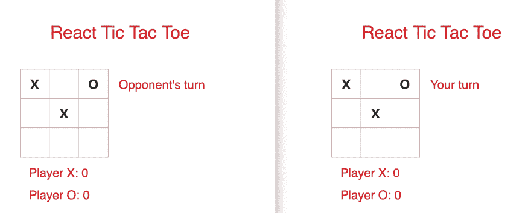](https://res.cloudinary.com/practicaldev/image/fetch/s--zFxEOkHs--/c_limit%2Cf_auto%2Cfl_progressive%2Cq_auto%2Cw_880/https://www.pubnub.com/wp-content/uploads/2019/07/React-tic-tac-toe-overview.png)

玩家首先加入大厅，他们可以创建一个频道或加入一个频道。如果玩家创建了一个频道，他们将获得一个*房间 id* 与另一个玩家共享。创建通道的玩家成为*玩家 X* ，并将在游戏开始时迈出第一步。

[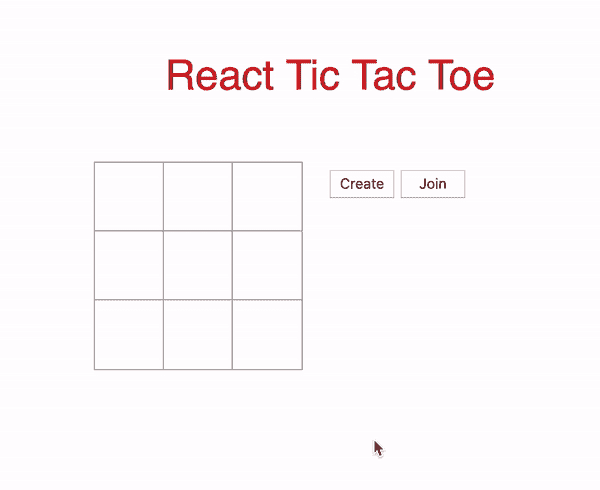](https://res.cloudinary.com/practicaldev/image/fetch/s--pBHPkya6--/c_limit%2Cf_auto%2Cfl_progressive%2Cq_66%2Cw_880/https://www.pubnub.com/wp-content/uploads/2019/07/create-room.gif)

玩家用获得的*房间 id* 加入一个频道，成为*玩家 O* 。只有当频道中有其他人时，玩家才能加入频道。如果有一个以上的人，那么该频道的游戏正在进行中，玩家将无法加入。一旦通道中有两个玩家，游戏就开始了。

[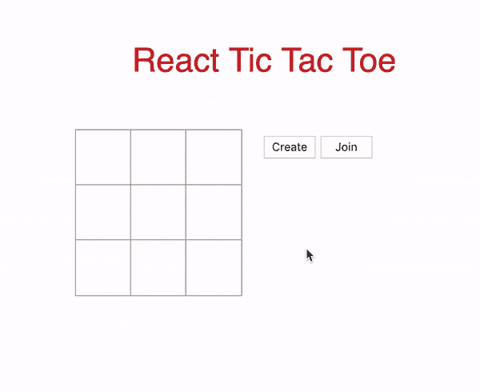](https://res.cloudinary.com/practicaldev/image/fetch/s--X9IiMtj1--/c_limit%2Cf_auto%2Cfl_progressive%2Cq_66%2Cw_880/https://www.pubnub.com/wp-content/uploads/2019/07/join-channel.gif)

游戏结束时，获胜者的分数增加一分。如果比赛以平局结束，那么双方都得不到一分。向*玩家 X* 显示一个模式，要求他们开始新一轮或结束游戏。如果*玩家 X* 继续游戏，棋盘将重置，开始新一轮。否则，游戏结束，双方玩家都回到大厅。

[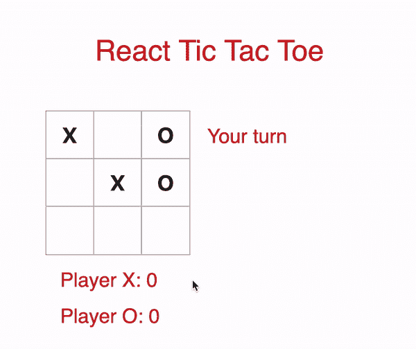](https://res.cloudinary.com/practicaldev/image/fetch/s--l31wbGVd--/c_limit%2Cf_auto%2Cfl_progressive%2Cq_66%2Cw_880/https://www.pubnub.com/wp-content/uploads/2019/07/exit-to-lobby-1.gif)

## 设置大堂

在我们建立大厅之前，注册一个免费的 PubNub 账户。你可以在[的 PubNub 管理面板](https://admin.pubnub.com/?utm_source=Syndication&utm_medium=DevTo&utm_campaign=SYN-CY19-Q3-DevTo-August-5)中获得你唯一的 pub/sub 密钥

一旦你得到了你的密钥，把它们插入到 **App.js** 的构造函数中。

```
// App.js
import React, { Component } from 'react';
import Game from './Game';
import Board from './Board';
import PubNubReact from 'pubnub-react';
import Swal from "sweetalert2";  
import shortid  from 'shortid';
import './Game.css';

class App extends Component {
  constructor(props) {  
    super(props);
    // REPLACE with your keys
    this.pubnub = new PubNubReact({
      publishKey: "YOUR_PUBLISH_KEY_HERE", 
      subscribeKey: "YOUR_SUBSCRIBE_KEY_HERE"    
    });

    this.state = {
      piece: '', // X or O
      isPlaying: false, // Set to true when 2 players are in a channel
      isRoomCreator: false,
      isDisabled: false,
      myTurn: false,
    };

    this.lobbyChannel = null; // Lobby channel
    this.gameChannel = null; // Game channel
    this.roomId = null; // Unique id when player creates a room 
    this.pubnub.init(this); // Initialize PubNub
  }  

  render() {
    return ();
    }
  }

  export default App; 
```

Enter fullscreen mode Exit fullscreen mode

同样在构造函数中，状态对象和变量被初始化。当对象和变量出现在整个文件中时，我们会检查它们。最后，我们在构造函数的末尾初始化了 PubNub。

在**呈现**方法内部和**返回**语句内部，我们为大厅组件添加了标记。

```
return (  
    <div> 
      <div className="title">
        <p> React Tic Tac Toe </p>
      </div>

      {
        !this.state.isPlaying &&
        <div className="game">
          <div className="board">
            <Board
                squares={0}
                onClick={index => null}
              />  

            <div className="button-container">
              <button 
                className="create-button "
                disabled={this.state.isDisabled}
                onClick={(e) => this.onPressCreate()}
                > Create 
              </button>
              <button 
                className="join-button"
                onClick={(e) => this.onPressJoin()}
                > Join 
              </button>
            </div>                        

          </div>
        </div>
      }

      {
        this.state.isPlaying &&
        <Game 
          pubnub={this.pubnub}
          gameChannel={this.gameChannel} 
          piece={this.state.piece}
          isRoomCreator={this.state.isRoomCreator}
          myTurn={this.state.myTurn}
          xUsername={this.state.xUsername}
          oUsername={this.state.oUsername}
          endGame={this.endGame}
        />
      }
    </div>
); 
```

Enter fullscreen mode Exit fullscreen mode

大厅组件由一个标题、一个空的井字游戏棋盘(如果玩家按下方块，什么也不会发生)和“*创建*和“*加入*按钮组成。仅当状态值*正在显示*为假时，该组件才会显示。如果它被设置为 true，那么游戏已经开始，组件被更改为游戏组件，我们将在教程的第二部分中对此进行介绍。

公告板组件也是大厅组件的一部分。在[棋盘](https://github.com/ocastroa/react-tictactoe/blob/master/src/Board.js)组件内是[方块](https://github.com/ocastroa/react-tictactoe/blob/master/src/Square.js)组件。为了将重点放在大厅和游戏组件上，我们不会对这两个组件进行详细介绍。

当播放器按下“创建”按钮时，该按钮被禁用，因此播放器不能创建多个频道。“加入”按钮不会被禁用，以防玩家决定加入某个频道。一旦按下“创建”按钮，就会调用方法**onprescreate()**。

### 创建通道

我们在**onprescreate()**中做的第一件事是生成一个随机的字符串 id，它被截断为 5 个字符。我们通过使用 [**shortid()**](https://www.npmjs.com/package/shortid) 来实现。我们将字符串追加到' *tictactoelobby -* '中，这将是玩家订阅的唯一大厅频道。

```
// Create a room channel
onPressCreate = (e) => {
  // Create a random name for the channel
  this.roomId = shortid.generate().substring(0,5);
  this.lobbyChannel = 'tictactoelobby--' + this.roomId; // Lobby channel name

  this.pubnub.subscribe({
    channels: [this.lobbyChannel],
    withPresence: true // Checks the number of people in the channel
  });
} 
```

Enter fullscreen mode Exit fullscreen mode

为了防止两个以上的玩家加入给定的频道，我们使用 [PubNub Presence](https://www.pubnub.com/docs/react-native-javascript/presence/?utm_source=Syndication&utm_medium=DevTo&utm_campaign=SYN-CY19-Q3-DevTo-August-5) 。稍后，我们将查看检查通道占用率的逻辑。

一旦玩家订阅了大厅频道，就会显示一个带有房间 id 的模式，以便其他玩家可以加入该频道。

[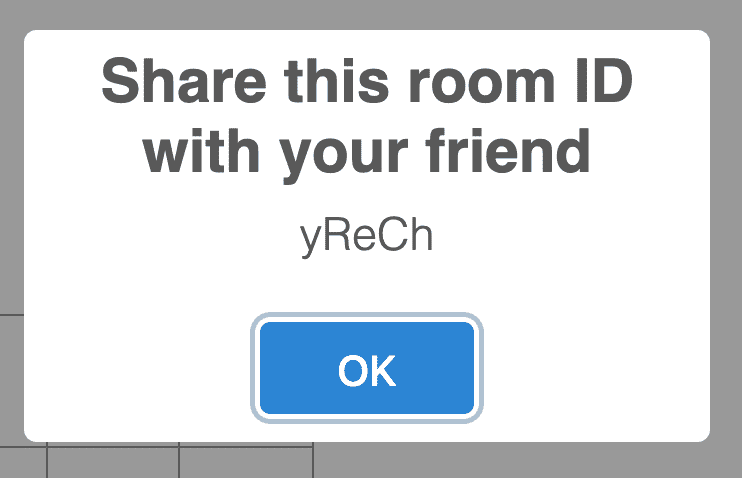](https://res.cloudinary.com/practicaldev/image/fetch/s--iL8bgFc_--/c_limit%2Cf_auto%2Cfl_progressive%2Cq_auto%2Cw_880/https://www.pubnub.com/wp-content/uploads/2019/07/share-roomid-1.png)

这个模态，以及这个应用程序中使用的所有模态，都是由 [**SweetAlert2**](https://sweetalert2.github.io/#download) 创建的，用来替换 JavaScript 的默认 Alert()弹出框。

```
// Inside of onPressCreate()
// Modal
Swal.fire({
  position: 'top',
  allowOutsideClick: false,
  title: 'Share this room ID with your friend',
  text: this.roomId,
  width: 275,
  padding: '0.7em',
  // Custom CSS to change the size of the modal
  customClass: {
      heightAuto: false,
      title: 'title-class',
      popup: 'popup-class',
      confirmButton: 'button-class'
  }
}) 
```

Enter fullscreen mode Exit fullscreen mode

在 **onPressCreate()** 结束时，我们更改状态值以反映应用程序的新状态。

```
this.setState({
  piece: 'X',
  isRoomCreator: true,
  isDisabled: true, // Disable the 'Create' button
  myTurn: true, // Player X makes the 1st move
}); 
```

Enter fullscreen mode Exit fullscreen mode

一旦玩家创建了一个房间，他们必须等待另一个玩家加入那个房间。我们来看看加入一个房间的逻辑。

### 加入一个频道

当玩家按下“加入”按钮时，将调用 **onPressJoin()** 。向玩家显示一个模式，要求他们在输入字段中输入*房间 id* 。

[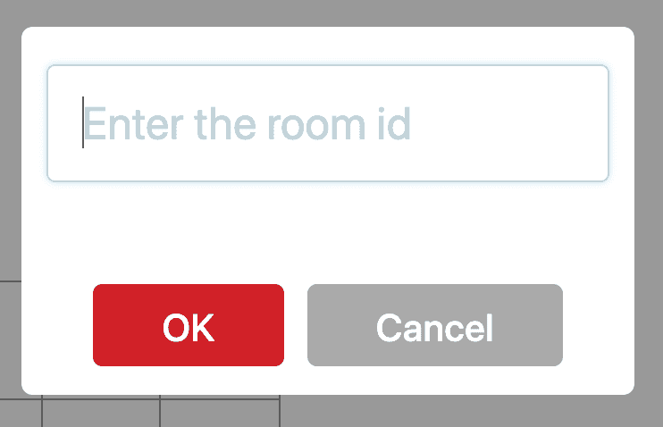](https://res.cloudinary.com/practicaldev/image/fetch/s--erSc88U7--/c_limit%2Cf_auto%2Cfl_progressive%2Cq_auto%2Cw_880/https://www.pubnub.com/wp-content/uploads/2019/07/enter-roomid.png)

如果玩家键入*房间 id* 并按下“确定”按钮，则调用 **joinRoom(value)** ，其中**值**是*房间 id* 。如果输入字段为空或者玩家按下“取消”按钮，则不会调用此方法。

```
// The 'Join' button was pressed
onPressJoin = (e) => {
  Swal.fire({
    position: 'top',
    input: 'text',
    allowOutsideClick: false,
    inputPlaceholder: 'Enter the room id',
    showCancelButton: true,
    confirmButtonColor: 'rgb(208,33,41)',
    confirmButtonText: 'OK',
    width: 275,
    padding: '0.7em',
    customClass: {
      heightAuto: false,
      popup: 'popup-class',
      confirmButton: 'join-button-class',
      cancelButton: 'join-button-class'
    } 
  }).then((result) => {
    // Check if the user typed a value in the input field
    if(result.value){
      this.joinRoom(result.value);
    }
  })
} 
```

Enter fullscreen mode Exit fullscreen mode

我们在 **joinRoom()** 中做的第一件事是将**值**追加到“ *tictactoelobby -* ”中，类似于我们在 **onPressCreate()** 中所做的。

```
// Join a room channel
joinRoom = (value) => {
  this.roomId = value;
  this.lobbyChannel = 'tictactoelobby--' + this.roomId;
} 
```

Enter fullscreen mode Exit fullscreen mode

在玩家订阅大厅频道之前，我们必须使用 [hereNow()](https://www.pubnub.com/docs/react-native-javascript/api-reference-presence#here_now/?utm_source=Syndication&utm_medium=DevTo&utm_campaign=SYN-CY19-Q3-DevTo-August-5) 来检查频道的总占用率。如果总占用率小于 2，玩家可以成功订阅大厅频道。

```
// Check the number of people in the channel
this.pubnub.hereNow({
  channels: [this.lobbyChannel], 
}).then((response) => { 
    if(response.totalOccupancy < 2){
      this.pubnub.subscribe({
        channels: [this.lobbyChannel],
        withPresence: true
      });

      this.setState({
        piece: 'O', // Player O
      });  

      this.pubnub.publish({
        message: {
          notRoomCreator: true,
        },
        channel: this.lobbyChannel
      });
    } 
}).catch((error) => { 
  console.log(error);
}); 
```

Enter fullscreen mode Exit fullscreen mode

玩家订阅大厅频道后，*片段*的状态值变为‘0 ’,并向该大厅频道发布消息。这个消息通知*玩家 X* 另一个玩家已经加入了这个频道。我们在 **componentDidUpdate()** 中设置了消息监听器，稍后我们会谈到。

如果总占用率大于 2，则游戏正在进行，试图加入频道的玩家将被拒绝访问。下面的代码在 **hereNow()** 中 if 语句的下面。

```
// Below the if statement in hereNow()
else{
  // Game in progress
  Swal.fire({
    position: 'top',
    allowOutsideClick: false,
    title: 'Error',
    text: 'Game in progress. Try another room.',
    width: 275,
    padding: '0.7em',
    customClass: {
        heightAuto: false,
        title: 'title-class',
        popup: 'popup-class',
        confirmButton: 'button-class'
    }
  })
} 
```

Enter fullscreen mode Exit fullscreen mode

现在让我们来看看 **componentDidUpdate()** 。

### 开始游戏

在 **componentDidUpdate()** 中，我们检查播放器是否连接了一个通道，也就是检查 *this.lobbyChannel* 不是 **null** 。如果它不是空的，我们设置一个监听器监听所有到达通道的消息。

```
componentDidUpdate() {
  // Check that the player is connected to a channel
  if(this.lobbyChannel != null){
    this.pubnub.getMessage(this.lobbyChannel, (msg) => {
      // Start the game once an opponent joins the channel
      if(msg.message.notRoomCreator){
        // Create a different channel for the game
        this.gameChannel = 'tictactoegame--' + this.roomId;

        this.pubnub.subscribe({
          channels: [this.gameChannel]
        });
      }
    }); 
  }
} 
```

Enter fullscreen mode Exit fullscreen mode

我们检查到达的消息是否是加入频道的玩家发布的*msg . message . notroomcreator*。如果是这样的话，我们创建一个新的频道，'*tictactoe game-【T3]'，将*房间 id* 追加到字符串中。游戏频道用于发布玩家的所有移动，这将更新他们的棋盘。*

最后，在订阅游戏频道后， *isPlaying* 的状态值被设置为 true。这样做将用游戏组件替换大厅组件。

```
this.setState({
   isPlaying: true
 });  

 // Close the modals if they are opened
 Swal.close();
} 
```

Enter fullscreen mode Exit fullscreen mode

一旦显示了游戏组件，我们希望通过执行 *Swal.close()* 从大厅组件中关闭所有打开的模式。

现在我们有两个玩家连接到一个独特的游戏频道，他们可以开始玩井字游戏！在下一节中，我们将实现游戏组件的 UI 和逻辑。

## 打造游戏特色

我们在 **Game.js** 中做的第一件事就是设置**基础构造器** :

```
// Game.js
import React from 'react';
import Board from './Board';
import Swal from "sweetalert2";  

class Game extends React.Component {
  constructor(props) {
    super(props);
    this.state = {
      squares: Array(9).fill(''), // 3x3 board
      xScore: 0,
      oScore: 0,
      whosTurn: this.props.myTurn // Player X goes first
    };

    this.turn = 'X';
    this.gameOver = false;
    this.counter = 0; // Game ends in a tie when counter is 9
  }

  render() { 
    return (); 
  } 
 } 
export default Game; 
```

Enter fullscreen mode Exit fullscreen mode

对于状态对象，我们初始化数组 *squares* 属性，该属性用于存储玩家在棋盘中的位置。这将在下面进一步解释。我们还将玩家分数设置为 0，并将*的值 whostrn*设置为 *myTurn* ，对于*玩家 X* 该值被初始化为**真**，对于*玩家 O* 该值被初始化为**假**。

变数*回合*和*计数器*的值会随着游戏的进行而改变。在游戏结束时， *gameOver* 被设置为**真**。

### 添加 UI

接下来，让我们在 **render** 方法中设置游戏组件的标记。

```
render() {
  let status;
  // Change to current player's turn
  status = `${this.state.whosTurn ? "Your turn" : "Opponent's turn"}`;

  return (
    <div className="game">
      <div className="board">
        <Board
            squares={this.state.squares}
            onClick={index => this.onMakeMove(index)}
          />  
          <p className="status-info">{status}</p>
      </div> 
      <div className="scores-container">
        <div>
          <p>Player X: {this.state.xScore} </p>
        </div> 
        <div>
          <p>Player O: {this.state.oScore} </p>
        </div>
      </div>   
    </div>
  );
} 
```

Enter fullscreen mode Exit fullscreen mode

我们在 UI 中显示了状态值，让玩家知道是该他们走还是该其他玩家走。每次移动时，状态*的布尔值就会更新。UI 的其余部分由棋盘组件和玩家的分数组成。*

### 添加逻辑

当玩家在棋盘上移动时，调用**on make move(****index)**，其中 **index** 是棋子在棋盘上的位置。棋盘有 3 行 3 列，所以总共有 9 个方格。每个方块都有自己唯一的**索引**值，从值 0 开始，以值 8 结束。

```
onMakeMove = (index) =>{
  const squares = this.state.squares;

  // Check if the square is empty and if it's the player's turn to make a move
  if(!squares[index] && (this.turn === this.props.piece)){ 
    squares[index] = this.props.piece;

    this.setState({
      squares: squares,
      whosTurn: !this.state.whosTurn 
    });

    // Other player's turn to make a move
    this.turn = (this.turn === 'X') ? 'O' : 'X';

    // Publish move to the channel
    this.props.pubnub.publish({
      message: {
        index: index,
        piece: this.props.piece,
        turn: this.turn
      },
      channel: this.props.gameChannel
    });  

    // Check if there is a winner
    this.checkForWinner(squares)
  }
} 
```

Enter fullscreen mode Exit fullscreen mode

在获得数组*方块*的状态后，使用一个条件语句来检查玩家触摸的方块是否为空，以及是否轮到他们移动。如果一个或两个条件都不满足，则该玩家的棋子不放在方格上。否则，玩家的棋子被添加到放置该棋子的索引中的数组*方格*中。

例如，如果*玩家 X* 在第 0 行第 2 列移动，并且条件语句为真，那么*方块[2]* 的值将为“X”。

[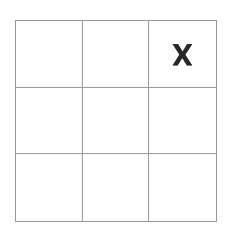](https://res.cloudinary.com/practicaldev/image/fetch/s--FshB5oAm--/c_limit%2Cf_auto%2Cfl_progressive%2Cq_auto%2Cw_880/https://www.pubnub.com/wp-content/uploads/2019/07/squares-example.png)

接下来，状态被改变以反映游戏的新状态，并且*回合*被更新，以便其他玩家可以进行他们的移动。为了让其他玩家的棋盘更新当前数据，我们将数据发布到游戏频道。所有这些都是实时发生的，所以一旦一个有效的移动被做出，两个玩家都会立即看到他们的棋盘更新。这个方法的最后一件事是调用**checkforwinter(squares)**来检查是否有赢家。

在此之前，让我们看一下**componentidmount****()**，在这里我们为到达游戏通道的新消息设置了监听器。

```
componentDidMount(){
  this.props.pubnub.getMessage(this.props.gameChannel, (msg) => {
    // Update other player's board
    if(msg.message.turn === this.props.piece){
      this.publishMove(msg.message.index, msg.message.piece);
    }
  });
} 
```

Enter fullscreen mode Exit fullscreen mode

因为两个玩家都连接到同一个游戏频道，所以他们都会收到这条消息。调用方法 **publishMove(index，piece)** ，其中 **index** 是放置棋子的位置， **piece** 是玩家移动的棋子。这个方法用当前移动更新棋盘，并检查是否有赢家。为了防止进行当前移动的玩家不得不再次重复这个过程，如果语句检查玩家的棋子是否与*回合*的值匹配。如果是这样，他们的董事会更新。

```
// Opponent's move is published to the board
publishMove = (index, piece) => {
  const squares = this.state.squares;

  squares[index] = piece;
  this.turn = (squares[index] === 'X')? 'O' : 'X';

  this.setState({
    squares: squares,
    whosTurn: !this.state.whosTurn
  });

  this.checkForWinner(squares)
} 
```

Enter fullscreen mode Exit fullscreen mode

更新板卡的逻辑与 **onMakeMove()** 相同。我们现在来看一下**checkforwinter()**。

```
checkForWinner = (squares) => {
  // Possible winning combinations
  const possibleCombinations = [
    [0, 1, 2],
    [3, 4, 5],
    [6, 7, 8],
    [0, 3, 6],
    [1, 4, 7],
    [2, 5, 8],
    [0, 4, 8],
    [2, 4, 6],
  ];

  // Iterate every combination to see if there is a match
  for (let i = 0; i < possibleCombinations.length; i += 1) {
    const [a, b, c] = possibleCombinations[i];
    if (squares[a] && squares[a] === squares[b] && squares[a] === squares[c]) {
      this.announceWinner(squares[a]);
      return;
    }
  }
} 
```

Enter fullscreen mode Exit fullscreen mode

所有获胜的组合都在双数组*可能组合*中，其中每个数组都是赢得游戏的可能组合。在*可能组合*中的每一个数组都要对照数组*方块*进行检查。有匹配的，就有赢家。让我们通过一个例子来说明这一点。

假设参与人 X 在第 2 行第 0 列做了一个获胜的移动。该位置的*指数*为 6。棋盘现在看起来像这样:

[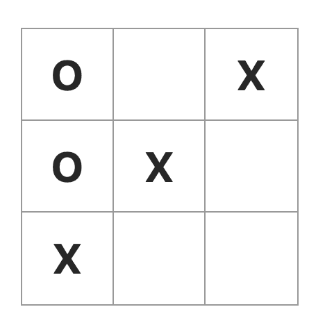](https://res.cloudinary.com/practicaldev/image/fetch/s--jqXiMnGm--/c_limit%2Cf_auto%2Cfl_progressive%2Cq_auto%2Cw_880/https://www.pubnub.com/wp-content/uploads/2019/07/winning-move-example-1.png)

*玩家 X* 的获胜组合是【2，4，6】。数组*方块*更新为:["O "，" X "，" O "，" X "，" X "，" X "，" X "，" "]。

在循环的*中，当*【a，b，c】*的值为【2，4，6】时，*循环的*中的 *if* 语句为 true，因为【2，4，6】都具有相同的 *X* 的值。获胜者的分数需要更新，所以**调用一个****announcewinner()**来奖励获胜的玩家。*

如果比赛以平局结束，这一轮没有赢家。为了检查平局游戏，我们使用一个计数器，每次在棋盘上移动一步，计数器就加 1。

```
// Below the for loop in checkForWinner()
// Check if the game ends in a draw
this.counter++;
// The board is filled up and there is no winner
if(this.counter === 9){
  this.gameOver = true;
  this.newRound(null);
} 
```

Enter fullscreen mode Exit fullscreen mode

如果计数器达到 9，那么游戏以和局结束，因为玩家在棋盘的最后一格没有走赢棋。当这种情况发生时，调用方法 **newRound()** 时使用了一个 **null** 参数，因为没有赢家。

在我们使用这个方法之前，让我们先回顾一下**a****announcewinner()**。

```
// Update score for the winner
announceWinner = (winner) => {
  let pieces = {
    'X': this.state.xScore,
    'O': this.state.oScore
  }

  if(winner === 'X'){
    pieces['X'] += 1;
    this.setState({
      xScore: pieces['X']
    });
  }
  else{
    pieces['O'] += 1;
    this.setState({
      oScore: pieces['O']
    });
  }
  // End the game once there is a winner
  this.gameOver = true;
  this.newRound(winner);    
} 
```

Enter fullscreen mode Exit fullscreen mode

这个方法的参数是 *winner* ，也就是赢得游戏的玩家。我们检查获胜者是“X”还是“O ”,并将获胜者的分数增加一分。由于游戏已经结束，变量 *gameOver* 被设置为真，方法 **newRound()** 被调用。

### 开始新一轮

*玩家 X* 可以选择再玩一轮或结束游戏返回大厅。

[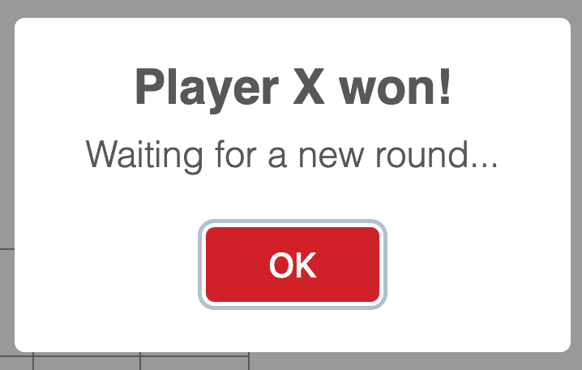](https://res.cloudinary.com/practicaldev/image/fetch/s--2mDFZ8EA--/c_limit%2Cf_auto%2Cfl_progressive%2Cq_auto%2Cw_880/https://www.pubnub.com/wp-content/uploads/2019/07/playero-endgame-modal.png)

另一个玩家告诉我们要等到玩家 X 决定怎么做。

[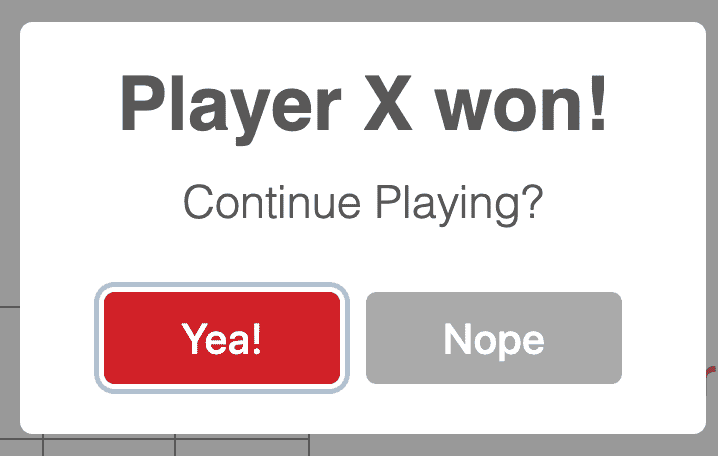](https://res.cloudinary.com/practicaldev/image/fetch/s--9IKjFyue--/c_limit%2Cf_auto%2Cfl_progressive%2Cq_auto%2Cw_880/https://www.pubnub.com/wp-content/uploads/2019/07/playerx-endgame-modal.png)

一旦*玩家 X* 决定要做什么，就会有消息发布到游戏频道，让其他玩家知道。然后更新用户界面。

```
newRound = (winner) => {
  // Announce the winner or announce a tie game
  let title = (winner === null) ? 'Tie game!' : `Player ${winner} won!`;
  // Show this to Player O
  if((this.props.isRoomCreator === false) && this.gameOver){
    Swal.fire({  
      position: 'top',
      allowOutsideClick: false,
      title: title,
      text: 'Waiting for a new round...',
      confirmButtonColor: 'rgb(208,33,41)',
      width: 275,
      customClass: {
          heightAuto: false,
          title: 'title-class',
          popup: 'popup-class',
          confirmButton: 'button-class',
      } ,
    });
    this.turn = 'X'; // Set turn to X so Player O can't make a move 
  } 

  // Show this to Player X
  else if(this.props.isRoomCreator && this.gameOver){
    Swal.fire({      
      position: 'top',
      allowOutsideClick: false,
      title: title,
      text: 'Continue Playing?',
      showCancelButton: true,
      confirmButtonColor: 'rgb(208,33,41)',
      cancelButtonColor: '#aaa',
      cancelButtonText: 'Nope',
      confirmButtonText: 'Yea!',
      width: 275,
      customClass: {
          heightAuto: false,
          title: 'title-class',
          popup: 'popup-class',
          confirmButton: 'button-class',
          cancelButton: 'button-class'
      } ,
    }).then((result) => {
      // Start a new round
      if (result.value) {
        this.props.pubnub.publish({
          message: {
            reset: true
          },
          channel: this.props.gameChannel
        });
      }

      else{
        // End the game
        this.props.pubnub.publish({
          message: {
            endGame: true
          },
          channel: this.props.gameChannel
        });
      }
    })      
  }
 } 
```

Enter fullscreen mode Exit fullscreen mode

如果消息是 *reset* ，那么所有的状态值和变量，除了玩家的分数，都被重置为初始值。任何仍然打开的模式都被关闭，新的一轮开始。

对于消息 *endGame* ，关闭所有模态，调用方法 **endGame()** 。这个方法在 **App.js** 里。

```
// Reset everything
endGame = () => {
  this.setState({
    piece: '',
    isPlaying: false,
    isRoomCreator: false,
    isDisabled: false,
    myTurn: false,
  });

  this.lobbyChannel = null;
  this.gameChannel = null;
  this.roomId = null;  

  this.pubnub.unsubscribe({
    channels : [this.lobbyChannel, this.gameChannel]
  });
} 
```

Enter fullscreen mode Exit fullscreen mode

所有状态值和变量都被重置为初始值。频道名称被重置为空，因为每次玩家创建房间时都会生成一个新名称。由于频道名称不再有用，玩家退订大厅和游戏频道。 *isPlaying* 的值被重置为 false，因此游戏组件将被替换为大厅组件。

包含在 **App.js** 中的最后一个方法是 **componentWillUnmount()** ，它从两个通道中取消订阅播放器。

```
componentWillUnmount() {
  this.pubnub.unsubscribe({
    channels : [this.lobbyChannel, this.gameChannel]
  });
} 
```

Enter fullscreen mode Exit fullscreen mode

这就是我们要让游戏运行所需要做的一切！可以在 [repo](https://github.com/ocastroa/react-tictactoe/blob/master/src/Game.css) 中获取游戏的 CSS 文件。现在，让我们开始游戏。

## 运行游戏

在运行游戏之前，我们需要做几个小步骤。首先，我们需要启用 [PubNub Presence 特性](https://www.pubnub.com/docs/react-native-javascript/api-reference-presence/?utm_source=Syndication&utm_medium=DevTo&utm_campaign=SYN-CY19-Q3-DevTo-August-5)，因为我们使用它来获取频道中的人数(在订阅大厅频道时，我们使用了 *withPresence* )。进入 [PubNub 管理仪表板](https://admin.pubnub.com/#/login/?utm_source=Syndication&utm_medium=DevTo&utm_campaign=SYN-CY19-Q3-DevTo-August-5)，点击你的应用程序。点击**键集**并向下滚动至**应用附加模块**。将**存在**开关拨到上的**。保持默认值不变。**

[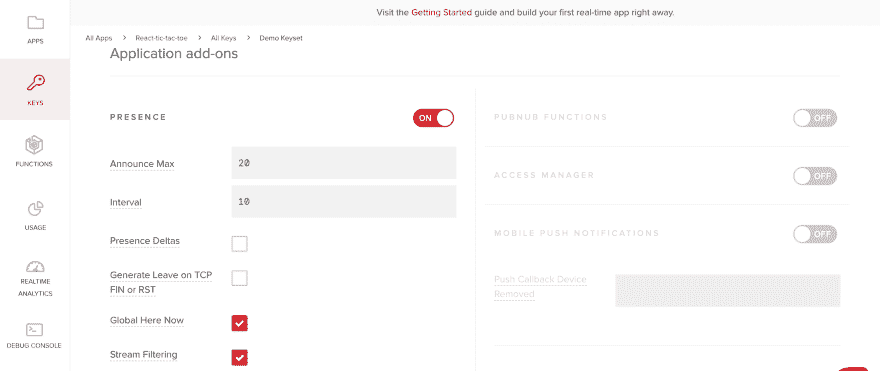](https://res.cloudinary.com/practicaldev/image/fetch/s--BGzGGhpj--/c_limit%2Cf_auto%2Cfl_progressive%2Cq_auto%2Cw_880/https://www.pubnub.com/wp-content/uploads/2019/07/enable-presence-1.png)

要安装应用程序中使用的三个依赖项并运行应用程序，您可以运行位于应用程序根目录中的脚本 **dependencies.sh** 。

```
# dependencies.sh
npm install --save pubnub pubnub-react
npm install --save shortid
npm install --save sweetalert2

npm start 
```

Enter fullscreen mode Exit fullscreen mode

在终端中，转到应用程序的根目录，键入以下命令，使脚本可执行 :

```
chmod +x dependencies.sh 
```

Enter fullscreen mode Exit fullscreen mode

使用以下命令运行脚本:

```
./dependencies.sh 
```

Enter fullscreen mode Exit fullscreen mode

应用程序将在 [http://localhost:3000](http://localhost:3000) 中打开，并显示大厅组件。

[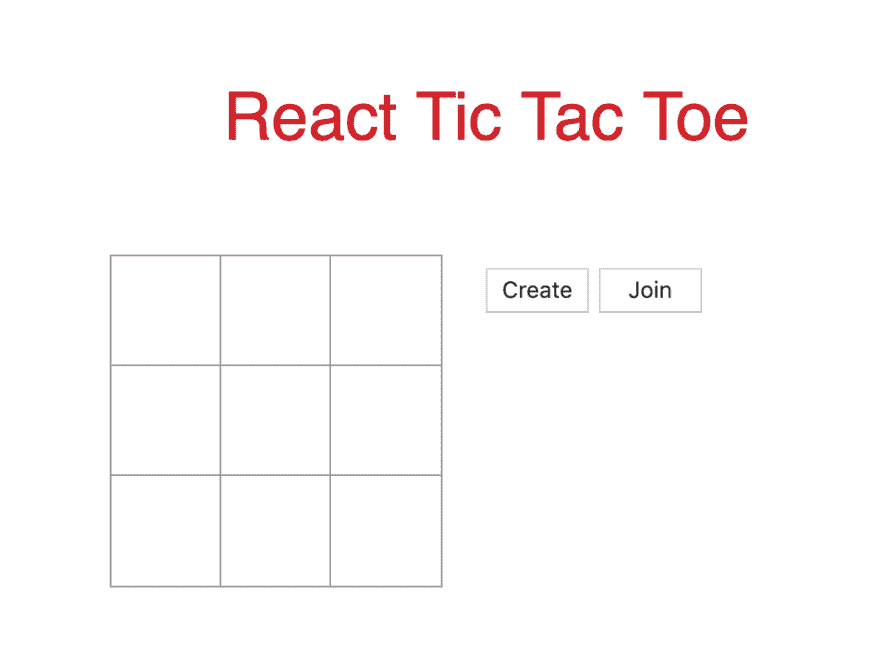](https://res.cloudinary.com/practicaldev/image/fetch/s--MuHq40es--/c_limit%2Cf_auto%2Cfl_progressive%2Cq_auto%2Cw_880/https://www.pubnub.com/wp-content/uploads/2019/07/run-the-app.png)

打开另一个选项卡，或者最好是窗口，复制并粘贴 [http://localhost:3000](http://localhost:3000) 。在一个窗口中，单击“创建”按钮创建一个频道。将弹出一个显示*房间 id* 的对话框。复制并粘贴该 id。转到另一个窗口，单击“加入”按钮。当弹出模式时，在输入框中输入*房间 id* ，并按下“确定”按钮。

[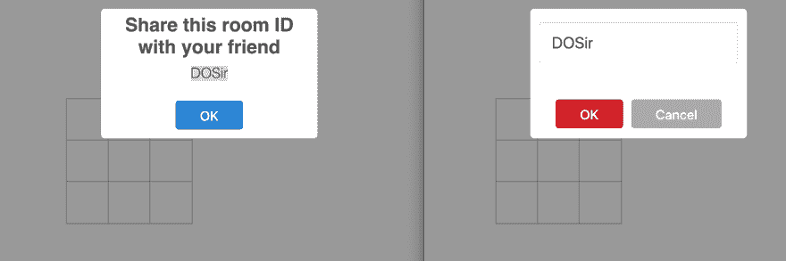](https://res.cloudinary.com/practicaldev/image/fetch/s--cGV3Oee4--/c_limit%2Cf_auto%2Cfl_progressive%2Cq_auto%2Cw_880/https://www.pubnub.com/wp-content/uploads/2019/07/create-join-lobby.png)

一旦玩家连接上，游戏就开始了。用于创建通道的窗口首先移动。按下棋盘上的任意方块，看到棋子 **X** 在两个窗口中实时显示在棋盘上。如果你试着按同一块棋盘上的另一个方块，什么都不会发生，因为不再轮到你走了。在另一个窗口中，按下棋盘上的任意方块，棋子 **O** 被放置在该方块中。

[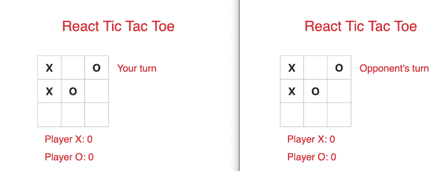](https://res.cloudinary.com/practicaldev/image/fetch/s--fFuRK7KY--/c_limit%2Cf_auto%2Cfl_progressive%2Cq_auto%2Cw_880/https://www.pubnub.com/wp-content/uploads/2019/07/place-piece-on-board.png)

继续玩，直到有一个赢家或平局。然后显示一个模式，宣布这一轮的获胜者，或者宣布游戏以平局结束。在同样的模式下，*玩家 X* 必须决定是继续玩还是退出游戏。玩家 O 的*模式会告诉他们等待新一轮。*

[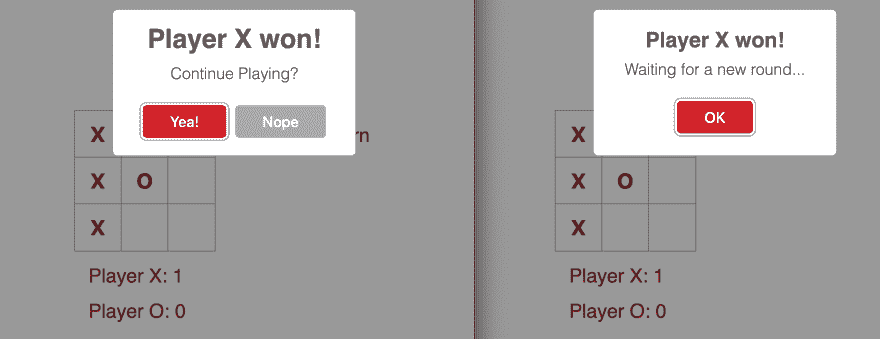](https://res.cloudinary.com/practicaldev/image/fetch/s--3FsKRR71--/c_limit%2Cf_auto%2Cfl_progressive%2Cq_auto%2Cw_880/https://www.pubnub.com/wp-content/uploads/2019/07/end-of-game.png)

如果*玩家 X* 继续游戏，除了分数之外的一切都会被重置。否则，两位玩家将被带回大厅，在那里他们可以创建或加入新频道。看看这个[视频](https://www.youtube.com/embed/CegmJ6BXhbc)的游戏演示。

## 创建原生手机版本

既然你已经让你的游戏在网络浏览器上完美运行了，那就让它移动化吧！查看如何在 Android 和 iOS 的 React Native 中构建一个多人游戏。如果你想构建更多的实时游戏，并想知道 PubNub 如何帮助你，请查看[多人游戏教程](https://www.pubnub.com/blog/tag/multiplayer-gaming/?utm_source=Syndication&utm_medium=DevTo&utm_campaign=SYN-CY19-Q3-DevTo-August-5)。