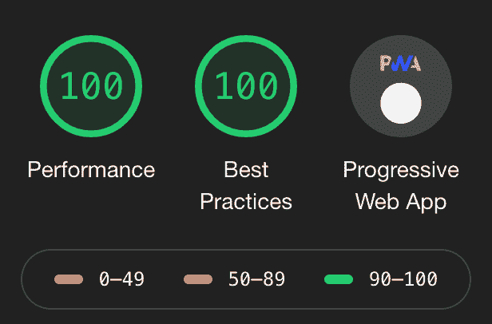

# 使用 nginx 在 docker 中构建一个渐进式 web 应用程序，以部署到 kubernetes 或 docker swarm

> 原文：<https://dev.to/rhanarion/build-a-progressive-web-app-in-docker-with-nginx-to-deploy-to-kubernetes-or-docker-swarm-253f>

随着我的基于 kubernetes 的个人云设置完成(你可以在这里阅读:[https://rhazn . com/posts/run-a-personal-cloud-with-traefik-lets-encrypt-and-zookeeper/](https://rhazn.com/posts/run-a-personal-cloud-with-traefik-lets-encrypt-and-zookeeper/))，是时候实际部署第一个项目了。

最容易部署的应用程序是一个纯粹的客户端单页面应用程序，它封装在 docker 容器中，带有一个像 nginx 这样的 web 服务器来交付文件。将应用程序打包到它自己的容器中允许我们构建一个标准化的容器，可以在本地运行进行测试，也可以部署到 docker swarm 和 kubernetes。

设置和配置我们自己的 HTTP 服务器还允许对缓存进行微调，以获得良好的 lighthouse 分数:

[](https://res.cloudinary.com/practicaldev/image/fetch/s--fuZHBBdy--/c_limit%2Cf_auto%2Cfl_progressive%2Cq_auto%2Cw_880/https://rhazn.com/img/posts/build-a-progressive-web-app-in-docker-with-nginx-to-deploy-to-kubernetes-or-docker-swarm/scores.png)

# 建筑在码头上

对于这个设置，我们使用 docker 构建应用程序。这样，无论本地计算机上安装了什么软件，应用程序总是使用相同的节点版本构建，并且可以一致地复制。

这里的项目是一个基于 create-react-app 的 react 应用程序，但它可以与任何前端框架类似地工作:

```
FROM node:12.6.0 AS build

WORKDIR /

COPY package.json package-lock.json tsconfig.json ./

RUN npm ci

COPY ./src ./src
COPY ./public ./public

RUN npm run build --prod 
```

Enter fullscreen mode Exit fullscreen mode

# 配置 nginx

对于 nginx 配置，我将一个配置文件放入项目并签入。这个配置文件稍后被复制到服务 SPA 的容器中。为了实现良好的性能，我们

*   为 HTML/CSS 和 JS 文件启用 gzip
*   为任何文件设置一年的缓存(因为 create-react-app 会在每次生产构建时构建新的文件名，这会使部署时的缓存失效)
*   禁用实际 index.html 文件的缓存(因为我们需要让浏览器请求最新的文件)
*   将任何请求重定向到 index.html，以便 SPA 路由器能够处理它们

你可以在这里看到完整的配置文件:

```
server {
    listen 80;
    server_name _;

    gzip on;
    gzip_types text/html text/css application/javascript;

    root /var/www/;
    index index.html;

    # Force all paths to load either itself (js files) or go through index.html.
    location /index.html {
        try_files $uri /index.html;

        add_header Cache-Control "no-store, no-cache, must-revalidate";    
    }

    location / {
        try_files $uri /index.html;

        expires 1y;
        add_header Cache-Control "public";
    }
} 
```

Enter fullscreen mode Exit fullscreen mode

# 建造最终容器

最终结果将是 a)在“构建”步骤中在 docker 中构建 SPA，然后从 nginx 映像中设置一个容器，并从构建步骤中复制 JS 以及如上所述的签入 nginx 配置。

最后，我们公开端口 80 并启动 nginx 来服务文件。

```
FROM node:12.6.0 AS build

WORKDIR /

COPY package.json package-lock.json tsconfig.json ./

RUN npm ci

COPY ./src ./src
COPY ./public ./public

RUN npm run build --prod

FROM nginx:1.16.1

COPY --from=build /build /var/www/
COPY ./k8s/config/nginx.conf /etc/nginx/conf.d/default.conf
EXPOSE 80
CMD ["nginx", "-g", "daemon off;"] 
```

Enter fullscreen mode Exit fullscreen mode

# 关于我

我是一个全栈开发者和数字产品爱好者，我可以自由工作，并总是在寻找下一个令人兴奋的项目:)。

你可以通过电子邮件(pheltweg@gmail.com 或者推特 https://twitter.com/rhanarion T2 联系我。