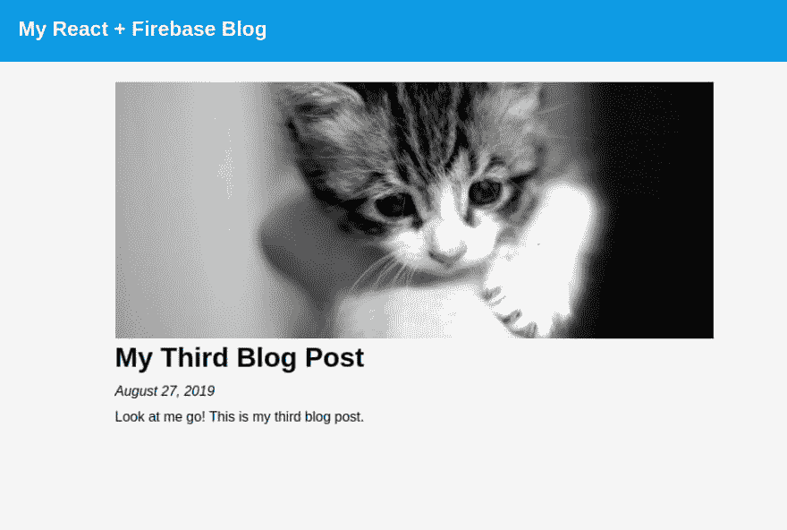

# 构建 React & Firebase 博客站点:第 3 部分

> 原文：<https://dev.to/ashleemboyer/build-a-react-firebase-blog-site-part-3-4c5e>

*这篇文章最初发表于[我的个人博客网站](https://ashleemboyer.com/react-firebase-blog-03)。*

我们已经到了 React & Firebase 系列的第三部分。在第一部分中，我们学习了如何设置一切。[上次](https://ashleemboyer.com/react-firebase-blog-02)，我们做了一个创建新博文的页面。今天，我们将从 Firebase 实时数据库中读取单个帖子，并在我们的应用程序中显示它们。

如果你还没有阅读前两篇文章，我有一些你可以用的入门代码。在继续之前，请确保您遵循第一部分的第 1、2 和 5 步。

## 目录

1.  克隆(第 3 部分)启动代码[可选]
2.  检查`Post`组件
3.  将`Post`组件连接到 Firebase

* * *

## 1。克隆(第 3 部分)启动代码[可选]

如果您已经成功完成了第 2 部分，请跳过这一步。否则，您可以通过在终端中运行以下命令来克隆代码:

```
git clone https://github.com/ashleemboyer/react-firebase-blog-starter-part-3.git 
```

Enter fullscreen mode Exit fullscreen mode

在继续之前，您需要更改一个文件:`src/firebase.js`。如果你打开它，你会看到下面的`config`常量:

```
const config = {
  apiKey: "<YOUR-API-KEY>",
  authDomain: "<YOUR-AUTH-DOMAIN>",
  databaseURL: "<YOUR-DATABASE-URL>",
  projectId: "<YOUR-PROJECT-ID>",
  storageBucket: "<YOUR-STORAGE-BUCKET>",
  messagingSenderId: "<YOUR-MESSAGE-SENDER-ID>",
  appId: "<YOUR-APP-ID>"
}; 
```

Enter fullscreen mode Exit fullscreen mode

常量中的属性用于将您的应用程序连接到 Firebase 项目。要找到这些值，通过 [Firebase 控制台](https://console.firebase.google.com)左侧栏中的齿轮图标进入你的项目设置。向下滚动到“你的应用”下的“Firebase SDK 片段”,从他们调用的`firebaseConfig`中复制属性。用这些值替换您的`config`常量中的属性。

现在你可以运行`npm install`然后`npm run start`在浏览器中查看你的项目。

## 2。检查`Post`组件

你可以在`src/pages/post.js`文件中找到这个组件。让我们看看它现在在做什么。

首先，它使用我们在`src/App.js`中设置的`Router`从 URL 中获取 slug。传递给`Route`的组件在`Router`内有一个`match`道具发送给它们。这个道具还有其他方式发送给组件，你可以在这里阅读更多关于那个[的内容。](https://reacttraining.com/react-router/web/api/match)

接下来，我们有一个`postSlugs`常量，它是一个真实博客文章中存在的 slugs 数组。如果你查看数据库，这些与我们给第一个和第二个博客帖子的子弹相匹配。问题是这个代码不是动态的，也没有连接到数据库。我们一会儿会回来讨论这个问题。

接下来，我们检查地址栏中的`slug`是否是`postSlugs`中的一个。如果不是，那么用户试图看到的帖子实际上并不存在。因此，我们将一个`Redirect`返回给我们的`404`组件。你可以在这里阅读更多关于`Redirect`。

最后，我们有我们的返回声明。现在，它为每个有效的帖子`slug`返回相同的东西。相反，我们希望展示我们存储在 Firebase 中的真实的博文内容。

## 3。将`Post`组件连接到 Firebase

首先，让我们添加 import 函数，这样我们就可以尝试从数据库中读取数据。当我们这么做的时候，我们还应该导入`useState`来帮助管理一些事情。

```
import React, { useState } from "react";

import { getFirebase } from "../firebase"; 
```

Enter fullscreen mode Exit fullscreen mode

接下来，让我们考虑一下我们想要用`useState`来管理什么。首先想到的是一个`loading`状态。这将是一个布尔值，它描述了我们是否试图从数据库中加载一些东西。我们还希望我们的`currentPost`有一个变量，我们试图从数据库中读取。用下面两行代码替换`postSlugs`行:

```
const [loading, setLoading] = useState(true);
const [currentPost, setCurrentPost] = useState(); 
```

Enter fullscreen mode Exit fullscreen mode

我们希望在加载状态下开始，这样页面可以显示一些不同的内容，向用户表明页面正在加载。你可以展示一个动画，GIF，纯文本，随便你。我们暂时保持简单，只返回一些文本，如下所示:

```
if (loading) {
  return <h1>Loading...</h1>; } 
```

Enter fullscreen mode Exit fullscreen mode

然而，我们的数据库调用需要放在这个`if`语句之前。如果我们把它放在 after，它将永远不会到达，因为`if`语句使代码提前返回。下面是我们在调用`useState`之后和刚刚写的`if`语句之前要添加的内容:

```
if (loading && !currentPost) {
  getFirebase()
    .database()
    .ref()
    .child(`/posts/${slug}`)
    .once("value")
    .then(snapshot => {
      if (snapshot.val()) {
        setCurrentPost(snapshot.val());
      }
      setLoading(false);
    });
} 
```

Enter fullscreen mode Exit fullscreen mode

让我们更新我们对一个帖子是否存在的检查。将`postDoesNotExist`更新为:

```
const postDoesNotExist = !currentPost; 
```

Enter fullscreen mode Exit fullscreen mode

这些情况一开始可能会有点混乱。我们在检查什么？在这里列出执行的步骤可能会有所帮助，您可以通过向文件中添加一些控制台日志来试验一下。

1.  在第一次加载时:`loading`为真，`setCurrentPost`未定义，所以我们进入`if`语句内部。一旦我们将它放入`then`，如果`snapshot.val()`返回一个对象(如果给定的`slug`不存在 post，它将为空)，我们调用`setCurrentPost`，使`currentPost`不再未定义。
2.  在`setCurrentPost`调用之后:进行这个调用将重新呈现组件。我们再次到达我们的`if (loading && !currentPost)`语句。因为现在已经定义了`currentPost`,所以我们不再进入代码块，从而避免对数据库进行不必要的调用。我们到达`if (loading)`语句。`loading`仍然为真，所以组件返回一些文本，不做任何其他事情。
3.  在`setLoading`调用之后:进行这个调用将重新呈现组件。`loading`现在是假的，`currentPost`可能是未定义的或是一个对象。这就是`if (postDoesNotExist)`支票的用武之地。如果我们没有从数据库中得到一个帖子，我们返回一个`Redirect`，就像之前一样。否则，我们继续进行最后的`return`，在那里我们显示帖子。

我希望这些步骤不会让你不知所措，它们会帮助你看到钩子和状态管理的力量！对我来说，它们是 React 最酷的东西。

以下是我展示帖子的方式:

```
return (
  <>
    
    <h1>{currentPost.title}</h1>
    <em>{currentPost.datePretty}</em>
    <p dangerouslySetInnerHTML={{ __html: currentPost.content }}></p>
  </> ); 
```

Enter fullscreen mode Exit fullscreen mode

我还在`src/index.js`中的`<p>`元素顶部添加了一个`12px`边距。

现在，当你点击“继续阅读…”链接或手动导航到您的一个帖子，您应该会看到类似这样的内容:

[](https://res.cloudinary.com/practicaldev/image/fetch/s--jTRokSje--/c_limit%2Cf_auto%2Cfl_progressive%2Cq_auto%2Cw_880/https://firebasestorage.googleapis.com/v0/b/ashleemboyer-2018.appspot.com/o/images%252Freact-firebase-blog%252Fpart-03%252Fpost.png%3Falt%3Dmedia%26token%3D4a9abd6a-9549-467f-a473-ff86ae47357a)

* * *

你知道我有时事通讯吗？📬

如果你想在我发布新的博客帖子或宣布重大项目时得到通知，请联系 https://ashleemboyer.com/newsletter。

* * *

如果您有任何问题或疑虑，请[给我发电子邮件](//mailto:hello@ashleemboyer.com)或[发推特消息](https://twitter.com/ashleemboyer)。我喜欢收到你的来信！😊