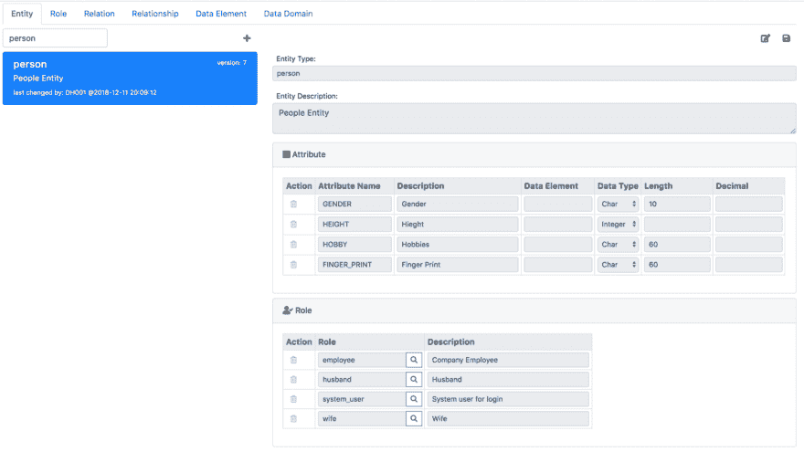
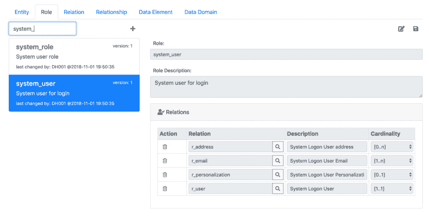
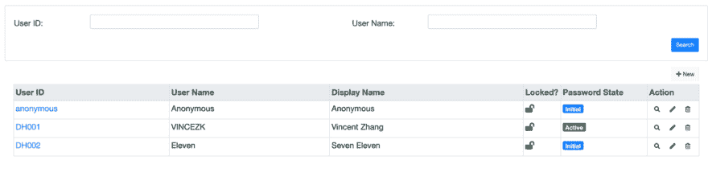
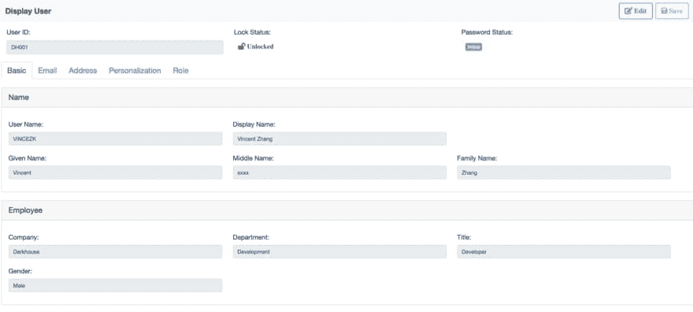
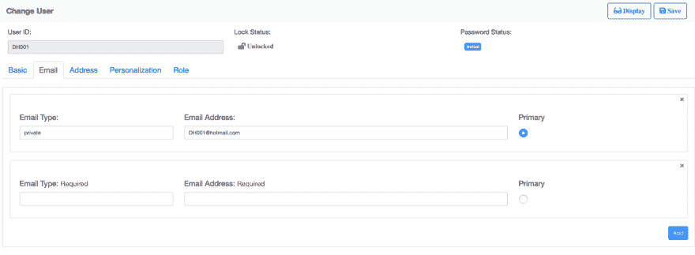
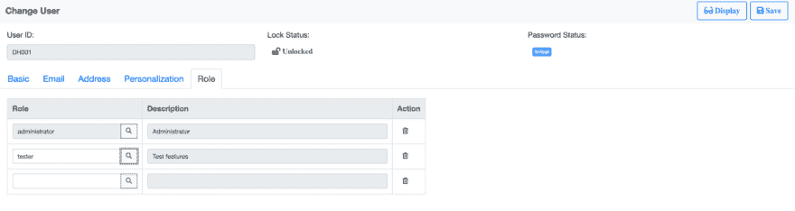
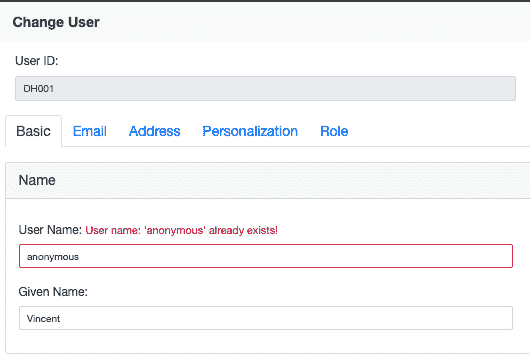
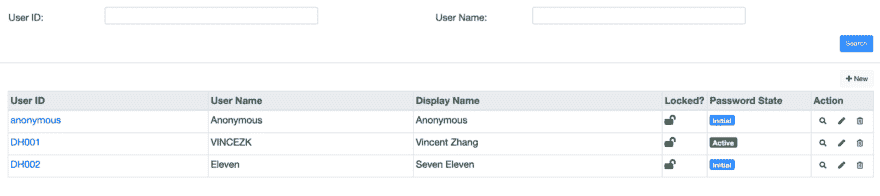
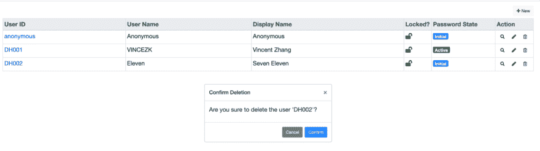

# 使用 Angular 构建一个真正的 CRUD 应用程序

> 原文：<https://dev.to/vincezk/build-a-real-crud-app-using-angular-5eh>

关于如何构建 CRUD 应用程序，有大量的博客。但是这个博客试图把重点放在单词**“真实的”**上。许多例子向人们展示了构建一个 CRUD 应用程序是多么容易。因为我从来不认为它是那么容易，所以我试着告诉它有多难？在那些简单的例子中，隐藏或缺失了什么？我们如何在不损失质量的情况下简化它？

我将以用户管理模块为例，几乎每个系统都需要这个模块。这是一个深入本质的好例子。用户是被授权访问系统资源的人。在开发这类应用程序时，你会读到很多想法、模式和困难。

我使用 Angular 作为 UI 技术。因为我们的理念是一致的，主要是在双向绑定和组件构造上。当然，一个 CRUD 应用涉及到很多其他技术。有些是如此重要，以至于我们忘记了它们的存在。除了操作系统和数据库，我还在 NodeJS 堆栈上构建了应用程序。你可以先浏览一下[演示](https://darkhouse.com.cn/portal/users)，看看是否值得你花时间继续阅读。完整的代码存放在 [Github](https://github.com/VinceZK/Portal/tree/master/src/app/user) 中。

## 先建模

现在第一个问题，从哪里开始？有些人喜欢绘制 UI 模型，而有些人喜欢设计 DB 表。无论哪种方法，您实际上都是在建模。你在考虑一个用户应该有什么样的属性。所以，让我们用新潮的方式试试，用 JSON 来建模。

```
{"r_user":  {"USER_ID":  "DH001",  "USER_NAME":  "VINCEZK",  "PASSWORD":  "Dark1234",  "PWD_STATE":  1,  "LOCK":  null,  "DISPLAY_NAME":  "Vincent Zhang",  "FAMILY_NAME":  "Zhang",  "GIVEN_NAME":  "Vincent",  "MIDDLE_NAME":  null},  "r_employee":  {"USER_ID":  "DH001",  "COMPANY_ID":  "Darkhouse",  "DEPARTMENT_ID":  "Development",  "TITLE":  "Developer",  "GENDER":  "Male"},  "r_email":  [  {"EMAIL":  "xxxx@hotmail.com",  "TYPE":  "private",  "PRIMARY":  1},  {"EMAIL":  "xxxx@darkhouse.com",  "TYPE":  "work",  "PRIMARY":  0}  ],  "r_address":  [  {"ADDRESS_ID":  527,  "COUNTRY":  "China",  "CITY":  "Shanghai",  "POSTCODE":  201202,  "ADDRESS_VALUE":  "Room #999, Building #99, XXX Road #999",  "TYPE":  "Current Live",  "PRIMARY":  1  },  {"ADDRESS_ID":  528,  "COUNTRY":  "China",  "CITY":  "Haimen",  "POSTCODE":  226126,  "ADDRESS_VALUE":  "Village LeeZhoo",  "TYPE":  "Born Place",  "PRIMARY":  0}  ],  "r_personalization":  {"USER_ID":  "DH001",  "DATE_FORMAT":  null,  "DECIMAL_FORMAT":  null,  "TIMEZONE":  "UTC+8",  "LANGUAGE":  "ZH"  },  "relationshipWithRole":  [  {"NAME":  "administrator"},  {"NAME":  "tester"}  ]  } 
```

JSON 建模的主要好处是方便。你只需要一个记事本和一些协议。例如，“r_user”是将一些相关属性组合在一起的关系。如果关系有多个元组，那么使用数组，比如“r_email”和“r_address”。如果该实体与其他实体有关系，则参考“relationshipWithRole”。

现在，有了这个 JSON 模型，我们可以上下扩展:UI 和数据库。先看哪个？好吧，如果你有利益相关者，请先做 UI。我这种情况，既然没有这种压力，就先做数据库。

老问题来了:对象关系映射。我做的 JSON 模型是基于对象的。我应该以相同的对象方式存储它吗？我的回答永远是“不”。我们存储数据只是因为我们将来会报告它们。并且在报告数据时，我们处理的是“集合”而不是“对象”。如果我在数据存储期间投资较少，那么我会在报告时进行回报。所以我选择了一个关系数据库，我将使用框架 [JSON-on-Relations](https://github.com/VinceZK/json-on-relations) 进行对象关系映射。

因为用户是一个人，所以我创建了两个角色“system_user”和“employee ”,并将它们分配给 person 实体。
[T3】](https://res.cloudinary.com/practicaldev/image/fetch/s--qIn3xP55--/c_limit%2Cf_auto%2Cfl_progressive%2Cq_auto%2Cw_880/https://thepracticaldev.s3.amazonaws.com/i/lps9lbxeu4kvf590h7rb.png)

在角色“系统用户”中，我分配了 4 个关系:“r 地址”、“r 电子邮件”、“r 个性化”和“r 用户”。每个关系都有其基数设置。例如:“[1..1]"表示每个实体实例在关系" r_user "中必须有一个项目。
[T3】](https://res.cloudinary.com/practicaldev/image/fetch/s--CazoTZnR--/c_limit%2Cf_auto%2Cfl_progressive%2Cq_auto%2Cw_880/https://thepracticaldev.s3.amazonaws.com/i/0wz29n5tojp1qg6kpnd0.png)

使用 [JSON-on-Relations](https://github.com/VinceZK/json-on-relations) 的图形建模工具，我可以很容易地创建 DB 表，并使它们组成“用户”实体。如你所见，它遵循实体-关系模型概念，这听起来过时了，
，但实际上比现在的 ORM 更深刻。此外， [JSON-on-Relations](https://github.com/VinceZK/json-on-relations) 提供了开箱即用的 RESTful APIs，允许在实体上进行 CRUD 操作。

但是建模不是一件容易的事情。工具只能帮助你在数据库中创建它，而不能帮助你设计它。建模中棘手的事情是如何实现适用性、可扩展性和可重用性。人们都在说“增长的架构”，我不相信这在数据建模中行得通。数据建模的精心设计对软件的生命至关重要。在一个糟糕的数据模型上是不会“成长”的。

当我设计“用户”模型时，我首先认为用户必须是一个人。然而，情况并非总是如此。在 A2A 集成场景中使用的通信用户不是人。它只是一个有权限访问某些系统资源的凭证。所以我把“system_user”定义为一个角色，而不是一个实体。当它被分配给某个人时，该人将担任系统用户角色来访问系统资源。如你所见，建模实际上是哲学家的思维，尤其是形而上学。

## 绘制 UI

从架构的角度来看，CRUD 应用程序通常有 3 层:数据库、服务器端逻辑和 UI 端逻辑。整个商业逻辑就是在他们中间传播的。很难排除他们中的任何一个。服务器端逻辑用于粘合 DB 和 UI。如果没有这个中间层，UI 可能必须从数据库中加载全部数据。就像你打开桌面上的 Office 文档一样。但是请记住，**一个 CRUD 应用被多个用户用于并发访问**。这是与个人应用程序的根本区别。所以接下来，我来画 UI。

取决于您对 UI 技术的熟悉程度，您可以用铅笔和纸来绘制 UI，或者利用一些 UI 模型工具，或者直接使用正式的 UI 开发工具。因为我在建模时已经有了 UI，并且我可以使用 HTML 和 CSS 自由地绘制它，所以我可以节省一些时间来将 UI 模型转换成真正的 UI。我的 UI 有 2 页:搜索&列表页和详情页。

[](https://res.cloudinary.com/practicaldev/image/fetch/s--rxn6P2jq--/c_limit%2Cf_auto%2Cfl_progressive%2Cq_auto%2Cw_880/https://thepracticaldev.s3.amazonaws.com/i/ox83gjeikr5vq2ubkwaf.png)

搜索和列表页面允许您搜索和列出用户。此外，您还可以创建新用户，或删除现有用户。单击用户 ID 链接或显示/更改操作将导航到详细信息页面。
[T3】](https://res.cloudinary.com/practicaldev/image/fetch/s--H0oZ2_mF--/c_limit%2Cf_auto%2Cfl_progressive%2Cq_auto%2Cw_880/https://thepracticaldev.s3.amazonaws.com/i/zd60ntom5s4ij6ds4089.png)

详细页面显示用户的所有详细信息。它有一个固定的标题来显示最重要的信息，和 5 个标签来分组不同类型的其他信息。顶部有一个工具栏，包含右侧的“编辑/显示”和“保存”按钮。

这两页是相当静态的。数据在 HTML 中是固定的，按钮被禁用，链接是假的。到目前为止，我只想把它画下来，看看它是否符合我的想法。在真实的项目中，您需要向涉众展示它们，以检查需求是否得到满足。

人们可能会争论为什么要手工构建 ui？不是有很多工具可以从数据模型自动生成 ui 吗？嗯，我只能说:对于我所有已知的产品和经验丰富的项目，我从来没有见过一个真正成功的遵循这种方法的。也许，很多演示、概念验证、玩具和传教士都在使用这样的技术，比如模型生成 UI 或者 UI 生成模型。

正如我所说的 3 层，你很难消除一个。这条规则也适用于设计时。每一层都有自己的建模语言来描述同一个实体。数据库使用关系代数来实现物理存储上的全路径访问；服务器端通常使用面向对象的编程来操作内存中的数据；UI 试图用人类的语言来表达，以使用户更加友好。有了这些不同的吸引力，我们很难使用一些固定的规则从另一个中产生一个。我们能做的是映射和翻译 3 种建模语言。从数据库到服务器端，我们称之为对象关系映射；而从服务器端到 UI，我们说 UI-Object 映射。

## 对象到 UI 的映射

实际上，我很喜欢绘制 UI，尤其是如果你有正确的构建模块，并且可以立即看到改变的效果。在这里，我使用 [Bootstrap](https://getbootstrap.com/docs/4.3/layout/overview/) 进行排版，使用 [Angular Server](https://angular.io/guide/quickstart#step-3-serve-the-application) 进行实时渲染。当 UI 看起来不错时，就该绑定数据和逻辑了。对于 Angular 的反应形式，它是非常直接的。

无论 UI 看起来如何，在场景背后，都有一个连贯的对象。我这里所说的“对象”是指嵌套结构。就像有不同项目结构的标题结构，以及项目的项目结构之类的东西。我的“用户”对象，如果用 Angular 的 FormGroup 表示，看起来如下:

```
this.userForm = this.fb.group({
  USER_ID: ['DH001', [Validators.required]], LOCK: ['Unlocked'], PWD_STATUS: [''],
  userBasic: this.fb.group({
    names: this.fb.group({
      USER_NAME: ['VINCEZK', [Validators.required]],
      DISPLAY_NAME: ['Vincent Zhang', [Validators.required]],
      GIVEN_NAME: ['Vincent'], MIDDLE_NAME: [''], FAMILY_NAME: ['Zhang']
    }),
    employee: this.fb.group({
      TITLE: ['Developer'], DEPARTMENT_ID: ['Development'], 
      COMPANY_ID: ['Darkhouse', [Validators.required]], GENDER: ['Male']
    })
  }),
  emails:  this.fb.array([
    this.fb.group({
      EMAIL: ['DH001@hotmail.com'], TYPE: ['private'], PRIMARY: ['1']
    });
    this.fb.group({
      EMAIL: ['DH001@darkhouse.com'], TYPE: ['work'], PRIMARY: ['0']
    });
  ]),
  addresses: this.fb.array([
    this.fb.group({
      ADDRESS_ID: [''], TYPE: ['Current Live', [Validators.required]],
      ADDRESS_VALUE: ['Room #999, Building #99, XXX Road #999', [Validators.required]],
      POSTCODE: ['201202'], CITY: ['Shanghai'], COUNTRY: ['China'], PRIMARY: ['1']
    })
  ]),
  userPersonalization: this.fb.group({
    USER_ID: ['DH001'], LANGUAGE: ['ZH'], TIMEZONE: ['UTC+8'], DECIMAL_FORMAT: [''], DATE_FORMAT: ['']
  }),
  userRole: this.fb.array([
    this.fb.group({
      NAME: ['administrator'], DESCRIPTION: ['Administrator'],
      system_role_INSTANCE_GUID: ['391E75B02A1811E981F3C33C6FB0A7C1'],
      RELATIONSHIP_INSTANCE_GUID: ['06FEB4702A1B11E981F3C33C6FB0A7C1']
    })
  ])
}); 
```

Angular 引入 FormGroup 及其构建器(this.fb)来构造对象。不仅仅是结构和值，您还可以添加一些验证器。例如，我在属性“USER_ID”上添加了“Validators.required ”,以声明它不允许为空。此外，FormGroup 对象处理 UI(HTML)和对象(JS)之间的双向绑定。这意味着用户界面的任何改变都会立即同步到对象上，反之亦然。

```
<div class="col-lg-4 form-group" [formGroup]="userForm">
  <label for="user_id" class="col-form-label dk-form-label">User ID:</label>
  <input id="user_id" name="user_id" formControlName="USER_ID" type="text" class="form-control">
</div>
<div class="col-lg-4 form-group" [formGroup]="userForm">
  <label for="lockStatus" class="col-form-label">Lock Status:</label>
  <div id="lockStatus" class="form-control">
    <span *ngIf="userForm.get('LOCK').value" class="fas fa-lock" > Locked</span>
    <span *ngIf="!userForm.get('LOCK').value" class="fas fa-lock-open"> Unlocked</span>
  </div>
</div>
<div class="col-lg-4 form-group" [formGroup]="userForm">
  <label for="passwordStatus" class="col-form-label">Password Status:</label>
  <div id="passwordStatus" class="form-control" [ngSwitch]="userForm.get('PWD_STATUS').value">
    <div *ngSwitchCase="">
      <span class="badge badge-primary">Initial</span>
    </div>
    <div *ngSwitchCase="1">
      <span class="badge badge-success">Active</span>
    </div>
    <div *ngSwitchCase="2">
      <span class="badge badge-warning">Renew</span>
    </div>
  </div>
</div> 
```

从上面的摘录中，您可以发现 FormGroup 对象是如何通过属性“[formGroup]”和“formControlName”绑定到 HTML 的。有时，并不总是直接显示值，而是进行一些转换。就像“lockStatus”和“passwordStatus”一样，我想通过给它们人类可读的描述和图标，以一种更主动的方式来展示它们。

我有一些以多元组分组的属性，比如“电子邮件”、“地址”和“用户角色”。它们可以被构造成有角度的形式。但是在 UI 中，它们可以用各种方式表示。你可以选择列表或表格控件，每一个又都有很多详细的选择。
根据数据对象的性质，同时考虑到“添加”&“删除”操作，您可能会发现这有时是一个艰难的决定。
[](https://res.cloudinary.com/practicaldev/image/fetch/s--m7vo-AaM--/c_limit%2Cf_auto%2Cfl_progressive%2Cq_auto%2Cw_880/https://thepracticaldev.s3.amazonaws.com/i/4ci67m2l4jgd25e7rft6.png)

我为“电子邮件”和“地址”选择列表。主要是因为一个用户可能没有那么多电子邮件或地址。因此，用类似表单的方式来表示它们更自然。因此，当你点击“添加”按钮，一个新的空白表格被追加，允许输入新的电子邮件地址。点击右上角的“X”将删除一封电子邮件。
[T3】](https://res.cloudinary.com/practicaldev/image/fetch/s--xTldC7wp--/c_limit%2Cf_auto%2Cfl_progressive%2Cq_auto%2Cw_880/https://thepracticaldev.s3.amazonaws.com/i/baadyms9pv4yqwn6t7xq.png)

对于“用户角色”，我使用表。不仅仅是因为一个用户可能被分配了很多角色，更多的是因为这是一个分配维护。也就是说，“用户”和“角色”是两个不同的实体。在这里，我们只维护它们之间的关系。因此，信息可以以密集的方式显示。

注意，我在“操作”栏中只有“删除”按钮。没有“添加”按钮。当您在最后一行键入角色名称时，它会自动追加一个空行。这种设计使得用户界面更加整洁和自然。但是，它假设角色分配只有一个字段输入，并且总是一个接一个。不要在任何其他情况下使用这种模式。

现在看起来我的用户界面更加动态了。至少，数据是从幕后的对象获取的，而不是硬编码在 HTML 中。但是，FormGroup 对象和 HTML 都存在于浏览器中。所以我们还在 UI 层，还没有和服务器端连接。但是您可能会发现 FormGroup 对象和 JSON 数据模型的结构看起来很相似。这是因为这两者都是对象模型。如果我没记错的话，我们首先设计 JSON 数据模型，然后在形成 FormGroup 对象的过程中绘制 UI 模型。只要概念一致，我们就可以轻松地映射和连接不同层的对象。

多亏了 JSON-On-Relations，我不需要编写任何服务器端代码来获取 JSON 对象。我只是简单地在客户端编写一个服务调用。

```
getUserDetail(userID: string): Observable<Entity | Message[]> {
  const pieceObject = {
    ID: { RELATION_ID: 'r_user', USER_ID: userID},
    piece: {RELATIONS: ['r_user', 'r_employee', 'r_email', 'r_address', 'r_personalization'],
            RELATIONSHIPS: [
              {
                RELATIONSHIP_ID: 'rs_user_role',
                PARTNER_ENTITY_PIECES: { RELATIONS: ['r_role'] }
              }]
    }
  };
  return this.http.post<Entity | Message[]>(
    this.originalHost + `/api/entity/instance/piece`, pieceObject, httpOptions).pipe(
    catchError(this.handleError<any>('getUserDetail')));
} 
```

上面的服务调用通过用户 ID 获取用户详细信息 JSON 对象。它构成了一个请求，要求获得某些实体信息。如果你查一下“pieceObject”的语法，就不难理解它是从关系“r_user”、“r_employee”、“r_email”、“r_address”、“r_personalization”，以及关系“rs_user_role”中索取数据的。服务调用返回 JSON 响应，其模式与开始时的 JSON 模型相同。

接下来就是将返回的 JSON 对象(数据)映射到 FromGroup 对象(userForm)。这很简单。唯一需要注意的是像“email”、“address”和“role”这样的数组对象，我使用了 dedicate 循环将单个 FormGroup 推送到 FormArray。

```
this.userForm = this.fb.group({
  USER_ID: [data['r_user'][0]['USER_ID'], [Validators.required]],
  LOCK: [data['r_user'][0]['LOCK']],
  PWD_STATUS: [data['r_user'][0]['PWD_STATUS']],
  userBasic: this.fb.group({
    names: this.fb.group({
      USER_NAME: [data['r_user'][0]['USER_NAME'], [Validators.required]],
      DISPLAY_NAME: [data['r_user'][0]['DISPLAY_NAME'], [Validators.required]],
      GIVEN_NAME: [data['r_user'][0]['GIVEN_NAME']],
      MIDDLE_NAME: [data['r_user'][0]['MIDDLE_NAME']],
      FAMILY_NAME: [data['r_user'][0]['FAMILY_NAME']]
    }),
    employee: this.fb.group({
      TITLE: [data['r_employee'][0]['TITLE']],
      DEPARTMENT_ID: [data['r_employee'][0]['DEPARTMENT_ID']],
      COMPANY_ID: [data['r_employee'][0]['COMPANY_ID'], [Validators.required]],
      GENDER: [data['r_employee'][0]['GENDER']]
    })
  }),
  emails:  this.fb.array([]),
  addresses: this.fb.array([]),
  userPersonalization: this.fb.group({
    USER_ID: [data['r_personalization'] ? data['r_personalization'][0]['USER_ID'] : ''],
    LANGUAGE: [data['r_personalization'] ? data['r_personalization'][0]['LANGUAGE'] : ''],
    TIMEZONE: [data['r_personalization'] ? data['r_personalization'][0]['TIMEZONE'] : ''],
    DECIMAL_FORMAT: [data['r_personalization'] ? data['r_personalization'][0]['DECIMAL_FORMAT'] : ''],
    DATE_FORMAT: [data['r_personalization'] ? data['r_personalization'][0]['DATE_FORMAT'] : '']
  }),
  userRole: this.fb.array([])
});

const emailArray = this.userForm.get('emails') as FormArray;
data['r_email'].forEach( email => {
  emailArray.push(
    this.fb.group({
      EMAIL: [email['EMAIL'], [Validators.required]],
      TYPE: [email['TYPE'], [Validators.required]],
      PRIMARY: [email['PRIMARY']]
    })
  );
});

const addressArray = this.userForm.get('addresses') as FormArray;
if (data['r_address']) {
  data['r_address'].forEach( address => {
    addressArray.push(
      this.fb.group({
        ADDRESS_ID: [address['ADDRESS_ID']],
        TYPE: [address['TYPE'], [Validators.required]],
        ADDRESS_VALUE: [address['ADDRESS_VALUE'], [Validators.required]],
        POSTCODE: [address['POSTCODE']],
        CITY: [address['CITY']],
        COUNTRY: [address['COUNTRY']],
        PRIMARY: [address['PRIMARY']]
      })
    );
  });
}

const roleArray = this.userForm.get('userRole') as FormArray;
const userRoleRelationship = data['relationships'][0];
if (userRoleRelationship) {
  userRoleRelationship.values.forEach( value => {
    const roleInstance = value.PARTNER_INSTANCES[0];
    roleArray.push(
      this.fb.group({
        NAME: [roleInstance['r_role'][0]['NAME']],
        DESCRIPTION: [roleInstance['r_role'][0]['DESCRIPTION']],
        system_role_INSTANCE_GUID: [roleInstance['INSTANCE_GUID']],
        RELATIONSHIP_INSTANCE_GUID: [value['RELATIONSHIP_INSTANCE_GUID']]
      })
    );
  });
} 
```

直到现在，我才完成了一个完整的从 DB 到 UI 的数据流。这是 CRUD 缩写中的字母“R ”,表示读取用户对象。流程可以描述如下:

***DB(关系)→JSON-On-Relations(服务器端 JS)→FormGroup(客户端 JS) →UI(HTML)。*T3】**

多亏了 JSON-On-Relations，我在 DB 和服务器层上节省了很多精力。相反，我更关注建模和 UI。下一步我将做字母“U”，这是更新一个用户对象。

## UI 到对象的映射

所以是相反的方向:

***UI(HTML) →FormGroup(客户端 JS)→JSON-Relations(服务器端 JS) →DB(关系)。*T3】**

我们知道在数学中，通常从一个方向计算是容易的，但是相反的方向是极其困难的。“读取”和“更新”也是如此。与“读取”相比，“更新”需要更多的关注，包括数据验证、错误处理、并发控制和工作保护。

但是在接触更新流程之前，首先必须做的一件事是编辑模式和显示模式之间的切换。如果你认为这是小菜一碟，那么，我会争论很多。通常，在这些 CRUD 演示中，你不会看到编辑/显示开关。这是因为这些演示永远不会用于生产。正如我所说的，一个 CRUD 应用程序由多个并发用户使用。区分编辑和显示模式有助于理解对象是受权限保护还是受并发控制保护。

一些应用程序甚至使用不同的 UI 控件或设计来编辑和显示模式。这通常是为了获得更好的用户显示体验，和/或简化编辑。我将重复使用显示模式的同一页面。因此，我必须为所有可编辑的 UI 控件添加“readonly”属性，并将其绑定到一个变量。棘手的是像复选框和单选按钮这样的控件，它们没有“只读”属性。因此，我必须为它们编写特殊的逻辑代码。根据用户界面的复杂程度，实现这两种用户界面状态的工作可能会有所不同。例如，通过删除无效行或添加空行，我还在列表和表格控件上添加了特殊的逻辑。

通常，切换到编辑模式和切换到显示模式是以不同的方式实现的。以下逻辑适用于切换到编辑模式:

1.  检查用户是否有权更改对象；
2.  检查是否有并发用户正在编辑同一对象；
3.  将用户界面更改为可编辑状态。

以下逻辑适用于切换到显示模式:

1.  检查对象是否被更改，如果是，询问是否保存或忽略更改；
2.  释放对象上的锁；
3.  将用户界面更改为只读状态。

一旦我适应了这种转换，我知道下一件重要的事情就是确认。因为我知道验证是无止境的。人们很容易想到单个字段和字段组合的许多验证规则。这完全取决于你愿意在验证上投资多少。尽管如此，我可以简单地得出结论，大多数验证都是关于数据域的，它们可以在客户端或服务器端实现。

客户端验证更便宜。尽可能使用客户端验证。Angular 提供了一些现成的验证函数，比如:required、maxLength、minLength、email 等等。然而，客户端验证只能覆盖一点点。因为大部分数据上下文位于服务器端。因此，服务器端验证是不可避免的。

我的第一个验证是在“用户名”字段上。因为它是一个唯一的属性，所以我必须确保用户的输入在系统范围内是唯一的。
主要考虑的是何时触发验证？是在输入值之后，还是与保存请求一起？答案总是越早越好。所以我实现了一个异步验证函数，并将其分配给“USER _ NAME”form control。

```
const userNameCtrl = this.userForm.get('userBasic.names.USER_NAME') as FormControl;
userNameCtrl.setAsyncValidators(
      existingUserNameValidator(this.identityService, this.messageService, this.userForm.get('USER_ID').value));
...

export function existingUserNameValidator(identityService: IdentityService,
                                          messageService: MessageService,
                                          userID: string): AsyncValidatorFn {
  return (control: AbstractControl): Promise<ValidationErrors | null> | Observable<ValidationErrors | null> => {
    return timer(500).pipe(
      switchMap( () => identityService.getUserByUserName(control.value).pipe(
        map(data => {
          if (data['r_user'] && data['r_user'][0]['USER_ID'] !== userID) {
            return {message: messageService.generateMessage('USER', 'USER_NAME_EXISTS', 'E', control.value).msgShortText};
          } else {
            return null;
          }
        })
      )));
  };
} 
```

效果看起来不错，当用户在“用户名”字段中输入一些字母后，它会立即检查服务器，看看输入的值是否存在。你可以发现我在验证功能中设置了“定时器(500)”，这意味着当我停止输入时，它会等待半秒钟(500 毫秒)。作为用户，他可以更早地获得错误反馈，而不需要额外的动作。

用户现在很高兴，唯一的问题是成本。为了实现这种验证，需要一个专用服务。幸运的是，在我的例子中，我可以直接利用 JSON-On-Relations，而无需任何服务器端编码。但是我也可以预见很多特殊的服务器端编码不可避免的情况。并且这种类型的服务可能仅专用于 UI。

问题 1:所有的 UI 验证(包括客户端验证)都应该在服务器端实现吗？我认为答案可能是肯定的。因为这些验证试图对用户友好。他们只负责 UI，不能保证数据是从其他渠道输入的(比如 API)。无论如何，应该在服务器端再次实现相同的验证。

问题 2:服务器端验证应该尽可能嵌入到数据模型中吗？我的答案是不太会，我知道这次的答案可能会引起争议。我们都知道 DB 提供了数据一致性功能，比如唯一键检查和外键检查。为什么不利用这些特性呢？我的经验告诉我，大多数数据模型在诞生时并不完美。它们需要在整个生命周期中进行调整。数据模型中的逻辑越多，调整它们的成本就越高。只要想想调整关键字段的数据转换就知道了。然而，如果您将逻辑从数据模型中分离出来，那么您在调整它们时将获得更大的灵活性。这并不是说你应该总是避免使用它们，而是建议你三思而行。

伴随验证的是错误处理。如何优雅地向用户报告验证错误？对于字段值验证，在其旁边显示错误提示是很自然的。当然错误应该被强调。这需要一些 HTML 和 CSS 的工作。如果对 UI 控件进行错误显示，那么会很有帮助，很省力。
[T3】](https://res.cloudinary.com/practicaldev/image/fetch/s--QF1o599N--/c_limit%2Cf_auto%2Cfl_progressive%2Cq_auto%2Cw_880/https://thepracticaldev.s3.amazonaws.com/i/3dd08ggvk87ruk72dle8.png)

除了在字段旁边显示验证错误之外，还有需要正确显示的对象级消息。它不仅是错误消息的边界，也是警告、信息和成功消息的边界。消息可以是短文本和长文本，它们需要支持多种语言。消息应该在客户端和服务器端进行维护。最后，您会发现您需要一个消息框架来涵盖所有这些需求。这就是我创建 [UI 消息](https://github.com/VinceZK/ui-message)的原因。

通过所有验证后，现在可以将数据保存到数据库中了。我需要调用 JSON-On-Relations 的变更实体 RESTful API。API 要求一个类似于我们的建模对象的 JSON 对象，但是每个关系元组都有一个保留的“action”属性来指示对元组的操作。它的值可以是“添加”、“删除”或“更新”之一。使用“action”属性，可以告诉 JSON-On-Relations 对象发生了什么变化。

Angular FormGroup 知道哪些 FormControls 是通过“dirty”属性更改的，这真是太神奇了。因此，我们可以从已更改的 FormGroup 对象中合成已更改的对象。编写这种从 UI 对象到服务器端对象的映射，并告诉 DB
有什么变化，通常很无聊且容易出错。这就是现有 ORM 解决方案有生存空间的原因。但我不喜欢的是，它们也引入了许多不必要的复杂性。事实上，我们只需要一些实用的方法来帮助进行映射。

```
_composeChangesToUser() {
  this.changedUser['ENTITY_ID'] = 'person';
  this.changedUser['INSTANCE_GUID'] = this.instanceGUID;

  const userBasicFormGroup = this.userForm.get('userBasic');
  const userID = this.userForm.get('USER_ID').value;
  if (userBasicFormGroup.dirty) {
    const userBasicNamesFormGroup = userBasicFormGroup.get('names') as FormGroup;
    this.changedUser['r_user'] = this.uiMapperService.composeChangedRelation(
      userBasicNamesFormGroup, {USER_ID: userID}, this.isNewMode);

    const userBasicEmployeeFormGroup = userBasicFormGroup.get('employee') as FormGroup;
    this.changedUser['r_employee'] = this.uiMapperService.composeChangedRelation(
      userBasicEmployeeFormGroup, {USER_ID: userID}, this.isNewMode);
  }

  const userEmailFormArray = this.userForm.get('emails') as FormArray;
  this.changedUser['r_email'] = this.uiMapperService.composeChangedRelationArray(
    userEmailFormArray, this.originalUserValue['emails'], {EMAIL: null});

  const userAddressFormArray = this.userForm.get('addresses') as FormArray;
  this.changedUser['r_address'] = this.uiMapperService.composeChangedRelationArray(
    userAddressFormArray, this.originalUserValue['addresses'], {ADDRESS_ID: null});

  const userPersonalizationFormGroup = this.userForm.get('userPersonalization') as FormGroup;
  this.changedUser['r_personalization'] = this.uiMapperService.composeChangedRelation(
    userPersonalizationFormGroup, {USER_ID: userID}, !userPersonalizationFormGroup.get('USER_ID').value);

  const userRoleFormArray = this.userForm.get('userRole') as FormArray;
  const relationship = this.uiMapperService.composeChangedRelationship(
    'rs_user_role',
    [{ENTITY_ID: 'permission', ROLE_ID: 'system_role'}],
    userRoleFormArray, this.originalUserValue['userRole'], ['NAME', 'DESCRIPTION']);
  if (relationship) {this.changedUser['relationships'] = [relationship]; }
} 
```

使用 JSON-On-Relations 提供的“UiMapperService ”,我可以很容易地从 FormGroup 对象组合更改。“UiMapperService”有 3 种方法:

1.  **composeChangedRelation** :将 FormGroup 转换为变化后的关系格式。
2.  **composeChangedRelationArray**:将一个形式数组转换成一个变化的关系数组格式。
3.  **composeChangedRelationship**:将形式数组转换为变化后的关系赋值格式。

有人喜欢采取更简单的方法:完全删除原来的，然后插入一个新的。这样，开发人员就不用费心去跟踪变化了。这可能适用于非常简单的实体。尽管不那么优雅，但在大多数情况下，它会产生很多副作用。例如，一个实体可能与其他实体有许多关系，将该实体作为一个整体操作会产生并发冲突。

最后一步很简单，只需调用 RESTful API，让 JSON-On-Relations 帮助您将更改转发到 DB。它返回成功保存的对象或错误消息。在下面的摘录中，“saveUser”方法通过检查用户对象是否有“INSTANCE_GUID”来区分“更新”和“新建”模式。如果有，那么用“put”，否则用“post”。

```
saveUser(user: Entity): Observable<Entity | Message[]> {
  if (user['INSTANCE_GUID']) {
    return this.http.put<Entity | Message[]>(
      this.originalHost + `/api/entity`, user, httpOptions).pipe(
      catchError(this.handleError<any>('saveUser')));
  } else {
    return this.http.post<Entity | Message[]>(
      this.originalHost + `/api/entity`, user, httpOptions).pipe(
      catchError(this.handleError<any>('saveUser')));
  }
} 
```

看来我已经征服了最困难的道路，CRUD 中的字母“U”。可能还剩下一样东西，工作保障。想象一下，当你改变了一个对象上的某个东西，然后你不小心点击了浏览器的“后退”按钮，你在期待什么？你希望应用程序通过弹出一个对话框要求确认离开当前页面来阻止导航。这让我跳到下一个问题:导航。

## 导航

导航是一个很难的话题。好在[棱角](https://angular.io/guide/router)帮了大忙。
对我来说，只有 2 页。尽管如此，我还是花了一些心思。

在开始思考导航之前，我需要建立搜索和列表页面。它比详细页容易得多，因为没有“U”字母。更幸运的是，我仍然不需要任何服务器端编码，因为 JSON-On-Relations 已经为我提供了一个[通用查询 API](https://github.com/VinceZK/json-on-relations#generic-query-request) 。

```
searchUsers(userID: string, userName: string): Observable<UserList[] | Message[]> {
  const queryObject = new QueryObject();
  queryObject.ENTITY_ID = 'person';
  queryObject.RELATION_ID = 'r_user';
  queryObject.PROJECTION = ['USER_ID', 'USER_NAME', 'DISPLAY_NAME', 'LOCK', 'PWD_STATE'];
  queryObject.FILTER = [];
  if (userID) {
    if (userID.includes('*')) {
      userID = userID.replace(/\*/gi, '%');
      queryObject.FILTER.push({FIELD_NAME: 'USER_ID', OPERATOR: 'CN', LOW: userID});
    } else {
      queryObject.FILTER.push({FIELD_NAME: 'USER_ID', OPERATOR: 'EQ', LOW: userID});
    }
  }
  if (userName) {
    if (userName.includes('*')) {
      userName = userName.replace(/\*/gi, '%');
      queryObject.FILTER.push({FIELD_NAME: 'USER_NAME', OPERATOR: 'CN', LOW: userName});
    } else {
      queryObject.FILTER.push({FIELD_NAME: 'USER_NAME', OPERATOR: 'EQ', LOW: userName});
    }
  }
  queryObject.SORT = ['USER_ID'];
  return this.http.post<any>(this.originalHost + `/api/query`, queryObject, httpOptions).pipe(
    catchError(this.handleError<any>('searchObjects')));
} 
```

我只需要编写“queryObject”，它需要一个目标实体、
一个前导关系、投影字段、过滤器和排序。因为我只允许对两个字段进行过滤:“用户 ID”和“用户名”，所以我为它们编写了一些特殊的逻辑。如果用户想要进行通配符“*”搜索，那么我将“*”替换为“%”，因为我的数据库只将“%”识别为通配符。
[](https://res.cloudinary.com/practicaldev/image/fetch/s--EhXMsO9P--/c_limit%2Cf_auto%2Cfl_progressive%2Cq_auto%2Cw_880/https://thepracticaldev.s3.amazonaws.com/i/allb7xl6soomitoxnoj0.png)

搜索和列表页面有 3 个导航:

1.  单击“用户 ID”和“显示”操作将在显示模式下导航到详细页面；
2.  单击“更改”操作将在编辑模式下导航到详细信息页面；
3.  单击“新建”按钮将在新模式下导航到详细信息页面。

在 web 应用程序中，导航是由 URL 驱动的。我实际上花了一些时间来设计我的网址。我将“/users”路由到搜索和列表页面，将“/users/:userID”路由到详细页面，并添加了一个参数“action”来说明模式。例如，“/users/DH 001；操作=更改”将在编辑模式下导航到用户“DH001”。在 Angular 中，我描述了我的路线如下:

```
const routes: Routes = [
  { path: 'users', component: UserListComponent},
  { path: 'users/:userID', component: UserDetailComponent, canDeactivate: [WorkProtectionGuard]},
  { path: 'errors', component: ErrorPageComponent },
  { path: 'pageNotFound', component: NotFoundComponent },
  { path: '**', component: NotFoundComponent }
]; 
```

除了前两个路径，我还有另外两个错误显示和页面未找到的路径。如果在浏览器的地址栏中输入了无效路径，最后一个路径“**”也会路由到“pageNotFound”。

第二个路径有一个额外的属性“canDeactivate”，我将我的工作保护逻辑分配给它。当导航离开详细页面时，我检查对象是否脏，然后弹出确认对话框:
“放弃更改？”。

还有一个问题。当从详细信息页面导航回搜索和列表页面时。默认情况下，Angular 触发重载，这在我的例子中并不好。为了避免这种情况，我实现了自己的 route use 策略。

```
// In app.module.ts
providers: [
  {provide: RouteReuseStrategy, useClass: CustomReuseStrategy}
]

// In custom.reuse.strategy.ts
import {ActivatedRouteSnapshot, DetachedRouteHandle, RouteReuseStrategy} from '@angular/router';

export class CustomReuseStrategy implements RouteReuseStrategy {
  routesToCache: string[] = ['users'];
  storedRouteHandles = new Map<string, DetachedRouteHandle>();

  shouldDetach(route: ActivatedRouteSnapshot): boolean {
    return this.routesToCache.indexOf(route.routeConfig.path) > -1;
  }

  store(route: ActivatedRouteSnapshot, handle: DetachedRouteHandle): void {
    this.storedRouteHandles.set(route.routeConfig.path, handle);
  }

  shouldAttach(route: ActivatedRouteSnapshot): boolean {
    return this.storedRouteHandles.has(route.routeConfig.path);
  }

  retrieve(route: ActivatedRouteSnapshot): DetachedRouteHandle {
    return this.storedRouteHandles.get(route.routeConfig.path);
  }

  shouldReuseRoute(future: ActivatedRouteSnapshot, curr: ActivatedRouteSnapshot): boolean {
    return future.routeConfig === curr.routeConfig;
  }
} 
```

定制路由策略的主要思想是缓存搜索和列表页面(/users)。然而，在问题的背后，更普遍的问题是，当导航回一个页面时，是否应该重新加载它？嗯，这取决于你的要求。而给出这样的答案也让导航变得如此困难。

例如，在我的例子中，如果我希望细节页面的更改(显示名称更改)也影响搜索和列表页面，那么我应该在向后导航时重新加载页面。在这个尝试中，我应该做的不是简单地缓存整个页面，而是只缓存搜索标准，
并在返回时进行自动重新搜索。然后，考虑更复杂的场景，不仅是搜索标准，还有列宽、位置等等。如果没有框架的支持，这只会让你抓狂。

是时候应付最后两个字母“C”和“D”了。我只是利用导航功能来实现新用户的创建。因此，当单击“新建”按钮时，它会导航到路径“/users/；行动=新”。在详细页面中，我检查参数“action”的值，如果它是“new”，那么我创建一个空的用户对象。这样，我可以重用编辑模式的逻辑。

```
ngOnInit() {
  this.route.paramMap.pipe(
    switchMap((params: ParamMap) => {
      this.action = params.get('action');
      if (this.action === 'new') {
        this.isNewMode = true;
        return this._createNewUser();
      } else {
        this.isNewMode = false;
        return this.identityService.getUserDetail(params.get('userID'));
      }
    })
  ).subscribe( data => {
    if ('ENTITY_ID' in data) {
      this.instanceGUID = data['INSTANCE_GUID'];
      this._generateUserForm(<Entity>data);
      if (this.isNewMode || this.action === 'change') {
        this._switch2EditMode();
      } else {
        this._switch2DisplayMode();
      }
    } else {
      const errorMessages = <Message[]>data;
      errorMessages.forEach( msg => this.messageService.add(msg));
    }
  });
}

...

_createNewUser(): Observable<Entity> {
  const userDetail = new Entity();
  userDetail['ENTITY_ID'] = 'person';
  userDetail['r_user'] = [
    { USER_ID: '', LOCK: 0, PWD_STATUS: '', USER_NAME: '', DISPLAY_NAME: '',
      GIVEN_NAME: '', MIDDLE_NAME: '', FAMILY_NAME: ''}
  ];
  userDetail['r_employee'] = [
    {TITLE: '', DEPARTMENT_ID: '', COMPANY_ID: '', GENDER: ''}
  ];
  userDetail['r_email'] = [];
  userDetail['r_personalization'] = [
    {USER_ID: '', LANGUAGE: '', TIMEZONE: '', DECIMAL_FORMAT: '', DATE_FORMAT: ''}
  ];
  userDetail['relationships'] = [];
  return of(userDetail);
} 
```

为了删除一个用户，我需要在搜索和列表页面上实现一个确认对话框，当用户点击“动作”列中的垃圾桶图标时。再次感谢 JSON-On-Relations，我不需要编写任何服务器端逻辑。
[](https://res.cloudinary.com/practicaldev/image/fetch/s--DdmNNW9Z--/c_limit%2Cf_auto%2Cfl_progressive%2Cq_auto%2Cw_880/https://thepracticaldev.s3.amazonaws.com/i/k6v2crsmq7mrmicc6n8n.png)

到目前为止，CRUD 似乎已经完成。但是我对我的小应用程序有信心吗？答案是“没有”。因为我还没仔细测试过。虽然在开发过程中，我进行了一些不完整的测试，但我知道这已经足够了。只要想想按钮、字段、导航路线的数量，以及它们不同顺序的组合。你无法预料别人会如何使用你的应用。所以我必须认真有效地做测试。

## 测试

测试的重要性不言而喻。然而，如何进行测试是一个有争议的话题。然而，我跟随我的心，用我自己的方式做测试。唯一重要的是提高我的信心。

回想整个过程，我在服务器端什么都没写，好像只需要关注 UI 层。通过阅读 [Angular 的测试手册](https://angular.io/guide/testing#testing)，我玩起了它的测试工具。

首先，我认为我不应该写任何[服务测试](https://angular.io/guide/testing#service-tests)。我所有的服务都很简单。在他们第一次成功呼叫后，不值得再投入更多的时间。

然后，我写了一些[组件类测试](https://angular.io/guide/testing#component-class-testing)，发现它不能帮助获得任何信心。虽然我的大部分代码都位于 component 类中，但是我认为没有必要编写额外的代码来测试那些数据映射和转换逻辑。我的意思是看看那些简单的“if else”和“loop”语句，你真的需要运行它们来知道它们是做错了还是做对了吗？我真正关心的是 UI 是否与组件类中的逻辑一起正确运行。

我还检查了[组件 DOM 测试](https://angular.io/guide/testing#component-dom-testing)。乍一看，似乎我应该投资它。然而，经过一些测试，我发现不值得继续下去。它只是不容易使用，而且学习曲线很陡。您需要深入了解 Angular 架构，以便知道如何正确模拟运行时上下文。我只是不想浪费时间去嘲笑一些非常技术性的东西，比如 HTTP 服务。同样在我的例子中，我和 DOM 没有非常复杂的交互，比如动画。我的组件不需要任何可重用性。

最后，我发现最适合我的测试工具是端到端(E2E)测试。尽管 Angular 团队似乎更推荐组件 DOM 测试，但我对基于[量角器](https://www.protractortest.org/#/)的 E2E 测试框架非常满意。

我在“e2e”文件夹中放了两个文件:页面对象:“user.po.ts”和 e2e 脚本:“user.e2e-spec.ts”。

在“user.po.ts”中，我模拟了页面中的操作，比如导航、单击按钮、输入值以及获得结果。

```
 navigateToSearch() {
    return browser.get('/users');
  }

  fillUserID(userID: string = 'anonymous') {
    element(by.css('[name="user_id"]')).sendKeys(userID);
  }

  clickSearchButton() {
    element(by.id('search')).click();
  }

  getSearchResultList() {
    return element.all(by.tagName('tr'));
  } 
```

在“user.e2e-spec.ts”中，我编排了页面动作以形成 e2e 场景。

```
describe('Search&List Page', () => {
    beforeAll(() => {
      page.navigateToSearch();
    });

    it('should list all users when clicking button Search', () => {
      page.clickSearchButton();
      page.getSearchResultList()
        .then((list) => expect(list.length).toBeGreaterThan(2));
    });

    it('should list a user filtered by userID', () => {
      page.fillUserID(); // anonymous
      page.clickSearchButton();
      expect(page.getFirstHitUserID()).toEqual('anonymous');
    });
 } 
```

与我从其他人那里听到的 e2e 测试困难且昂贵不同，我得到了相反的感受。正如你可能会发现，它实际上是直观的，易于维护。有些人可能担心 e2e 剧本的脆弱性。但对我来说，其实挺强的。我在开发过程中使用这些脚本，很少需要调整它们。我认为可能有以下原因:

1.  我使用“by.id”来定位 HTML 元素。
2.  页面对象和 e2e 规范的分离起了作用；
3.  我有一个稳定的模型和后端服务。

基于您正在开发的东西，应该仔细选择测试方法和工具。对于 CRUD 应用程序，我认为 E2E 测试是最合适的。与构建框架、库或算法不同，您添加的主要价值是映射和 UI 皮肤。

我不是一个妄想实现高覆盖率的人，所以我还是做了大量的手工测试。e2e 脚本确实节省了我的时间，例如，
我想做一个小的验证测试，从现有用户中删除一个角色。然后，我只是使用脚本来帮助创建一个用户，然后进行手动测试。我不需要自动化这些小的手工测试，因为我相信它们应该一次没问题，永远没问题。

还是那句话，最重要的是我的自信。

## 后记

在这篇长文中，我回忆了开发一个典型 CRUD App 的过程。正如我所说，这不是一个容易的过程。虽然我利用了很多框架，但如果你不想偷工减料，这仍然需要相当多的努力。每次开发一个新的 CRUD App(即使在同一个栈里)，总会有不同的想法。

在早期，UI 是在服务器端呈现的，对象也是如此。因此，我们需要一个强大的会话管理框架来保存这些热门对象。现在，随着现代网络技术的发展，对象存在于客户端。然而，从未改变的是关系集和单例对象之间的映射。

虽然在这篇博客中，我将 JSON-On-Relations 用于对象关系映射，但我也可以想象会有其提供的 RESTful APIs 无法实现的情况，例如权限检查。因此，编写服务器端逻辑几乎是不可避免的。主要是因为**一个物体在一个系统**中不是孤立的。它必须与他人有关系才能使系统有机。

我的小应用程序还远未完成。如果我想让它成为一个企业级的 CRUD 应用，它仍然需要:

1.  只要有可能，价值是有帮助的。例如，“公司”字段最好是一个下拉框。然后字段“部门”也应该是一个下拉框，值取决于所选的公司。字段“角色”应该弹出一个搜索帮助框，允许用户搜索和选择。
2.  权限检查。“用户”对象上的 CRUD 操作应该安全地区分给不同的用户。
3.  并发锁。当一个用户正在编辑一个对象时，另一个试图编辑同一对象的用户应该被阻止，只允许显示。另一种方法是对 ETAG 使用乐观锁。
4.  多语言支持。标签、标题和按钮文本应该翻译成不同的语言。并以登录语言显示它们。

仅举几个例子，也许还有很多没有提到的例子，比如响应式网页设计。尽管如此，我认为好的框架确实很有帮助。比如我在这个例子中使用的:Angular、Bootstrap、JSON-On-Relations 和 UI-Message。它们都是开源的，个人很容易获得和学习。

另一个有帮助的是模式。对于成熟的专有平台，除了框架、服务、库之外，还提供了大量的模式或实例供参考。有了这些模式，你就可以更有效地构建 CRUD 应用程序，而不用走捷径。所以我相信当我在相同的堆栈上构建第二个 CRUD 应用程序时，它会快得多。

这也是这个博客的目的。我希望它也能给你一个模式参考，以及构建这种真正的 CRUD 应用程序的一些标准和成本。