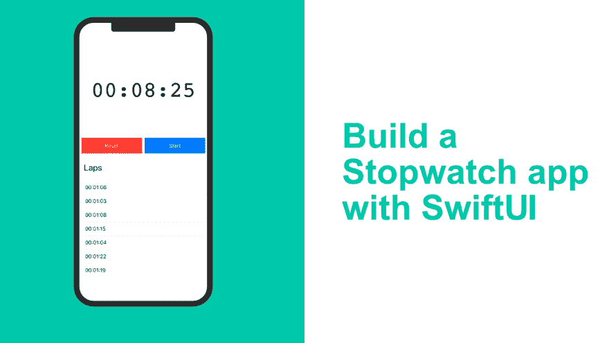
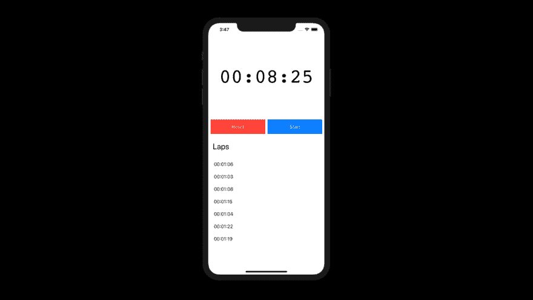
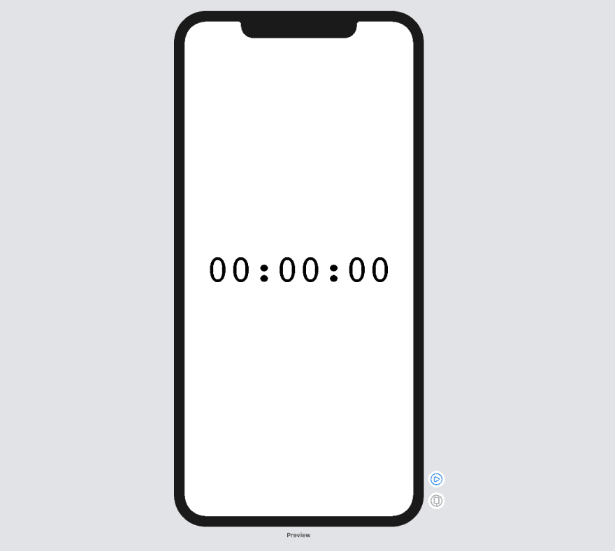
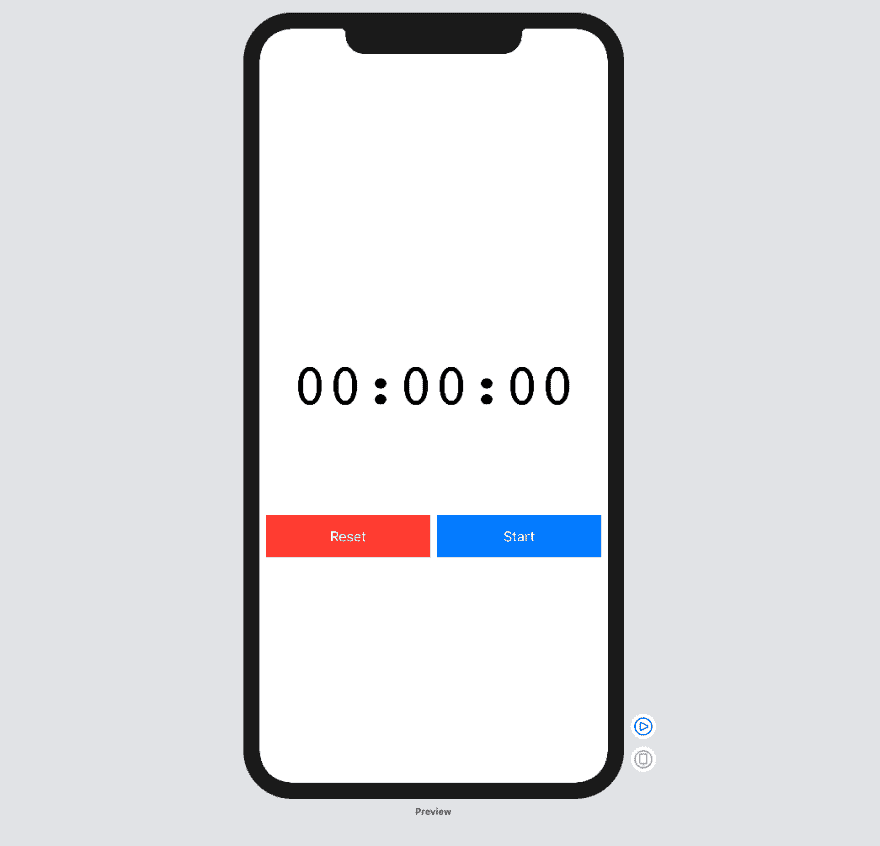
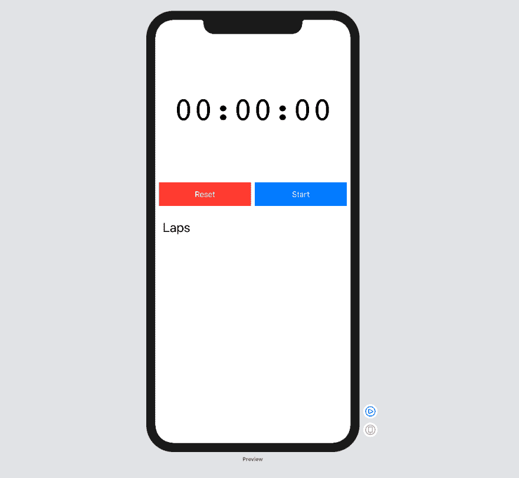

# 使用 SwiftUI 构建秒表应用程序

> 原文：<https://dev.to/darrenleak/build-a-stopwatch-app-with-swiftui-249a>

[](https://res.cloudinary.com/practicaldev/image/fetch/s--Oq8J5Ibh--/c_limit%2Cf_auto%2Cfl_progressive%2Cq_auto%2Cw_880/https://programmingwithswift.com/conteimg/2019/07/feature-19.png)

在这篇文章中，我将向你展示如何使用 SwiftUI 构建一个秒表应用程序。在这篇文章中，我将向你展示如何使用 SwiftUI 以及一些基本的布局和使用“ObjectBinding”来创建自定义视图。

我知道我们正在构建一个秒表应用程序，但是我不打算讲述实际的秒表代码逻辑，因为我觉得这超出了本教程的范围。本教程更多的是关于用 SwiftUI 构建应用程序 UI。

[](https://res.cloudinary.com/practicaldev/image/fetch/s--e-YGiXfr--/c_limit%2Cf_auto%2Cfl_progressive%2Cq_auto%2Cw_880/https://programmingwithswift.com/conteimg/2019/07/Stopwatch-1.png)

在上面的图片中，你可以看到当我们完成时，应用程序会是什么样子。这没什么特别的，但是很实用。

当应用程序完成时，您将能够启动秒表，记录圈数(这将只在内存中)，暂停秒表并重置它。

现在我们知道了它需要什么样的外观和功能，我们可以开始构建它了。

## 步骤 1:将秒表类添加到您的项目中

我只为本教程创建了这个类。我不会把它归类为生产就绪，因为它还没有经过适当的测试，代码也不太好。它仅用于演示目的。

你可以在这里找到秒表类。或者你可以在这里下载[的要点](https://gist.github.com/programmingwithswift/0303decba01bba1189e66d4943dda4a3/archive/6c20430caa45865d53b99eb5a1201dc4cccca98f.zip)。

## 第二步:添加定时器文本()

在你的主`ContentView`变量`body`里面我们需要添加一个`VStack`。您的代码应该如下所示:

```
struct ContentView : View {
    @ObjectBinding var stopWatch = StopWatch()

    var body: some View {
        VStack {
            // Code here
        }
    }
} 
```

那将保存我们所有的用户界面。现在我们已经有了我们的`VStack`,我们可以添加我们的`Text`视图来显示计时器文本。

使用`SwiftUI`,父视图不能在子/子视图上强制大小，所以我们将需要在我们添加的`Text`视图上完成大部分样式。将下面的代码添加到我们刚刚添加的`VStack`中。

```
Text(self.stopWatch.stopWatchTime)
    .font(.custom("courier", size: 70))
    .frame(width: UIScreen.main.bounds.size.width,
           height: 300,
           alignment: .center) 
```

在上面的代码中，我们创建了一个新的`Text`视图。我们将默认文本设置为`00:00:00`,稍后将使用适当的值进行更新。

之后，我们开始造型。我把字体改成了`courier`，这样效果更好，因为它是`monospace`字体，当我使用标准系统字体时，文本会抖动，因为它一直在变化。我们还设置大小为`70`，这样它就又大又漂亮。接下来我们要做的是更新框架。我们希望宽度是屏幕的全宽，但我们也希望它相当高，所以我们将高度设置为 300。从技术上来说，您可以不进行`.center`校准，因为这是默认设置。

您的应用程序现在应该如下所示:

[](https://res.cloudinary.com/practicaldev/image/fetch/s--T4x7yThu--/c_limit%2Cf_auto%2Cfl_progressive%2Cq_auto%2Cw_880/https://programmingwithswift.com/conteimg/2019/07/Screenshot-2019-07-28-at-16.09.27.png)

这不是我们想要的，但这是一个开始。

## 第三步:创建按钮视图

在我们继续布局之前，我们需要创建按钮。这将是一个新的自定义视图。按钮功能和文本将根据秒表的状态而变化。

例如，当计时器停止时，我们会有两个按钮，一个是重置计时器，另一个是启动计时器。如果计时器正忙于计时，这些按钮将变成一圈按钮和暂停按钮。

因为 app 超级小，我已经把逻辑放在按钮里了。如果应用程序更大，我会从按钮中剥离逻辑，并使用其他东西根据我传递给它的参数创建我需要的按钮。

### 按钮有什么要求？

每个按钮需要接受两个动作和两个字符串。他们还需要有一种颜色，他们需要知道计时器是否暂停。

### 代码

为此，创建一个名为`StopWatchButton`的新`struct`，并使其符合如下的`View`协议:

```
struct StopWatchButton : View {
    var body: some View {
        // Buttons coming soon
    }
} 
```

我们现在可以在`body`属性的正上方添加属性。

现在将您的结构更改为如下所示:

```
struct StopWatchButton : View {
    var actions: [() -> Void]
    var labels: [String]
    var color: Color
    var isPaused: Bool

    var body: some View {
        // Buttons coming soon
    }
} 
```

太好了，我们现在可以在`body`中添加按钮逻辑了。

我们需要添加的第一件事是`body`中的按钮宽度变量。这个值是随机的，但是它满足我们的需要。

您的`body`属性现在应该是这样的:

```
var body: some View {
    let buttonWidth = (UIScreen.main.bounds.size.width / 2) - 12
} 
```

这将产生一个错误，但不要担心，我们现在会解决这个问题。

我们现在将创建按钮视图。这并不太复杂。`SwiftUI`中的一个基本`Button`带两个参数，一个是`action`，另一个是`label`视图。在我们的`action`和`label`参数中，我们将检查计时器是否暂停，基于此，我们将知道调用什么函数以及我们需要显示什么`Text`视图。

更新您的`body`变量，如下所示:

```
var body: some View {
    let buttonWidth = (UIScreen.main.bounds.size.width / 2) - 12

    return Button(action: {
            if self.isPaused {
                self.actions[0]()
            } else {
                self.actions[1]()
            }
        }) {
            if isPaused {
                Text(self.labels[0])
                    .color(Color.white)
                    .frame(width: buttonWidth,
                           height: 50)
            } else {
                Text(self.labels[1])
                    .color(Color.white)
                    .frame(width: buttonWidth,
                           height: 50)
            }
        }
        .background(self.color)
    }
} 
```

在上面的代码中，你可以看到我们在做什么。在`action`部分(第一个闭包),我们检查`isPaused`属性。如果是`true`，那么我们使用我们的`actions`数组中的第一个动作，否则我们使用第二个动作。

对于`label`也是如此。如果`isPaused`为真，我们将使用标签数组中的第一个字符串，否则使用第二个字符串。

除此之外，每个`Text`视图都有相同的样式，我们可以为此创建我们自己的自定义文本视图，但这非常简单，所以我现在看不出有什么必要。如果我们要使用与其他地方相同的文本视图，我肯定会创建一个自定义的文本视图。

需要注意的一点是如何设置`Text`视图框架，而不是按钮框架。正如我前面提到的，`SwiftUI`要求我们在子视图上设置框架，因为父视图不能告诉子视图做什么。

我们要做的最后一件事是设置按钮的背景颜色。

`StopWatchButton`的最终代码应该是这样的:

```
struct StopWatchButton : View {
    var actions: [() -> Void]
    var labels: [String]
    var color: Color
    var isPaused: Bool

    var body: some View {
        let buttonWidth = (UIScreen.main.bounds.size.width / 2) - 12

        return Button(action: {
            if self.isPaused {
                self.actions[0]()
            } else {
                self.actions[1]()
            }
        }) {
            if isPaused {
                Text(self.labels[0])
                    .color(Color.white)
                    .frame(width: buttonWidth,
                           height: 50)
            } else {
                Text(self.labels[1])
                    .color(Color.white)
                    .frame(width: buttonWidth,
                           height: 50)
            }
        }
        .background(self.color)
    }
} 
```

## 第四步:添加按钮

好了，大部分复杂的东西现在都不碍事了，我们可以继续设计我们的 UI 了。

我们需要做的下一件事是添加新的`StopWatchButton`的两个实例。在此之前，我们需要创建一个`HStack`来包装我们的按钮。

更新您的`ContentView`结构，如下所示:

```
struct ContentView : View {
    @ObjectBinding var stopWatch = StopWatch()

    var body: some View {
        VStack {
            Text(self.stopWatch.stopWatchTime)
                .font(.custom("courier", size: 70))
                .frame(width: UIScreen.main.bounds.size.width,
                       height: 300,
                       alignment: .center)

            HStack{
                // Our buttons will go here
            }
        }
     }
 } 
```

如你所见。除了在我们的`Text`视图下面有一个`HStack`来显示当前的定时器字符串值之外，没有什么变化。

在这个`HStack`中，您需要添加以下代码:

```
StopWatchButton(actions: [self.stopWatch.reset, self.stopWatch.lap],
                labels: ["Reset", "Lap"],
                color: Color.red,
                isPaused: self.stopWatch.isPaused())

StopWatchButton(actions: [self.stopWatch.start, self.stopWatch.pause],
                labels: ["Start", "Pause"],
                color: Color.blue,
                isPaused: self.stopWatch.isPaused()) 
```

添加代码后，您的应用程序应该如下所示:

[](https://res.cloudinary.com/practicaldev/image/fetch/s--5s7IvpHN--/c_limit%2Cf_auto%2Cfl_progressive%2Cq_auto%2Cw_880/https://programmingwithswift.com/conteimg/2019/07/Screenshot-2019-07-28-at-16.50.21.png)

这可能有点令人困惑。在上面的代码中，我们创建了两个新的`StopWatchButton`实例。

如前所述，这些按钮有四个属性。第一个属性是我们希望根据`isPaused`状态调用的函数。我们创建的第一个按钮将是我们的`Reset/Lap`，第二个按钮将是我们的`Start/Pause`按钮。在图像中，您看不到`Lap`按钮和`Pause`按钮，但如果您运行应用程序并点击`Start`按钮，您将能够看到`Lap`和`Pause`按钮。请注意，如果您运行应用程序并点击`Lap`按钮，视觉上不会发生任何变化。代码将正常工作，但在下一步，我将向您展示如何让圈速显示在列表中。

## 第五步:显示圈数

下一部分非常简单。我们所拥有的只是一个包含了一个视图和一个视图的视图。

在我们在上一步中创建的`HStack`下面，添加以下代码:

```
VStack(alignment: .leading) {
    Text("Laps")
        .font(.title)
        .padding()

    List { 
        ForEach(self.stopWatch.laps.identified(by: \.uuid)) { (lapItem) in
            Text(lapItem.stringTime)
        }
    }
} 
```

现在你已经添加了，你的应用程序应该看起来像这样:

[](https://res.cloudinary.com/practicaldev/image/fetch/s--cRpTk8Jl--/c_limit%2Cf_auto%2Cfl_progressive%2Cq_auto%2Cw_880/https://programmingwithswift.com/conteimg/2019/07/Screenshot-2019-07-28-at-17.01.45.png)

请注意，这些屏幕截图是在 Xcode 中拍摄的，如果您运行该应用程序，您将会看到`List`的单元格。

那么这段代码中发生了什么？第一件不同的事情是`VStack`为`alignment`接受一个参数。我这样做的原因是，如果我们删除它，`Laps`文本视图将在屏幕上居中，我更喜欢它在左手边。

在`VStack`中，我们添加了一个`Text`视图。我们设置字体大小为`.title`大小，在我们的应用程序中它是一个章节标题。我们还为`Text`视图添加了填充。这给了它一个很好的空间，使它与上面的按钮分开。

最后一部分是添加`List`视图。`List`视图需要每个`cell`的唯一标识符。不幸的是，每个 lapItem 没有唯一的标识属性，所以我必须添加一个 uuid 属性，在`ForEach`中使用。然后我们可以进入`lapItem`。我们现在可以添加另一个`Text`视图，在该视图中我们可以显示已经存储的每一圈时间。为此，我们只需访问我们拥有的`lapTime`对象的`stringTime`属性，并将其传递给`Text`视图。

如果你现在构建并运行这个应用程序，你应该可以启动秒表，点击`Lap`按钮，看到圈速显示在底部`List`。你还应该能够点击`Pause`按钮，让秒表暂停，一旦暂停，你应该能够点击`Reset`按钮，重置秒表时间，并从`List`中删除所有圈速。

这是最终代码的样子:

```
import SwiftUI

struct StopWatchButton : View {
    var actions: [() -> Void]
    var labels: [String]
    var color: Color
    var isPaused: Bool

    var body: some View {
        let buttonWidth = (UIScreen.main.bounds.size.width / 2) - 12

        return Button(action: {
            if self.isPaused {
                self.actions[0]()
            } else {
                self.actions[1]()
            }
        }) {
            if isPaused {
                Text(self.labels[0])
                    .color(Color.white)
                    .frame(width: buttonWidth,
                           height: 50)
            } else {
                Text(self.labels[1])
                    .color(Color.white)
                    .frame(width: buttonWidth,
                           height: 50)
            }
        }
        .background(self.color)
    }
}

struct ContentView : View {
    @ObjectBinding var stopWatch = StopWatch()

    var body: some View {
        VStack {
            Text(self.stopWatch.stopWatchTime)
                .font(.custom("courier", size: 70))
                .frame(width: UIScreen.main.bounds.size.width,
                       height: 300,
                       alignment: .center)

            HStack{
                StopWatchButton(actions: [self.stopWatch.reset, self.stopWatch.lap],
                                labels: ["Reset", "Lap"],
                                color: Color.red,
                                isPaused: self.stopWatch.isPaused())

                StopWatchButton(actions: [self.stopWatch.start, self.stopWatch.pause],
                                labels: ["Start", "Pause"],
                                color: Color.blue,
                                isPaused: self.stopWatch.isPaused())
            }

            VStack(alignment: .leading) {
                Text("Laps")
                    .font(.title)
                    .padding()

                List {
                    ForEach(self.stopWatch.laps.identified(by: \.uuid)) { (lapItem) in
                        Text(lapItem.stringTime)
                    }
                }
            }
        }
    }
} 
```

如果你喜欢这篇文章，请分享它并[订阅](https://www.youtube.com/channel/UCfU7rF00JFkGC6xvURCeBag?sub_confirmation=1)我的 [youtube 频道](https://www.youtube.com/channel/UCfU7rF00JFkGC6xvURCeBag?sub_confirmation=1)。