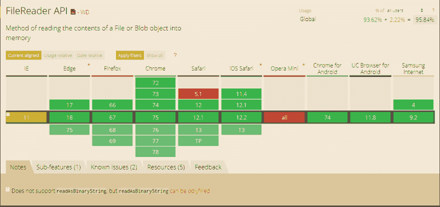

# 在浏览器中构建文本编辑器

> 原文：<https://dev.to/thisdotmedia/build-a-text-editor-in-the-browser-nh9>

在过去的几年里，现代浏览器已经能够用许多奇妙的新功能给我们带来惊喜，要跟上所有这些新功能是非常困难的。我个人并没有意识到所有主流浏览器现在都可以访问一个强大的 Web API 对象: [FileReader](https://developer.mozilla.org/en-US/docs/Web/API/FileReader) 。今天，我将与大家分享我对这一浏览器功能的体验。

FileReader 允许用户直接在浏览器中读取文件内容，而不需要将文件上传到服务器。引入这个特性是为了提供更好的用户体验，它不应该取代服务器端验证。

当我第一次发现这个特性时，我非常兴奋，但是在我开始使用它之前，我想不出任何具体的用户案例。从那时起，我能够在以下用户案例中使用它:

1.  上传前预览图像(缩略图)

2.  读取文件内容以向用户返回快速验证(例如:读取特定的字符串或正则表达式)

3.  为脱机浏览提供支持

4.  将文件转换为数据 URL

5.  提供客户端、文档创建

今天我们将构建一个文本编辑器，直接在浏览器中。整篇文章将详细介绍所有必要的代码，但是阅读本文需要理解 Javascript。

完成的工作将提供以下功能:

1.  上传文本文件的能力

2.  修改文本文件内容的能力

3.  能够下载修改后的文本文件

## 浏览器支持

如上所述，FileReader 的支持非常广泛，因为它现在在所有主流浏览器上都得到完全支持，部分支持可以追溯到 IE10，如[caniuse.com](https://caniuse.com/#feat=filereader)提供的表格所示。

[](https://res.cloudinary.com/practicaldev/image/fetch/s--F-ajGJY8--/c_limit%2Cf_auto%2Cfl_progressive%2Cq_auto%2Cw_880/https://thepracticaldev.s3.amazonaws.com/i/4ls70t87044ovrmgxxxy.png)

## FileReader 在行动

在下一章中，我们将构建我们的第一个 FileReader 实现。第一步包括使用对象构造函数语法初始化文件读取器对象。这将创建一个文件阅读器 Web API 的实例:

```
const reader = new FileReader(); 
```

既然我们的阅读器已经初始化，我们就能够附加到它的一些事件处理程序([事件处理程序列表](https://developer.mozilla.org/en-US/docs/Web/API/FileReader#Event_handlers))。我们将在稍后的文章中更详细地报道这一事件。

```
reader.onload = MyLoadFunction
reader.onerror = MyErrorFunction 
```

这也可以通过使用 addEventListener 语法([事件列表](https://developer.mozilla.org/en-US/docs/Web/API/FileReader#Events) ):
来实现

```
reader.addEventListener("load", myLoadFunction);
reader.addEventListener("error", myErrorFunction); 
```

现在是时候使用 API 提供的 **readAsText** 方法了([方法列表](https://developer.mozilla.org/en-US/docs/Web/API/FileReader#Methods))。此方法的目的是读取所提供文件的内容。在整个过程中，FileReader API 将触发事件，这些事件将触发相关的回调(myLoadFunction、myErrorFunction)。读取器方法接受一个参数，该参数应该是文件或 Blob 对象。

```
reader.readAsText(_file); 
```

最后，我们需要利用[文件](https://developer.mozilla.org/en-US/docs/Web/API/File/File) API 来声明我们的**_ 文件**变量。并不总是需要用 Javascript 从头开始创建文件，因为文件阅读器可以从多个来源访问文件(文件构造器、文件类型输入、拖放、画布等)..)..

```
const _file = new File(
  ["My newly created text file"], //fileContent
  "foo.txt",                      //fileName
  { type: "text/plain" }          //fileType
); 
```

如果成功，上面的代码将触发我们的 **MyLoadFunction** 事件回调。此方法可以访问读取器结果和状态作为其参数的一部分。从 readAsText 方法中成功的回调将包括以下属性:

```
{
  ...,
  readyState: 2, // 0 = EMPTY, 1 = LOADING, 2 = DONE
  Result: "My text file content"
} 
```

下表将显示所有不同事件的相关状态和值。生成下表所需的代码可在此代码笔上访问:[https://codepen.io/zelig880/pen/rEVEpK](https://codepen.io/zelig880/pen/rEVEpK)

| FileReader 事件 |  |  |  |
| 方案 | 事件名称 | 状态 | 结果 |
| 简单上传 | 初始化时(new FileReader()) | 0(空) | 空的 |
|  | onloadstart | 1(装载) | 空的 |
|  | onprogress | 1(装载) | 我新创建的文本文件 |
|  | 装载 | 2(完成) | 我新创建的文本文件 |
|  | onloadend | 2(完成) | 我新创建的文本文件 |
| 流产 | 初始化时(new FileReader()) | 0(空) | 空的 |
|  | onloadstart | 1(装载) | 空的 |
|  | 奥纳博特 | 2(完成) | 空的 |
|  | onloadend | 2(完成) | 空的 |

我们的文件阅读器的第一个实现已经完成，代码可以在下面的 codepen 上访问:[https://codepen.io/zelig880/pen/EBYwer](https://codepen.io/zelig880/pen/EBYwer)

## 浏览器文件编辑器

在这一章中，我们将扩展到目前为止我们所写的，并把它变成一个网页浏览器文本文件编辑器。

为了实现我们的目标，我们必须利用 API 提供的不同方法和特性，对现有代码进行以下修改。

1.  将 FileReader 输出更改为数据 URL 类型

2.  使用数据 URL 提供下载功能

3.  向客户端提供输入以更新一些文本

4.  使用 FileReader 读取使用 file 类型的输入上传的文件

5.  用上传的文件内容动态更新文本字段

### 将 FileReader 输出更改为数据 URL 类型

我们的第一步要求我们改变读取文件的方法。 **readAsText** 将被替换为 **readAsDataUrl。**这个方法将为我们提供一个[数据 URL](https://developer.mozilla.org/en-US/docs/Web/HTTP/Basics_of_HTTP/Data_URIs) (一个用 base64 表示我们文件的 URL)。

```
 reader.readAsDataURL(_file); 
```

### 使用数据 URL 提供下载功能

数据 URL 本身并不十分有用。因此，在这一部分，我们将提供一个非常简单的功能，允许下载新创建的文件。

为了实现我们的下载，我们将使用一个锚元素。该元素将我们的数据 URL 动态设置为它的 **href** 和属性 **download** 。此属性指定当用户单击链接而不是导航到文件时，将下载目标文件。

```
<a href="#" id="fileDownload" download>Newly Generated File</a> 
```

为了动态设置我们的 href，我们将通过声明一个回调函数来利用由 FileReader 触发的 onload 事件:

```
reader.onload = (e) => {
  const fileDownload = document.getElementById("fileDownload");
  fileDownload.href = e.target.result;
} 
```

我们的文本编辑器开始成形了。此时，我们能够下载一个“静态”文本文件。

### 向客户端提供输入以更新一些文本

现在是时候为我们的用户提供一些控制，让事情变得更加动态。为了执行这项任务，我们将创建一个简单的文本输入，用于动态修改我们文件的内容。

Javascript 代码将如下所示:

```
//create a file with dynamic content
function createFileObj(content, name){
  const file = new File(
    [content],
    `${name}.txt`,
    { type: "text/plain" }
  );

  return file;
}
//fetch the value from the input
const textInput = document.getElementById("textInput");
const inputValue = textInput.value;

//The _file variable will be used when calling our FileReader 
const _file = createFileObj(inputValue, "My Text file"); 
```

上面的代码让我们的文本编辑器变得栩栩如生。我们现在能够修改文本或我们下载的文件。

### 使用文件阅读器读取使用文件类型输入上传的文件

最后，为了扩展我们对 FileReader API 的了解，我们将使用另一个特性来增强我们的编辑器。我们将让用户能够从他们的计算机上传一个文本文件，并用上面写的代码修改它。

为了实现这一点，我们将创建一个 file 类型的**输入，并监听由该元素触发的 change 事件来初始化我们的 FileReader(这是 file reader api 最常见的用法)。** 

```
//listen to the change event triggered by the input element
const fileInput =   document.getElementById("fileUploadInput");
fileInput.addEventListener("change", handleUpload);

function handleUpload (event){

  //fetch the first file (the element could provide multiple files)
  var file = event.target.files[0];
  var reader = new FileReader();

  //use the textInput variable previously declared to update the text input
  reader.onload = (e) => { textInput.value = e.target.result };   

  //trigger the fileReader
  reader.readAsText(file);
} 
```

这个代码笔包括我们的全功能代码:[https://codepen.io/zelig880/pen/XLraXj](https://codepen.io/zelig880/pen/XLraXj)

## 结论

令人难以置信的是，如今直接在浏览器中使用 javascript 就能取得如此大的成就。

在不到 50 行代码中，我们已经能够编写一个全功能的文本编辑器，它可能还没有准备好投入生产(它有一些错误)，但是想到我们可以用这么少的代码实现这么多，我就兴奋不已。

## TLDR:

我们的文本编辑器的完整代码可以在下面的代码栏中找到:[https://codepen.io/zelig880/pen/XLraXj](https://codepen.io/zelig880/pen/XLraXj)

这篇文章由西蒙·科莫撰写，他是这个网站的导师和高级软件工程师。

你可以在推特上关注他们，电话是 [@zelig880](https://dev.to/zelig880) 。

需要 JavaScript 咨询、指导或培训帮助吗？在 [This Dot Labs](//thisdot.co) 查看我们的服务列表。