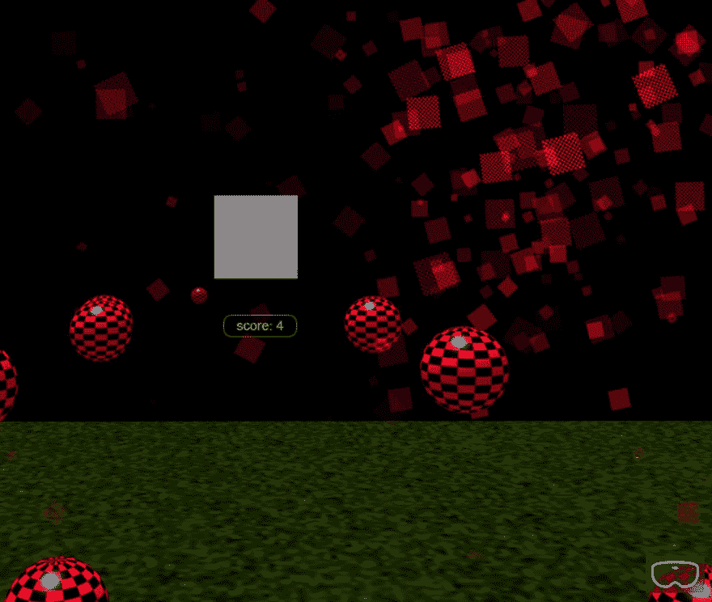

# 使用 BabylonJS 用 JavaScript 构建一个 Web VR 游戏

> 原文：<https://dev.to/azure/build-a-web-vr-game-with-javascript-using-the-babylonjs-framework-aek>

## 在本教程中，我将一步一步地向你展示如何用 BabylonJS 构建一个网络虚拟现实游戏

[](https://res.cloudinary.com/practicaldev/image/fetch/s--Id3h1vyj--/c_limit%2Cf_auto%2Cfl_progressive%2Cq_auto%2Cw_880/https://imgur.com/bvJslJf.jpg)

## 先决条件

- [nodejs](https://nodejs.org/en/download/)
- [vs 代码](https://code.visualstudio.com/download?WT.mc_id=devto-blog-casiljan)

## 什么是 BabylonJS 和 CannonJS

[BabylonJS](https://www.babylonjs.com/) 是一个完整的 JavaScript 框架，用于使用 HTML5、WebGL、WebVR 和 Web Audio 构建 3D 游戏和体验。

[CannonJS](http://www.cannonjs.org/) 是一个物理引擎，用 JavaScript 编写。你可能会问什么是物理引擎？嗯，它是“一种软件，提供某些物理系统的近似模拟，如刚体动力学(包括碰撞检测)、软体动力学和流体动力学，用于计算机图形、视频游戏和电影领域。”

## 首先，我们需要使用 babylonjs、webpack 和 typescript 获得基本的启动项目

### 运行 Starter 项目的步骤和 [Git 回购链接](https://github.com/cassieview/babylonjs-webpack-typescript-starter-project)

1.  克隆回购`git clone https://github.com/cassieview/babylonjs-webpack-typescript-starter-project.git` `cd babylonjs-webpack-typescript-starter-project`
2.  安装包`npm install`
3.  构建项目`npm run build`
4.  运行脚本来测试项目`npm start`
5.  在 VS 代码中打开`code .`

## 让我们来谈谈启动项目

### 简单的 index.html 模板。

```
<!DOCTYPE html>
<html>

    <head>
        <style>
            html,
            body {
                overflow: hidden;
                width: 100%;
                height: 100%;
                margin: 0;
                padding: 0;
                text-align: center;
            }

            #renderCanvas {
                width: 100%;
                height: 100%;
                touch-action: none;
            }
        </style>
    </head>

    <body>
        <canvas id="renderCanvas"></canvas>
        <script src="dist/index.js"></script>
    </body>

</html> 
```

Enter fullscreen mode Exit fullscreen mode

### index . ts 类型脚本文件

index.ts 文件是创建主场景的 typescript 文件。在 dist 文件夹中，typescript 被转换为 javascript。

游戏的脚本源可以在 dist 文件夹中找到。Webpack 是一个开源的 JavaScript 模块捆绑器，它生成代表这些模块的静态资产。这是从 dist 文件夹中加载的内容。WebPack 将脚本编译成一个源，用于提供游戏脚本。

首先，我们从 BabylonJS 导入创建游戏场景所需的包。创建 canvas 变量并使用普通 javascript 从 html body 部分获取 renderCanvas canvas 标记。然后我们创建引擎并传入 BabylonJS 引擎。

```
 import { Engine, Scene, HemisphericLight, Vector3, MeshBuilder, Mesh } from "babylonjs";
var canvas: any = document.getElementById("renderCanvas");
var engine: Engine = new Engine(canvas, true); 
```

Enter fullscreen mode Exit fullscreen mode

接下来我们有创建场景的功能。这里我们定义场景，传递引擎。我们创造了一台照相机。相机是游戏玩家的视点。我们用的是。

接下来，我们添加一个简单的球体网格到我们的场景中，并设置基本属性。vr 助手将 vr 按钮添加到屏幕的右下角，以便用户可以在 vr 中进入游戏。这确实会在浏览器中查看游戏和测试时产生问题。对于测试，我建议注释掉那行代码。然后当你想用你的 vr 头显测试的时候，取消注释进入 vr 游戏。

提示:通过运行`npm run build`然后在浏览器`C:/Code/babylonjs-webpack-typescript-starter-project/index.html`中打开 index.html 文件的路径，你可以很容易地测试你所做的更改。这是一个静态网站，所以你不必真的用`npm start`来运行它。只需运行构建并刷新 index.html 的浏览器路径。

```
function createScene(): Scene {
    // Create scene
    var scene: Scene = new Scene(engine);

    // Create camera
    var camera = new BABYLON.UniversalCamera("UniversalCamera", new BABYLON.Vector3(0, 0, -10), scene);

    // Create sphere
    var sphere1: Mesh = MeshBuilder.CreateSphere("sphere", { diameter: 1 }, scene);
    sphere1.position.y = 5;
    sphere1.material = new BABYLON.StandardMaterial("sphere material", scene)

    // Enable VR
    var vrHelper = scene.createDefaultVRExperience();
    vrHelper.enableInteractions();

    return scene;
}

var scene: Scene = createScene();

engine.runRenderLoop(() => {
    scene.render();
}); 
```

Enter fullscreen mode Exit fullscreen mode

## 开始构建游戏

现在您应该对 starter 项目中的内容以及 babylonjs 为我们做了什么有了基本的了解。接下来我们要添加重力，所以我们需要上面提到的 Cannonjs 库。

`import { Engine, Scene, ArcRotateCamera, HemisphericLight, Vector3, MeshBuilder, Mesh, CannonJSPlugin } from "babylonjs";`

将此代码块复制并粘贴到场景变量下。在这里，我们添加地面网格，并给它一个`physicsImpostor`,这样球体就会下落并落在地面上。

```
var gravityVector = new BABYLON.Vector3(0, -1, 0);
    scene.enablePhysics(gravityVector, new CannonJSPlugin);

    var light = new HemisphericLight("light",Vector3.Zero(),scene);

    // Parameters : name, position, scene
    var camera = new BABYLON.UniversalCamera("UniversalCamera", new BABYLON.Vector3(0, 0, -10), scene);
    camera.checkCollisions = true;
    camera.applyGravity = true;
    // Targets the camera to a particular position. In this case the scene origin
    camera.setTarget(BABYLON.Vector3.Zero());

    // Attach the camera to the canvas
    camera.attachControl(canvas, true);

    // Create Ground
    var ground = BABYLON.Mesh.CreatePlane("ground", 25.0, scene);
    ground.position = new BABYLON.Vector3(0, -10, 0);
    ground.rotation = new BABYLON.Vector3(Math.PI / 2, 0, 0);

    ground.material = new BABYLON.StandardMaterial("groundMat", scene);
    ground.material.backFaceCulling = false;
    ground.receiveShadows = true;
    ground.physicsImpostor = new BABYLON.PhysicsImpostor(ground, BABYLON.PhysicsImpostor.BoxImpostor, { mass: 0, friction: 1, restitution: 0 }, scene); 
```

Enter fullscreen mode Exit fullscreen mode

为球体添加物理、阴影和光线:

```
import { Engine, Scene, ArcRotateCamera, HemisphericLight, Vector3, MeshBuilder, Mesh, CannonJSPlugin, ShadowGenerator, DirectionalLight } from "babylonjs";

// Create sphere
    var sphereLight = new DirectionalLight("dir02", new Vector3(0.2, -1, 0), scene);
    sphereLight.position = new Vector3(0, 80, 0);

    var sphere1: Mesh = MeshBuilder.CreateSphere("sphere", { diameter: 1 }, scene);
    sphere1.position.y = 5;
    sphere1.material = new BABYLON.StandardMaterial("sphere material", scene)
    sphere1.physicsImpostor = new BABYLON.PhysicsImpostor(sphere1, BABYLON.PhysicsImpostor.SphereImpostor, { mass: 1 }, scene);
    var shadowGenerator = new ShadowGenerator(2048, sphereLight);
    shadowGenerator.addShadowCaster(sphere1); 
```

Enter fullscreen mode Exit fullscreen mode

现在我们有一个球体落在我们创建的地面面板上。多么令人兴奋。

## 项目架构

我们还有很多东西要添加到这个游戏中，虽然我们可以在一个巨大的函数中添加所有的东西。由于各种原因，这不是最佳实践。让我们添加一个`sphere.ts`文件并将我们的球体逻辑移动到其中。

```
 import { Scene, Vector3, MeshBuilder, Mesh, ShadowGenerator, DirectionalLight } from "babylonjs";

export function addSphere(scene: Scene) {

    // Create sphere
    var sphereLight = new DirectionalLight("dir02", new Vector3(0.2, -1, 0), scene);
    sphereLight.position = new Vector3(0, 80, 0);

    var sphere: Mesh = MeshBuilder.CreateSphere("sphere", { diameter: 1 }, scene);
    sphere.position.y = 5;
    sphere.material = new BABYLON.StandardMaterial("sphere material", scene)
    sphere.physicsImpostor = new BABYLON.PhysicsImpostor(sphere, BABYLON.PhysicsImpostor.SphereImpostor, { mass: 1 }, scene);
    var shadowGenerator = new ShadowGenerator(2048, sphereLight);
    shadowGenerator.addShadowCaster(sphere);
} 
```

Enter fullscreen mode Exit fullscreen mode

然后返回到`index.ts`，导入我们创建的文件，并在`addSphere`逻辑原来所在的地方调用`addSphere`函数。

```
 line 2: import { addSphere } from "./sphere";
line 35:  addSphere(scene); 
```

Enter fullscreen mode Exit fullscreen mode

现在是一个很好的时机来`npm run build`和刷新你的浏览器，看看你成功地完成了逻辑移动。

## 添加开始按钮

好的，就像任何好的游戏一样，你需要一个开始按钮，你知道，开始游戏。

导入 gui 库，以便我们可以使用 3d 按钮和面板。

```
import * as GUI from  "babylonjs-gui"; 
```

Enter fullscreen mode Exit fullscreen mode

在`createScene`功能下增加`startGameButton`功能。将`addSphere`函数调用移动到`button.onPointerUpObservable`事件中。此事件用于在单击时触发事件。

```
 var startGameButton = function (panel) {
    var button = new GUI.Button3D();
    panel.addControl(button);
    button.onPointerUpObservable.add(function () {
        addSphere(scene);
    });
    var text1 = new GUI.TextBlock();
    text1.text = "Start Game";
    text1.color = "white";
    text1.fontSize = 24;
    button.content = text1;
} 
```

Enter fullscreen mode Exit fullscreen mode

更新`createScene`函数，将按钮添加到场景中。这将转到第 35 行，之前的位置是`addSphere`。

```
 // Create the 3D UI manager
    var manager = new GUI.GUI3DManager(scene);
    // Create a horizontal stack panel
    var panel = new GUI.StackPanel3D();
    panel.margin = 0.02;
    manager.addControl(panel);
    startGameButton(panel); 
```

Enter fullscreen mode Exit fullscreen mode

这将是测试你所做的改变的好时机。当你点击这个按钮时，球体应该会从天空掉到地上。

## 点击使球体消失

为此，我们将进入`sphere.ts`文件并将`ActionManager`添加到`sphere`中，这样当我们点击球体时，它就会消失。在第 17 行添加以下逻辑开始。此外，您需要更新文件顶部的导入，以包含`ActionManager`和`ExecuteCodeAction`。

```
import { Scene, Vector3, MeshBuilder, Mesh, ShadowGenerator, DirectionalLight, ActionManager, ExecuteCodeAction } from "babylonjs"; 
```

Enter fullscreen mode Exit fullscreen mode

```
 sphere.actionManager = new ActionManager(scene);

    //add click event to sphere
    sphere.actionManager.registerAction(new 
    ExecuteCodeAction(ActionManager.OnPickUpTrigger, function () {

        scene.removeMesh(sphere);

    })); 
```

Enter fullscreen mode Exit fullscreen mode

## 添加循环点击开始时添加多个球体

在`addSphere`函数上方的`sphere.ts`中添加以下代码。这将增加 10 个球，当我们点击按钮，而不是一个。将`addSphere`函数更新为`var addSphere = function (scene: Scene) {`，因为我们不再直接从`index.ts`文件中调用它。

```
export function addSpheres(scene: Scene) {
    for (let index = 0; index < 10; index++) {
        addSphere(scene);
    }
} 
```

Enter fullscreen mode Exit fullscreen mode

更新`index.ts`文件以导入`addSpheres`函数并调用它而不是`addSphere`。

```
line 3: import { addSpheres } from "./sphere";
line 54: addSpheres(scene); 
```

Enter fullscreen mode Exit fullscreen mode

然后更新`sphere.ts`文件中的球体位置，这样就不会在同一个地方创建 10 个球体。删除`sphere.position.y = 5;`增加

```
 line 17: sphere.position = new Vector3(Math.random() * 20 - 10, 10, Math.random() * 10 - 5); 
```

Enter fullscreen mode Exit fullscreen mode

## 给球体添加粒子动画来模拟爆炸

球体消失很酷，但是让我们通过添加一个  来让它更有戏剧性，它会以一种卡通的爆炸式的方式喷射粒子。

添加一个名为`particles.ts`的新文件，并粘贴以下代码:

```
import { AbstractMesh, Texture, ParticleSystem, Scene, Vector3, Color4, Animation } from "babylonjs";
import { AdvancedDynamicTexture } from "babylonjs-gui";

let advancedTexture: AdvancedDynamicTexture;

export function addParticlesToMesh(mesh: AbstractMesh, scene: Scene): ParticleSystem {
    // Fountain object
    //var fountain = Mesh.CreateBox("foutain", 1.0, scene);

    var particleSystem = new ParticleSystem("particles", 2000, scene);

    //Texture of each particle
    particleSystem.particleTexture = new Texture("textures/flare.png", scene);

    // Where the particles come from
    particleSystem.emitter = mesh; // the starting object, the emitter
    particleSystem.minEmitBox = new Vector3(-1, 0, 0); // Starting all from
    particleSystem.maxEmitBox = new Vector3(1, 0, 0); // To...

    // Colors of all particles
    particleSystem.color1 = new Color4(0.7, 0.8, 1.0, 1.0);
    particleSystem.color2 = new Color4(0.2, 0.5, 1.0, 1.0);
    particleSystem.colorDead = new Color4(0, 0, 0.2, 0.0);

    // Size of each particle (random between...
    particleSystem.minSize = 0.1;
    particleSystem.maxSize = 0.5;

    // Life time of each particle (random between...
    particleSystem.minLifeTime = 0.3;
    particleSystem.maxLifeTime = 1.5;

    // Emission rate
    particleSystem.emitRate = 1500;

    // Blend mode : BLENDMODE_ONEONE, or BLENDMODE_STANDARD
    particleSystem.blendMode = ParticleSystem.BLENDMODE_ONEONE;

    // Set the gravity of all particles
    particleSystem.gravity = new Vector3(0, -9.81, 0);

    // Direction of each particle after it has been emitted
    particleSystem.direction1 = new Vector3(-7, 8, 3);
    particleSystem.direction2 = new Vector3(7, 8, -3);

    // Angular speed, in radians
    particleSystem.minAngularSpeed = 0;
    particleSystem.maxAngularSpeed = Math.PI;

    // Speed
    particleSystem.minEmitPower = 1;
    particleSystem.maxEmitPower = 3;
    particleSystem.updateSpeed = 0.005;

    // Start the particle system
    particleSystem.start();

    // Fountain's animation
    var keys = [];
    var animation = new Animation("animation", "rotation.x", 30, Animation.ANIMATIONTYPE_FLOAT,
        Animation.ANIMATIONLOOPMODE_CYCLE);
    // At the animation key 0, the value of scaling is "1"
    keys.push({
        frame: 0,
        value: 0
    });

    // At the animation key 50, the value of scaling is "0.2"
    keys.push({
        frame: 50,
        value: Math.PI
    });

    // At the animation key 100, the value of scaling is "1"
    keys.push({
        frame: 100,
        value: 0
    });

    // Launch animation
    animation.setKeys(keys);
    mesh.animations.push(animation);
    scene.beginAnimation(mesh, 0, 100, true);

    return particleSystem;
}

export function removeParticlesFromMesh(particleSystem: ParticleSystem): any {
    particleSystem.stop();
} 
```

Enter fullscreen mode Exit fullscreen mode

将`particles.ts`脚本导入到`spheres.ts`脚本中。

```
import { addParticlesToMesh, removeParticlesFromMesh } from "./particles"; 
```

Enter fullscreen mode Exit fullscreen mode

更新单击事件时的球体，并在中添加睡眠功能。当它被点击时，这将添加粒子到球体，等待 250 毫秒，然后停止添加粒子。如果你不停止粒子，在球体从场景中移除很久以后，到处都会出现粒子。

```
 sphere.actionManager.registerAction(new 
        ExecuteCodeAction(ActionManager.OnPickUpTrigger, function () {
        var particleSystem = addParticlesToMesh(sphere, scene);
        scene.removeMesh(sphere);
        sleep(250).then(() => {
            removeParticlesFromMesh(particleSystem);
        })

    }));

    const sleep = (milliseconds) => {
        return new Promise(resolve => setTimeout(resolve, milliseconds))
    } 
```

Enter fullscreen mode Exit fullscreen mode

## 添加 score.ts 因为每个游戏都需要一种方式来保持分数

创建`score.ts`脚本并粘贴到下面的代码中。

```
import { AdvancedDynamicTexture, Rectangle, Control, TextBlock } from 'babylonjs-gui';

let advancedTexture: AdvancedDynamicTexture;
let scoreText: TextBlock = new TextBlock();
let score = 0;
function init(): void {
    if (!advancedTexture) {
        advancedTexture = AdvancedDynamicTexture.CreateFullscreenUI("ui1");
    }
}

export function addLabelToScene(): void {

    if (!advancedTexture) {
        init();
    }
    let label = new Rectangle("score");
    label.background = "black";
    label.height = "30px";
    label.alpha = 0.5;
    label.width = "100px";
    label.cornerRadius = 20;
    label.thickness = 1;
    label.linkOffsetY = 30;
    label.top = "10%";
    label.zIndex = 5;
    label.verticalAlignment = Control.HORIZONTAL_ALIGNMENT_CENTER;
    advancedTexture.addControl(label);

    scoreText.text = "score: 0"
    scoreText.color = "white";
    label.addControl(scoreText);
}
export function incrementScore(): void{
    score++;
    scoreText.text = "score: " + score.toString();

}

export function updateScore(newScore: number): void{
    score = newScore;
    scoreText.text = "score: " + score.toString();

} 
```

Enter fullscreen mode Exit fullscreen mode

然后在`index.ts`脚本中导入脚本。

```
import { addLabelToScene, updateScore } from "./score"; 
```

Enter fullscreen mode Exit fullscreen mode

在`index.ts`文件中，我们想在添加按钮`startGameButton(panel);`后添加函数调用`addLabelToScene(panel)`，并且我们想在点击`startGameButton`时重置分数。

```
var startGameButton = function (panel) {
    var button = new GUI.Button3D();
    panel.addControl(button);
    button.onPointerUpObservable.add(function () {
        //reset score
        updateScore(0);
        addSpheres(scene);
    });
    var text1 = new GUI.TextBlock();
    text1.text = "Start Game";
    text1.color = "white";
    text1.fontSize = 24;
    button.content = text1;
} 
```

Enter fullscreen mode Exit fullscreen mode

在`sphere.ts`中，我们需要从`score.ts`脚本中提取`import { incrementScore } from "./score";`，然后在`removeParticlesFromMesh(particleSystem);`后添加`incrementScore();`，以增加点击球体时的分数。

## 将`PhysicsImpostor`从地面网格中移除，这样球会从地面落下，而不是落在地面上。

我们不希望人们能够在地面上投篮，所以我们需要从地面网格中删除`PhysicsImpostor`。

```
ground.physicsImpostor = new BABYLON.PhysicsImpostor(ground, BABYLON.PhysicsImpostor.BoxImpostor, { mass: 0, friction: 0, restitution: 0 }, scene); 
```

Enter fullscreen mode Exit fullscreen mode

## 最后我们将添加一些 T2 材料到我们的球体中

将巴比伦素材导入到`sphere.ts`脚本中。

```
import {StandardMaterial, Texture, Color3} from "babylonjs-materials"; 
```

Enter fullscreen mode Exit fullscreen mode

然后使用下面的代码
将材质添加到球体网格中

```
 // Material
    var materialAmiga = new StandardMaterial("amiga", scene);
    materialAmiga.diffuseTexture = new Texture("textures/amiga.jpg", scene);
    materialAmiga.emissiveColor = new Color3(0.5, 0.5, 0.5);
    sphere.material = materialAmiga; 
```

Enter fullscreen mode Exit fullscreen mode

好吧，让我们看看它是否有效！

## 你可以添加更多更酷的东西

*   纹理
*   背景
*   自定义网格
*   音效
*   天空才是极限！

## 将站点部署到 azure 存储作为静态站点，这样您的所有朋友也可以玩了

[查看如何在 Azure 上廉价托管该网站的文档](https://docs.microsoft.com/en-us/azure/storage/blobs/storage-blob-static-website)

[项目结束的全额 git 回购](https://github.com/cassieview/WebVR-ExploadingSpheres-Babylonjs)

向 [Babylonjs](https://babylonjs.com) 上出色的文档和[游乐场](https://doc.babylonjs.com/examples/)以及出色的开发人员致敬，他们辛勤工作，创建了一个可爱的库，使我们能够开发游戏！

快乐游戏建造！