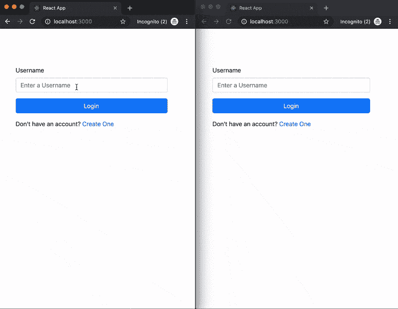

# 用 React & React bootstrap 构建一个匿名聊天应用

> 原文：<https://dev.to/kingidee/build-an-anonymous-chat-app-with-react-react-bootstrap-4h1c>

这篇文章最初发表在 [CometChat 的教程页面](https://www.cometchat.com/tutorials/build-an-anonymous-chat-app-with-react-react-bootstrap/)。

为了有效地阅读本文，您应该具备以下条件:

*   React 的先验知识。您可以使用这个[资源](https://reactjs.org/tutorial/tutorial.html)来加快速度。
*   Node.js 和 NPM 安装在你的机器上。
*   文本编辑器或 IDE。建议使用 VSCode。

## 简介

允许用户交流正成为许多应用程序的基本功能。根据我的经验，聊天拉近了你和客户之间的距离，可以带来更多的转化，提高参与度；最终，您的企业会取得更大的成功。然而，实现聊天可能很耗时。

在本教程中，我很高兴向您展示如何利用 React、React Bootstrap 和 CometChat，用最少的代码构建美观的群聊。

以下是您将构建的预览:

[](https://res.cloudinary.com/practicaldev/image/fetch/s--_ESt4h2E--/c_limit%2Cf_auto%2Cfl_progressive%2Cq_auto%2Cw_880/https://ucarecdn.com/70f941bc-dbf6-4ae5-974f-c846ef9bafa4/)

你可以选择直接进入[代码](https://github.com/cometchat-pro-tutorials/react-anonymous-group-chat)或者浏览我们的分步指南。

## 搭建一个新的 React 项目

对于本文，为了快速搭建一个新的 React 应用程序，您将使用一个非常流行的工具——create-React-app CLI 工具。打开一个终端，进入你通常保存项目的目录，运行这个命令:

```
npx create-react-app react-anonymous-chat 
```

运行该命令后，CLI 将开始安装 React 项目的默认依赖项。根据您的网速，这可能需要几分钟才能完成。设置项目后，在首选的文本编辑器或 IDE 中打开新项目。

## 安装依赖项

既然已经搭建好了应用程序，下一步就是安装聊天应用程序所需的依赖项。对于本文，您需要以下内容:

`@cometchat-pro/chat`:这个模块将使我们能够连接到 CometChat 并开始实时发送和接收消息
`react-bootstrap`:这是一个建立在 react 和 core Bootstrap 之上的 UI 库。在本文
`react-router-dom`中，您将使用它来设计整个应用程序:您将使用它进行客户端路由
`uuid`:该模块将用于生成唯一标识符

要安装上述模块，请运行以下命令:

```
# move into your project directory
cd react-anonymous-chat

# install dependencies using npm
npm install @cometchat-pro/chat react-bootstrap react-router-dom uuid 
```

## 设置

要在新创建的 React 项目中使用 CometChat Pro SDK，您需要一个 CometChat Pro 帐户。如果您没有帐户，可以在这里快速创建一个。

创建帐户后，转到您的仪表板，创建一个名为 react-anonymous-chat 的新应用程序。创建新应用程序后，您会发现应用程序 ID 贴在您的应用程序名称旁边。如果你打开你的应用程序，进入 API 密钥部分，你会看到一个 **fullAccess** 范围的密钥。把它和应用 ID 一起复制出来。我们很快就需要这些。

## 获取 CometChat API

接下来，在项目的根目录下创建一个`.env`文件来存储您的应用凭证。注意不要将这个文件提交给版本控制！这对于在发布应用程序时保护您的秘密非常重要。您可以通过运行以下命令轻松创建该文件:

```
touch .env 
```

打开文件并粘贴以下代码片段:

```
REACT_APP_COMETCHAT_APIKEY=YOUR_API_KEY_GOES_HERE
REACT_APP_COMETCHAT_APPID=YOUR_APP_ID_GOES_HERE 
```

将占位符替换为您仪表盘中的应用 ID 和 API 密钥。

既然您的密钥现在已经准备好了，您可以初始化 Create React App 生成的`index.js`文件中的`CometChat`。打开您的`index.js`文件，并用下面的代码片段替换它:

```
import React from 'react';
import ReactDOM from 'react-dom';
import App from './App';
import { CometChat } from '@cometchat-pro/chat';

CometChat.init(process.env.REACT_APP_COMETCHAT_APPID)
  .then(() => {
    console.log('Initialised CometChat');
  })
  .catch(() => {
    console.log('Failed to Initialise CometChat');
  });

ReactDOM.render(, document.getElementById('root')); 
```

在继续之前，您需要像这样在 public/index.htm 中导入引导:

```
<link
  rel="stylesheet"
  href="https://stackpath.bootstrapcdn.com/bootstrap/4.3.1/css/bootstrap.min.css"
  integrity="sha384-ggOyR0iXCbMQv3Xipma34MD+dH/1fQ784/j6cY/iJTQUOhcWr7x9JvoRxT2MZw1T"
  crossorigin="anonymous"
/> 
```

## 构建您的组件

您的应用程序将有三个组件，注册，主页和聊天组件。注册组件是允许用户创建新帐户的页面。在`src`目录下创建一个名为`components`的文件夹。这是您将添加组件的地方。

## 注册组件

在这个组件中，您将构建一个表单来帮助在应用程序上创建新用户。用户将拥有一个`UID`、一个电子邮件地址和一个名字。`UID`值必须是唯一的。

创建一个名为`Signup.js`的新文件，在文件中添加这些导入:

```
import React from 'react';
import Button from 'react-bootstrap/Button'
import Row from 'react-bootstrap/Row'
import Col from 'react-bootstrap/Col'
import Form from 'react-bootstrap/Form'
import Alert from 'react-bootstrap/Alert'
import Spinner from 'react-bootstrap/Spinner'
import { Redirect, Link } from 'react-router-dom' 
```

这里，您从核心组件`react-bootstrap`以及依赖组件`react-router-dom`中导入一些组件。

接下来，在`Signup.js`文件中定义注册组件的初始状态:

```
class Signup extends React.Component {
  constructor(props) {
    super(props);
    this.state = {
      uid: '',
      name: '',
      email: '',
      UIDError: null,
      errors: null,
      redirect: false,
      isLoading: false
    };
  }
  //... other class methods
}
export default Signup; 
```

这里，您定义了一个状态来保存注册表单和错误消息的数据。以下是状态中声明的每个对象的具体功能:

`uid`:保存用户名表单字段中输入文本的当前值。
`name`:保存表单域中用户名的当前值。
`email`:保存表单域中用户电子邮件的当前值。
`UIDError`:这个对象将在验证用户名字段时跟踪错误。
`errors`:验证其他字段时存储错误信息。
重定向:跟踪表单提交的成功情况。
`isLoading`:用于使用`<Spinner />`组件时提供视觉反馈。

`UIDError`对象跟踪用户名字段中的错误，而`errors`跟踪其他字段中的错误。它们是分开的，因为用户名字段不接受空格，因此它们没有相同的验证逻辑。

定义状态后，您将创建用户界面来表示应用程序的当前状态。将这个渲染方法添加到您的`Signup`类:

```
render() {
  if (this.state.redirect) return ;
  return (
    <React.Fragment>
      <Row
        className='d-flex justify-content-center align-items-center w-100 mt-5'
        style={{
          minHeight: '100%'
        }}
      >
      >Col>
        {this.state.errors !== null && (
          <Alert variant='danger'>
            <ul>
              {this.showErrors().map(err => (
                <li key={err}>{err</li>
              ))}
            </ul>
          </Alert>
        )}
        <Form onSubmit={this.handleSubmit}>
          <Form.Group controlId='username'>
            <Form.Label>User ID</Form.Label>
            <Form.Control
              required
              type='text'
              name='uid'
              value={this.state.uid}
              placeholder='Choose a username'
              onChange={this.handleChange}
            />
            {this.state.UIDError !== null && (
              <Form.Control.Feedback
                style={{ display: 'block' }}
                type='invalid'
              >
                {this.state.UIDError}
              </Form.Control.Feedback>
            )}
            </Form.Group>
              <Form.Group controlId='display-name'>
                <Form.Label>Name</Form.Label>
                <Form.Control
                  required
                  type='text'
                  name='name'
                  value={this.state.name}
                  placeholder='What is your name?'
                  onChange={this.handleChange}
                />
              </Form.Group>
              <Form.Group controlId='email'>
                <Form.Label>Email Address</Form.Label>
                <Form.Control
                  required
                  type='email'
                  name='email'
                  value={this.state.email}
                  placeholder='Your email address'
                  onChange={this.handleChange}
                />
              </Form.Group>
              <Button
                disabled={this.state.isLoading}
                variant='primary'
                type='submit'
                className='btn-block'
              >
                {this.state.isLoading ? (
                  <>
                    <Spinner
                      as='span'
                      animation='grow'
                      size='sm'
                      role='status'
                      aria-hidden='true'
                    />
                    Please wait...
                  </>
                ) : (
                  <span>Create My Account</span>
                )}
              </Button>
              <p className='pt-3'>
                Already have an account? <Link to='/'>Login</Link>
              </p>
            </Form>
          </Col>
        </Row>
      </React.Fragment>
    );
  } 
```

在这个代码片段中，您声明了一个表单，其中输入的值被绑定到您之前定义的状态。除了用户名输入之外，该表单包含三个带原生表单验证的输入。它还包含一个`<Redirect />`组件和一个在必要时呈现 home 组件的`Link`。

接下来，您将创建在`render`方法中使用的三个方法，即:`handleChange`、`handleSubmit`和`showErrors`。将这些方法添加到您的`Signup.js`文件:

```
handleChange = e => {
  if (e.target.name === 'uid') {
    const uid = e.target.value;
    if (uid.indexOf(' ') > 0) {
      this.setState(
        { UIDError: 'Username cannot contain white spaces' },
        () => {
          console.log(this.state.UIDError);
        }
      );
    } else {
      this.setState({ UIDError: null });
    }
  }
  this.setState({ [e.target.name]: e.target.value });
};

handleSubmit = e => {
  e.preventDefault();
  const { uid, name, email } = this.state;
  this.setState({ uid: '', name: '', email: '', isLoading: true });
  fetch('https://api.cometchat.com/v1/users', {
    method: 'POST',
    headers: {
      'Content-Type': 'application/json',
      appid: process.env.REACT_APP_COMETCHAT_APPID,
      apikey: process.env.REACT_APP_COMETCHAT_APIKEY
    },
    body: JSON.stringify({
      uid,
      name,
      email
    })
  })
  .then(response => response.json())
  .then(data => {
    const error = data.error;
    if (error) {
      this.setState(
        {
          isLoading: false,
          errors: { ...error.details }
        },
        () => {
          this.showErrors();
        }
      );
      return;
    }
    this.setState({
      isLoading: false,
      redirect: true
    });
  });
};

showErrors = () => {
  const errors = this.state.errors;
  let errorMessages = [];
  if (errors !== null) {
    for (const error in errors) {
      errorMessages = [...errorMessages, ...errors[error]];
    }
  }
  return errorMessages;
}; 
```

如果你正在构建一个生产应用程序，把你的密钥放在前端是不合适的。相反，密钥应该保存在服务器端，这样私钥就可以保持私有。

`handleChange`方法在用户输入时更新所有输入字段的值。对用户名字段执行自定义验证，以防止用户名中没有空格。`handleSubmit()`方法向账户创建 API: `https://api.cometchat.com/v1/users`发出一个`POST`请求，请求中包含用户输入的详细信息。如果成功，您将被重定向到主页。`showErrors`方法用于显示错误。

## 首页组件

既然您已经完成了注册组件，那么现在您将构建 home 组件。该组件用于支持用户登录。

在`/src/components`目录下创建一个新文件`Home.js`。在文件中，添加这些导入:

```
import React from 'react';
import Button from 'react-bootstrap/Button';
import Row from 'react-bootstrap/Row';
import Col from 'react-bootstrap/Col';
import Form from 'react-bootstrap/Form';
import Alert from 'react-bootstrap/Alert';
import Spinner from 'react-bootstrap/Spinner';
import { CometChat } from '@cometchat-pro/chat';
import { Redirect, Link } from 'react-router-dom'; 
```

这里，您导入了将要使用的组件，就像您在注册组件中所做的那样。之后，在类中添加这个代码片段:

```
class Home extends React.Component {
  constructor(props) {
    super(props);
    this.state = {
      username: '',
      user: null,
      error: null,
      redirect: false,
      isLoading: false
    };
  }

  //... other class methods

}
export default Home; 
```

在这里，您声明了这个组件的初始状态。这与您在注册组件中所做的类似，只是您有一个用户名和用户对象来保存关于登录用户的数据。

之后，将这两个方法添加到你的类`handleChange`和`handleSubmit`中，就像这样:

```
handleChange = e => {
  this.setState({ username: e.target.value });
};

handleSubmit = e => {
  e.preventDefault();
  const username = this.state.username;
  this.setState({ username: '', isLoading: true });
  CometChat.login(username, process.env.REACT_APP_COMETCHAT_APIKEY)
  .then(user => {
    this.setState({ redirect: true, user, isLoading: false });
    localStorage.setItem('cometchat:authToken', user.authToken);
  })
  .catch(err => {
    this.setState({ error: err.message, isLoading: false });
  });
}; 
```

当用户输入时，`handleChange`方法更新输入域的值，而`handleSubmit`方法将调用由`CometChat`提供的`login`方法。为了发出一个登录请求，定义在`.env`文件中的 API 键与用户名一起被传递。

成功登录后，将返回用户数据，并保存`authToken`以供以后重新验证。接下来，在`handleSubmit`方法下面添加这个组件的`render`方法，如下所示:

```
// other methods above...
render() {
  if (this.state.redirect)
  return (
    <Redirect
      to={{
        pathname: '/chat',
        user: this.state.user
      }}
    />
  );
  return (
    <React.Fragment>
      <Row
        className='d-flex justify-content-center align-items-center w-100 mt-5'
        style={{
          minHeight: '100%'
        }}
      >
        <Col xs={10} sm={10} md={4} lg={4} className='mx-auto mt-5'>
          {this.state.error !== null && (
            <Alert variant='danger'>{this.state.error}</Alert>
          )}
          <Form onSubmit={this.handleSubmit}>
            <Form.Group controlId='username'>
              <Form.Label>Username</Form.Label>
              <Form.Control
                required
                type='text'
                value={this.state.username}
                placeholder='Enter a Username'
                onChange={this.handleChange}
              />
            </Form.Group>
            <Button
              disabled={this.state.isLoading}
              variant='primary'
              type='submit'
              className='btn-block'
            >
              {this.state.isLoading ? (
                <>
                  <Spinner
                    as='span'
                    animation='grow'
                    size='sm'
                    role='status'
                    aria-hidden='true'
                  />
                  Loading...
                </>
              ) : (
                <span>Login</span>
              )}
            </Button>
            <p className='pt-3'>
              Don't have an account? <Link to='/signup'>Create One</Link>
            </p>
          </Form>
        </Col>
      </Row>
    </React.Fragment>
  );
} 
```

在这个代码片段中，您有一个登录表单来获取用户的用户名。当用户点击**登录**按钮时，您接受用户输入并调用您之前在该组件中定义的`handleSubmit`方法。如果收到成功响应，用户将被重定向到聊天组件，否则将显示一个错误。

## 聊天组件

这是一个组件，用户将能够在聊天组中查看消息和发送消息。首先，在`src/components`目录中创建一个新的`Chat.js`文件。之后，添加这些进口:

```
import React from 'react';
import { CometChat } from '@cometchat-pro/chat';
import Row from 'react-bootstrap/Row';
import Col from 'react-bootstrap/Col';
import Container from 'react-bootstrap/Container';
import Form from 'react-bootstrap/Form';
import Button from 'react-bootstrap/Button';
import Navbar from 'react-bootstrap/Navbar';
import { Redirect } from 'react-router-dom';
import uuid from 'uuid'; 
```

之后，在 Chat.js 文件中添加一个状态如下的类:

```
class Chat extends React.Component {
  constructor(props) {
    super(props);
    this.state = {
      redirect: false,
      user: null,
      receiverID: 'supergroup',
      messageText: '',
      messages: [],
      authToken: null,
      messageType: CometChat.MESSAGE_TYPE.TEXT,
      receiverType: CometChat.RECEIVER_TYPE.GROUP
    };
  }
  //... other class methods
}

export default Chat; 
```

这里，您需要一个 messages 数组来存储组中发送和接收的所有消息。`messageType`和`receiverType`对象定义了您想要监听的消息类型以及该消息是给谁的。`receiverID`对象用于标识您监听消息的组名。这里，您使用了为您生成的默认组——**超级组**。

之后，在构造函数的正下方添加组件的`render`方法，如下所示:

```
render() {
  if (this.state.redirect) return <Redirect to='/' />;
  return (
    <div
      className='bg-light page'
      style={{ height: '100vh', overflowX: 'hidden' }}
    >
      <Row>
        <Col>
          <Container>
            <div className='d-flex align-items-center justify-content-between'>
              <h3 className='text-center py-3 d-inline'>
                React Anonymous Chat
              </h3>
              <Button onClick={e => this.logout()} variant='outline-primary'>
                Logout
              </Button>
            </div>
            <ul className='list-group' style={{ marginBottom: '60px' }}>
              {this.state.messages.length > 0 ? (
                this.state.messages.map(msg => (
                  <li className='list-group-item' key={uuid()}>
                    <strong>{msg.sender.name}</strong>
                    <p>{msg.text}</p>
                  </li>
                ))
              ) : (
                <div className='text-center mt-5 pt-5'>
                  <p className='lead text-center'>Fetching Messages</p>
                </div>
              )}
            </ul>
          </Container>
        </Col>
      </Row>
      <Navbar fixed='bottom'>
        <Container>
          <Form
            inline
            className='w-100 d-flex justify-content-between align-items-center'
            onSubmit={this.sendMessage}
          >
            <Form.Group style={{ flex: 1 }}>
              <Form.Control
                value={this.state.messageText}
                style={{ width: '100%' }}
                required
                type='text'
                placeholder='Type Message here...'
                onChange={this.handleChange}
              />
            </Form.Group>
            <Button variant='primary' type='submit'>
              Send
            </Button>
          </Form>
        </Container>
      </Navbar>
    </div>
  );
} 
```

在这个呈现方法中，有一个`<Redirect />`组件，当没有登录用户时，它重定向到 home 组件。您还有一个消息框，显示组中发送和接收的所有消息，最后，您有一个表单来处理消息的发送。

这里调用了一些方法，先别着急，你很快就会定义这些方法。既然您已经为聊天组件构建了 UI，接下来的事情就是向用户显示消息。一旦安装了组件，您就可以这样做。在您的`Chat.js`文件中，添加这个方法:

```
componentDidMount() {
  this.setState({ user: this.props.location.user });
  this.getUser();
  this.receiveMessages();
} 
```

这是 React 提供的回调函数。在这个方法中，您将获取用户详细信息并监听组中的新消息。现在，像这样添加`getUser()`方法:

```
getUser = () => {
  CometChat.getLoggedinUser().then(
    user => {
      this.joinGroup();
    },
    error => {
      const authToken = localStorage.getItem('cometchat:authToken');
      if (authToken !== null) {
        this.setState({ authToken }, () => {
          this.reAuthenticateUserWithToken(this.state.authToken);
        });
      } else {
        this.setState({ redirect: true });
      }
    }
  );
}; 
```

在这个方法中，您获得登录的用户并使用`joinGroup()`方法加入组。如果在获取用户时出现错误，存储在`localStorage`中的`authToken`将作为重新认证用户的后备选项。`joinGroup()`方法尚未定义。在您的`Chat.js`中创建如下所示的方法:

```
joinGroup = () => {
  const GUID = this.state.receiverID;
  const password = '';
  const groupType = CometChat.GROUP_TYPE.PUBLIC;
  CometChat.joinGroup(GUID, groupType, password).then(
    group => {},
    error => {
      if (error.code === 'ERR_ALREADY_JOINED') {
        this.reAuthenticateUserWithToken();
      }
    }
  );
}; 
```

在这个方法中，用户订阅了这个组，他们现在可以从这个组发送和接收消息。此外，当用户成功加入组时，调用`fetchMessages()`方法来获取以前的消息。也添加了`fetchMessages()`方法:

```
fetchMessages = () => {
  const GUID = this.state.receiverID;
  const limit = 30;
  const messagesRequest = new CometChat.MessagesRequestBuilder()
    .setGUID(GUID)
    .setLimit(limit)
    .build();
  messagesRequest.fetchPrevious().then(
    messages => {
      const textMessages = messages.filter(msg => msg.type === 'text');
      this.setState({ messages: [...textMessages] });
      this.scrollToBottom();
    },
    error => {
      console.log('Message fetching failed with error:', error);
    }
  );
}; 
```

这将获取以前发送给该组的消息。为了让用户能够看到最新的消息，调用了`scrollToBottom()`方法。像这样给你的类添加一个`scrollToBottom()`方法:

```
scrollToBottom = () => {
  const page = document.querySelector('.page');
  page.scrollTop = page.scrollHeight;
}; 
```

既然您可以获取以前的消息，那么是时候让用户也发送新消息了。要实现这一点，首先需要创建一个`handleChange()`方法，以便每当用户键入新消息时更新状态。将此方法添加到您的类组件:

```
handleChange = e => {
  this.setState({ messageText: e.target.value });
}; 
```

此后，像这样添加`sendMessage`方法:

```
sendMessage = e => {
  e.preventDefault();
  const { receiverID, messageText, messageType, receiverType } = this.state;
  const textMessage = new CometChat.TextMessage(
    receiverID,
    messageText,
    messageType,
    receiverType
  );
  CometChat.sendMessage(textMessage).then(
    message => {
      this.setState({ messageText: '' });
      const oldMessages = [...this.state.messages];
      const filtered = oldMessages.filter(msg => msg.id !== message);
      this.setState({ messages: [...filtered, message] });
      this.scrollToBottom();
    },
    error => {
      console.log('Message sending failed with error:', error);
    }
  );
}; 
```

当`render()`方法中的表单被提交时，这个方法被调用。在调用`ComeChat`的`sendMessage`方法后，输入字段被清空，新的消息将被添加到消息数组中。新消息也会被过滤以防重复，最后，调用`scrollToBottom()`来聚焦新消息。

您在`componentDidMount`方法中调用的第二个方法是`receiveMessages`。现在，在你的类中创建方法:

```
receiveMessages = () => {
  const listenerID = 'supergroup';
  CometChat.addMessageListener(
    listenerID,
    new CometChat.MessageListener({
      onTextMessageReceived: textMessage => {
        const oldMessages = this.state.messages;
        oldMessages.push(textMessage);
        this.setState(
          {
            messages: [...oldMessages]
          },
          () => this.scrollToBottom()
        );
      }
    })
  );
}; 
```

因为您只关心文本消息，所以只使用了`onTextMessageReceived`处理程序。收到新消息时，消息数组会更新以实时显示消息。

之后，您必须添加一个注销方法，以使经过身份验证的用户能够从应用程序中注销。在`Chat.js`文件中添加一个注销方法，如下:

```
logout = () => {
  CometChat.logout().then(() => {
    localStorage.removeItem('cometchat:authToken');
    this.setState({ redirect: true });
  });
}; 
```

当用户点击注销按钮时，您调用`logout()`方法，然后，您重置`localStorage`并将用户重定向到主页。

现在您已经定义了您的组件，您将使用路线更新`App.js`文件。打开你的`App.js`文件，替换成这个:

```
import React from "react";
import { BrowserRouter as Router, Route, Switch } from "react-router-dom";
import Home from "./components/Home";
import Chat from "./components/Chat";
import Signup from "./components/Signup";
function App() {
  return (
    <Router>
      <Switch>
        <Route exact path="/" component={Home} />
        <Route exact path="/signup" component={Signup} />

      </Switch>
    </Router>
  );
}
export default App; 
```

现在，您已经成功完成了应用程序的构建。在你的应用程序的根目录下运行这个命令:

```
npm start 
```

您应该有一些类似于之前向您展示的内容。

## 结论

在本文中，您学习了如何使用 React、React Bootstrap 和 CometChat Pro 构建匿名聊天。现在，您可以轻松地将群聊集成到 React 应用程序中。至于 CometChat Pro SDK，还有很多其他特性没有在本文中介绍。通过深入研究[文档](https://prodocs.cometchat.com/docs/js-quick-start)，您可以随意扩展这一点。