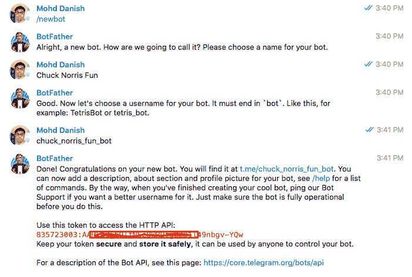
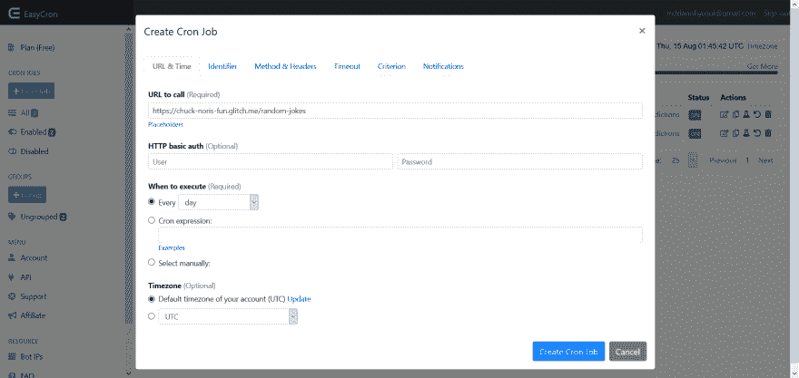

# 建立电报机器人发送每日通知

> 原文：<https://dev.to/mddanishyusuf/build-telegram-bot-to-send-daily-notification-4i00>

我正在为前端开发人员运行一个由公共 API 组成的网站，并且有一个面向用户的 telegram 组社区。所以，我决定每天都给频道提供一个随机的 API。然后，我决定自动完成这项任务，而不是与团队手动共享。

### **使用 NoCode 工具**

如果你不想编码和设置服务器，那么你可以在 5 分钟内设置好电报 API。[带 NoCode 的电报 API](https://nocodeapi.com/telegram-api)

### **使用代码**

让我们现在开始编码。

**第一步**:用一个 Bot( [@botfather](https://dev.to/botfather) )设置新的 Bot

在电报搜索中搜索姓名“ [@botfather](https://dev.to/botfather) ”，并在此处添加点击以发送命令。

制作一个机器人并按照指令操作。最后，您将获得 access_token 来使用 Telegram API。

[](https://res.cloudinary.com/practicaldev/image/fetch/s--kIAIFePz--/c_limit%2Cf_auto%2Cfl_progressive%2Cq_auto%2Cw_880/https://res.cloudinary.com/mohddanish/image/upload/v1565777567/42B0E406-7169-4B30-832E-13F829D4ED89.jpg)

所以，现在你创造了一个机器人。现在在电报搜索上搜一下(@name_bot)。

现在让我们编码这个机器人来自动完成任务。因此，我们正在将有关随机 API 的每日新闻自动传送到电报频道。

第二步:让我们为这个机器人设置一个服务器

我使用[glitch.com](https://glitch.com)构建服务器，使用 NodeJS 编写机器人代码。

在 Glitch 做一个快递项目。你可以把这个项目公开，也可以是私有的。

使用 Chuck Norris 的公共 API 发送 Chuck 的每日趣闻。在这里我发现了 API [查克·诺里斯 API](https://public-apis.xyz/chucknorris-io-7486)T2

```
var express = require('express')
var app = express()
var bodyParser = require('body-parser')
const axios = require('axios')
const {
    Telegram
} = require('telegraf')

const tg = new Telegram(process.env.BOT_TOKEN)

app.use(bodyParser.json()) // for parsing application/json

app.use(
    bodyParser.urlencoded({
        extended: true
    })
)

app.get('/random-jokes', function(req, res) {
    axios.get('https://api.chucknorris.io/jokes/random').then(res => {
        const txt = res.data.value
        tg.sendMessage(process.env.GROUP_ID, txt)
    })
    res.send('Joke is delivered')
})

// Finally, start our server
app.listen(3000, function() {
    console.log('Telegram app listening on port 3000!')
}) 
```

Enter fullscreen mode Exit fullscreen mode

将环境变量设置到**中。env** 文件。

```
BOT_TOKEN=<bot_access_token>
GROUP_ID=<group_id> 
```

Enter fullscreen mode Exit fullscreen mode

现在得到这些环境变量。用 **[@botfather](https://dev.to/botfather)** 可以轻松获得访问令牌。

要获取群组 id，首先将 bot 添加到您要发送每日通知的群组中。将下面 API 的 bot 调用添加到浏览器中以获取组 ID 后。

```
https://api.telegram.org/bot<bot_access_token>/getUpdates 
```

Enter fullscreen mode Exit fullscreen mode

因此，这个 API 将返回一个 JSON 对象数组。找到一个具有组名的对象，该对象 id 就是组 id。

```
//like this object
"chat":{
   "id":-369192376, // this is the group id
   "title":"xyz",
   "type":"group",
   "all_members_are_administrators":true
} 
```

Enter fullscreen mode Exit fullscreen mode

仅此而已。现在您有了 access_token 和组 id。您的服务器已准备好发送通知。

现在试着在浏览器中运行 API URL。

```
https://chuck-noris-fun.glitch.me/random-jokes
//https://<your glitch project name>/random-jokes 
```

Enter fullscreen mode Exit fullscreen mode

是的，起作用了。

[](https://res.cloudinary.com/practicaldev/image/fetch/s--NNHUoKbs--/c_limit%2Cf_auto%2Cfl_progressive%2Cq_auto%2Cw_880/https://thepracticaldev.s3.amazonaws.com/i/gcflcozk0axbfh1gjcut.png)

**步骤 3** :使用 CRON job 自动调用 API 端点。因此，有许多工具可以运行 CRON 作业。我正在使用名为[的 Easy Cron](https://www.easycron.com/?ref=131858) 它非常简单易用。

[](https://res.cloudinary.com/practicaldev/image/fetch/s--Wn7z1JPu--/c_limit%2Cf_auto%2Cfl_progressive%2Cq_auto%2Cw_880/https://thepracticaldev.s3.amazonaws.com/i/ikhp6n7997wwkrw75fan.png)

是啊！！！你做了你的电报机器人。还有更多值得探索。下面评论下来让我知道你需要更高级的 telegram bot 教程。

感谢阅读。

推特: [@mddanishyusuf](https://twitter.com/mddanishyusuf)
网址:[mohddanish . me](https://mohddanish.me)T5】项目: [NoCodeAPI](https://nocodeapi.com)