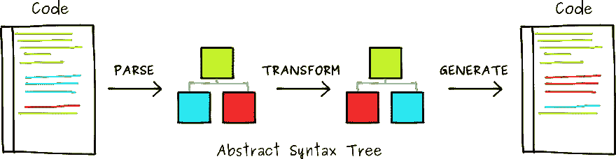
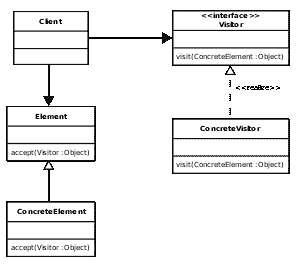

# 从头开始构建你自己的巴别塔插件

> 原文：<https://dev.to/mfco/build-your-own-babel-plugin-from-scratch-fk3>

## 简要介绍

首先，让我们谈谈 Babel，Babel 是一个 transpiler，它将代码从 JavaScript 转换成 JavaScript，也许你会有一点困惑，但让我们以经典的 JSX 为例。当你编写一个 React 应用程序时，你并不是在编写标准的 JS，Babel 是一个把所有漂亮的代码翻译成你的浏览器可以理解的 JS 的人。

<figure>

<figcaption>How a transpiler works</figcaption>

</figure>

好了，所有这些都很酷，现在是时候讨论它是如何工作的了，老实说，这真的很简单，它只是一个应用于每个 AST (AST 是处理输入代码后生成的抽象语法树)节点的访问者模式。这个模式允许我们在生成新代码之前完成一些动作，比如修改这个 AST。

<figure>

<figcaption>A classic visitor pattern</figcaption>

</figure>

## 一个简单的例子

如今，听说 CSS-in-JS 工具真的很常见，比如样式组件，或者样式 JSX。因此，让我们创建一个简单的 CSS 提取器，根据要求，如果我们谈论的是非无状态组件，我们将假设所有的样式都必须在一个名为`componentStyle`的函数中声明。
我们实现它的方法是创建自定义的 JSX 标签，这些标签将作为变量列在这个函数中，并与包含所需样式的对象相关联，这里我们有一个简单的组件示例，它定义了标签及其相关样式，按照惯例，使标签更容易被称为`STYLED_<HTML tag>`。