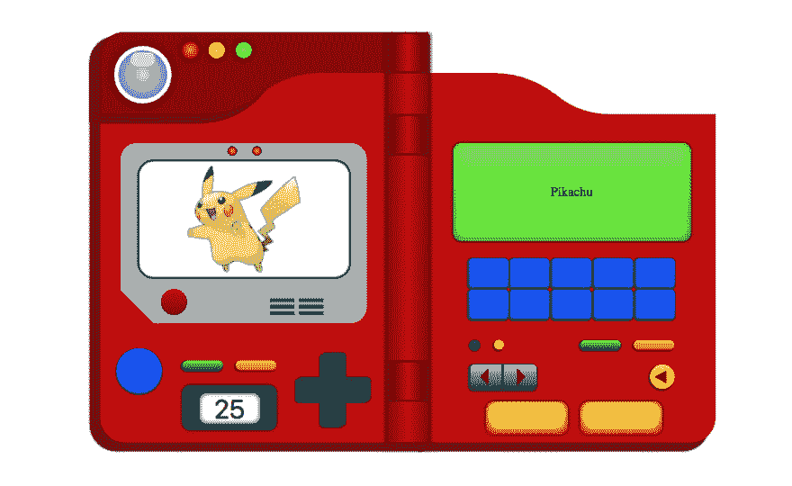
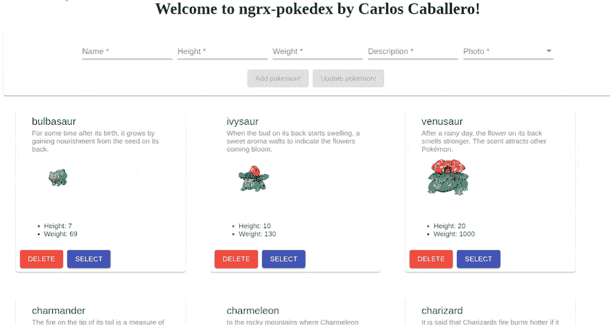
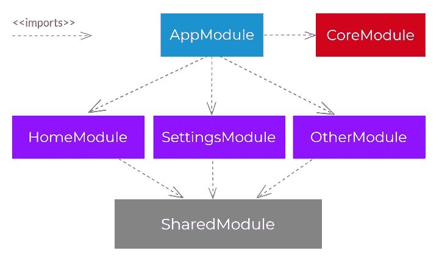
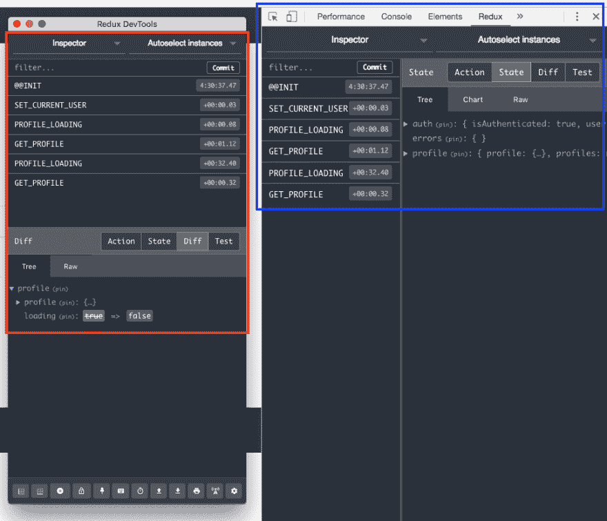
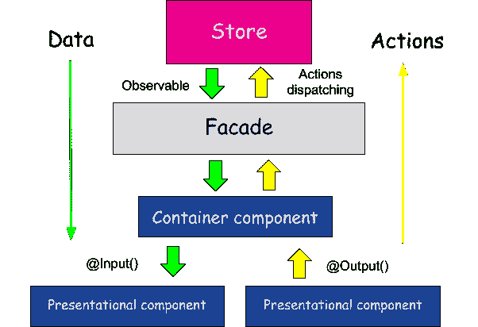

# 构建您的 Pokédex:第 1 部分 NgRX 简介

> 原文：<https://dev.to/angular/build-your-pokedex-part-1-introduction-to-ngrx-cgm>

这篇文章是我描述如何从**初学者到忍者**使用 NGRX 构建你的 Pokédex 的系列文章的一部分，如果你想阅读更多，你可以阅读下面的文章:

*   第一部分。构建你的 pokédex:NGRX 简介
*   第二部分。构建您的 Pokédex: @ngrx/entity
*   第三部分。构建您的 Pokédex:使用 create*函数改进 NgRX
*   第四部分。构建您的 Pokédex: @ngrx/data
*   第五部分。构建您的 Pokédex:测试 NgRX

* * *

[](https://res.cloudinary.com/practicaldev/image/fetch/s--NNUgluha--/c_limit%2Cf_auto%2Cfl_progressive%2Cq_auto%2Cw_880/https://cdn-images-1.medium.com/max/2000/0%2A0Y5OTBWR-YCcfel5.png)

# 简介

在这篇文章中，我们将使用 [Angular](http://angular.io) 框架和 [NgRX](https://ngrx.io) 作为状态管理库来开发一个 **pokédex** 。

建议了解如何在中级水平上管理 Angular，并了解什么是状态管理库，以便正确理解这篇文章，因为在本系列中，我们将展示如何开发一个具体的示例(Pokédex)，这可以作为您 NgRX 学习的补充。

首先，沿着这些帖子构建的结果显示在下面的 GIF 中。

[](https://res.cloudinary.com/practicaldev/image/fetch/s--v5trEOLC--/c_limit%2Cf_auto%2Cfl_progressive%2Cq_66%2Cw_880/https://cdn-images-1.medium.com/max/2000/0%2AjxpofLFJ9V7UzSWL.gif)

我们项目的目录结构如下所示(你可以从 [AngularAcademy](https://angular-academy.com/angular-architecture-best-practices/) 阅读关于 Angular 架构的帖子:

[](https://res.cloudinary.com/practicaldev/image/fetch/s--N91lfUCa--/c_limit%2Cf_auto%2Cfl_progressive%2Cq_auto%2Cw_880/https://cdn-images-1.medium.com/max/2000/0%2AEFDizQq0VPrpGQYR.png)

应用程序的结构分为两个明显不同的部分:

*   **共享**。在这里，我们将放置所有模块共享的所有元素，例如管道、指令、服务、模型和状态。
    *   **状态**。状态又分为子状态，允许我们管理存储应用程序状态的数据结构。在我们的应用程序中，我们将只有一个名为 Pokemon 的状态，其中存储了与 Pokemon 相关的信息。
*   **视图**。在这里，您将找到应用程序的视图/页面。该应用程序由模块构成:
    *   **核心模块**。对应用程序来说必不可少的服务，需要在最初进行实例化。
    *   **共享模块**。所有功能模块共享的模块。
    *   **功能模块**。按应用程序中的功能组织的模块。在我们的具体应用程序中，我们将只有一个功能模块(PokemonModule)。

[](https://res.cloudinary.com/practicaldev/image/fetch/s--Dsyc3hqv--/c_limit%2Cf_auto%2Cfl_progressive%2Cq_auto%2Cw_880/https://cdn-images-1.medium.com/max/2000/0%2AtoOjyh6kpM16SsMg.png)

# 初始配置

制作本教程的第一步是使用 CLI 创建一个新的角度项目。然后，显示创建我们的项目的结果和正在使用的具体版本。

```
ng new ngrx-pokedex 
```

```
ng --version

     _                      _                 ____ _     ___
    / \   _ __   __ _ _   _| | __ _ _ __     / ___| |   |_ _|
   / △ \ | '_ \ / _` | | | | |/ _` | '__|   | |   | |    | |
  / ___ \| | | | (_| | |_| | | (_| | |      | |___| |___ | |
 /_/   \_\_| |_|\__, |\__,_|_|\__,_|_|       \____|_____|___|
                |___/

Angular CLI: 8.0.6
Node: 10.15.0
OS: linux x64
Angular: 8.0.3
... animations, common, compiler, compiler-cli, core, forms
... language-service, platform-browser, platform-browser-dynamic
... router

Package                           Version
-----------------------------------------------------------
@angular-devkit/architect         0.800.6
@angular-devkit/build-angular     0.800.6
@angular-devkit/build-optimizer   0.800.6
@angular-devkit/build-webpack     0.800.6
@angular-devkit/core              8.0.6
@angular-devkit/schematics        8.0.6
@angular/cli                      8.0.6
@ngtools/webpack                  8.0.6
@schematics/angular               8.0.6
@schematics/update                0.800.6
rxjs                              6.4.0
typescript                        3.4.5
webpack                           4.30.0 
```

## tsconfig.json & &环境

在我使用 TypeScript 的项目中，我喜欢配置`path`来访问`shared`的子目录，而不必使用几级向后缩进(`../../ ..`)。`tsconfig.json`文件允许您轻松地为路线配置这些别名。

```
{  "compileOnSave":  false,  "compilerOptions":  {  "baseUrl":  "src",  "outDir":  "./dist/out-tsc",  "sourceMap":  true,  "declaration":  false,  "downlevelIteration":  true,  "experimentalDecorators":  true,  "module":  "esnext",  "moduleResolution":  "node",  "importHelpers":  true,  "target":  "es2015",  "typeRoots":  ["node_modules/@types"],  "lib":  ["es2018",  "dom"],  "resolveJsonModule":  true,  "paths":  {  "@shared/*":  ["app/shared/*"],  "@services/*":  ["app/shared/services/*"],  "@states/*":  ["app/shared/states/*"],  "@views/*":  ["app/views/*"],  "@models/*":  ["app/shared/interfaces/*"],  "@environments/*":  ["environments/*"]  }  }  } 
```

另一方面，我考虑尽快配置开发要素中的环境变量，以避免一旦决定从开发进入生产就必须执行这项任务。因此，我们开发的伪后端的路径将在如下所示的`environment.ts`文件中定义:

```
export const environment = {
  production: false,
  backendUrl: 'api/pokemons/'
}; 
```

# 假-后端

将使用`in-memory-web-api`模块，而不是开发一个在数据库或内存上执行 CRUD 操作的后端。这允许我们模拟 REST 上的操作。

这个模块拦截 Angular `Http`和`HttpClient`请求，否则这些请求会发送到远程服务器，并将它们重定向到您控制的内存数据存储中。

创建一个实现`InMemoryDbService`的`InMemoryDataService`类。

至少，我们必须实现创建“数据库”散列的`createDb`方法，该散列的键是集合名称，其值是要返回或更新的集合对象的数组。此外，我还实现了`genId`方法，为来自假服务器的每个新口袋妖怪生成一个唯一的 ID。

```
npm i angular-in-memory-web-api 
```

```
import { InMemoryDbService } from 'angular-in-memory-web-api';
import { pokemons as pokemonsDB } from '../mock/pokemons';

export class InMemoryDataService implements InMemoryDbService {
  createDb() {
    const pokemons = pokemonsDB;
    return { pokemons };
  }
  genId(): number {
    return Math.round(Math.random() * 1000000);
  }
} 
```

数据来自具有以下结构的模拟文件:

```
export  const  pokemons  =  [  {  id:  1,  photo:  1,  name:  'bulbasaur',  types:  ['grass',  'poison'],  height:  7,  weight:  69,  description:  'For  some  time  after  its  birth,  it  grows  by  gaining  nourishment  from  the  seed  on  its  back.'  },  {  id:  2,  photo:  2,  name:  'ivysaur',  types:  ['grass',  'poison'],  height:  10,  weight:  130,  description:  'When  the  bud  on  its  back  starts  swelling,  a  sweet  aroma  wafts  to  indicate  the  flowers  coming  bloom.'  },  ...  ]; 
```

最后，在服务器中为每个口袋妖怪存储一个静态图像。这些图像存储在使用`photo`字段标识的`asseimg/pokemon/`路径中。

用根`AppModule.imports`中的`HttpClientInMemoryWebApiModule`注册您的数据存储服务实现，用这个服务类和一个可选的配置对象
调用`forRoot`静态方法

```
import { AppComponent } from './app.component';
import { BrowserModule } from '@angular/platform-browser';
import { HttpClientInMemoryWebApiModule } from 'angular-in-memory-web-api';
import { HttpClientModule } from '@angular/common/http';
import { InMemoryDataService } from './shared/services/in-memory-data.service';
import { NgModule } from '@angular/core';

@NgModule({
  declarations: [AppComponent],
  imports: [
    BrowserModule,
    HttpClientModule,
    HttpClientInMemoryWebApiModule.forRoot(InMemoryDataService)
  ],
  providers: [],
  bootstrap: [AppComponent]
})
export class AppModule {} 
```

这个内存中的 web api 服务处理一个 HTTP 请求，并以 RESTy web api 的方式返回一个可观察的 HTTP 响应对象。它以下面的形式处理 URI 模式:base/:collectionName/:id？

例子:

```
 // for requests to an `api` base URL that gets heroes from a 'heroes' collection 
  GET api/heroes          // all heroes
  GET api/heroes/42       // the hero with id=42
  GET api/heroes?name=^j  // 'j' is a regex; returns heroes whose name starting with 'j' or 'J'
  GET api/heroes.json/42  // ignores the ".json" 
```

内存中的 web api 服务根据您在安装过程中定义的“数据库”——一组命名集合——来处理这些请求。

# NgRX 安装

## @ngrx/store

Store 是 RxJS powered state management for Angular 应用程序，灵感来自 Redux。Store 是一个受控状态容器，旨在帮助在 Angular 上编写高性能和一致的应用程序。

关键概念:

*   **动作**描述了由组件和服务分派的独特事件。
*   **状态变化**由称为 reducers 的纯函数处理，它采用当前状态和最新动作来计算新状态。
*   **选择器**是用于选择、导出和组成状态片段的纯函数。
*   **状态访问**与存储、状态的可观察对象和动作的观察对象。

你只需要安装以下软件包:

```
npm install @ngrx/store 
```

## @ngrx/effects

效果是一个 RxJS 供电的商店副作用模型。效果使用流来提供新的动作源，以基于外部交互(如网络请求、web 套接字消息和基于时间的事件)来减少状态。

### 简介

在基于服务的角度应用程序中，组件负责直接通过服务与外部资源进行交互。相反，effects 提供了一种与这些服务进行交互的方式，并将它们与组件隔离开来。Effects 是您处理任务的地方，比如获取数据、产生多个事件的长时间运行的任务，以及其他外部交互，在这些交互中，您的组件不需要这些交互的明确知识。

### 关键概念

*   Effects 将副作用从组件中分离出来，允许更纯粹的组件选择状态和分派动作。
*   Effects 运行长期运行的服务，监听从商店发出的每个可观察的动作。
*   效果根据他们感兴趣的动作类型过滤这些动作。这是通过使用运算符来完成的。
*   Effects 执行同步或异步任务，并返回一个新动作。

你只需要安装以下软件包:

```
npm install @ngrx/effects 
```

## @ngrx/store-devtools

Store Devtools 为 Store 提供开发人员工具和工具。

配置该工具的步骤如下:

1.  安装包:`npm install @ngrx/store-devtools`。
2.  安装 [Chrome](https://chrome.google.com/webstore/detail/redux-devtools/) / [Firefox](https://addons.mozilla.org/es/firefox/addon/reduxdevtools/) 扩展。
3.  在您的`AppModule`中，使用`StoreDevtoolsModule.instrument`将插装添加到模块导入:

```
import { StoreDevtoolsModule } from '@ngrx/store-devtools';
import { environment } from '../environments/environment'; // Angular CLI environemnt

@NgModule({
  imports: [
    StoreModule.forRoot(reducers),
    // Instrumentation must be imported after importing StoreModule (config is optional)
    StoreDevtoolsModule.instrument({
      maxAge: 25, // Retains last 25 states
      logOnly: environment.production, // Restrict extension to log-only mode
    }),
  ],
})
export class AppModule {} 
```

完成这些步骤后，当您打开 web 浏览器元素检查器时，您将获得一个新的 redux 选项卡。在这个新选项卡中，您可以看到已经触发的操作和应用程序的状态。

[](https://res.cloudinary.com/practicaldev/image/fetch/s--bfWA8hjP--/c_limit%2Cf_auto%2Cfl_progressive%2Cq_auto%2Cw_880/https://cdn-images-1.medium.com/max/2000/0%2AyhTYwWcbrE-tib8u.png)

## 共享模块&核心模块

按照 [Angular 团队构建 Angular 应用架构](https://angular.io/guide/architecture)的指示，将定义两个模块:

*   **共享模块**。该模块导入和导出功能模块中共享的模块。注意，已经导入了一组属于`@angular/material`的模块，这些模块本可以在一个名为`shared.material.module`的特定模块中导入和导出。然而，为了简化问题，它是从`SharedModule`模块直接导出的。有必要导入`StoreModule`模块，因为它负责加载应用程序中的商店。最后，导入与表单相关的模块，以构建用户界面。
*   **核心模块。**在该模块中，使用`StoreModule`和`EffectsModule`模块初始化减压器和效果。

```
import {
  MatButtonModule,
  MatCardModule,
  MatFormFieldModule,
  MatIconModule,
  MatInputModule,
  MatProgressSpinnerModule,
  MatSelectModule,
  MatSnackBarModule,
  MatToolbarModule
} from '@angular/material';

import { BrowserAnimationsModule } from '@angular/platform-browser/animations';
import { CommonModule } from '@angular/common';
import { FlexLayoutModule } from '@angular/flex-layout';
import { FormsModule } from '@angular/forms';
import { NgModule } from '@angular/core';
import { ReactiveFormsModule } from '@angular/forms';
import { StoreModule } from '@ngrx/store';

const MaterialModules = [
  MatInputModule,
  MatButtonModule,
  MatFormFieldModule,
  MatSelectModule,
  MatIconModule,
  MatCardModule,
  MatToolbarModule,
  MatSnackBarModule,
  MatProgressSpinnerModule
];
@NgModule({
  declarations: [],
  imports: [CommonModule, ReactiveFormsModule],
  exports: [
    CommonModule,
    FormsModule,
    ReactiveFormsModule,
    StoreModule,
    FlexLayoutModule,
    ...MaterialModules,
    BrowserAnimationsModule
  ]
})
export class SharedModule {} 
```

```
import { CommonModule } from '@angular/common';
import { EffectsModule } from '@ngrx/effects';
import { HttpClientModule } from '@angular/common/http';
import { NgModule } from '@angular/core';
import { PokemonEffects } from '@states/pokemon/pokemon.effects';
import { PokemonService } from '@services/pokemon.service';
import { StoreModule } from '@ngrx/store';
import { reducers } from './shared/states/root.reducer';

@NgModule({
  declarations: [],
  imports: [
    CommonModule,
    HttpClientModule,
    StoreModule.forRoot(reducers),
    EffectsModule.forRoot([PokemonEffects])
  ],
  providers: [PokemonService],
  exports: []
})
export class CoreModule {} 
```

# 有角的物质

角形材料的安装非常简单，因为我们只需要安装以下软件包:

```
npm install @angular/material
npm install @angular/flex-layout
npm install @angular/cdk 
```

# 口袋妖怪服务

在我们必须使用 NGRX 服务的情况下，我们减去所有与应用程序状态相关的逻辑。传统上，当您在 Angular 中开发服务时，您有一组属性来建模应用程序的子状态。

使用 NGRX，这个问题大大减少了，因为所有与状态管理相关的逻辑都委托给了存储，因此从服务中消失了。事实上，我们的`Pokemon.service`服务可以被认为是一个更大的服务，它封装了与`HttpClient`服务相关的逻辑，因为它唯一的任务就是与后端通信。

```
import { HttpClient } from '@angular/common/http';
import { Injectable } from '@angular/core';
import { Observable } from 'rxjs';
import { Pokemon } from '@shared/interfaces/pokemon.interface';
import { environment } from '@environments/environment';

@Injectable({
  providedIn: 'root'
})
export class PokemonService {
  constructor(private http: HttpClient) {}

  public getAll(): Observable<Pokemon[]> {
    return this.http.get<Pokemon[]>(environment.backendUrl);
  }

  public delete(id: string): Observable<Pokemon> {
    return this.http.delete<Pokemon>(`${environment.backendUrl}/${id}`);
  }

  public add(pokemon: Pokemon): Observable<Pokemon> {
    return this.http.post<Pokemon>(environment.backendUrl, pokemon);
  }

  public update(pokemon: Partial<Pokemon>): Observable<Pokemon> {
    return this.http.put<Pokemon>(`${environment.backendUrl}`, pokemon);
  }
} 
```

当您不打算包含与数据相关的方法时，没有必要构建一个类。出于这个原因，我们决定创建一个界面，其中每个口袋妖怪的属性建模如下所示。

```
export interface Pokemon {
  id: number;
  name: string;
  description: string;
  height: number;
  weight: number;
  photo: string;
} 
```

# NgRX

NgRx 是一个在 Angular 中构建反应式应用的框架。NgRx 提供了状态管理、副作用隔离、实体集合管理、路由器绑定、代码生成和开发人员工具，这些工具可以增强开发人员在构建许多不同类型的应用程序时的体验。

NgRX 由以下概念组成:

*   **州**。这里定义了我们想要建模的`state`，理想情况是设计组成完整状态的子状态。
*   **动作**。可对商店执行或有影响的操作列表。
*   **减速器**。转换状态的方法(因为使用了不变性，所以创建了一个新状态)。
*   **选择器**。允许在存储的子状态上创建可观察对象的方法。选择器非常有用，因为它们允许只在每个组件中我们感兴趣的片段上创建可观测量，而不需要观察整个商店。
*   **效果**。那些不改变悬挂物的方法在这里被合并。在我们的例子中，我们将使用它来创建操作执行是否令人满意的通知。另外，在服务的操作被满意地或不正确地执行的情况下，效果被用来触发动作。

因此，`@shared/state/pokemon`目录由以下文件组成:

[](https://res.cloudinary.com/practicaldev/image/fetch/s---1obh1wm--/c_limit%2Cf_auto%2Cfl_progressive%2Cq_auto%2Cw_880/https://cdn-images-1.medium.com/max/1200/0%2AyhTYwWcbrE-tib8u.png)

`index.ts`文件仅用于提高 pokemon 目录中导入的详细程度。

```
export * from './pokemon.actions';
export * from './pokemon.state';
export * from './pokemon.effects';
export * from './pokemon.reducer';
export * from './pokemon.selector'; 
```

## 状态模式

我们现在在`pokemon`文件中创建一些状态模型。

@ shared/interfaces/store . interface . ts

```
import { PokemonState } from '@shared/states/pokemon';

export interface AppStore {
  pokemon: PokemonState;
} 
```

口袋妖怪状态由下面定义的两个属性组成:

*   **ids** 。它是一个数字数组，包含按一定顺序排列的对象的键。在第一篇文章中，我们不会使用这个数组，它是由我们将在下一篇文章中解释的`@ngrx/entity`模块提供的。
*   **实体**。它是一个键值对象，其中的键是一个对应于每个口袋妖怪 ID 的字符串。这样，我们就可以通过密钥直接访问每个口袋妖怪，而不必在数组中搜索。

```
import { Pokemon } from '@shared/interfaces/pokemon.interface'
export interface PokemonState {
  ids: number[];
  entities: { [key: string]: Pokemon };
} 
```

## 动作

我们必须定义的第一件事是可以对商店执行的一组操作。传统的操作是由众所周知的缩写 CRUD 组成的。每个操作都有两个额外的操作作为补充，即操作 XX_SUCCESS 和 XX_FAILED。
这样，不带后缀的操作被用作服务执行的触发器，服务与后端通信。
根据服务返回的值，将触发成功或失败的操作。

如果触发了成功操作，将执行修改存储的相关缩减器和带有操作已成功执行的消息的通知。另一方面，当执行失败的操作时，我们不需要修改存储，而是需要一个通知来指示错误已经发生。

因此，我们定义的一组动作及其对应的名称空间`[Pokemon]`如下:

```
export enum PokemonActionTypes {
  ADD = '[Pokemon] Add',
  ADD_SUCCESS = '[Pokemon] Add success',
  ADD_FAILED = '[Pokemon] Add failed',
  LOAD_POKEMONS = '[Pokemon] Load pokemon',
  LOAD_POKEMONS_SUCCESS = '[Pokemon] Load pokemon success',
  LOAD_POKEMONS_FAILED = '[Pokemon] Load pokemon failed',
  UPDATE = '[Pokemon] Update',
  UPDATE_SUCCESS = '[Pokemon] Update success',
  UPDATE_FAILED = '[Pokemon] Update failed',
  DELETE = '[Pokemon] Delete',
  DELETE_SUCCESS = '[Pokemon] Delete success',
  DELETE_FAILED = '[Pokemon] Delete failed'
} 
```

实现`Action`接口的类用于构建 NgRX 生态系统中的每个动作。在每个类的构造函数方法中指定了`payload`。这个`payload`是归约者的自变量，它修改状态。

以`AddSuccess`类为例。`type`属性用于定义该类对应的动作类型。最后，与这个动作相关联的`payload`是来自后端的`Pokemon`。

```
export class AddSuccess implements Action {
  readonly type = PokemonActionTypes.ADD_SUCCESS;

  constructor(public pokemon: Pokemon) {}
} 
```

`pokemon.actions.ts`文件如下所示:

```
import { Action } from '@ngrx/store';
import { Pokemon } from '@models/pokemon.interface';

export enum PokemonActionTypes {
  ADD = '[Pokemon] Add',
  ADD_SUCCESS = '[Pokemon] Add success',
  ADD_FAILED = '[Pokemon] Add failed',
  LOAD_POKEMONS = '[Pokemon] Load pokemon',
  LOAD_POKEMONS_SUCCESS = '[Pokemon] Load pokemon success',
  LOAD_POKEMONS_FAILED = '[Pokemon] Load pokemon failed',
  UPDATE = '[Pokemon] Update',
  UPDATE_SUCCESS = '[Pokemon] Update success',
  UPDATE_FAILED = '[Pokemon] Update failed',
  DELETE = '[Pokemon] Delete',
  DELETE_SUCCESS = '[Pokemon] Delete success',
  DELETE_FAILED = '[Pokemon] Delete failed'
}

export class LoadPokemon implements Action {
  readonly type = PokemonActionTypes.LOAD_POKEMONS;

  constructor() {}
}

export class LoadPokemonSuccess implements Action {
  readonly type = PokemonActionTypes.LOAD_POKEMONS_SUCCESS;

  constructor(public payload: Array<Pokemon>) {}
}
export class LoadPokemonFailed implements Action {
  readonly type = PokemonActionTypes.LOAD_POKEMONS_FAILED;

  constructor(public message: string) {}
}

export class Add implements Action {
  readonly type = PokemonActionTypes.ADD;

  constructor(public pokemon: Pokemon) {}
}

export class AddSuccess implements Action {
  readonly type = PokemonActionTypes.ADD_SUCCESS;

  constructor(public pokemon: Pokemon) {}
}
export class AddFailed implements Action {
  readonly type = PokemonActionTypes.ADD_FAILED;

  constructor(public message: string) {}
}

export class Delete implements Action {
  readonly type = PokemonActionTypes.DELETE;

  constructor(public id: number) {}
}
export class DeleteSuccess implements Action {
  readonly type = PokemonActionTypes.DELETE_SUCCESS;

  constructor(public id: number) {}
}
export class DeleteFailed implements Action {
  readonly type = PokemonActionTypes.DELETE_FAILED;

  constructor(public message: string) {}
}

export class Update implements Action {
  readonly type = PokemonActionTypes.UPDATE;

  constructor(public pokemon: Pokemon) {}
}
export class UpdateSuccess implements Action {
  readonly type = PokemonActionTypes.UPDATE_SUCCESS;

  constructor(public pokemon: Pokemon) {}
}
export class UpdateFailed implements Action {
  readonly type = PokemonActionTypes.UPDATE_FAILED;

  constructor(public message: string) {}
}

export type PokemonActions =
  | LoadPokemonSuccess
  | Add
  | AddSuccess
  | AddFailed
  | Delete
  | DeleteSuccess
  | DeleteFailed
  | Update
  | UpdateSuccess
  | UpdateFailed; 
```

## 减速器

NgRx 中的 Reducers 负责处理应用程序中从一个状态到下一个状态的转换。Reducers 函数通过基于动作的类型确定要处理的动作来处理这些转换。

在 NgRX 生态系统中，只需要导出一个函数来还原到`CoreModule`。在我们的具体问题中，这个函数是`pokemonReducer`。在函数 reducer 中定义了状态变化。

该函数具有以下签名:

```
export function pokemonInitialState(): PokemonState {
  return {
    ids: [],
    entities: {}
  };
}

export function pokemonReducer(
  state: PokemonState = pokemonInitialState(),
  action: PokemonActions
): PokemonState 
```

其中接收到两个参数:

*   **状态**。修改前的当前状态。如果没有当前状态，将使用函数中定义的初始状态。
*   **动作**。将对状态执行的操作。

reduce 函数由一个`switch`组成，其中必须返回一个新的`PokemonState`。

```
switch (action.type) {
    case PokemonActionTypes.LOAD_POKEMONS_SUCCESS:
      return {
        ...state,
        entities: arrayToObject(action.payload)
      };

    case PokemonActionTypes.ADD_SUCCESS:
      return {
        ...state,
        entities: {
          ...state.entities,
          [action.pokemon.id]: action.pokemon
        }
      };

    case PokemonActionTypes.DELETE_SUCCESS:
      const entities = { ...state.entities };
      delete entities[action.id];
      return {
        ...state,
        entities
      };

    case PokemonActionTypes.UPDATE_SUCCESS:
      return {
        ...state,
        entities: {
          ...state.entities,
          [action.pokemon.id]: action.pokemon
        }
      };

    default:
      return state;
  } 
```

注意，修改状态的情况是“成功的”，其中使用了扩展操作符]([https://developer . Mozilla . org/en-US/docs/Web/JavaScript/Reference/Operators/Spread _ syntax](https://developer.mozilla.org/en-US/docs/Web/JavaScript/Reference/Operators/Spread_syntax))来构建新的状态。

例如，ADD_SUCCESS 案例返回一个新对象，其中组合了当前状态(`... state`)和对`entities`属性的修改。`entities`属性是由旧的`state.entities`和新的`action.pokemon`组合而成的新对象，其中`action.pokemon.id`的位置被修改。

值得注意的是，在接收到的有效载荷中，对象将由一个名为`pokemon`的属性组成，该属性是作为参数从创建的动作中传递的对象。

```
case PokemonActionTypes.ADD_SUCCESS:
      return {
        ...state,
        entities: {
          ...state.entities,
          [action.pokemon.id]: action.pokemon
        }
      }; 
```

`pokemon.reducer.ts`文件如下所示。`arrayToObject`函数是一个辅助函数，将一个数组转换成一个对象

```
import { PokemonActionTypes, PokemonActions } from './pokemon.actions';

import { PokemonState } from './pokemon.state';

export function pokemonInitialState(): PokemonState {
  return {
    ids: [],
    entities: {}
  };
}

function arrayToObject(array) {
  return array.reduce((obj, item) => {
    obj[item.id] = item;
    return obj;
  }, {});
}

export function pokemonReducer(
  state: PokemonState = pokemonInitialState(),
  action: PokemonActions
): PokemonState {
  switch (action.type) {
    case PokemonActionTypes.LOAD_POKEMONS_SUCCESS:
      return {
        ...state,
        entities: arrayToObject(action.payload)
      };

    case PokemonActionTypes.ADD_SUCCESS:
      return {
        ...state,
        entities: {
          ...state.entities,
          [action.pokemon.id]: action.pokemon
        }
      };

    case PokemonActionTypes.DELETE_SUCCESS:
      const entities = { ...state.entities };
      delete entities[action.id];
      return {
        ...state,
        entities
      };

    case PokemonActionTypes.UPDATE_SUCCESS:
      return {
        ...state,
        entities: {
          ...state.entities,
          [action.pokemon.id]: action.pokemon
        }
      };

    default:
      return state;
  }
} 
```

## 选择器

选择器是[纯函数](https://www.carloscaballero.io/understanding-javascript-typescript-memoization/)，用于获取存储状态的切片。@ngrx/store 提供了一些帮助函数来优化这个选择。在选择状态片段时，选择器提供了许多功能。

*   轻便的
*   [记忆化](https://www.carloscaballero.io/understanding-javascript-typescript-memoization/)
*   作文
*   可试验的
*   类型安全

NgRX 提供了两个函数来创建选择器:

*   **CreateFeatureSelector** 这个函数允许我们为子状态创建一个选择器。
*   **创建选择器**。这个函数允许我们使用两个参数创建选择器:1。选择器；2.定义我们想要选择什么值的函数。

在我们的 Pokédex 中，我们只需要一个选择器(将它们全部加载)，如果我们有一个包含每个口袋妖怪详细信息的页面，我们可以创建一个名为`selectById`的特定选择器。

`pokemon.selector.ts`文件如下所示。

```
import { createFeatureSelector, createSelector } from '@ngrx/store';

import { PokemonState } from './pokemon.state';

export const selectPokemonState = createFeatureSelector<PokemonState>(
  'pokemon'
);

export const selectAll = createSelector(
  selectPokemonState,
  state => Object.values(state.entities)
); 
```

## 效果

这些效果是我们实现 Pokédex 的一个基本部分，因为我们已经委派了决定为此目的分派哪个动作的责任。下面是载入口袋妖怪的效果，作为这个解释的例子。

`loadAllPokemon $`正在监听`LOAD_POKEMONS`动作的出现(该动作将由组件分派)。从 NgRX 上的这一点开始，需要对 [RxJS 库](https://rxjs-dev.firebaseapp.com/)有最基本的了解，因为它将与可观察的流一起工作

首先，使用了`switchMap`操作符，它允许丢弃来自发布者的值序列，以便在每个时刻只管理一个流。这里使用了从后端返回一个`Observable<Pokemon[]>`的`PokemonService`服务。如果来自后端的操作成功，则触发`LoadPokemonSuccess`动作，其中有效载荷是口袋妖怪数组。另一方面，如果后端发生错误，那么会触发`LoadPokemonFailed`动作，其中有效负载是服务器错误消息。

```
 @Effect()
  loadAllPokemon$: Observable<any> = this.actions$.pipe(
    ofType(PokemonActions.PokemonActionTypes.LOAD_POKEMONS),
    switchMap(() =>
      this.pokemonService.getAll().pipe(
        map(pokemons => new PokemonActions.LoadPokemonSuccess(pokemons)),
        catchError(error => of(new PokemonActions.LoadPokemonFailed(error)))
      )
    )
  ); 
```

在我们的例子中，通过创建两个监听成功和失败操作的效果，这个问题被简化了。在这两种效果中，总是显示相同的通知消息。

```
@Effect({ dispatch: false })
  successNotification$ = this.actions$.pipe(
    ofType(...this.POKEMON_ACTIONS_SUCCESS),
    tap(() =>
      this.snackBar.open('SUCCESS', 'Operation success', {
        duration: 2000
      })
    )
  );
  @Effect({ dispatch: false })
  failedNotification$ = this.actions$.pipe(
    ofType(...this.POKEMON_ACTIONS_FAILED),
    tap(() =>
      this.snackBar.open('FAILED', 'Operation failed', {
        duration: 2000
      })
    )
  ); 
```

值得注意的是，参数`dispatch: false`已经被指示给`Effect`装饰器，因为每个效果默认触发一个动作；如果没有定义，它会在最后触发相同的操作，这可能会导致无限循环。

这两种效果都监听特定类型的动作(`POKEMON_ACTIONS_SUCCESS`或`POKEMON_ACTIONS_FAILED`)，并使用 Angular Material 的`snackBar`服务触发通知。

不要等待存储被修改的成功动作的效果，因为这正是我们先前定义的 reducer 所执行的任务。

最后，`pokemon.effects.ts`文件如下图所示。

```
import * as PokemonActions from '@states/pokemon/pokemon.actions';

import { Actions, Effect, ofType } from '@ngrx/effects';
import { Observable, of } from 'rxjs';
import { catchError, map, switchMap, tap } from 'rxjs/operators';

import { Injectable } from '@angular/core';
import { MatSnackBar } from '@angular/material';
import { Pokemon } from '@shared/interfaces/pokemon.interface';
import { PokemonService } from '@services/pokemon.service';

@Injectable()
export class PokemonEffects {
  constructor(
    private actions$: Actions,
    private pokemonService: PokemonService,
    public snackBar: MatSnackBar
  ) {}

  POKEMON_ACTIONS_SUCCESS = [
    PokemonActions.PokemonActionTypes.ADD_SUCCESS,
    PokemonActions.PokemonActionTypes.UPDATE_SUCCESS,
    PokemonActions.PokemonActionTypes.DELETE_SUCCESS,
    PokemonActions.PokemonActionTypes.LOAD_POKEMONS_SUCCESS
  ];

  POKEMON_ACTIONS_FAILED = [
    PokemonActions.PokemonActionTypes.ADD_FAILED,
    PokemonActions.PokemonActionTypes.UPDATE_FAILED,
    PokemonActions.PokemonActionTypes.DELETE_FAILED,
    PokemonActions.PokemonActionTypes.LOAD_POKEMONS_FAILED
  ];

  @Effect()
  loadAllPokemon$: Observable<any> = this.actions$.pipe(
    ofType(PokemonActions.PokemonActionTypes.LOAD_POKEMONS),
    switchMap(() =>
      this.pokemonService.getAll().pipe(
        map(pokemons => new PokemonActions.LoadPokemonSuccess(pokemons)),
        catchError(error => of(new PokemonActions.LoadPokemonFailed(error)))
      )
    )
  );

  @Effect()
  addPokemon$: Observable<any> = this.actions$.pipe(
    ofType(PokemonActions.PokemonActionTypes.ADD),
    switchMap((action: any) =>
      this.pokemonService.add(action.pokemon).pipe(
        map((pokemon: Pokemon) => new PokemonActions.AddSuccess(pokemon)),
        catchError(error => of(new PokemonActions.AddFailed(error)))
      )
    )
  );

  @Effect()
  deletePokemon$: Observable<any> = this.actions$.pipe(
    ofType(PokemonActions.PokemonActionTypes.DELETE),
    switchMap(({ id }) =>
      this.pokemonService.delete(id).pipe(
        map(() => new PokemonActions.DeleteSuccess(id)),
        catchError(error => of(new PokemonActions.DeleteFailed(error)))
      )
    )
  );

  @Effect()
  updatePokemon$: Observable<any> = this.actions$.pipe(
    ofType(PokemonActions.PokemonActionTypes.UPDATE),
    switchMap(({ pokemon }) =>
      this.pokemonService.update(pokemon).pipe(
        map(() => new PokemonActions.UpdateSuccess(pokemon)),
        catchError(error => of(new PokemonActions.UpdateFailed(error)))
      )
    )
  );

  @Effect({ dispatch: false })
  successNotification$ = this.actions$.pipe(
    ofType(...this.POKEMON_ACTIONS_SUCCESS),
    tap(() =>
      this.snackBar.open('SUCCESS', 'Operation success', {
        duration: 2000
      })
    )
  );
  @Effect({ dispatch: false })
  failedNotification$ = this.actions$.pipe(
    ofType(...this.POKEMON_ACTIONS_FAILED),
    tap(() =>
      this.snackBar.open('FAILED', 'Operation failed', {
        duration: 2000
      })
    )
  );
} 
```

## 根.减速器

最后，同样重要的是，我们需要一个`root.reducer`文件，从中可以加载应用程序的所有子状态。在我们的特例中，我们只有`pokemon.reducer`。

```
import { pokemonReducer } from './pokemon/pokemon.reducer';

export const reducers = { pokemon: pokemonReducer }; 
```

# 页面/视图

现在，我们将开始构建应用程序的可视化部分。请记住，应用程序状态的所有管理都委托给了 NgRX，因此，我们不需要担心更改任何组件的状态。

这个事实大大简化了我们的页面/视图，因为我们只需定义两种类型的组件:

*   **智能组件**。将通过`dispatch`方法或使用选择器来执行存储任务的组件。
*   **dummy 组件**。只需向 SmartComponent 显示数据和管理事件的组件。

该架构在 [ng-conf]((https://www.ng-conf.org/2019/angular-architecture-specific-layers/)) 中以稳定架构的形式出现。下图显示了所使用的架构，其中我们省略了[外观模式](https://www.carloscaballero.io/design-patterns-facade/)，因为它对于我们的具体问题是不必要的，因为我们只有一个模块。

[](https://res.cloudinary.com/practicaldev/image/fetch/s--d12Qjfg2--/c_limit%2Cf_auto%2Cfl_progressive%2Cq_auto%2Cw_880/https://cdn-images-1.medium.com/max/1200/0%2AgUJK8yNbyTdlT_b5.png)

视图目录的结构如下:

[](https://res.cloudinary.com/practicaldev/image/fetch/s---pegTA0j--/c_limit%2Cf_auto%2Cfl_progressive%2Cq_auto%2Cw_880/https://cdn-images-1.medium.com/max/1200/0%2AX_sgjaPZpa2FeiiI.png)

回到我们的具体问题(Pokédex)，PokemonComponent 是智能组件，另一方面，与列表和表单相关的组件是虚拟组件。

我们的口袋妖怪模块的启动器是自己的`app.component`,这很简单，我接下来会给你看。

```
<div style="text-align:center">
  <h1>Welcome to ngrx-pokedex by Carlos Caballero!</h1> </div> <app-pokemon></app-pokemon> 
```

## 口袋妖怪模块

Pokemon 模块只负责加载组成应用程序的三个组件，当然还有如下所示的 SharedModule。

```
import { CommonModule } from '@angular/common';
import { NgModule } from '@angular/core';
import { PokemonComponent } from './pokemon.component';
import { PokemonFormComponent } from './pokemon-form/pokemon-form.component';
import { PokemonListComponent } from './pokemon-list/pokemon-list.component';
import { SharedModule } from '@shared/shared.module';

const COMPONENTS = [
  PokemonListComponent,
  PokemonComponent,
  PokemonFormComponent
];

@NgModule({
  declarations: COMPONENTS,
  imports: [CommonModule, SharedModule],
  exports: COMPONENTS
})
export class PokemonModule {} 
```

### 口袋妖怪组件(智能组件)

Pokemon 组件通过`dispatch`方法和选择器与状态交互。通过属性`[pokemon]`和事件`onUpdate`、`onAdd`、`onDelete`和`onSelect`完成与组件虚拟对象的通信。

```
<app-pokemon-form
  [pokemon]="pokemon"
  (update)="onUpdate($event)"
  (add)="onAdd($event)"
></app-pokemon-form>
<app-pokemon-list
  [pokemons]="pokemons$ | async"
  (delete)="onDelete($event)"
  (select)="onSelect($event)"
></app-pokemon-list> 
```

`app-pokemon-list`组件通过`selectAll`选择器接收持续订阅商店的口袋妖怪列表。管道`async`是执行口袋妖怪`subscribe`和`unsubscribe`任务的管道，因此组件假人接收口袋妖怪列表，并且只专注于执行正确显示它们的任务。

该组件的构造器负责使用代码中所示的`LoadPokemon`动作加载所有口袋妖怪:

```
constructor(private store$: Store<AppStore>) {
  this.store$.dispatch(new PokemonActions.LoadPokemon());
} 
```

CRUD 操作在非常简单的方法中执行:

```
public onDelete(pokemon: Pokemon) {
  this.store$.dispatch(new PokemonActions.Delete(pokemon.id));
}
public onSelect(pokemon: Pokemon) {
  this.pokemon = pokemon;
}
public onUpdate(pokemon: Pokemon) {
  this.store$.dispatch(new PokemonActions.Update(pokemon));
}
public onAdd(pokemon: Pokemon) {
  this.store$.dispatch(new PokemonActions.Add(pokemon));
} 
```

该组件的代码如下:

```
import * as PokemonActions from '@states/pokemon/pokemon.actions';
import * as PokemonSelectors from '@states/pokemon/pokemon.selector';

import { ChangeDetectionStrategy, Component } from '@angular/core';

import { AppStore } from '@shared/interfaces/store.interface';
import { Observable } from 'rxjs';
import { Pokemon } from '@shared/interfaces/pokemon.interface';
import { Store } from '@ngrx/store';

@Component({
  selector: 'app-pokemon',
  templateUrl: './pokemon.component.html',
  changeDetection: ChangeDetectionStrategy.OnPush
})
export class PokemonComponent {
  public pokemon: Pokemon = {} as Pokemon;
  public pokemons$: Observable<any> = this.store$.select(
    PokemonSelectors.selectAll
  );
  public onDelete(pokemon: Pokemon) {
    this.store$.dispatch(new PokemonActions.Delete(pokemon.id));
  }
  public onSelect(pokemon: Pokemon) {
    this.pokemon = pokemon;
  }

  public onUpdate(pokemon: Pokemon) {
    this.store$.dispatch(new PokemonActions.Update(pokemon));
  }
  public onAdd(pokemon: Pokemon) {
    this.store$.dispatch(new PokemonActions.Add(pokemon));
  }
  constructor(private store$: Store<AppStore>) {
    this.store$.dispatch(new PokemonActions.LoadPokemon());
  }
} 
```

### 口袋妖怪形态组件(添加/更新口袋妖怪)

PokemonForm 组件专注于执行操作`add`和`update`。

```
<mat-card class="container">
  <form [formGroup]="pokemonForm">
    <div
      class="form-element"
      fxLayout
      fxLayout.xs="column"
      fxLayoutAlign="center"
      fxLayoutGap="10px"
    >
      <mat-form-field>
        <mat-label>Name</mat-label>
        <input
          required
          formControlName="name"
          class="form-control"
          placeholder="Pikachu"
          type="text"
          matInput
        />
      </mat-form-field>
      <mat-form-field>
        <mat-label>Height</mat-label>
        <input
          matInput
          required
          formControlName="height"
          class="form-control"
          placeholder="0.5"
          type="text"
        />
      </mat-form-field>

      <mat-form-field>
        <mat-label>Weight</mat-label>
        <input
          matInput
          required
          formControlName="weight"
          class="form-control"
          placeholder="9.5"
          type="text"
        />
      </mat-form-field>
      <mat-form-field>
        <mat-label>Description</mat-label>
        <input
          matInput
          required
          formControlName="description"
          class="form-control"
          placeholder="Description"
          type="text"
        />
      </mat-form-field>
      <mat-form-field>
        <mat-label>Photo</mat-label>
        <mat-select required formControlName="photo" class="form-control">
          <mat-option *ngFor="let photo of photos" [value]="photo.id">{{
            photo.name
          }}</mat-option>
        </mat-select>
      </mat-form-field>
    </div>
    <div class="example-button-row">
      <button
        type="button"
        mat-raised-button
        color="primary"
        (click)="addPokemon()"
        [disabled]="!pokemonForm.valid"
      >
        Add pokemon!
      </button>
      <button
        type="button"
        mat-raised-button
        color="accent"
        (click)="updatePokemon()"
        [disabled]="!pokemonForm.valid"
      >
        Update pokemon!
      </button>
    </div>
  </form>
</mat-card> 
```

该组件只需要关注与视图相关的内容:**表单验证**。

组件之间的通信使用`EventEmitter`完成。另一方面，该组件从 smartComponent 接收口袋妖怪，因为您可以从`PokemonList`中选择要编辑的口袋妖怪。

```
import {
  ChangeDetectionStrategy,
  Component,
  EventEmitter,
  Input,
  OnChanges,
  OnInit,
  Output
} from '@angular/core';
import { FormBuilder, FormGroup, Validators } from '@angular/forms';

import { Pokemon } from '@shared/interfaces/pokemon.interface';

@Component({
  selector: 'app-pokemon-form',
  templateUrl: './pokemon-form.component.html',
  changeDetection: ChangeDetectionStrategy.OnPush
})
export class PokemonFormComponent implements OnInit, OnChanges {
  pokemonForm: FormGroup;
  @Input() pokemon: Pokemon = {} as Pokemon;
  @Output() add: EventEmitter<Pokemon> = new EventEmitter<Pokemon>();
  @Output() update: EventEmitter<Pokemon> = new EventEmitter<Pokemon>();

  photos = [
    {
      id: 1,
      name: 'bulbasaur'
    },
    {
      id: 2,
      name: 'ivysaur'
    },
   ...
  ];
  constructor(private formBuilder: FormBuilder) {}

  ngOnInit() {
    this.initForm(this.pokemon);
  }
  ngOnChanges() {
    this.initForm(this.pokemon);
  }

  private initForm(pokemon: Partial<Pokemon> = {}) {
    this.pokemonForm = this.formBuilder.group({
      name: [pokemon.name, Validators.required],
      description: [pokemon.description, Validators.required],
      height: [pokemon.height, Validators.required],
      weight: [pokemon.weight, Validators.required],
      photo: [pokemon.photo, Validators.required]
    });
  }

  public addPokemon() {
    const pokemon: Pokemon = { ...this.pokemonForm.value };
    this.add.emit(pokemon);
    this.initForm();
  }

  public updatePokemon() {
    const pokemon = {
      ...this.pokemon,
      ...this.pokemonForm.value
    };
    this.update.emit(pokemon);
    this.initForm();
  }
} 
```

### 口袋妖怪列表组件(删除/选择口袋妖怪)

最后，`PokemonList`组件的任务是与 smartComponent 通信，以执行`delete`和`select`操作。这个组件与上一个组件非常相似。在这种情况下，我们应该只关注显示口袋妖怪的列表，而不必担心应用程序的状态。

```
<div fxLayout="row wrap">
  <div
    *ngFor="let pokemon of pokemons; trackBy: trackByFn"
    fxFlex="27%"
    class="pokemon"
  >
    <mat-card class="example-card">
      <mat-card-header>
        <mat-card-title> {{ pokemon.name }}</mat-card-title>
        <mat-card-subtitle> {{ pokemon.description }} </mat-card-subtitle>
      </mat-card-header>

      <mat-card-content>
        
        <ul>
          <li>Height: {{ pokemon.height }}</li>
          <li>Weight: {{ pokemon.weight }}</li>
        </ul>
      </mat-card-content>
      <mat-card-actions>
        <button mat-raised-button color="warn" (click)="deletePokemon(pokemon)">
          DELETE
        </button>
        <button
          mat-raised-button
          color="primary"
          (click)="selectPokemon(pokemon)"
        >
          SELECT
        </button>
      </mat-card-actions>
    </mat-card>
  </div>
</div> 
```

```
import {
  ChangeDetectionStrategy,
  Component,
  EventEmitter,
  Input,
  Output
} from '@angular/core';

import { Pokemon } from '@shared/interfaces/pokemon.interface';

@Component({
  selector: 'app-pokemon-list',
  templateUrl: './pokemon-list.component.html',
  styleUrls: ['./pokemon-list.component.css'],
  changeDetection: ChangeDetectionStrategy.OnPush
})
export class PokemonListComponent {
  @Input() pokemons: any[] = [];
  @Output() delete: EventEmitter<any> = new EventEmitter();
  @Output() select: EventEmitter<any> = new EventEmitter();

  constructor() {}

  public deletePokemon(pokemon: Pokemon) {
    this.delete.emit(pokemon);
  }
  public selectPokemon(pokemon: Pokemon) {
    this.select.emit(pokemon);
  }

  trackByFn(_, item) {
    return item.id;
  }
} 
```

# 题外话:风格

最后，我们使用 Flex-Layout 和 Angular 材质设计了这个应用程序，使用了从 Angular 的`styles.css`文件配置的`Indigo-pink`主题。

```
@import '@angular/material/prebuilt-themes/indigo-pink.css';

.example-button-row button,
.example-button-row a {
  text-align: center;
  margin-right: 8px;
} 
```

# 结论

在本帖中，我们构建了一个小示例，其中展示了大型 SPA 应用程序架构的基本要点:

*   分离可视组件的状态管理。
*   高效、轻松地创建管理状态的元素。
*   创建关注相关:**视图**的组件。
*   根据组件是否会与应用程序的状态进行通信，组件被分类到 SmartComponent 和 DummyComponent 中。

本系列中的以下帖子将涵盖有趣的主题，例如:

*   自动创建状态，因为使用@ngrx/entity 会非常重复。
*   门面模式将通过`@ngrx/data`包使用。
*   测试应用程序的状态。

真正重要的是概念，而不是使用的技术或库。因此，对于那些开始有大角度应用并需要应用架构原则的人来说，这篇文章应该作为一个指南。

# 越来越多，越来越多...

*   [角度架构最佳实践](https://angular-academy.com/angular-architecture-best-practices/)
*   [角度架构- ng-conf](https://www.ng-conf.org/2019/angular-architecture-specific-layers/)
*   [棱角分明的建筑(官方文件)](https://angular.io/guide/architecture)
*   [NGRX](https://ngrx.io/)
*   [理解记忆](https://www.carloscaballero.io/understanding-javascript-typescript-memoization/)
*   [RxJS](https://rxjs-dev.firebaseapp.com/)
*   [立面图案](https://www.carloscaballero.io/design-patterns-facade/)

该岗位的 *GitHub 分支*为 https://github.com/Caballerog/ngrx-pokedex/tree/ngrx-part1