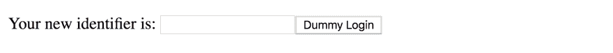
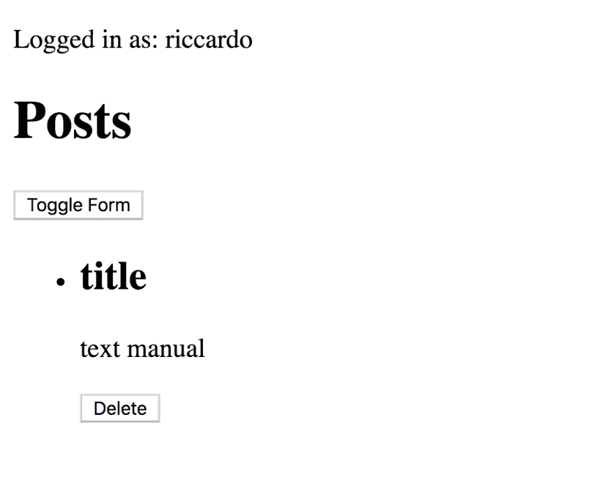

# 使用 Yesod 在 Haskell 中构建博客——身份验证

> 原文：<https://dev.to/riccardoodone/building-a-blog-in-haskell-with-yesod-authentication-3gco>

你可以继续在这里阅读或者[跳转到我的博客](https://odone.io/posts/2019-07-29-building-a-blog-in-haskell-with-yesod%E2%80%93authentication.html)来获得完整的体验，包括美妙的粉色、蓝色和白色调色板。

* * *

这是一个关于 [Yesod](https://www.yesodweb.com/) 的系列:一个 Haskell web 框架，遵循类似于 [Rails](https://rubyonrails.org/) 的哲学。事实上，它非常固执己见，并且提供了许多现成的功能。

一本关于 Yesod 的好书可以在网上免费获得:[用 Haskell 和 Yesod 开发 web 应用](https://www.yesodweb.com/book)。这就是为什么这个系列将是对来自[回购](https://github.com/3v0k4/yesod-blog)的提交的评论，我们将使用它来开发一个超级简单的博客。

换句话说，这不是学习如何使用 Yesod 的好材料。然而，它有望给出该框架如何工作的概述。

* * *

## 使用`authDummy`进行登录

到目前为止，我们一直使用带有用户名和密码的表单作为登录。事实证明，Yesod 提供了 [`Yesod.Auth.Dummy`](http://hackage.haskell.org/package/yesod-auth-1.6.7/docs/Yesod-Auth-Dummy.html) 来简化开发。稍后，在生产中[可以使用其他供应商](http://hackage.haskell.org/package/yesod-auth-1.6.7/docs/Yesod-Auth-Dummy.html)。

[](https://res.cloudinary.com/practicaldev/image/fetch/s--73BFVLQE--/c_limit%2Cf_auto%2Cfl_progressive%2Cq_auto%2Cw_880/https://thepracticaldev.s3.amazonaws.com/i/q1a7mphdgwwoq7vzywqq.png)

提交[76c 4347 CDF 4 f 563 e 9 f 543 e 83 e 5558848d 29826 a 5](https://github.com/3v0k4/yesod-blog/commit/76c4347cdf4f563e9f543e83e5558848d29826a5):

*   使登陆页面总是重定向到登录页面`redirect $ AuthR LoginR`
*   将文章页面设置为成功登录的目标重定向`loginDest _ = PostsR`
*   将我们的`emptyLayout`设置为授权页面`authLayout = liftHandler . emptyLayout`的布局

## 在布局中显示登录用户

提交[aab 5274 C2 ECB 823 b 8 C4 D1 C4 EEC fa 37 BF 0 e 41 c 51 f](https://github.com/3v0k4/yesod-blog/commit/aab5274c2ecb823b8c4d1c4eecfa37bf0e41c51f)将登录用户的用户名添加到布局中。

[](https://res.cloudinary.com/practicaldev/image/fetch/s--cBS4S-Zx--/c_limit%2Cf_auto%2Cfl_progressive%2Cq_auto%2Cw_880/https://thepracticaldev.s3.amazonaws.com/i/petwta9a1ngwmgv2anot.png)

## 文章页面需要验证

提交[9 f97a 457 AFD FB 2 C1 fc 7724 DDE 990d 650168783 a7](https://github.com/3v0k4/yesod-blog/commit/9f97a457afdfb2c1fc7724dde990d650168783a7)将认证添加到帖子页面:

```
- Nothing -> Unauthorized "You must login to access this page" + Nothing -> AuthenticationRequired 
```

Enter fullscreen mode Exit fullscreen mode

换句话说，如果一个未经验证的用户试图访问 posts 页面，就会触发到登录表单的重定向。

## 调整落地

commit[DD 46b 15777 f 6118074 F4 B2 ce 461 f 78 C5 efca 8 ef 1](https://github.com/3v0k4/yesod-blog/commit/dd46b15777f6118074f4b2ce461f78c5efca8ef1)根据当前用户的身份验证状态，将登录页面重定向到登录页面或帖子页面。

* * *

从我个人的电子邮件中获取最新内容。用你的想法回复。让我们互相学习。订阅我的 [PinkLetter](https://odone.io#newsletter) ！