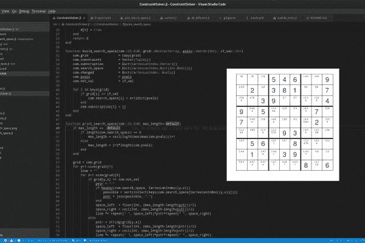

# 在 Julia 中构建约束编程求解器

> 原文：<https://dev.to/wikunia/building-a-constraint-programming-solver-in-julia-2e80>

[](https://res.cloudinary.com/practicaldev/image/fetch/s--OCDf3mwm--/c_limit%2Cf_auto%2Cfl_progressive%2Cq_auto%2Cw_880/https://opensourc.img/a/e/5/2/7/ae52753e2acf811c854573c253cf50bdba14b253-cover.png)

两年多前，我用 Python 写了一个[数独解算器。我真的很喜欢它，因此我花了一些时间在 Julia 中做同样的事情，只是更快；)然后我想在 Julia 中构建一个完整的约束编程求解器。实际上我还是想做。这将是艰难但有趣的。我想在我的博客上分享我的方式，而不是在我做了一些事情后写下来，我想在我做的时候分享我的旅程。](///blog/sudoku)

此外，博客应该尽可能简单，每个人都应该能够一步一步地跟进。

在我的梦中，我们一起建造这个，所以如果有人疯了，想从头开始建造一个约束编程求解器...给我发邮件( [o.kroeger@opensourc.es](mailto:o.kroeger@opensourc.es) )和/或评论这篇文章。

在第一篇文章中，我将创建包和测试用例，并使用回溯法构建最基本的求解器。在接下来的阶段中，我们将一起构建`alldifferent`、`straights`、`sum`约束等。下一个帖子将与之前的 Sudoku 帖子相似，但有动画，当然是用 Julia 写的。

让我们开始吧:

首先我们创建一个包:

```
julia
(v1.2) pkg> generate ConstraintSolver
Generating project ConstraintSolver:
    ConstraintSolver/Project.toml
    ConstraintSolver/src/ConstraintSolver.jl

(v1.2) pkg> activate ConstraintSolver/
Activating environment at `~/Julia/ConstraintSolver/Project.toml`

(v1.2) pkg> develop .
 Resolving package versions...
  Updating `~/.julia/environments/v1.2/Project.toml`
  [e0e52ebd] + ConstraintSolver v0.1.0 [`../../../Julia/ConstraintSolver`]
  Updating `~/.julia/environments/v1.2/Manifest.toml`
  [e0e52ebd] + ConstraintSolver v0.1.0 [`../../../Julia/ConstraintSolver`] 
```

**信息:**用`]`进入套餐模式。

我想为这个项目建立一个 git 存储库，我们也可以在 julia shell 中这样做。

```
shell> cd ConstraintSolver/
/home/ole/Julia/ConstraintSolver

shell> git init
Initialized empty Git repository in /home/ole/Julia/ConstraintSolver/.git/ 
```

**信息:**用`;`进入外壳模式。

我接下来要做的就是创建一个简单的测试文件，我称之为`current.jl`，它在`.gitignore`里面，这样我就可以在不同的分支上测试同样的东西。

```
shell> mkdir test
shell> touch test/current.jl
shell> vim .gitignore 
```

现在，在我们加载模块之前，我建议使用 [Revise](https://github.com/timholy/Revise.jl) 来帮助我们避免在修改代码时重新加载 REPL。

```
julia> using Revise 
```

文件不是真正的测试，它更像是一个游戏场。

我在里面写道:

```
using ConstraintSolver

CS = ConstraintSolver
include("sudoku_fcts.jl")

function main()
    com = CS.init()

    grid = zeros(Int8,(9,9))
    grid[1,:] = [0 0 0 5 4 6 0 0 9]
    grid[2,:] = [0 2 0 0 0 0 0 0 7]
    grid[3,:] = [0 0 3 9 0 0 0 0 4]
    grid[4,:] = [9 0 5 0 0 0 0 7 0]
    grid[5,:] = [7 0 0 0 0 0 0 2 0]
    grid[6,:] = [0 0 0 0 9 3 0 0 0]
    grid[7,:] = [0 5 6 0 0 8 0 0 0]
    grid[8,:] = [0 1 0 0 3 9 0 0 0]
    grid[9,:] = [0 0 0 0 0 0 8 0... 
```

在[打开源代码](https://opensourc.es/blog/constraint-solver-1)阅读完整帖子