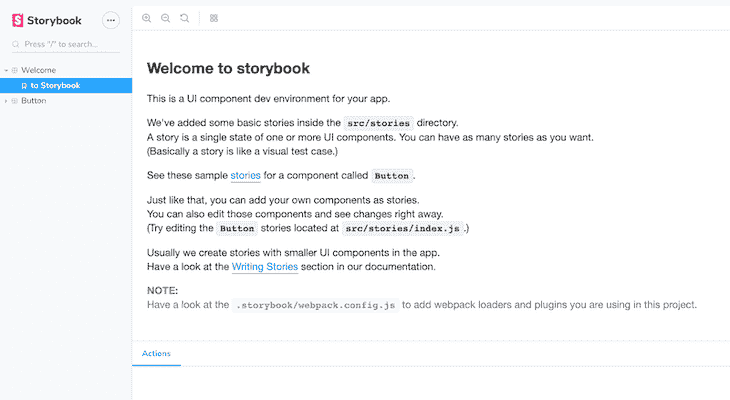
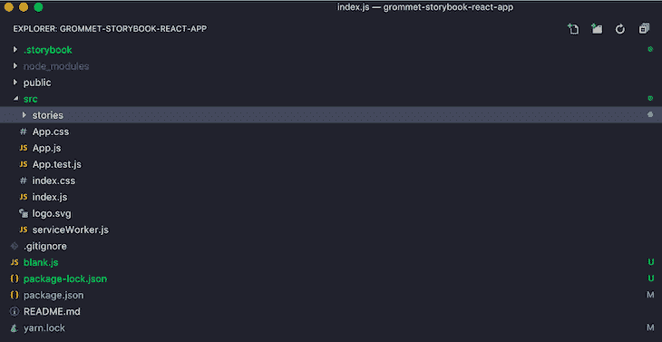
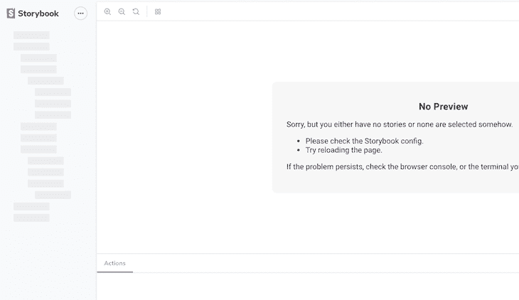
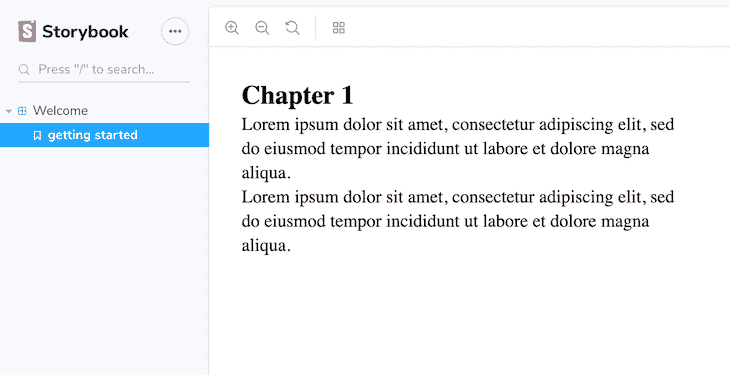
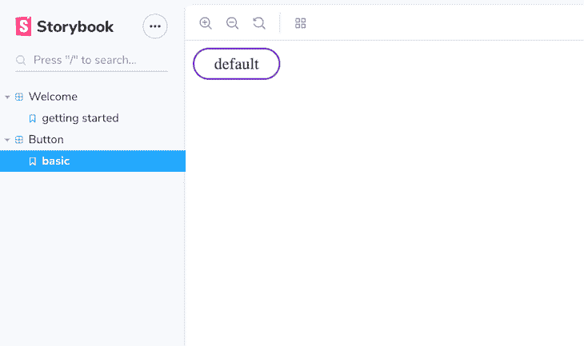
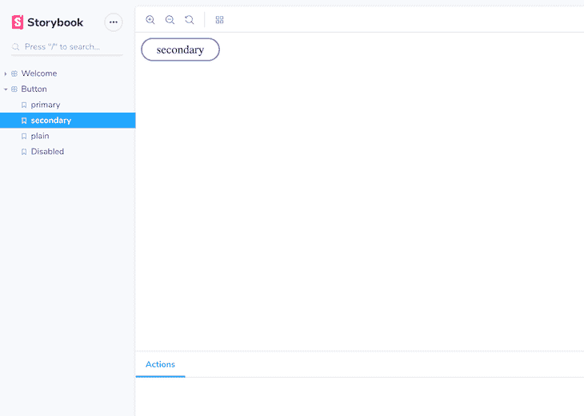

# 用索环和故事书构建设计系统

> 原文：<https://dev.to/bnevilleoneill/building-a-design-system-with-grommet-and-storybook-1kif>

**作者:[艾曼纽](https://blog.logrocket.com/author/emmanuelyusufu/)优素福** ✏️

## 简介

我们都听说过“设计系统”这个时髦词。但是我们如何理解它，更重要的是，我们如何为自己建造一个？这篇文章将指导你使用 React、Grommet 和 Storybook 创建一个设计系统。

## 到底什么是设计系统？

一个设计系统由一种设计语言、一个组件库和一个文档/风格指南网站组成，前两者都存在于其中。

正如 Emma Wedekind 在 [this talk 中所详述的，当开发人员谈论设计系统时，他们大多指的是组件库；当设计师这样做时，他们会参考设计语言。项目经理最有可能关心的是文档/风格指南网站，所有的东西都在那里。](https://www.youtube.com/watch?v=ropAuzI7MtA&t=24s)

下面阐述这三个部分的目的:

*   设计语言:这有助于将我们的产品塑造成我们品牌的代表。它包括颜色(代表情感)、字体大小、可访问性和动作(代表个性)。
*   组件库:这些是可重用的代码组件，作为我们应用程序的构建模块。它们也表达了设计语言。这些包括按钮、输入字段等。如果您没有从头开始构建自己的库，那么您可以定制一个流行的库，比如 Grommet，以满足您的项目需求。
*   **文档/风格指南网站:**这是你记录所有关于设计语言和组件库的网站。这通过允许您的所有团队成员访问它来创建一致性。

设计系统通常提供构建我们的应用程序的构件。随着公司的产品变得越来越复杂，团队规模越来越大，这使得公司的产品套件具有一致的用户体验。

各大软件公司都有自己的设计系统。一些流行设计系统的例子有 Shopify 的[北极星](https://polaris.shopify.com/)，谷歌的[材料设计](https://material.io/design/)，以及 Trello 的[玉米片](https://blog.trello.com/introducing-nachos-a-tasty-new-design-system-for-trello)。

那么，如何为自己的品牌打造一个呢？你首先需要准备好设计系统的三个部分。

[](https://logrocket.com/signup/)

## 索环

[Grommet](https://v2.grommet.io/) 是一个 React 组件库，它提供了可响应且可访问的移动优先代码组件，您可以轻松地将其用于您的项目。

特别值得注意的是，Grommet 提供了强大的主题工具，允许您定制组件库，以符合您的颜色、类型、组件交互和布局需求。这解决了我们之前讨论的设计语言部分。

## 故事书

Storybook 是一个开源工具，允许您记录和探索代码的组成部分。它可以与 React、Vue 和 Angular 一起使用，还可以让您单独处理组件，并在不同的状态下测试它们。

最重要的是，Storybook 支持自动生成可定制的风格指南网站。

## 安装

首先，让我们搭建一个空白的 React 应用程序。

```
npx create-react-app my-app
cd grommet-storybook-react-app 
```

在代码编辑器中打开项目。下一步是安装索环:

```
npm install grommet styled-components --save 
```

还安装故事书:

```
npx -p @storybook/cli sb init 
```

回想一下，Storybook 可以用于 React、Vue 和 Angular。上面的命令将检测我们正在使用的框架，并安装合适的故事书版本。在我们的例子中，React 版本`@storybook/react`将被安装。

安装完成后，运行 app:

```
npm run storybook 
```

浏览器中将显示以下屏幕:

[](https://res.cloudinary.com/practicaldev/image/fetch/s--u__vS5HC--/c_limit%2Cf_auto%2Cfl_progressive%2Cq_auto%2Cw_880/https://i2.wp.com/blog.logrocket.com/wp-content/uploads/2019/09/storybook-welcome-component-browser.png%3Fresize%3D730%252C400%26ssl%3D1)

正如您在组件资源管理器中看到的，Storybook 提供了两个现成的组件用于演示。这些是`Welcome`和`Button`组件。

如果我们查看我们的项目文件夹，我们会注意到安装后添加了`.storybook`和`stories`文件夹。

[](https://res.cloudinary.com/practicaldev/image/fetch/s--vhyI0n21--/c_limit%2Cf_auto%2Cfl_progressive%2Cq_auto%2Cw_880/https://i1.wp.com/blog.logrocket.com/wp-content/uploads/2019/09/stories-folder.png%3Fresize%3D730%252C377%26ssl%3D1)

访问`stories/index.js`文件夹查看演示组件。观察并删除或注释掉下面的部分；我们将构建自己的欢迎和按钮组件。

```
storiesOf('Welcome', module).add('to Storybook', () => <Welcome showApp={linkTo('Button')} />);

storiesOf('Button', module)
  .add('with text', () => <Button onClick={action('clicked')}>Hello Button</Button>)
  .add('with some emoji', () => (
    <Button onClick={action('clicked')}>
      <span role="img" aria-label="so cool">
        😀 😎 👍 💯
      </span>
    </Button>
  )); 
```

这是应该留下的:

```
import React from 'react';

import { storiesOf } from '@storybook/react';
import { action } from '@storybook/addon-actions';
import { linkTo } from '@storybook/addon-links'; 
```

[](https://res.cloudinary.com/practicaldev/image/fetch/s--VY_SIi6---/c_limit%2Cf_auto%2Cfl_progressive%2Cq_auto%2Cw_880/https://i0.wp.com/blog.logrocket.com/wp-content/uploads/2019/09/storybook-components-removed-browser.png%3Fresize%3D730%252C422%26ssl%3D1)

## 创建我们的组件

现在，进入正题:我们将从构建欢迎和按钮组件开始，就像我们前面看到的一样。

任何好的文档都有一个特点，那就是它有一个帮助开发人员开始的欢迎说明。这通常会提供设置或安装指南。让我们假设我们正在为你的公司建立一个设计系统。我们可以使用`welcome`组件作为我们的欢迎说明。这意味着它将被明文填充。

### `Welcome`分量

在`src`文件夹中创建一个`components`文件夹，然后在`components`中创建一个`Welcome.js`文件。将以下代码放入文件:

```
import React from 'react';
import { Heading, Paragraph, Box } from 'grommet';

class Welcome extends React.Component {

  render() {
    return (
      <Box direction="column" pad="medium">

        <Heading margin="none" level="3">Chapter 1</Heading>
        <Paragraph margin="none">
          Lorem ipsum dolor sit amet,
          consectetur adipiscing elit,
          sed do eiusmod tempor incididunt ut
          labore et dolore magna aliqua.
        </Paragraph>
        <Paragraph margin="none">
          Lorem ipsum dolor sit amet,
          consectetur adipiscing elit,
          sed do eiusmod tempor incididunt ut
          labore et dolore magna aliqua.
        </Paragraph>

      </Box>
    );
  }

}

export default Welcome; 
```

在上面的代码中，我们导入了`Heading`和`Paragraph`，它们是来自 Grommet 的类型组件。我们还导入了`Box`，这是一个放置内容的容器。一切都在一个`Welcome`组件中，我们已经为导出设置了这个组件。

在`stories`文件夹中，转到`index.js`并导入`Welcome`组件。

```
import Welcome from '../components/Welcome'; 
```

还将以下内容添加到`index.js` :

```
storiesOf('Welcome', module).add('getting started', () => <Welcome />); 
```

在 Storybook 中，一个故事指的是一个组件及其几种可能的状态，例如，一个处于不同状态的按钮。

在上面的代码中，`storiesOf()`函数帮助我们在组件浏览器界面中命名一个特定的故事，而`.add()`函数设置一个下拉菜单，当它被释放时，呈现组件的不同状态。当我们创建下一个组件时，这一点会更清楚。

[](https://res.cloudinary.com/practicaldev/image/fetch/s--ZwMN10qQ--/c_limit%2Cf_auto%2Cfl_progressive%2Cq_auto%2Cw_880/https://i1.wp.com/blog.logrocket.com/wp-content/uploads/2019/09/storybook-custom-welcome-component.png%3Fresize%3D730%252C375%26ssl%3D1)

### `Button`分量

按钮在界面中被大量使用。它们对产品有很大的影响，是创建设计系统的一个很好的起点。

要创建`Button`组件，在`components`文件夹中创建一个`Button.js`文件。将以下代码粘贴到:

```
import React from 'react';
import { Button as GrommetBtn } from 'grommet';

class Button extends React.Component {
  render() {
    return (
      <GrommetBtn label="default" />
    );
  }
}

export default Button; 
```

注意，因为我想创建我们自己的组件`Button`，我不得不将 Grommet 的默认按钮重命名为`GrommetBtn`以防止名称冲突。

现在导入`index.js` :
中的`Button`组件

```
import Button from '../components/Button'; 
```

将按钮故事添加到同一个文件:

```
storiesOf('Button', module).add('basic', () => <Button />); 
```

这将呈现如下所示:

[](https://res.cloudinary.com/practicaldev/image/fetch/s--TRljUQl8--/c_limit%2Cf_auto%2Cfl_progressive%2Cq_auto%2Cw_880/https://i1.wp.com/blog.logrocket.com/wp-content/uploads/2019/09/storybook-custom-default-button.png%3Fresize%3D730%252C433%26ssl%3D1)

正如在任何设计系统中所期望的那样，我们应该能够在许多情况下重用像按钮这样的组件。这通常是通过向组件传递自定义属性来实现的。

无论传递什么属性，都会影响组件的呈现方式。幸运的是，索环为每个组件配备了足够的道具来满足您的需求。

为了确保我们的按钮组件接收从`index.js`传递给它的任何属性，请转到`Button.js`并在花括号之间添加一个表达式。

```
<GrommetBtn label={this.props.label} {...this.props} /> 
```

现在让我们创建并记录按钮的不同变体。转到按钮故事并进行以下更改:

```
storiesOf('Button', module)
  .add('primary', () => <Button primary label="primary" />)
  .add('secondary', () => <Button primary={false} label="secondary" />)
  .add('plain', () => <Button plain label="plain" />)
  .add('Disabled', () => <Button disabled label="Disabled" />); 
```

当我们运行代码时，我们应该会看到下面的屏幕:

[](https://res.cloudinary.com/practicaldev/image/fetch/s--tXgkT6s9--/c_limit%2Cf_auto%2Cfl_progressive%2Cq_auto%2Cw_880/https://i0.wp.com/blog.logrocket.com/wp-content/uploads/2019/09/storybook-custom-secondary-button.png%3Fresize%3D730%252C521%26ssl%3D1)

扣眼按钮有很多有用的道具，比如`accessibilityTitle`、`active`、`icon`、`plain`、`target`、`size`、`onClick`、`href`、`id`、`label`、`type`等。请在这里随意查看它们。

值得一提的是，Storybook 可以用附加组件来增压[，这里可以看到](https://storybook.js.org/addons/)。附加组件是可以附加到 Storybook 上的额外功能，使其更有用并增加高级功能。

例子有[源附加组件](https://github.com/storybookjs/storybook/tree/master/addons/storysource)(允许你查看组件的源代码以复制和粘贴)[、notes 附加组件](https://github.com/storybookjs/storybook/tree/master/addons/notes)(用于在 markdown 中记录组件的使用)，以及用于故事书定制的[背景附加组件](https://github.com/storybookjs/storybook/tree/master/addons/backgrounds)。

## 自定义扣眼主题

我们现在来看看三种方式，你可以自定义你的索环主题。

1.  索环组件有一个[顶层包装容器](https://v2.grommet.io/grommet),可以用来对组件进行全局样式化。

```
const customTheme = {
    global: {
       colors: {
       custom: "#cc6633"
       }
    }
};

const Themed = () => (
  <Grommet theme={customTheme}>
    <Box pad="medium">
      <Anchor icon={<Add />} label="Add" color="custom" />
    </Box>
  </Grommet>
); 
```

1.  Grommet 还提供了 [`ThemeContext.Extend`](https://v2.grommet.io/themecontext?c=DwFQFgpgthDCD2A7ALhAHsgdAUQxRAJgFAAEJAbgIYA2ArhALwDeTJA5tfAEY0BcJrAMbxOAJwDO-VgXiD+AcgDEAM2UBONYMHySAXz17dRAHykSwAELw0JAA6UCDAETVKothCckeggNZtReFpCZxlBLwIAS1EIQWRIpGdAgHcvAHpTMktrOwdnV3dPb0o-AKCQpzCI6Nj4xKcU9NNgNPBoOCRUDBw8QmMgA) 来对组件进行局部样式化。

```
<ThemeContext.Extend
  value={{ global: { colors: { doc: '#ff99cc' } } }}
>
  <Box pad="large" background="doc" direction="row" />
  <Box pad="large" background="doc" direction="row" />
</ThemeContext.Extend> 
```

1.  您还可以使用样式化组件来单独样式化组件。

```
import styled from 'styled-components`;
import { Button } from 'grommet';
const MyStyledButton = styled(Button)`
   font-weight: bold;
   background-color: #BADA55;
`;

const MyComponent = () => (
  <div>
     Press Button <MyStyledButton label="Press Me" />
  </div>
); 
```

## 将文档部署为静态应用程序

为了向整个团队展示我们的组件库，我们必须将其部署为一个站点。您可以将其部署到 Netlify、GitHub 页面或任何静态托管服务。

只需将以下 npm 脚本添加到您的`package.json` :

```
{
  "scripts": {
    "build-storybook": "build-storybook -c .storybook -o .out"
  }
} 
```

然后运行`yarn build-storybook`。

这将把 Storybook 从项目目录构建到一个静态 web 应用程序中，并将其放在`.out`目录中。现在，您可以将内容部署在`.out`目录中的任何位置。

在本地测试:

```
npx http-server .out 
```

## 结论

在这篇文章中，我们探索了能让你建立设计系统的技术。我们已经讨论了如何实现组件、定制、文档和托管您的设计系统。现在去做一些很棒的东西吧！

* * *

**编者按:**看到这个帖子有问题？你可以在这里找到正确的版本。

## Plug: [LogRocket](https://logrocket.com/signup/) ，一款适用于网络应用的 DVR

[](https://res.cloudinary.com/practicaldev/image/fetch/s--6FG5kvEL--/c_limit%2Cf_auto%2Cfl_progressive%2Cq_auto%2Cw_880/https://i2.wp.com/blog.logrocket.com/wp-content/uploads/2017/03/1d0cd-1s_rmyo6nbrasp-xtvbaxfg.png%3Fresize%3D1200%252C677%26ssl%3D1)

[log rocket](https://logrocket.com/signup/)是一个前端日志工具，让你重放问题，就像它们发生在你自己的浏览器中一样。LogRocket 不需要猜测错误发生的原因，也不需要向用户询问截图和日志转储，而是让您重放会话以快速了解哪里出错了。它可以与任何应用程序完美配合，不管是什么框架，并且有插件可以记录来自 Redux、Vuex 和@ngrx/store 的额外上下文。

除了记录 Redux 动作和状态，LogRocket 还记录控制台日志、JavaScript 错误、stacktraces、带有头+体的网络请求/响应、浏览器元数据、自定义日志。它还使用 DOM 来记录页面上的 HTML 和 CSS，甚至为最复杂的单页面应用程序重新创建像素级完美视频。

[免费试用](https://logrocket.com/signup/)。

* * *

帖子[用索环和故事书](https://blog.logrocket.com/building-design-system-grommet-storybook/)构建一个设计系统最先出现在[博客](https://blog.logrocket.com)上。