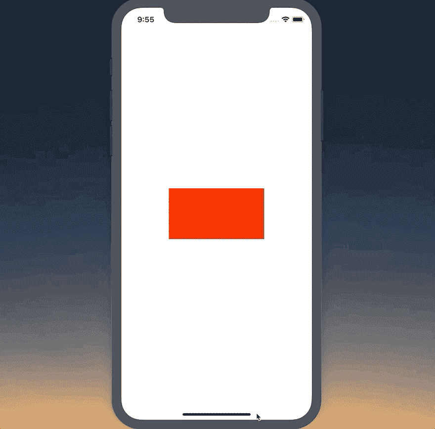
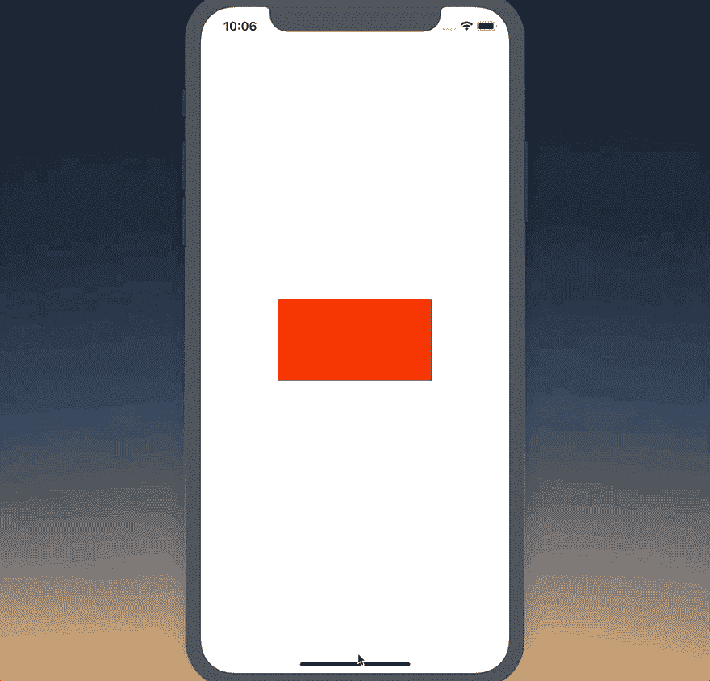

# 在 React Native 中构建维度挂钩

> 原文：<https://dev.to/spencercarli/building-a-dimensions-hook-in-react-native-10ao>

> 本课[最初发表于 React Native 学校](https://www.reactnativeschool.com/building-a-dimensions-hook-in-react-native)。请务必访问我们的 React 本地课程完整库！

如果你需要在你的设备中同时支持纵向和横向，你很可能会使用 React Native 自带的`Dimensions` API。

我的代码中充满了对`Dimensions.get('screen')`的调用——但是如果用户开始使用纵向应用，然后切换到横向应用会怎样？

在今天的课程中，我们将构建一个钩子，当设备方向改变时，它会给你用户当前的屏幕尺寸并更新。

## 启动器代码

App.js

```
import React from 'react';
import { View, Dimensions, StyleSheet } from 'react-native';

const styles = StyleSheet.create({
  container: {
    flex: 1,
    backgroundColor: '#fff',
    alignItems: 'center',
    justifyContent: 'center',
  },
  containerLandscape: {
    backgroundColor: '#000',
  },
  box: {
    backgroundColor: 'red',
    height: 100,
  },
});

const screen = Dimensions.get('screen');

export default () => {
  const isLandscape = screen.width > screen.height;
  return (
    <View style={[styles.container, isLandscape && styles.containerLandscape]}>
      <View style={[styles.box, { width: screen.width / 2 }]} />
    </View>
  );
}; 
```

[](https://res.cloudinary.com/practicaldev/image/fetch/s--t98e3XTU--/c_limit%2Cf_auto%2Cfl_progressive%2Cq_66%2Cw_880/https://thepracticaldev.s3.amazonaws.com/i/r65jwt35rhjj4s11287x.gif)

对于这个示例应用程序，我希望我们的红框的宽度*总是*是屏幕宽度的 50%。我也希望背景是黑色的景观。你可以看到，如果我们保持原来的方向，*就会这样。从肖像开始，我们已经有了合适的宽度和颜色背景。如果我们切换到风景，虽然它保持原来的样子。*

## 钩子

我们将创建一个名为`useScreenDimensions`的钩子。它应该返回屏幕宽度，高度，以及提供给我们的任何其他数据。当方向改变时，它应该更新该信息。

首先，我们将使用`useState`返回初始尺寸:

App.js

```
// ...

const useScreenDimensions = () => {
  const [screenData, setScreenData] = useState(Dimensions.get('screen'));

  return screenData;
};

export default () => {
  const screenData = useScreenDimensions();
  const isLandscape = screenData.width > screenData.height;

  return (
    <View style={[styles.container, isLandscape && styles.containerLandscape]}>
      <View style={[styles.box, { width: screenData.width / 2 }]} />
    </View>
  );
}; 
```

这给了我们与之前完全相同的行为。

接下来，我们将通过`Dimensions.addEventListener`监听任何尺寸变化。这将使用包含`window`和`screen`的对象调用回调函数。

App.js

```
// ...

const useScreenDimensions = () => {
  const [screenData, setScreenData] = useState(Dimensions.get('screen'));

  useEffect(() => {
    const onChange = result => {
      setScreenData(result.screen);
    };

    Dimensions.addEventListener('change', onChange);
  });

  return screenData;
};

// ... 
```

这将更新`screenData`变量，这将依次更新我们的组件。

如果你现在运行它，它的工作！但是我们有一个大问题。

现在，监听器将永远运行——我们永远不会告诉它什么时候应该停止。这可能会引起问题。

要清理带有钩子的监听器，你需要从`useEffect`钩子返回一个函数。

对我们来说，这意味着返回一个我们调用`Dimensions.removeEventListener`的函数；

App.js

```
// ...

const useScreenDimensions = () => {
  const [screenData, setScreenData] = useState(Dimensions.get('screen'));

  useEffect(() => {
    const onChange = result => {
      setScreenData(result.screen);
    };

    Dimensions.addEventListener('change', onChange);

    return () => Dimensions.removeEventListener('change', onChange);
  });

  return screenData;
};

// ... 
```

最后，让这个挂钩告诉我们设备是否处于纵向模式，而不是依赖消费者每次都必须这样做，这将是有价值的。

App.js

```
// ...

const useScreenDimensions = () => {
  const [screenData, setScreenData] = useState(Dimensions.get('screen'));

  useEffect(() => {
    const onChange = result => {
      setScreenData(result.screen);
    };

    Dimensions.addEventListener('change', onChange);

    return () => Dimensions.removeEventListener('change', onChange);
  });

  return {
    ...screenData,
    isLandscape: screenData.width > screenData.height,
  };
};

export default () => {
  const screenData = useScreenDimensions();

  return (
    <View
      style={[
        styles.container,
        screenData.isLandscape && styles.containerLandscape,
      ]}
    >
      <View style={[styles.box, { width: screenData.width / 2 }]} />
    </View>
  );
}; 
```

现在你知道了！一个易于重用的钩子，允许你在应用程序中监听任何维度的变化。

[](https://res.cloudinary.com/practicaldev/image/fetch/s--mRqv5A4r--/c_limit%2Cf_auto%2Cfl_progressive%2Cq_66%2Cw_880/https://thepracticaldev.s3.amazonaws.com/i/b6dwqhn5wjo5u01qlrwo.gif)

## 最终代码

App.js

```
import React, { useEffect, useState } from 'react';
import { View, Dimensions, StyleSheet } from 'react-native';

const styles = StyleSheet.create({
  container: {
    flex: 1,
    backgroundColor: '#fff',
    alignItems: 'center',
    justifyContent: 'center',
  },
  containerLandscape: {
    backgroundColor: '#000',
  },
  box: {
    backgroundColor: 'red',
    height: 100,
  },
});

// const screen = Dimensions.get('screen');

const useScreenDimensions = () => {
  const [screenData, setScreenData] = useState(Dimensions.get('screen'));

  useEffect(() => {
    const onChange = result => {
      setScreenData(result.screen);
    };

    Dimensions.addEventListener('change', onChange);

    return () => Dimensions.removeEventListener('change', onChange);
  });

  return {
    ...screenData,
    isLandscape: screenData.width > screenData.height,
  };
};

export default () => {
  const screenData = useScreenDimensions();

  console.log(screenData);
  return (
    <View
      style={[
        styles.container,
        screenData.isLandscape && styles.containerLandscape,
      ]}
    >
      <View style={[styles.box, { width: screenData.width / 2 }]} />
    </View>
  );
}; 
```