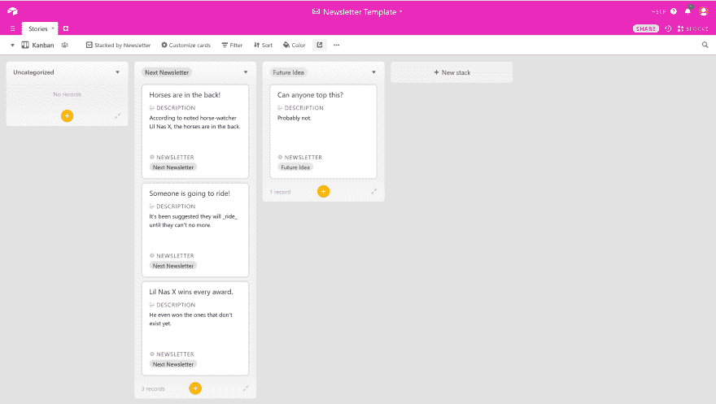
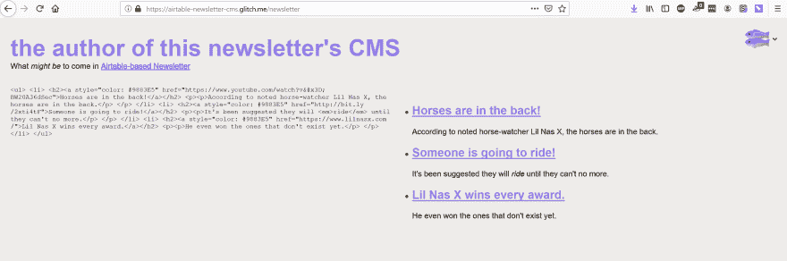

# 建立一个迷你 CMS 与节点，车把，和空气表

> 原文：<https://dev.to/casseylottman/building-a-mini-cms-with-node-handlebars-and-airtable-128p>

我最近用 TinyLetter.com 开始了一个关于住房&街道政策的时事通讯。在我最初的几个版本中，我使用 TinyLetter 的 WYSIWYG 编辑器，但是我很快发现[生成的 HTML &样式可能非常不一致](https://tinyletter.com/cassey/letters/america-the-update)。好尴尬！

幸运的是，TinyLetter WYSIWYG 编辑器还允许您直接输入 HTML 源代码。我认为这是最好的途径，但是我更喜欢用 Markdown 编写我的时事通讯，并以结构化的方式生成 HTML。我还在寻找一种在旅途中为我的时事通讯输入想法的方法——移动设备上的 TinyLetter 编辑器不是最友好的，而且我没有已经在使用的 go-to notes 应用程序。

我偶然看到了这篇关于使用 Trello 作为 CMS 的博客文章，并决定尝试使用 T2 的 Airtable 来构建类似的东西，我已经用它来存储结构化的个人数据和待办事项。我知道有一些[很棒的 Airtable 首发项目可以在 Glitch.com](https://glitch.com/@cassey/airtable-examples-starters)上重新混合，所以构建其中一个感觉是很自然的一步。我重新混合了 Glitch 项目 Airtable-Example 并开始入侵。

首先，我构建了 [Airtable 库来保存我的简讯内容](https://airtable.com/shrCO5ikWX59JShpn)。我的简讯通常是链接综述的形式，所以我希望每个简讯都有多个条目，带有标题和相关的 URL，以及说明为什么我认为人们可能会对这个链接感兴趣的描述。

接下来，我开始编写代码。起初，我想也许我想把生成的 HTML 写到一个可以复制的文件中，但是我也想在把它粘贴到 TinyLetter 编辑器之前，能够看到给定新闻稿的渲染 HTML。因此，我决定了一种格式，在这种格式下，HTML 将与呈现的新闻稿内容并排显示。

起初我使用 EJS，因为它是一个模板引擎，在过去的简单项目中对我来说效果很好。我很快就发现了一些限制，虽然这导致了车把开关。首先，在最新的 EJS 主版本中不支持自定义过滤器。我想要一个过滤器来呈现我的一些数据(每个新闻条目的描述字段)作为 markdown，这样当我对一个给定的链接有很多要说的时候，我可以有很好的格式描述。

我对一个特定链接有很多话要说的情况也导致了我的新闻简报的一种新格式:不是有许多链接的`<ul>`，而是我想发送关于单个链接的信息，这不属于`<ul>`。因此，我在车把上找到了一些`compare`过滤器的帮助器代码，如果我有多个链接要显示，它会让我呈现一个`<ul>`，如果只有一个链接，它会让我呈现一个`
`。我觉得有点奇怪，这不是内置于车把，但它很容易为它添加一个自定义助手。

我想让我的工作进展简讯是私人的，所以我添加了一些非常基本的认证。我在索引页面上创建了一个带有密码字段的表单，必须填写该字段以匹配我在`.env`中设置的值，以便显示时事通讯的内容。

我还想让我的 CMS 简讯尽可能广泛，这样其他觉得有用的人也可以使用它。因此，我存储了所有自定义到我的应用程序的信息(我的简讯的名称，我的名字，配置从其中提取简讯内容的基础的值，等等。)在`.env`文件中。当你[在 Glitch](https://glitch.com/edit/#!/remix/airtable-newsletter-cms) 上重新混合 Airtable-Newsletter-CMS 项目时，你会得到一个带有`.env`的项目版本，其中已经准备好填入你自己的值。

你可以在 Glitch 上看到[正在运行的项目，如果你觉得有用的话，你可以把它重新混合起来供自己使用。](https://airtable-newsletter-cms.glitch.me) 

[https://glitch.com/embed/#!/embed/airtable-newsletter-cms?path=index.html](https://glitch.com/embed/#!/embed/airtable-newsletter-cms?path=index.html)

当然，如果你关心住房和街道政策的发展，[订阅 Cassey 的宜居社区综述](https://tinyletter.com/cassey)，这是创建这个应用程序的主要动力。