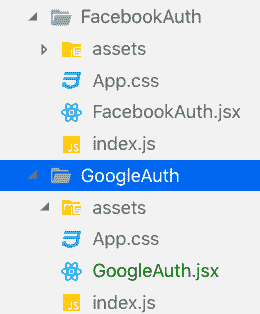
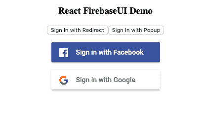
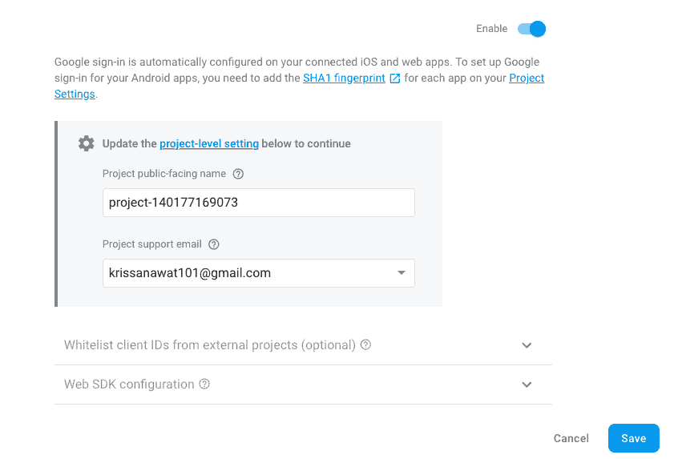
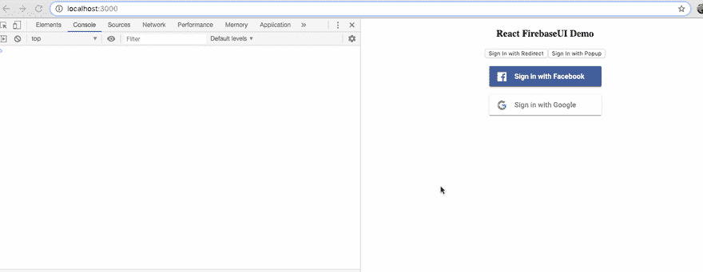
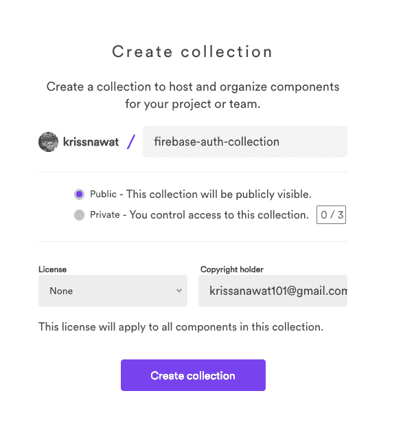
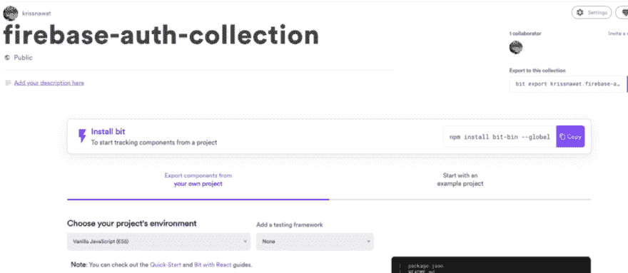
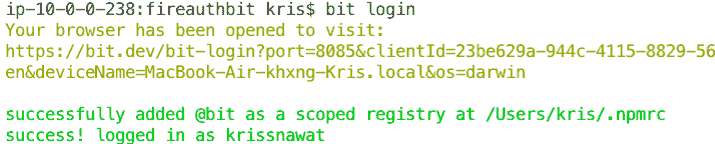
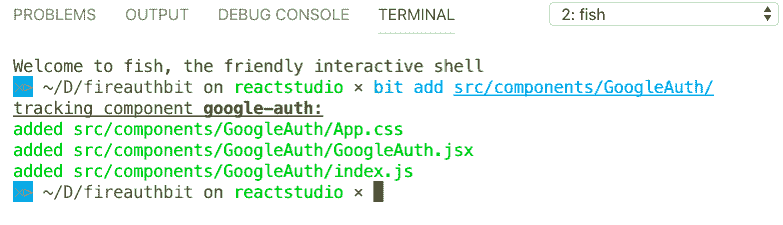
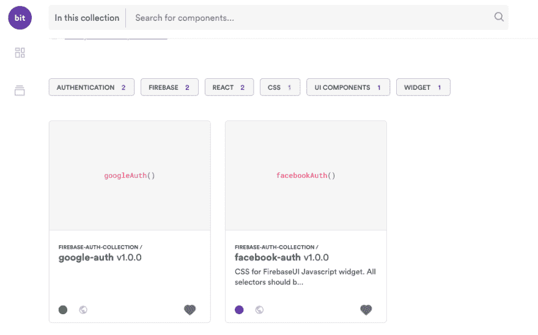

# 构建可重用的 React 登录组件

> 原文：<https://dev.to/kris/building-a-reusable-react-login-component-1d48>

#### 了解如何构建一个可重用和可共享的 Firebase Google 登录组件

在本章中，我们将从第[章](https://dev.to/kris/building-a-reusable-firebase-facebook-login-component-27o6)中停止的地方继续，第一章涉及实现脸书登录和启动 react 应用程序结构。我们将把 Google 登录添加到我们在第一章中创建的同一个应用程序中。这一章简短、甜蜜、简单，因为我们已经完成了前一章中有问题的部分。我们已经将本教程分解成多个小标题，以便您掌握 React 项目、Google 登录、firebase auth、组件实现等概念。并据此工作。

现在，让我们继续实现谷歌登录！

### 你会学到什么…？

*   如何创建新的 React 应用程序？
*   React 中如何传道具？
*   如何使用 Firebase 认证？
*   如何创建和设置谷歌应用程序？
*   [如何使用 Bit。](https://bit.dev)

第一章已经涵盖了大部分的要点，所以这一章在我们继续学习的时候会让概念更加清晰。

### 问题

因为我们已经在第一章中完成了大部分有问题的部分，所以本章只处理 Google 登录的实现问题；这与脸书登录相比相对简单。所以，我们需要在不浪费太多时间的情况下快速取胜。我们需要快速产生结果，这是保持我们达到最终里程碑的动力的重要部分。

### 要求

这里有一个插件、包和服务的完整列表，我们需要从本教程中获得一些东西:

*   Nodejs v8.x.x 或更高版本与 NPM/yarn 一起安装。
*   火基和比特账户。
*   你已经完成了上一章的项目。
*   火基和钻头包。

### 可重复使用以前的代码

为了方便起见，我们将复制我们在第一章中创建的脸书组件，并将所有相关名称改为 Google。项目目录结构如下所示:

[](https://res.cloudinary.com/practicaldev/image/fetch/s--67jcuKo6--/c_limit%2Cf_auto%2Cfl_progressive%2Cq_auto%2Cw_880/https://cdn-images-1.medium.com/max/260/1%2AlCl_4qmH6WU9Xrq7Ugjnkg.png)

下面详细介绍了我们将脸书更名为谷歌的地方:

1.  文件夹 **FacebookAuth** 更改为 **GoogleAuth。**

2.  ***FacebookAuth.jsx*** 文件改为 ***GoogleAuth.jsx*** 文件。

3.  在 ***GoogleAuth.jsx*** 文件中，将类名改为 ***GoogleAuth。***

4.  在 ***handleLogin()*** 函数中，将***face book auth provider***改为 ***GoogleAuthProvider。*T11】**

然后，我们需要将 HTML 部分中的**脸书**改为**谷歌**，如下面的代码片段所示:

```
<li class="firebaseui-list-item">
     <button
        onClick={this.handleLogin}
        class="firebaseui-idp-button mdl-button mdl-js-button mdl-button--raised firebaseui-idp- **google** firebaseui-id-idp-button">
         <span class="firebaseui-idp-icon-wrapper">

           
          </span>
          <span class="firebaseui-idp-text firebaseui-idp-text-long">
              Sign in with **Google**
          </span>
          <span class="firebaseui-idp-text firebaseui-idp-text-short">
**Google**
          </span>
      </button> 
```

上面的代码将为我们提供 Google 登录组件，我们需要将它导入到我们的 *App.js* 文件中。

现在，我们需要复制下面的代码，并将其添加到我们的 *App.js* 文件中。

在我们的 *GoogleAuth/index.js* 文件中，我们需要将 *FacebookAuth* 的所有导入替换为 *GoogleAuth，*，如下面的代码片段所示:

现在，每一个更改都将只在我们的 *App.js* 文件中进行。我们需要修改 *App.js* 文件以包含组件并传递 firebase 配置，如下面的代码片段所示:

因此，我们将在浏览器屏幕或应用程序屏幕上看到以下结果:

[](https://res.cloudinary.com/practicaldev/image/fetch/s--UJpYgco6--/c_limit%2Cf_auto%2Cfl_progressive%2Cq_auto%2Cw_880/https://cdn-images-1.medium.com/max/417/1%2AqvDPm_w4Zdw1LJC4U2Lb0w.png)

我们可以看到，这是工作得很好。现在，我们把一个移动到我们教程章节的 Firebase 部分。

#### 激活 Firebase 中的登录方式

在这一步中，我们需要在 firebase 控制台中激活登录方法，以便 Google 登录能够工作。为此，我们需要:

转到 firebase 控制台>身份验证>启用 Google 登录方法

最后，我们需要提供一个项目支持电子邮件，然后单击“保存”按钮，如下面的控制台屏幕截图所示:

[](https://res.cloudinary.com/practicaldev/image/fetch/s--cj7g_qSM--/c_limit%2Cf_auto%2Cfl_progressive%2Cq_auto%2Cw_880/https://cdn-images-1.medium.com/max/841/1%2AgouRIMIT2S2z5DzLO6RsMA.png)

完成后，我们需要返回到我们的应用程序，并点击谷歌登录。我们将在浏览器控制台中看到以下模拟和结果:

[](https://res.cloudinary.com/practicaldev/image/fetch/s--_gYblRuy--/c_limit%2Cf_auto%2Cfl_progressive%2Cq_66%2Cw_880/https://cdn-images-1.medium.com/max/1024/1%2AirGP2EddTAJy6dGaD5xsfg.gif)

最后，我们已经在 react 应用程序中成功实现了 Google 登录。

现在，我们需要像上一章一样，通过创建一个新的集合来将代码推入位。

### 使其可重复使用并与 Bit 共享

[共享可重用代码组件作为团队成员](https://bit.dev)

为了使我们的代码可重用和可共享，我们将进行一些重组，并将所有代码移动到“组件”中(这不是强制性的，但在使用[位](https://bit.dev)时，这是一种更好的做法)。然后，我们将它(及其所有依赖项)导出到 [Bit 的 cloud](https://bit.dev/components) 上的一个组件集合中，以便与其他人共享和轻松重用。

在这一步中，我们将再次推送新组件，即 Google 登录组件。我们已经安装了我们的 Bit 包并连接到我们的 Bit 帐户。因此，我们需要创建一个集合，并从跟踪组件开始。

注意:第一步和第二步是安装 Bit account。如果您已经有一个 Bit 帐户，可以跳过这些步骤。

#### 1。在项目上创建一个集合并初始化 Bit

这里，我们在 Bit 上创建一个新的集合，我们将把所有的组件代码放入这个集合。我们使用 Bit“create collection”配置页面创建一个名为“firebase-auth-collection”的新集合，如下面的屏幕截图所示:

[](https://res.cloudinary.com/practicaldev/image/fetch/s--HtOP7Nix--/c_limit%2Cf_auto%2Cfl_progressive%2Cq_auto%2Cw_880/https://cdn-images-1.medium.com/max/587/1%2AFF1zzr2tVDlxytpkbV7Cbw.png)

为了成功地将整个项目推进到 Bit，您需要遵循以下页面上给出的说明:

[](https://res.cloudinary.com/practicaldev/image/fetch/s--CMCnMHk3--/c_limit%2Cf_auto%2Cfl_progressive%2Cq_auto%2Cw_880/https://cdn-images-1.medium.com/max/1024/1%2AccQIEhgssTq-cQdb4stu7w.png)

首先，我们需要安装 Bit CLI

> 利用 NPM，
> 
> *npm 安装位-bin -全局*

然后，我们需要在 Bit CLI 中转至项目目录，并在 Bit CLI 上执行 bit init 和 run bit login 命令，如下图所示:

[](https://res.cloudinary.com/practicaldev/image/fetch/s--t7HbYBU_--/c_limit%2Cf_auto%2Cfl_progressive%2Cq_auto%2Cw_880/https://cdn-images-1.medium.com/max/715/1%2Ay2bXTuO2sAPDSDdwiJuegw.png)

#### 2。为组件配置一个 React 编译器

当我们配置一个编译器时，我们告诉 Bit 用它封装组件。将组件和它们的编译器封装在一起给了我们在任何地方使用、构建和测试它们的自由。这包括能够在我们希望使用该组件的任何应用程序中运行代码，以及在云中运行代码以支持诸如 [live component playground](https://bit.dev/davidhu2000/react-spinners/pacman-loader) 之类的功能。

```
bit import bit.envs/compilers/react --compiler 
```

#### 3。轨道组件

我们需要在您的命令提示符或 Bit 控制台中使用以下命令来跟踪我们的组件:

位添加 src/components/GoogleAuth

执行命令后的结果显示在下面的屏幕截图中:

[](https://res.cloudinary.com/practicaldev/image/fetch/s--wpvNucEf--/c_limit%2Cf_auto%2Cfl_progressive%2Cq_auto%2Cw_880/https://cdn-images-1.medium.com/max/783/1%2AWXtlxf7cmw6Obha1wZRgSA.png)

#### 4。标记并导出到我们在 Bit 云上的收藏

这里，我们将为所有被跟踪的组件设置一个版本，并使用下面的位命令导出到这个集合:

位标签-所有 1.0.0

[](https://res.cloudinary.com/practicaldev/image/fetch/s--nPbe9Jbt--/c_limit%2Cf_auto%2Cfl_progressive%2Cq_auto%2Cw_880/https://cdn-images-1.medium.com/max/706/1%2Ad_RXXyRRRVTfLYMYUf2Bow.png)

最后，我们需要执行下面的位命令，将组件代码推送到我们之前创建的位集合:

```
bit export krissnawat.firebase-auth-collection 
```

现在，我们的软件包在[位](https://bit.dev/krissnawat/firebase-auth-collection/google-auth)上运行。这是我们 firebase auth 集合中的第二个组件，如下图所示:

[](https://res.cloudinary.com/practicaldev/image/fetch/s--jvvtFWGb--/c_limit%2Cf_auto%2Cfl_progressive%2Cq_auto%2Cw_880/https://cdn-images-1.medium.com/max/983/1%2AsMzsErQDmTsRL-EFTMpBMQ.png)

最后，我们需要替换我们的 *App.js* 文件中的组件，如下面的代码片段所示: