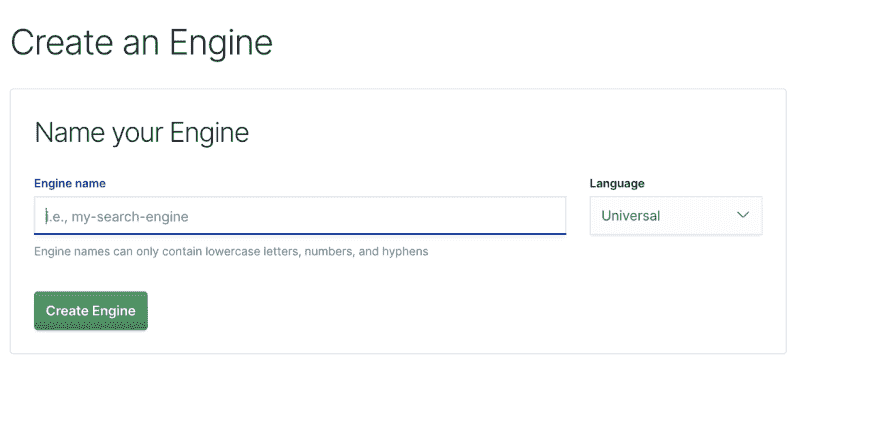
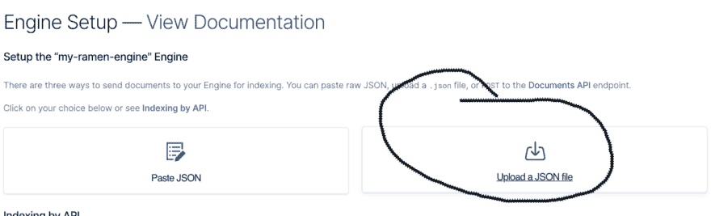
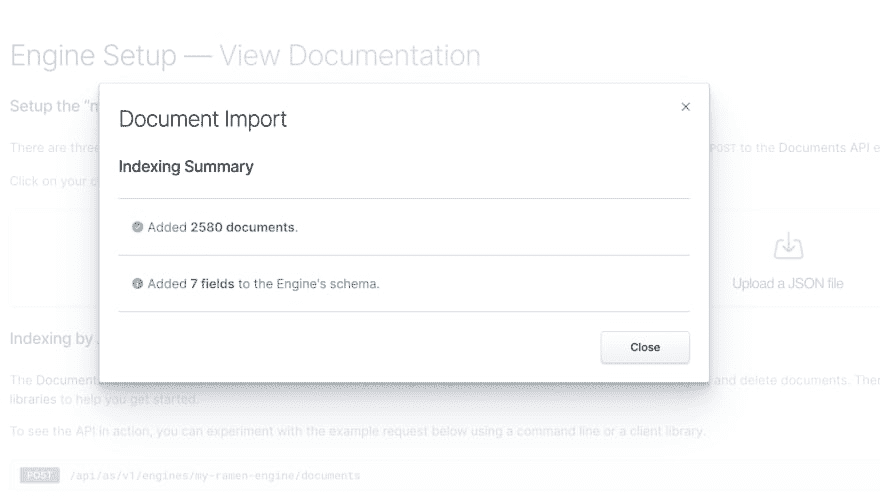
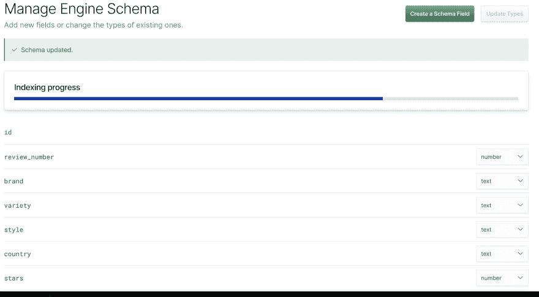
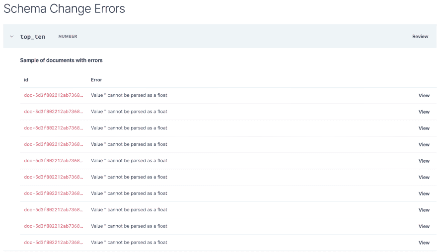
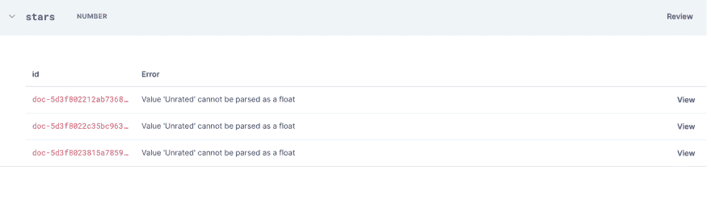

# 使用 ReactJS、Elasticsearch、App Search 和 Grommet 构建评论应用程序—(第 1 部分:数据)

> 原文：<https://dev.to/the_power_coder/building-a-review-app-using-reactjs-elasticsearch-app-search-and-grommet-part-1-data-451d>

我一直想建立一个应用程序有一段时间了。作为一名测试自动化工程师，我接触了很多非常酷的技术和 web 应用程序，但作为一名前 web 开发人员，我发现自己需要解决构建 web 应用程序的问题，使用一些较新的 JS 技术，并重新学习一些我不太熟悉的模式。首先，我们将从互联网上获取一些东西。

# 我们的数据

我们将从 Kaggle 上的一个样本数据集开始。这个数据是针对世界各地可以找到的不同类型的拉面及其评级的。我们希望能够搜索这些不同类型的拉面，对它们进行分类等。让我们开始收集数据吧。我不想自己配置一个 Elasticsearch 集群和所有的东西。我宁愿让 Elasticsearch 看看我的数据，然后做对它最有利的事情。这可以通过 App 搜索工具来完成。

我们将从应用搜索的标准用户界面(不是入职工具)开始，并创建我们的第一个引擎。姑且称之为`my-ramen-engine`。我们也将让这种语言成为通用语言。

我看了一下我们的数据，我们的数据来自一个. csv 文件。我们需要的格式是. json。所以我们将使用一个在线转换器来获得我们想要的格式的数据。一旦完成，我们就有了 ramen_ratings.json 文件，我们将把它上传到`App Search`中。

**~注意~**

的。csv 文件在标题行中有大写字母和空格。当我试图导入数据时，应用程序搜索出现错误。我处理这个问题的方法是将所有的字段都改为小写，并用下划线表示空格。比如我把 Review #改成 review_number。完成后，我们可以导入文件。

完成后，我们将返回到引擎概述页面。接下来，我们希望对模式进行一些调整，因为默认情况下所有字段都是作为文本导入的。让我们继续更新它们，以反映它们的实际值。当我们查看我们的模式时，我们看到`review_number`、`stars`和`top_ten`需要更新为`number`。

**啊哦！我们遇到了障碍！**

我们有一些数据质量问题。我们的某些字段包含不能更改为数字类型的数据。

有几种方法可以解决这个问题。我们可以通过主页上概述的 API 更新记录，我们可以删除错误的记录，或者我们可以在源位置修复数据，删除所有记录并重新加载 JSON。我只是要删除错误的记录，因为它们不是很多，而且这是测试数据。如果这是我们的实际生产数据，编辑或重新导入这些数据以便保留这些记录是有意义的。

完成后，我们将进入文档页面。我们现在在 Elasticsearch 实例中有我们的索引文档，我们将能够调用查询等。应用程序搜索甚至会为我们提供一个包装精美的 React 组件，直接放入我们的应用程序中！在本文的下一部分，我将使用 React 和 Grommit 创建实际的应用程序！