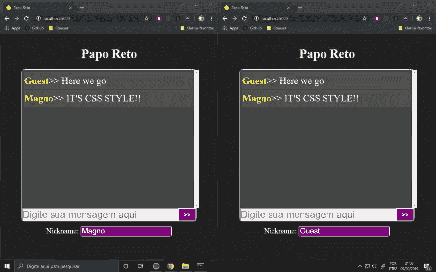

# 构建简单的网络聊天

> 原文：<https://dev.to/raymag/building-a-simple-webchat-2504>

你好。在这篇文章中，你将学习如何使用 python 和 web sockets 构建一个简单的 webchat。既然是这样，你就需要在你的电脑上安装 [python](https://www.python.org/) 。

这个项目的源代码可以在这个 [github 库](https://github.com/raymag/papo-reto)上找到，你也可以在 [Papo 烈斗](https://papo-io.herokuapp.com/)上在线看到。

如果没有`flask`包，可以用下面的命令安装:`pip install Flask`。你还需要`flask_socketio`和`eventlet`，这样你就可以运行`pip install flask_socketio`和`pip install eventlet`来安装它们。

现在您已经安装了所有的东西，这就是我们项目的文件和目录的样子:

```
templates
 - index.html
static
   css
    - style.css
- main.py 
```

我们项目的核心是`main.py`文件，它将控制我们的应用程序。会是这样的:

```
#! -*- enconding: utf-8 -*- from flask import Flask, render_template
from flask_socketio import SocketIO, emit

app = Flask(__name__, template_folder='templates', static_folder='static', static_url_path='/static/')
socketio = SocketIO(app)

@app.route('/')
def index():
    return render_template('index.html')

@socketio.on('client_message')
def receive_message (client_msg):
    emit('server_message', client_msg, broadcast=True)

if __name__ == '__main__':
    socketio.run(app) 
```

前两行代码导入我们将在这个项目中使用的包和模块。

```
from flask import Flask, render_template
from flask_socketio import SocketIO, emit 
```

`Flask`是我们的 web 框架，`flask_socketio`是一个包，它允许`flask`使用像 websockets 这样的全双工低延迟通信协议。

然后，我们实例化我们的 flask 应用程序，并定义模板和静态文件的位置。我们还实例化了 socketio 对象，并将 flask 应用程序作为参数传递。

```
app = Flask(__name__, template_folder='templates', static_folder='static', static_url_path='/static/')
socketio = SocketIO(app) 
```

我们现在定义我们的默认路径，它将返回到`index.html`页面:

```
@app.route('/')
def index():
    return render_template('index.html') 
```

当用户发送消息时，它将向服务器发出事件 client_message，将昵称和消息作为参数传递。然后，服务器会将此消息广播给每个连接的用户:

```
@socketio.on('client_message')
def receive_message (client_msg):
    emit('server_message', client_msg, broadcast=True) 
```

最后，我们将用下面几行代码开始运行我们的应用程序:

```
if __name__ == '__main__':
    socketio.run(app) 
```

就这样，我们的`main.py`文件现在完成了，这就把我们带到了`index.html`文件。在这种情况下，它将有三个主要部分:T2、T3 和 T4。该文件的内容将是:

```
<!DOCTYPE html>
<html lang="pt-BR">
<head>
Papo Reto
<meta name="viewport" content="width=device-width, initial-scale=1.0">
<script src="//cdnjs.cloudflare.com/ajax/libs/socket.io/2.2.0/socket.io.js" integrity="sha256-yr4fRk/GU1ehYJPAs8P4JlTgu0Hdsp4ZKrx8bDEDC3I=" crossorigin="anonymous"></script>

</head>
<body>
<script type="text/javascript" charset="utf-8">
const socket = io();
socket.on('server_message', (data) => {
    let e = document.createElement('p');
    let sp = document.createElement('span');
    sp.innerHTML = data.nickname;
    e.appendChild(sp);
    e.innerHTML = e.innerHTML+'>> '+data.message;
    if(document.getElementById('message-box').children.length>20){
        document.getElementById('message-box').removeChild(document.getElementById('message-box').children[0]);
    }
    document.getElementById('message-box').appendChild(e);

    document.getElementById('message-box').scroll(0, document.getElementById('message-box').scrollHeight);
});
function htmlEntities(str) {
    return String(str).replace(/&/g, '&amp;').replace(/</g, '&lt;').replace(/>/g, '&gt;').replace(/"/g, '&quot;');
}
function sendMessage(){
    socket.emit('client_message', {'nickname': htmlEntities(document.getElementById('nickname-input').value), 'message':  htmlEntities(document.getElementById('message-input').value)});
    document.getElementById('message-input').value = '';
}
function isPressingEnter(e){
    let k;
    if(window.event){
        k = e.keyCode;
        if(k===13){
            sendMessage();
        }
    }else if(e.which){
        k = e.which;
        if(k===13){
            sendMessage();
        }
    }
}
</script>

<h1 id="title">Papo Reto</h1>
<section id="chat-box">
    <section id="message-box">
    </section>

    <section id="input-box">
        <input type="text" autofocus onkeypress="return isPressingEnter(event)" required placeholder="Digite sua mensagem aqui" id="message-input">
        <button type="button" id="send-button" onclick="sendMessage()" >>></button> 
    </section>
</section>

<section id="nickname-box">
    <label id="nickname-label" for="nickname-input">Nickname: </label>
    <input type="text" id="nickname-input" autocomplete="off" value="Guest">
</section>

</body>
</html> 
```

我们使用 [SocketIO](https://socket.io/) 客户端 api 来连接和处理 websockets。所以在这种情况下，我们使用 CDN 来这样做:

```
<script src="//cdnjs.cloudflare.com/ajax/libs/socket.io/2.2.0/socket.io.js" integrity="sha256-yr4fRk/GU1ehYJPAs8P4JlTgu0Hdsp4ZKrx8bDEDC3I=" crossorigin="anonymous"></script> 
```

现在，使用 javascript，我们需要定义我们的 socket 对象，它将与服务器连接:

```
const socket = io(); 
```

由于 websocket 在同一条路线上，我们不需要传递任何东西作为参数。

当用户点击发送按钮时，它将调用`sendMessage`函数。但是如果用户在带有`input-box` id 的输入上键入一些东西，它将调用`isPressingEnter`函数，该函数将验证用户是否被按下了 enter。如果是，它也会调用`sendMessage()` :

```
function isPressingEnter(e){
    let k;
    if(window.event){
        k = e.keyCode;
        if(k===13){
            sendMessage();
        }
    }else if(e.which){
        k = e.which;
        if(k===13){
            sendMessage();
        }
    }
} 
```

然后，`sendMessage`函数将向服务器发出一个`client_message`事件，将昵称和消息作为数据传递:

```
function sendMessage(){
    socket.emit('client_message', {'nickname': htmlEntities(document.getElementById('nickname-input').value), 'message':  htmlEntities(document.getElementById('message-input').value)});
    document.getElementById('message-input').value = '';
} 
```

我们还使用`htmlEntities`函数从输入:
中移除 HTML 标签

```
function htmlEntities(str) {
    return String(str).replace(/&/g, '&amp;').replace(/</g, '&lt;').replace(/>/g, '&gt;').replace(/"/g, '&quot;');
} 
```

当服务器收到消息时，它会通过发出`server_message`事件向每个人广播消息。所以我们需要在收到`server_message`事件时将此消息添加到`message-box`:

```
socket.on('server_message', (data) => {
    let e = document.createElement('p');
    let sp = document.createElement('span');
    sp.innerHTML = data.nickname;
    e.appendChild(sp);
    e.innerHTML = e.innerHTML+'>> '+data.message;
    if(document.getElementById('message-box').children.length>20){
        document.getElementById('message-box').removeChild(document.getElementById('message-box').children[0]);
    }
    document.getElementById('message-box').appendChild(e);

    document.getElementById('message-box').scroll(0, document.getElementById('message-box').scrollHeight);
}); 
```

如果你现在用`python main.py`运行服务器，你会看到我们的网络聊天已经在工作了。
[](https://res.cloudinary.com/practicaldev/image/fetch/s--pVP4vcjO--/c_limit%2Cf_auto%2Cfl_progressive%2Cq_auto%2Cw_880/https://thepracticaldev.s3.amazonaws.com/i/w9n2c7gqygq036knv6w2.jpg)

但是由于它看起来很糟糕，我们会给它添加一些 css。Flask templates 使用`jinja`作为它的模板引擎，所以将我们的 css 文件路径添加到`index`页面有点不同。我们可以在`head`标签中添加下面几行代码:

```
<link rel="stylesheet" type="text/css" href="{{ url_for('static', filename='./css/stylxe.css') }}"> 
```

您可以随心所欲，但在这种情况下，这就是我们的 CSS 文件的内容:

```
*{
    margin: 0;
    padding: 0;
}
body{
    background: #202020;
    color: #eee;
    font-family: 'monospace';
    line-height: 1.4em; 
    display: flex;
    flex-direction: column;
    justify-content: space-around;
    align-items: center;
    padding: 15px;
}
#title{
    font-size: calc(20px + 2vw + 1vh);
    padding: 40px;
}
#chat-box{
    border: 2px solid #ccc;
    border-radius: 10px;
    box-shadow: 3px 4px 4px #111;
}
@media only screen and (max-width: 600px){
    #chat-box{
        width: 95vw;
    }
}
@media only screen and (min-width: 600px){
    #chat-box{
        width: 80vw;
    }
}
#message-box{
    width: 100%;
    height: 60vh;
    background: #444;
    overflow-y: scroll;
    padding: 5px;
    font-size: calc(10px + 1vh + 2vw);
}
#message-box p{
    width: 100%;
    line-height: 1.5em;
    overflow-wrap: break-word;
    padding: 5px 2px;
    margin: 2px 0;
    background: #4f4f4f;
}
#message-box span{
    color: yellow;
    font-weight: 900;
}

#input-box{
    width: 100%;
    height: 100%;
    display: grid;
    grid-template-columns: 90% 10%;
}
#message-input{
    height: 90%;
    font-size: calc(10px + 1vh + 2vw);
    border-radius: 0 0 0 6px;
}
#send-button{
    background: purple;
    color: #f0f0a0;
    height: 100%;
    font-size: calc(10px + 1vh);
    font-weight: 900;
}
#nickname-box{
    padding: 15px;
}
#nickname-input {
    border-radius: 5px;
    background: purple;
    color: white;
    padding: 2px;
    font-size: calc(10px + 1vh + 1vw);
}
#nickname-label{
    font-size: calc(10px + 1vh + 1vw);

} 
```

而现在，结果就是:
[](https://res.cloudinary.com/practicaldev/image/fetch/s--1SCSJw9r--/c_limit%2Cf_auto%2Cfl_progressive%2Cq_auto%2Cw_880/https://thepracticaldev.s3.amazonaws.com/i/34lny5gljmzi2ubsg7g9.jpg)

感谢您的关注！这是我们可以使用 python 构建一个非常简单的 webchat 的方法之一。而且，这样做很容易，但是如果你们愿意，我也可以展示如何将它部署到 heroku。所以你可以让它在线运行。