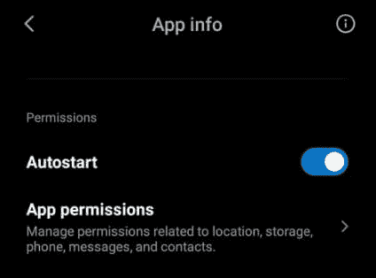

# 构建永不停止运行的 Android 服务

> 原文：<https://dev.to/robertohuertasm/building-an-android-service-that-never-stops-running-1790>

这些天来，我一直在努力寻找一种在安卓系统中运行无止境服务的方法。这只是给所有追求相同目标的你们一个指引。希望有帮助！😁

## 问题

由于 Android 8.0 (API 级别 26)中引入的 Android 电池优化，后台服务现在有一些重要的[限制](https://developer.android.com/about/versions/oreo/background.html#services)。本质上，一旦应用程序在后台运行一段时间，它们就会被杀死，对于我们运行一个始终运行的服务的目的来说，它们变得毫无价值。

根据 Android 的建议，我们应该使用 [JobScheduler](https://developer.android.com/reference/android/app/job/JobScheduler.html) ，它似乎工作得很好，将为我们处理 [wakelocks](https://developer.android.com/training/scheduling/wakelock#cpu) ，在作业运行时保持手机清醒。

可惜这个也不行。 [JobScheduler](https://developer.android.com/reference/android/app/job/JobScheduler.html) 将根据 Android 的判断运行作业，最重要的是，一旦手机进入[睡眠模式](https://developer.android.com/training/monitoring-device-state/doze-standby)，这些作业运行的频率将不断降低。更糟糕的是，如果你想访问网络——比如说你需要向你的服务器发送数据——你将无法访问。查看[瞌睡模式强加的限制列表](https://developer.android.com/training/monitoring-device-state/doze-standby#restrictions)。

如果你不介意不能访问网络，也不介意不能控制周期，那么 JobScheduler 可以很好地工作。在我们的例子中，我们希望我们的服务以一个非常特定的频率运行，并且永不停止，所以我们需要其他的东西。

## 一切都是为了前台服务

如果你一直在互联网上寻找这个问题的解决方案，很可能你最终会从 Android 的文档到达这个[页面。](https://developer.android.com/guide/components/services)

在那里，我们了解了 Android 提供的不同类型的服务。看一看`Foreground Service`描述:

> 前台服务执行一些对用户来说显而易见的操作。例如，音频应用程序将使用前台服务来播放音轨。前台服务必须显示通知。即使用户没有与应用程序交互，前台服务也会继续运行。

这似乎正是我们要找的东西...的确是这样！😉

## 显示代码

创建一个`foreground service`确实是一个简单的过程，所以我将访问并解释构建一个永不停止的前台服务所需的所有步骤。

像往常一样，我已经创建了一个包含所有代码的[库，以防你想看一看并跳过这篇文章的其余部分。](https://github.com/robertohuertasm/endless-service)

## 添加一些依赖关系

我在这个例子中使用了 [Kotlin](https://kotlinlang.org/) ，所以我们将利用[协程](https://kotlinlang.org/docs/reference/coroutines-overview.html)和[燃料](https://github.com/kittinunf/fuel)库来处理 HTTP 请求。

为了添加这些依赖项，我们必须将它们添加到我们的`build.gradle`文件:

```
dependencies {
    implementation fileTree(dir: 'libs', include: ['*.jar'])
    implementation"org.jetbrains.kotlin:kotlin-stdlib-jdk7:$kotlin_version"
    implementation 'com.android.support:appcompat-v7:28.0.0'
    implementation 'com.android.support.constraint:constraint-layout:1.1.3'
    implementation 'com.jaredrummler:android-device-names:1.1.8'

    implementation 'com.github.kittinunf.fuel:fuel:2.1.0'
    implementation 'com.github.kittinunf.fuel:fuel-android:2.1.0'
    implementation 'org.jetbrains.kotlinx:kotlinx-coroutines-core:1.3.0-M1'

    testImplementation 'junit:junit:4.12'
    androidTestImplementation 'com.android.support.test:runner:1.0.2'
    androidTestImplementation 'com.android.support.test.espresso:espresso-core:3.0.2'
} 
```

Enter fullscreen mode Exit fullscreen mode

## 书写我们的服务

需要显示通知，让用户知道应用程序仍在运行。如果你仔细想想，这是有道理的。

注意，我们将不得不覆盖一些处理服务生命周期关键方面的[服务回调方法](https://developer.android.com/guide/components/services#Basics)。

同样非常重要的是，我们使用了[部分唤醒锁](https://developer.android.com/training/scheduling/wakelock#cpu)，这样我们的服务就不会受到[打盹模式](https://developer.android.com/training/monitoring-device-state/doze-standby)的影响。请记住，这将对我们手机的电池寿命产生影响，因此我们必须评估我们的用例是否可以由 Android 提供的任何其他替代方案处理，以便在后台运行进程。

代码中有一些实用函数调用(`log`、`setServiceState`)和一些自定义枚举(`ServiceState.STARTED`)，不过不用太担心。如果你想知道它们来自哪里，只要看看[范例库](https://github.com/robertohuertasm/endless-service)就知道了。

```
class EndlessService : Service() {

    private var wakeLock: PowerManager.WakeLock? = null
    private var isServiceStarted = false

    override fun onBind(intent: Intent): IBinder? {
        log("Some component want to bind with the service")
        // We don't provide binding, so return null
        return null
    }

    override fun onStartCommand(intent: Intent?, flags: Int, startId: Int): Int {
        log("onStartCommand executed with startId: $startId")
        if (intent != null) {
            val action = intent.action
            log("using an intent with action $action")
            when (action) {
                Actions.START.name -> startService()
                Actions.STOP.name -> stopService()
                else -> log("This should never happen. No action in the received intent")
            }
        } else {
            log(
                "with a null intent. It has been probably restarted by the system."
            )
        }
        // by returning this we make sure the service is restarted if the system kills the service
        return START_STICKY
    }

    override fun onCreate() {
        super.onCreate()
        log("The service has been created".toUpperCase())
        var notification = createNotification()
        startForeground(1, notification)
    }

    override fun onDestroy() {
        super.onDestroy()
        log("The service has been destroyed".toUpperCase())
        Toast.makeText(this, "Service destroyed", Toast.LENGTH_SHORT).show()
    }

    private fun startService() {
        if (isServiceStarted) return
        log("Starting the foreground service task")
        Toast.makeText(this, "Service starting its task", Toast.LENGTH_SHORT).show()
        isServiceStarted = true
        setServiceState(this, ServiceState.STARTED)

        // we need this lock so our service gets not affected by Doze Mode
        wakeLock =
            (getSystemService(Context.POWER_SERVICE) as PowerManager).run {
                newWakeLock(PowerManager.PARTIAL_WAKE_LOCK, "EndlessService::lock").apply {
                    acquire()
                }
            }

        // we're starting a loop in a coroutine
        GlobalScope.launch(Dispatchers.IO) {
            while (isServiceStarted) {
                launch(Dispatchers.IO) {
                    pingFakeServer()
                }
                delay(1 * 60 * 1000)
            }
            log("End of the loop for the service")
        }
    }

    private fun stopService() {
        log("Stopping the foreground service")
        Toast.makeText(this, "Service stopping", Toast.LENGTH_SHORT).show()
        try {
            wakeLock?.let {
                if (it.isHeld) {
                    it.release()
                }
            }
            stopForeground(true)
            stopSelf()
        } catch (e: Exception) {
            log("Service stopped without being started: ${e.message}")
        }
        isServiceStarted = false
        setServiceState(this, ServiceState.STOPPED)
    }

    private fun pingFakeServer() {
        val df = SimpleDateFormat("yyyy-MM-dd'T'HH:mm:ss.mmmZ")
        val gmtTime = df.format(Date())

        val deviceId = Settings.Secure.getString(applicationContext.contentResolver, Settings.Secure.ANDROID_ID)

        val json =
            """
                {
                    "deviceId": "$deviceId",
                    "createdAt": "$gmtTime"
                }
            """
        try {
            Fuel.post("https://jsonplaceholder.typicode.com/posts")
                .jsonBody(json)
                .response { _, _, result ->
                    val (bytes, error) = result
                    if (bytes != null) {
                        log("[response bytes] ${String(bytes)}")
                    } else {
                        log("[response error] ${error?.message}")
                    }
                }
        } catch (e: Exception) {
            log("Error making the request: ${e.message}")
        }
    }

    private fun createNotification(): Notification {
        val notificationChannelId = "ENDLESS SERVICE CHANNEL"

        // depending on the Android API that we're dealing with we will have
        // to use a specific method to create the notification
        if (Build.VERSION.SDK_INT >= Build.VERSION_CODES.O) {
            val notificationManager = getSystemService(Context.NOTIFICATION_SERVICE) as NotificationManager;
            val channel = NotificationChannel(
                notificationChannelId,
                "Endless Service notifications channel",
                NotificationManager.IMPORTANCE_HIGH
            ).let {
                it.description = "Endless Service channel"
                it.enableLights(true)
                it.lightColor = Color.RED
                it.enableVibration(true)
                it.vibrationPattern = longArrayOf(100, 200, 300, 400, 500, 400, 300, 200, 400)
                it
            }
            notificationManager.createNotificationChannel(channel)
        }

        val pendingIntent: PendingIntent = Intent(this, MainActivity::class.java).let { notificationIntent ->
            PendingIntent.getActivity(this, 0, notificationIntent, 0)
        }

        val builder: Notification.Builder = if (Build.VERSION.SDK_INT >= Build.VERSION_CODES.O) Notification.Builder(
            this,
            notificationChannelId
        ) else Notification.Builder(this)

        return builder
            .setContentTitle("Endless Service")
            .setContentText("This is your favorite endless service working")
            .setContentIntent(pendingIntent)
            .setSmallIcon(R.mipmap.ic_launcher)
            .setTicker("Ticker text")
            .setPriority(Notification.PRIORITY_HIGH) // for under android 26 compatibility
            .build()
    }
} 
```

Enter fullscreen mode Exit fullscreen mode

## 处理 Android 清单的时间

我们将需要一些额外的权限为`FOREGROUND_SERVICE`、`INTERNET`和`WAKE_LOCK`。请务必不要忘记将它们包括在内，否则它将不起作用。

一旦我们将它们放置到位，我们将需要声明我们的服务。

```
<?xml version="1.0" encoding="utf-8"?>
<manifest xmlns:android="http://schemas.android.com/apk/res/android" 
          package="com.robertohuertas.endless">

    <uses-permission android:name="android.permission.FOREGROUND_SERVICE"></uses-permission>
    <uses-permission android:name="android.permission.INTERNET"></uses-permission>
    <uses-permission android:name="android.permission.WAKE_LOCK" />

    <application
            android:allowBackup="true"
            android:icon="@mipmap/ic_launcher"
            android:label="@string/app_name"
            android:roundIcon="@mipmap/ic_launcher_round"
            android:supportsRtl="true"
            android:theme="@style/AppTheme">

        <service
                android:name=".EndlessService"
                android:enabled="true"
                android:exported="false">
        </service>

        <activity android:name=".MainActivity">
            <intent-filter>
                <action android:name="android.intent.action.MAIN"/>
                <category android:name="android.intent.category.LAUNCHER"/>
            </intent-filter>
        </activity>
    </application>
</manifest> 
```

Enter fullscreen mode Exit fullscreen mode

## 能告诉我怎么启动服务吗？

是的，你说得对。你看，根据 Android 版本，我们必须用特定的方法启动服务。

如果 Android 版本低于 API 26，我们必须使用 [startService](https://developer.android.com/reference/android/content/Context.html#startService(android.content.Intent)) 。在任何其他情况下， [startForegroundService](https://developer.android.com/reference/android/content/Context.html#startForegroundService(android.content.Intent)) 是我们必须使用的。

在这里你可以看到我们的`MainActivity`，只是一个有两个按钮的屏幕*开始*和*停止*服务。这就是你开始我们*无尽服务*所需要的一切。

请记住，您可以在这个 [GitHub 资源库](https://github.com/robertohuertasm/endless-service)中查看完整的代码。

```
class MainActivity : AppCompatActivity() {

    override fun onCreate(savedInstanceState: Bundle?) {
        super.onCreate(savedInstanceState)
        setContentView(R.layout.activity_main)

        title = "Endless Service"

        findViewById<Button>(R.id.btnStartService).let {
            it.setOnClickListener {
                log("START THE FOREGROUND SERVICE ON DEMAND")
                actionOnService(Actions.START)
            }
        }

        findViewById<Button>(R.id.btnStopService).let {
            it.setOnClickListener {
                log("STOP THE FOREGROUND SERVICE ON DEMAND")
                actionOnService(Actions.STOP)
            }
        }
    }

    private fun actionOnService(action: Actions) {
        if (getServiceState(this) == ServiceState.STOPPED && action == Actions.STOP) return
        Intent(this, EndlessService::class.java).also {
            it.action = action.name
            if (Build.VERSION.SDK_INT >= Build.VERSION_CODES.O) {
                log("Starting the service in >=26 Mode")
                startForegroundService(it)
                return
            }
            log("Starting the service in < 26 Mode")
            startService(it)
        }
    }
} 
```

Enter fullscreen mode Exit fullscreen mode

## 奖励:安卓开机启动服务

好了，我们现在有了我们的*无休止的服务*每分钟都发出我们想要的网络请求，但是之后用户重启手机...我们的服务不会再次开始...😞

别担心，我们也能找到解决办法。我们将创建一个名为`StartReceiver`的[广播接收器](https://developer.android.com/reference/android/content/BroadcastReceiver)。

```
class StartReceiver : BroadcastReceiver() {

    override fun onReceive(context: Context, intent: Intent) {
        if (intent.action == Intent.ACTION_BOOT_COMPLETED && getServiceState(context) == ServiceState.STARTED) {
            Intent(context, EndlessService::class.java).also {
                it.action = Actions.START.name
                if (Build.VERSION.SDK_INT >= Build.VERSION_CODES.O) {
                    log("Starting the service in >=26 Mode from a BroadcastReceiver")
                    context.startForegroundService(it)
                    return
                }
                log("Starting the service in < 26 Mode from a BroadcastReceiver")
                context.startService(it)
            }
        }
    }
} 
```

Enter fullscreen mode Exit fullscreen mode

然后，我们将再次修改我们的`Android Manifest`，并添加一个新的权限(`RECEIVE_BOOT_COMPLETED`)和新的 [BroadCastReceiver](https://developer.android.com/reference/android/content/BroadcastReceiver) 。

```
<?xml version="1.0" encoding="utf-8"?>
<manifest xmlns:android="http://schemas.android.com/apk/res/android"
          package="com.robertohuertas.endless">
    <uses-permission android:name="android.permission.FOREGROUND_SERVICE"></uses-permission>
    <uses-permission android:name="android.permission.INTERNET"></uses-permission>
    <uses-permission android:name="android.permission.WAKE_LOCK" />
    <uses-permission android:name="android.permission.RECEIVE_BOOT_COMPLETED"/>

    <application
            android:allowBackup="true"
            android:icon="@mipmap/ic_launcher"
            android:label="@string/app_name"
            android:roundIcon="@mipmap/ic_launcher_round"
            android:supportsRtl="true"
            android:theme="@style/AppTheme">

        <service
                android:name=".EndlessService"
                android:enabled="true"
                android:exported="false">
        </service>

        <activity android:name=".MainActivity">
            <intent-filter>
                <action android:name="android.intent.action.MAIN"/>
                <category android:name="android.intent.category.LAUNCHER"/>
            </intent-filter>
        </activity>

        <receiver android:enabled="true" android:name=".StartReceiver">
            <intent-filter>
                <action android:name="android.intent.action.BOOT_COMPLETED"/>
            </intent-filter>
        </receiver>

    </application>
</manifest> 
```

Enter fullscreen mode Exit fullscreen mode

请注意，除非服务已经在运行，否则不会重新启动。我们就是这么设计的，并不是说一定要这样。

无论如何，如果你想测试这个，只需启动一个带有`Google Services`的模拟器，并确保在*根*模式下运行[亚行](https://developer.android.com/studio/command-line/adb)。

```
adb root
# If you get an error then you're not running the proper emulator.
# Be sure to stop the service
# and force a system restart:
adb shell stop
adb shell start
# wait for the service to be restarted! 
```

Enter fullscreen mode Exit fullscreen mode

## 加成 2:任务移除后重启服务

Michal Materowski 写信给我，告诉了我这个案例和它的解决方案，所以我要表扬他！

理论上，根据`Android`文档，从服务的`onStartCommand`方法返回 **RETURN_STICKY** 应该足够 Android 保持前台服务运行。

迈克尔正在用一台*小米 Note 5* 和**安卓 Pie** 测试这一切，每次他从最近的应用程序中滑动一个应用程序，它都完美地工作。不幸的是，每当他按下`Clear all recent apps`按钮( [MIUI](https://en.miui.com/) 特定)，服务就停止了，通知也不见了。`Clear all recent apps`按钮可能通过杀死所有进程及其相关服务来优化电池寿命。

他发现`Android`文档说明`onTaskRemoved` **“如果服务当前正在运行，并且用户已经删除了来自服务应用程序的任务，则调用该服务。”**，所以计划是利用这一点来重启服务。但是请记住，如果应用程序以其他方式被终止(例如，从手机设置中停止)，则`onTaskRemoved`不会被调用。

将这些线路添加到您的**服务** :

```
override fun onTaskRemoved(rootIntent: Intent) {
    val restartServiceIntent = Intent(applicationContext, EndlessService::class.java).also {
        it.setPackage(packageName)
    };
    val restartServicePendingIntent: PendingIntent = PendingIntent.getService(this, 1, restartServiceIntent, PendingIntent.FLAG_ONE_SHOT);
    applicationContext.getSystemService(Context.ALARM_SERVICE);
    val alarmService: AlarmManager = applicationContext.getSystemService(Context.ALARM_SERVICE) as AlarmManager;
    alarmService.set(AlarmManager.ELAPSED_REALTIME, SystemClock.elapsedRealtime() + 1000, restartServicePendingIntent);
} 
```

Enter fullscreen mode Exit fullscreen mode

你可以查看迈克尔·马托洛夫斯基的 PR 的全部代码。

**重要** : Michal 必须手动设置`Autostart`权限，否则**服务不会在开机**时启动。

[](https://res.cloudinary.com/practicaldev/image/fetch/s--9sRDDdRN--/c_limit%2Cf_auto%2Cfl_progressive%2Cq_auto%2Cw_880/https://dev-to-uploads.s3.amazonaws.com/i/byo4tirtix6mf8sbkwgv.png)

根据 Michal 的说法，有些人提到设置`stopWithTask`标志可能会有所帮助，但这对他来说没有什么影响:

```
<service android:name=".EndlessService"" android:stopWithTask="false" /> 
```

Enter fullscreen mode Exit fullscreen mode

迈克尔·马特洛夫斯基在这个案子上的帮助获得了很多荣誉。

尽情享受吧！❤️

-
最初发表于 2019 年 6 月 29 日[robertohuertas.com](https://robertohuertas.com/2019/06/29/android_foreground_services)。