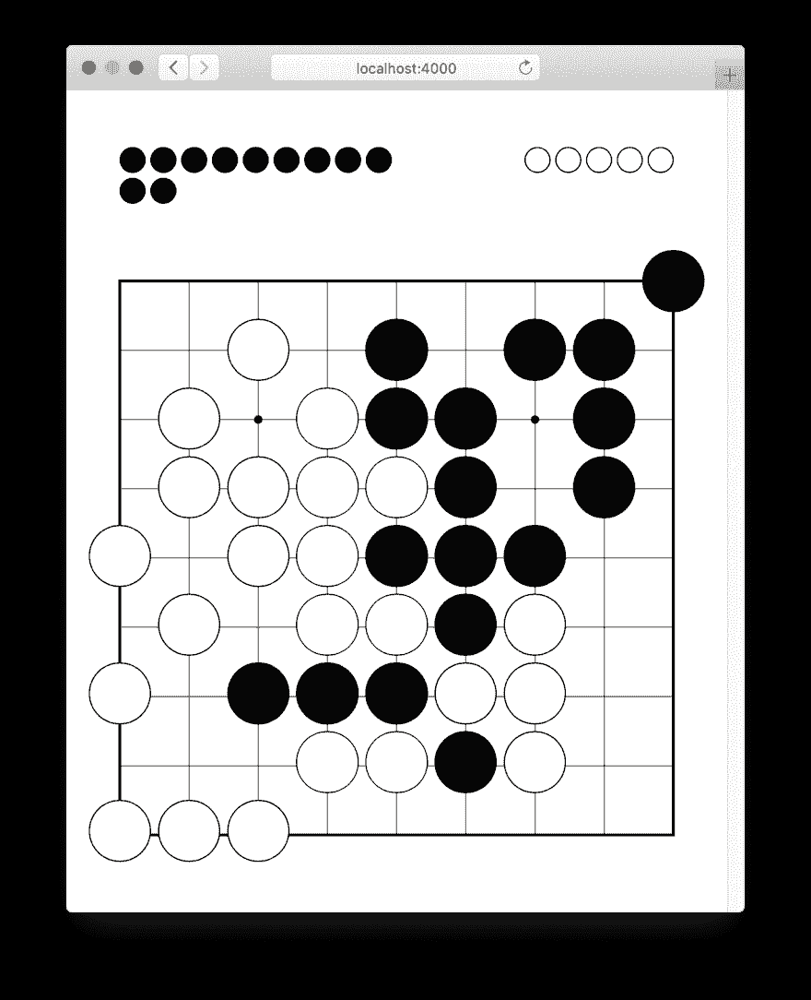

# 使用 Phoenix LiveView 构建和玩围棋游戏

> 原文：<https://dev.to/appsignal/building-and-playing-the-go-game-with-phoenix-liveview-58g>

欢迎回到另一个炼丹术！这一次，我们将通过构建一个互动游戏来发现 [Phoenix LiveView](https://github.com/phoenixframework/phoenix_live_view) 的威力。

通过在服务器上渲染 HTML，并通过 web sockets 在前端和后端之间进行通信，LiveView 可以帮助我们构建实时界面，而无需编写 JavaScript 或担心更新浏览器中的状态。通过更新服务器端的状态，LiveView 确保只更新页面中需要更新的部分，从而使应用程序速度更快，通过网络发送的数据量更少。

为了说明这一点，我们将在 Phoenix 中构建我们的游戏，并使用 LiveView 使其具有交互性。虽然井字游戏很有趣，但我们将通过构建 [Go](https://en.wikipedia.org/wiki/Go_(game)) 来做一些更有野心的事情。

> 围棋是一种抽象的战略棋类游戏，由两个人玩，目的是比对手包围更多的地盘。该游戏于 2500 多年前在中国发明，被认为是延续至今的最古老的棋盘游戏。

[最终结果](https://hayago.herokuapp.com)是围棋游戏的实现，允许玩家轮流在棋盘上放置石头。玩家可以捕捉彼此的石头，游戏会记录下哪些石头被捕捉到了。

[](https://res.cloudinary.com/practicaldev/image/fetch/s--_FVTYwbr--/c_limit%2Cf_auto%2Cfl_progressive%2Cq_auto%2Cw_880/https://blog.appsignal.cimg/blog/2019-06/go.png)

在这个过程中，我们将了解 [Phoenix LiveView](https://github.com/phoenixframework/phoenix_live_view) 如何通过将所有内容保存在 Elixir 中来帮助您构建交互式应用程序，而无需在前端和后端之间复制代码。

## 走吧！

[starter app](https://github.com/jeffkreeftmeijer/hayago/tree/starter) 是一个 Phoenix 应用程序，其中一些部分已经设置好了。它清理了一些生成的文件，为围棋棋盘添加了样式，根据[自述文件](https://github.com/phoenixframework/phoenix_live_view/tree/108c96aca0245fa673307f0e1a617f4b0704e981#readme)中的安装指南预装了 Phoenix LiveView，还有一个跟踪游戏状态的模块。

在我们的游戏中，`State`模块描述了游戏的状态。starter 应用程序已经附带了`State`模块，因此我们可以专注于使用 LiveView。

`State` struct 在其`:positions`列表中跟踪棋盘上的石头，并在其`:current`键中知道下一个玩家是谁。

```
# lib/hayago/state.ex
defmodule Hayago.State do
  alias Hayago.State
  defstruct positions: Enum.map(1..81, fn _ -> nil end), current: :black

  # ...
end 
```

新创建的状态以 81 个`nil`值的列表作为其`:positions`进行初始化，因为板是空的并且具有 9 乘 9 的位置。拥有黑色石头的玩家是第一个移动的，因此对于任何新的状态,`:current`键被设置为`:black`。

`State`模块公开了两个函数。第一个是`place/2`，它在棋盘上放置一颗新的石头。如果新石头窃取了另一块石头的所有自由，被捕获的石头将自动从棋盘上移除。

`legal?/2`功能通过检查另一个石头是否已经占据了该位置并确保该石头不会被立即占领来检查移动是否合法。

->如果您想了解更多关于我们将使用的`State`模块的实现，请查看[模块的文档](https://github.com/jeffkreeftmeijer/hayago/blob/starter/lib/hayago/state.ex)，其中解释了它如何处理在棋盘上放置石头、捕捉石头和验证可能的移动。

## `GameLive`模块

我们将从渲染黑板开始。首先，我们在应用程序中添加一个实时视图来处理显示和更新白板。它叫做`GameLive`，有`render/1`和`mount/2`回调函数。

```
# lib/hayago_web/live/game_live.ex
defmodule HayagoWeb.GameLive do
  use Phoenix.LiveView

  def render(assigns) do
    HayagoWeb.GameView.render("index.html", assigns)
  end

  def mount(_session, socket) do
    {:ok, assign(socket, state: %Hayago.State{})}
  end
end 
```

`mount/2`回调在`socket`中设置赋值器来设置视图的初始状态。我们用它来创建一个新的状态，然后将它添加到 socket assigns 中，使它在模板中可用。

接下来，我们将添加一个模板来呈现棋盘。我们将其命名为`index.html.leex`，使其成为一个*实时 EEx* 模板。虽然与常规 EEx 模板相似，但实时模板会跟踪更改，以便在视图更新时通过网络发送最少量的数据。

```
# lib/hayago_web/templates/game/index.html.leex
<div class="board <%= @state.current %>">
  <%= for _position <- @state.positions do %>
    <button></button>
  <% end %>
</div> 
```

我们循环遍历在实时视图中分配的`@state`结构中的所有位置，以及每个位置的一个空的`<button>`元素。按钮在一个`<div>`元素中，样式表自动将其样式化为 Go board。我们还将当前颜色作为类名添加到棋盘上，以便当您将鼠标悬停在某个位置上时，样式表可以显示您将要放置的石头。

最后，我们将发送给`/`的任何请求路由到路由器
中的`GameLive`模块

```
# lib/hayago_web/router.ex
defmodule HayagoWeb.Router
  # ...

  scope "/", HayagoWeb do
    pipe_through :browser

    live "/", GameLive
  end
end 
```

如果我们启动 Phoenix 服务器并在浏览器中导航到 [https://localhost:4000](https://localhost:4000) ，我们将看到应用程序呈现一个空的围棋盘。虽然我们现在还不能放置石头，但是将鼠标悬停在棋盘上的位置会显示新石头将被放置的位置。

## 出手

为了将石头放在棋盘上，`State`实现了一个`place/2`函数，该函数采用了一个`State`结构和一个索引。它用`:current`键中的值替换与索引相对应的位置，该值可以是`:black`或`:white`，具体取决于轮到哪个玩家。

在模板中，我们为按钮添加了`phx-click`和`phx-value`属性。这些属性告诉 LiveView 向我们的`GameLive`模块发送一个事件。

```
# lib/hayago_web/templates/game/index.html.leex
<div class="board">
  <%= for {value, index} <- Enum.with_index(@state.positions) do %>
    <button phx-click="place" phx-value="<%= index %>" class="<%= value %>"></button>
  <% end %>
</div> 
```

在我们的实时视图中，我们通过匹配模板中设置的属性来处理事件。我们使用传递的索引来调用`State.place/2`，它返回一个新的状态，将石头放在棋盘上。我们将返回一个带有新状态的`:noreply`-元组。

```
# lib/hayago_web/live/game_live.ex
defmodule HayagoWeb.GameLive do
  # ...

  def handle_event("place", index, %{assigns: assigns} = socket) do
    new_state = State.place(assigns.state, String.to_integer(index))
    {:noreply, assign(socket, state: new_state)}
  end
end 
```

通过更新套接字中的状态，LiveView 知道重新呈现模板中发生变化的部分。然后将更新后的页面与渲染后的页面进行比较，以对已经渲染的页面应用最小的补丁。

回到我们的浏览器，它会在我们做出更改后自动刷新页面，我们的项目已经开始看起来像一个合适的围棋游戏。我们可以把石头放在棋盘上，甚至可以包围敌人的石头来移除它！

看看我们没有做的事情！我们不必编写任何代码来向浏览器发送数据，也不必担心更新呈现的页面。每当状态改变时，LiveView 负责更新页面。

然而，如果我们点击相同的位置两次，一个已经放置的石头被另一个替换。为了防止这种情况发生，我们应该禁用代表非法移动的按钮。

## 防止非法移动

为了防止非法移动，我们将为每个已经有石头的位置或者新放置的石头没有自由的位置渲染一个禁用按钮。

为了做到这一点，我们将使用`State.legal?/2`，它接受当前状态和一个索引，并返回一个值，指示当前玩家是否可以在那里放置石头。

```
<div class="board <%= @state.current %>">
  <%= for {value, index} <- Enum.with_index(@state.positions) do %>
    <%= if Hayago.State.legal?(@state, index) do %>
      <button phx-click="place" phx-value="<%= index %>" class="<%= value %>"></button>
    <% else %>
      <button class="<%= value %>" disabled="disabled"></button>
    <% end %>
  <% end %>
</div> 
```

因为 LiveView 负责更新页面，所以我们可以在模板中添加一个 if 语句，检查在每个位置放置一块石头是否合法。如果是，我们呈现和以前一样的按钮。否则，我们将呈现一个禁用的按钮。

样式表确保不为禁用的按钮显示悬停，并将光标改为指示可以在那里放置一块石头。

## 捕捉石头

当捕获一颗石头时，`place/2`功能会在当前状态的`:captures`地图中增加一个计数器，其中包含一个黑色和白色石头的计数器。

对于每个捕获的石头，我们将在棋盘上方显示一块石头。由于捕获已经在我们从实时视图接收的`@state`结构中可用，我们将循环遍历每个计数器，用正确的类名呈现一个`<span>`,以便样式表转换成一个按钮。

```
<div class="captures">
  <div>
    <%= for _ <- 1..@state.captures.black, @state.captures.black > 0 do %>
      <span class="black"></span>
    <% end %>
  </div>
  <div>
    <%= for _ <- 1..@state.captures.white, @state.captures.white > 0 do %>
      <span class="white"></span>
    <% end %>
  </div>
</div> 
```

由于我们在列表理解中使用了一个范围，我们将确保添加一个过滤器，以确保在遍历列表时列表不为空。

现在，我们有一种方法来跟踪哪些石头被捕获，因为石头显示在棋盘上方。

## 计分、历史和 Ko 规则

我们在实现 Go 方面取得了一些进展，现在我们已经学会了如何建立一个 LiveView 项目。我们已经看到，仔细更新状态就足以让构建一个界面，而不必担心更新视图。相反，我们专注于呈现当前状态的静态表示，并将更新玩家看到的页面的工作留给了 LiveView。除了设置我们的实时视图模块，我们编写的显示电路板状态的代码都是通过向模板添加逻辑来完成的，我们自己不必编写任何 JavaScript。

然而，还是有一些事情我们应该做。下次我们见面时，我们将在游戏中添加历史，允许玩家撤销移动，我们将实施 [ko 规则](https://senseis.xmp.net/?Ko)以防止重复移动。最后，我们将添加一个分数计数器来显示每个玩家的当前分数。到时候见！