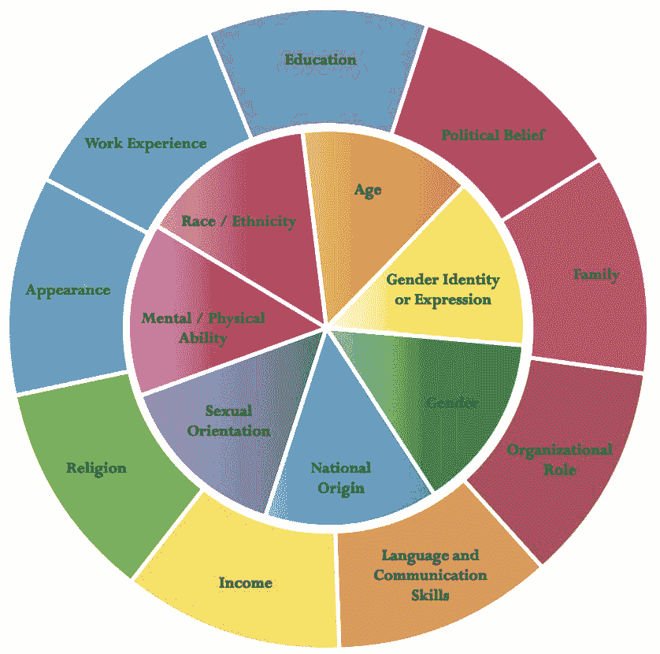

# 创新和包容性开发者社区的构建模块:第 1 部分

> 原文：<https://dev.to/listencommunity/building-blocks-for-an-innovative-and-inclusive-developer-community-part-1-4bl5>

*NB:本帖原载于 [Heavybit 的博客](https://www.heavybit.com/library/blog/building-blocks-for-an-innovative-and-inclusive-developer-community-part-1/)于 2019 年 6 月 6 日*
*封面图片由[贝琳达·费因斯](https://unsplash.com/@bel2000a?utm_source=unsplash&utm_medium=referral&utm_content=creditCopyText)于 [Unsplash](https://unsplash.com/?utm_source=unsplash&utm_medium=referral&utm_content=creditCopyText)*

## 第一部分:前期考虑

对于早期创业公司来说，专注于重要的事情是至关重要的。虽然每个公司都有所不同，但大多数种子阶段或 A 轮创业公司都专注于打造一个可以扩展的产品，并产生确保更多跑道所需的收入。对于解决真正痛点的面向开发人员的产品，早期采用者和倡导者的社区可能已经在这个阶段有机地形成了。虽然现在依靠这种有机增长并在以后对社区建设更具战略性似乎已经足够了，但你可能会错过更好地了解你的产品、扩大你的范围并为一个社区奠定基础的机会，这个社区将比你想象的更能影响你的产品创新。

## 你为之开发的开发者可能不是你想象的那样

你正在创造下一个伟大的开发者产品。这将有助于加快开发周期，并让开发人员高兴不已。你认为你很清楚谁是你产品的理想开发者。你确定吗？

建立和发展开发者社区的一个激动人心的部分是看到开发者使用你的产品的所有令人惊讶的方式。像 [Kit](http://kitcrm.com) 这样的公司以前所未见的方式使用 [Shopify 的 API](https://developers.shopify.com)，并被 Shopify 收购，成为 Shopify 商家不可或缺的营销工具。如果你在早期建立了正确的社区框架，你不仅可以建立一批忠实的早期采用者，还可以利用你的社区来拓展你的产品的潜力。

## 挑战自己的假设

为了进入你当前和潜在的社区成员的头脑，你需要走出你自己和你所了解和信任的网络。你的网络会一直支持和通知你的公司，但要更好地了解用户社区的潜力，你需要了解他们如何解释你的价值主张，并以新鲜的眼光想象你的产品的用途。

有很多方法可以做到这一点，但它们都包括一个关键的东西:倾听。根据您当前开发人员社区的规模，您可以通过多种方式实现这一点。[开发者用户访谈](https://www.thoughtworks.com/insights/blog/dev-dogfooding-not-user-research)可能很有见地，即使你在研究自己的产品时可能会产生内部反馈。此外，考虑一个[开发者调查](https://blog.keen.io/what-we-learned-when-we-surveyed-our-developer-community/)。这不仅能让您清楚地了解当前用户的优势和劣势，还能让您有机会衡量社区内多元化维度的基线，让您在成长过程中围绕多元化和包容性设定切实可行的目标。

<figure> 

<figcaption>多元化轮盘展示了多元化的不同维度，由约翰霍普金斯大学多元化领导委员会开发</figcaption>

</figure>

在你的早期阶段寻求外部对你的想法的认可不必过于复杂或耗时。有一些有价值和包容性的开发者社区，他们会很乐意参与你的想法或 MVP，并有可能成为社区增长的源泉。

其中一个今年大受欢迎的社区是 [dev.to](http://dev.to) (👋)，成立于 2017 年，是热门推特账户 [@ThePracticalDev](http://twitter.com/thepracticaldev) 的一个分支。与这个包容的、适度的、可访问的开发人员社区分享您的产品和知识将在短期内获得回报，您可能无法从您现有的网络中获得反馈，从长期来看，将获得重视包容性的社区的信任。相反，像 Hacker News 这样的社区，虽然肯定会给你的网站带来流量，甚至可能带来一些转化，却一次又一次地被证明是一个有害的社区。谷歌的工程师 Mekka Okereke 最近在这个 [twitter 帖子](https://twitter.com/mekkaokereke/status/1116870900517785600)中总结得很好。

## 社区健康必备

如果在社区发展的早期阶段有一项社区投资，那就是行为准则。即使你还没有一个在线用户社区或论坛，如果你是完全开源的，或者如果你正在举办活动——从随意的欢乐时光到会议，行为准则是确保各行各业的开发者在你的社区中感到受保护和受欢迎的一种方式。尽管不再被积极维护，极客女权主义维基仍然是行为准则创建(以及所有其他与包容相关的事情)的坚实、常青的资源。与[行为准则的制定](https://geekfeminism.wikia.org/wiki/Code_of_conduct_evaluations)同样重要的是行为准则的执行。让您的团队接受如何应对违反行为准则的培训是确保 CoC 为您的社区提供有意义价值的唯一方法。 [Valerie Aurora](https://twitter.com/vaurorapub) 和 [Mary Gardiner](https://twitter.com/me_gardiner) 写了一本精彩的(免费的)行为准则执行书，可以从这里[下载](https://mailchi.mp/frameshiftconsulting.com/cocbook)。

## 创始团队是谁？

社区产生社区。如果没有一致的努力，一个社区就像一个公司一样，自然会吸引那些看起来、想起来、做起来像现有成员的成员。众所周知，许多科技公司的创始人都是年轻的白人男性。如果你的创始团队符合这一描述，那么仍然有很多机会为一个多元化和受欢迎的社区铺平道路。然而，因为你的有机社区将不会受益于创始人级别的更边缘化的技术群体的代表，你的社区将需要确保你建立一个包容的、欢迎的社区的愿望对考虑加入它的人来说是非常清楚的。斯图尔特·巴特菲尔德和卡尔·汉德森创立的 Slack 就是一个很好的例子。摘自 2018 年《大西洋月刊》一篇关于 Slack 多样性的文章:

> 这些努力始于该公司 2014 年的推出，并且一直在加速。“我们所有人都认为这是我们的责任，”Slack 的基础设施工程高级主管朱莉娅·格雷斯(Julia Grace)告诉我。

Slack 对多样性和包容性的有意做法不仅带来了更加多样化的工作场所，还带来了更受欢迎的开发人员体验，甚至包括最小的细节。例如，Slack 的文档没有假设开发人员知道 oAuth 是什么，[在进入关于流程和访问的细节之前明确定义它。像这样的简单细节可能会被有经验的开发人员社区忽略，从而阻止了可能编写下一个大集成的新开发人员的访问。](https://api.slack.com/docs/oauth)

早期侧重于增长和规模，但采取这些小步骤来投资开发人员社区的潜力，可以确保您为包容和创新奠定基础，使您的产品更上一层楼。

在本系列的下一篇文章[中，我们将着眼于中期开发者创业的社区建设的基本领域。](https://www.heavybit.com/library/blog)