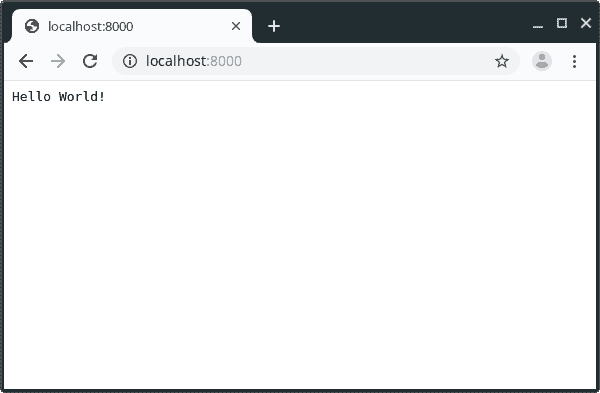

# 用 Bocadillo - Installation 创建博客

> 原文：<https://dev.to/itachiuchiha/building-blog-with-bocadillo-installation-3agp>

我[之前发表过](https://dev.to/aligoren/bocadillo-yet-another-python-framework-57ii)一篇关于博卡迪略的帖子。

在这个系列中，我们将与 Bocadillo 一起创建一个简单的博客。

我希望我们能成功。

**该系列的 GitHub 库**:【https://github.com/aligoren/bocadillo_blog T2】

* * *

## 基础知识

### Virtualenv

我们将使用 virtualenv 来隔离我们的开发环境。

```
mkdir bocadillo_blog

cd bocadillo_blog

virtualenv .

# after finish installation

source bin/activate 
```

Enter fullscreen mode Exit fullscreen mode

我们的命令行应该是这样的；

```
(bocodillo_blog) [YOUR_USER@YOUR_USER-pc bocodillo_blog]$ 
```

Enter fullscreen mode Exit fullscreen mode

### 安装

您可以使用以下命令
安装 bocadillo

```
pip install bocadillo 
```

Enter fullscreen mode Exit fullscreen mode

### 额外安装

您将需要会话来进行身份验证。我们将为此编写一个装饰器。

```
pip install bocadillo[sessions] 
```

Enter fullscreen mode Exit fullscreen mode

## 博卡迪洛要求

您需要 Python 3.6 或更高版本才能使用 Bocadillo。

## 需求文件

我们假设将我们的博客应用程序部署到服务器上。我们需要将所有依赖项添加到需求文件中。

```
pip freeze > requirements.txt 
```

Enter fullscreen mode Exit fullscreen mode

### 我们的第一款应用

我们将使用我们最喜欢的编辑器创建一个名为 **app.py** 的文件。我更喜欢 Visual Studio 代码，但你也可以用你的。

我们稍后将改变我们的项目结构。

```
from bocadillo import App, configure

app = App()
configure(app)

@app.route("/")
async def index(req, res):
    res.text = "Hello World!" 
```

Enter fullscreen mode Exit fullscreen mode

目前就这些。让我们运行这个命令来服务我们的应用程序。

```
uvicorn app:app --reload 
```

Enter fullscreen mode Exit fullscreen mode

不需要安装 uvicorn。已经和博卡迪洛装在一起了。我们使用了 **- reload** 标志，因为我们想避免总是手动重启应用程序。

我们的应用程序现在在端口 8000 上运行。让我们在浏览器上打开`http://localhost:8000`。

是啊！我们做到了:)

我们看到了我们的 **Hello World！**消息。

[](https://res.cloudinary.com/practicaldev/image/fetch/s--GzkBd0LH--/c_limit%2Cf_auto%2Cfl_progressive%2Cq_auto%2Cw_880/https://thepracticaldev.s3.amazonaws.com/i/cml2isxioj7yk2ie84nj.png)

这是我们系列的第一部分。