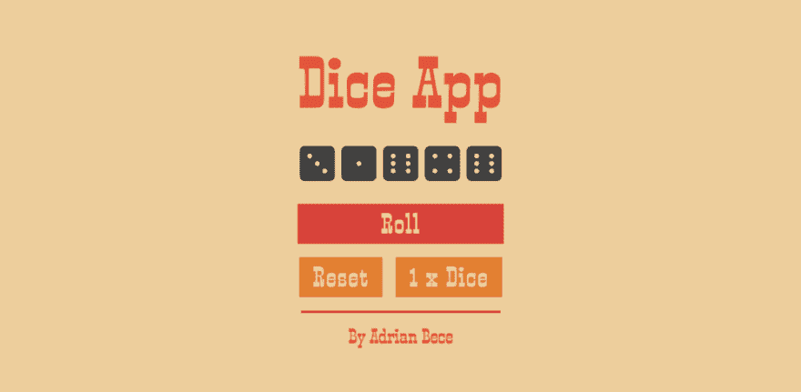

# 构建自定义反应挂钩

> 原文：<https://dev.to/prototyp/building-custom-react-hooks-11h2>

React 钩子简化了创建可重用的、干净的和通用的代码的过程，并且像 memoization 这样的高级优化技术现在更容易获得和使用。React 的官方文档没有详细介绍定制钩子，因为它介绍了基本钩子，所以本文的重点将主要放在构建定制 React 钩子和最佳实践上。

理解基本的 React 挂钩是从本文中获得最大收益所必需的。如果您还不熟悉这些基础知识，那么有很多很棒的文章可以介绍它们。例如， [React 的官方文档](https://reactjs.org/docs/hooks-intro.html)是一个很好的起点。

## 心态

为了构建一个通用的、高性能的和可重用的定制钩子，有几件事情要记住。

### 钩子在每次组件重新渲染时运行

由于我们正在使用功能组件和钩子，我们不再需要生命周期方法。每次状态或道具改变时，功能组件被重新呈现，因此，我们的自定义钩子被一遍又一遍地调用。

### 尽可能使用基本钩子

基本的 React 钩子是任何定制钩子的核心。我们可以使用**记忆化**和**钩子依赖数组**来控制定制钩子的哪些部分在每次重新渲染时会改变或者不会改变。理解每个基本钩子在我们的定制钩子中的作用是很重要的，这样才能有效地使用它们并构建高性能钩子。

### 规则的钩子

有几个重要的规则要记住。这些规则在 [React hooks 文档](https://reactjs.org/docs/hooks-rules.html)中有详细解释。

## 建筑定制挂钩

现在我们已经介绍了基础知识，我们准备构建我们自己的定制钩子。在下面的例子中，我们将建立一个构建定制钩子的可靠模式，并浏览一些最佳实践。

让我们想象一下，我们正在做一个项目，用户可以玩多个游戏，这些游戏使用掷骰子作为他们游戏机制的一部分。一些游戏只需要一个骰子来玩，而一些游戏可能需要多个骰子来玩。我们还假设在一些游戏中，骰子的数量可能会改变。

记住这一点，我们将构建具有以下特性的 **useGameDice** hook:

*   定制钩子可以用正在使用的骰子的数量和初始值来初始化
*   设置正在使用的骰子数量的函数
*   掷骰子的函数。返回 1 到 6 之间的随机数数组。长度由所用骰子的数量决定
*   将所有骰子值重置为初始值的功能

### 设置挂钩(导入和挂钩功能)

我们使用推荐的自定义钩子命名惯例将我们的自定义钩子声明为一个常规的箭头函数——名称应该以“use”关键字开始。我们还导入了 React 挂钩，我们将在稍后的实现中使用它们。我们也可以导入常量、其他函数、其他自定义钩子等等。

我们的钩子可以用两个可选变量初始化:

*   **initialNumberOfDice** -将使用多少个骰子
*   **initialDiceValue** -确定初始值和复位后的值

这两个变量都有默认值 1，以避免任何错误并简化钩子的设置。

```
import { useState, useMemo, useCallback, useEffect } from "react";

export const useGameDice = (initialNumberOfDice = 1, initialDiceValue = 1) => {
 /* We'll be adding code here in order */
}; 
```

Enter fullscreen mode Exit fullscreen mode

### 添加状态和记忆私有变量

首先，我们需要建立我们的国家。我们将声明两个简单的状态:

*   **diceValue**——数组，其大小由骰子数定义，保存每个骰子的值
*   **骰子数量** -决定将要使用的骰子数量(骰子数组大小)

我们还初始化了 **initialDiceState** 变量，该变量创建初始数组值，该值将在初始渲染和状态重置时分配。该值被记忆以避免数组在每次重新呈现时被初始化并填充默认值。

```
 const [diceValue, setDiceValue] = useState();
 const [numberOfDice, setNumberOfDice] = useState(initialNumberOfDice);

 const initalDiceState = useMemo(
   () => Array(numberOfDice).fill(initialDiceValue),
   [numberOfDice, initialDiceValue]
 ); 
```

Enter fullscreen mode Exit fullscreen mode

### 增加记忆挂钩功能

接下来，我们将创建以下函数:

*   **generaterandomdicennumber**-生成一个介于 1 和 6 之间的随机数(一次掷骰子)
*   **rollDice** -为数组中的每个元素调用一个随机数生成器(骰子)
*   **resetDice** -将骰子值状态重置为初始值

```
const generateRandomDiceNumber = useCallback(() => {
   return Math.floor(Math.random() * 6) + 1;
}, []);

const rollDice = useCallback(() => {
   const arrayConfig = { length: numberOfDice };
   const newDiceValues = Array.from(arrayConfig, generateRandomDiceNumber);
   setDiceValue(newDiceValues);
}, [numberOfDice, generateRandomDiceNumber]);

const resetDice = useCallback(() => {
   setDiceValue(initalDiceState);
}, [initalDiceState]); 
```

Enter fullscreen mode Exit fullscreen mode

我们使用 **useCallback** 钩子来控制函数何时被重新初始化。只有当函数的依赖数组中的任何变量发生变化时，函数才会被重新初始化。对于 **generateRandomDiceNumber** 函数，它在第一次渲染和初始化后不会重新初始化，因为该函数不依赖于任何外部变量或状态。

### 添加副作用——钩子初始化&更新

我们需要设置一个监听器来监视初始骰子状态的更新。这个副作用有两个责任:

1.  当钩子第一次初始化时，它将骰子状态设置为初始值
2.  当骰子数(数组大小)改变时，它将骰子状态更新为初始值

```
 useEffect(() => {
   setDiceValue(initalDiceState);
 }, [initalDiceState]); 
```

Enter fullscreen mode Exit fullscreen mode

### API 设置&返回语句

最后，我们正在定义我们的状态和 api 对象，并按照 useState 约定在数组中返回它们。让我们来看看每个对象:

*   **state** -保存我们所有的状态值。我们希望这个对象在几乎每次重新渲染时都会改变
*   **API**——保存所有函数。我们正在返回一些在 **useCallback** 中声明的函数和一个来自 **useState** hook 的函数。这个对象被记忆，因为我们不希望它在每次重新渲染时都改变

```
const state = {
   diceValue,
   numberOfDice
 };

const api = useMemo(
   () => ({
     setNumberOfDice,
     rollDice,
     resetDice
   }),
   [setNumberOfDice, rollDice, resetDice]
 );

 return [state, api]; 
```

Enter fullscreen mode Exit fullscreen mode

我们返回数组中的对象，因为我们希望这个钩子是灵活的。通过这样做，我们允许开发人员重命名返回的变量，并允许他们在需要时初始化这个钩子的多个实例。

```
 const [diceFirst_state, diceFirst_api] = useGameDice();
 const [diceSecond_state, diceSecond_api] = useGameDice(); 
```

Enter fullscreen mode Exit fullscreen mode

### Git 库&演示

你可以在下面的 [GitHub 库](https://github.com/codeAdrian/dice-app)上看到最终实现和完整代码的演示。

[](https://res.cloudinary.com/practicaldev/image/fetch/s--MT-BSqXl--/c_limit%2Cf_auto%2Cfl_progressive%2Cq_auto%2Cw_880/https://thepracticaldev.s3.amazonaws.com/i/2a3wkdqhrntanwfh059d.png)

## React 自定义钩子图案概述

到目前为止，您可能已经注意到，我们将正在添加的代码分组到了各个部分。这种结构清晰的模式遵循一条逻辑路径:

1.  状态初始化(useState，useReducer)、局部变量初始化(useMemo)、ref 初始化(useRef)和外部定制钩子初始化
2.  记忆函数(使用回调)
3.  副作用(使用效果)
4.  api 设置(状态和记忆的 API)
5.  返回语句

## 结论

毫不奇怪，hooks 受到了 React 社区的好评。开发人员能够更容易地在组件之间共享逻辑，为每个定制钩子创建多个组件(接口)，挑选钩子状态的部分和他们将在组件中使用的 API，等等。

这种可重用性和多功能性使 hooks 成为 React 应用程序开发中真正的游戏规则改变者。在构建定制的 React 挂钩时，有了既定的模式和最佳实践，开发人员就能够交付具有一致质量、清晰结构和最佳性能的代码。

* * *

这些文章以咖啡为燃料。所以，如果你喜欢我的工作，觉得它很有用，请考虑给我买杯咖啡吧！我真的很感激。

[](https://www.buymeacoffee.com/ubnZ8GgDJ)

感谢你花时间阅读这篇文章。如果你觉得这很有用，请给它一个❤️或🦄，分享评论。

这篇文章也可以在[媒体](https://medium.com/prototyped/building-custom-react-hooks-f6aad8567825)上找到，所以请随意阅读👏如果你喜欢的话。