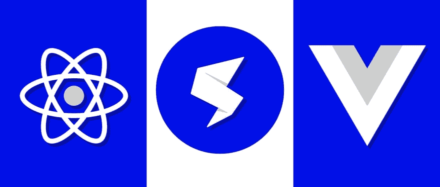

# 使用 React、Vue 和单 spa 构建微前端

> 原文：<https://dev.to/dabit3/building-micro-frontends-with-react-vue-and-single-spa-52op>

[](https://res.cloudinary.com/practicaldev/image/fetch/s--Ugkc02A1--/c_limit%2Cf_auto%2Cfl_progressive%2Cq_auto%2Cw_880/https://thepracticaldev.s3.amazonaws.com/i/wstpdc9ie6iw77qfeam7.jpg)

在过去的几周里，有很多关于微前端的讨论(有些是负面的，有些是正面的)。

有一条来自乔尔·丹宁·‏的推文真正引起了我的注意，他是单身水疗中心的创始人:

> 
> 
> 我是他们的主要推广者之一——AMA😀2019 年 6 月 14 日上午 06:19[](https://twitter.com/intent/tweet?in_reply_to=1139417020347240448)[](https://twitter.com/intent/retweet?tweet_id=1139417020347240448)19[](https://twitter.com/intent/like?tweet_id=1139417020347240448)90

当我看到像这样有争议的新事物时，我总是想亲自尝试一下，看看所有的宣传是关于什么的，这样我就可以形成自己对这个主题的看法。

这让我开始创建一个微前端应用程序，它可以呈现两个独立的 React 应用程序和一个 Vue 应用程序。

在本教程中，我将分享我所学到的东西，并向你展示如何构建一个由 React 和 Vue 应用程序组成的微前端应用程序。

> 要查看该应用程序的最终代码，请点击[此处](https://github.com/dabit3/micro-frontend-example)。

## 单人水疗

我们将用来创建项目的工具是[Single SPA](https://single-spa.js.org/)——一个用于前端微服务的 javascript 框架。

Single SPA 使您能够在一个单页应用程序中使用多个框架，允许您按功能拆分代码，并拥有 Angular、React、Vue.js 等。所有应用都生活在一起。

您可能已经习惯了 Create React APP CLI 和 Vue CLI 的时代。使用这些工具，您可以快速启动整个项目，完成 webpack 配置、依赖项和样板文件。

如果您习惯于这种简单的设置，那么第一部分可能会有些不和谐。这是因为我们将从头开始创建一切，包括安装我们需要的所有依赖项，以及从头创建 webpack 和 babel 配置。

> 如果你仍然好奇单个 SPA 是做什么的，或者为什么你可能想要使用微前端架构来构建，请查看[这个](https://www.youtube.com/watch?v=L4jqow7NTVg&feature=youtu.be)视频。

## 入门

你需要做的第一件事是创建一个新的文件夹来存放应用程序，并转到目录:

```
mkdir single-spa-app

cd single-spa-app 
```

接下来，我们将初始化一个新的 package.json 文件:

```
npm init -y 
```

现在，*这是有趣的部分*。我们将安装这个项目所需的所有依赖项。我将把这些分成单独的步骤。

#### 安装常规依赖项

```
npm install react react-dom single-spa single-spa-react single-spa-vue vue 
```

#### 安装通天塔依赖项

```
npm install @babel/core @babel/plugin-proposal-object-rest-spread @babel/plugin-syntax-dynamic-import @babel/preset-env @babel/preset-react babel-loader --save-dev 
```

#### 安装 webpack 依赖项

```
npm install webpack webpack-cli webpack-dev-server clean-webpack-plugin css-loader html-loader style-loader vue-loader vue-template-compiler --save-dev 
```

现在，所有的依赖项都已安装，我们可以创建我们的文件夹结构了。

我们应用程序的主要代码将位于一个 **src** 目录中。这个 **src** 目录将为我们的每个应用程序保存子文件夹。让我们继续在 **src** 文件夹:
中创建 **react** 和 **vue** 应用程序文件夹

```
mkdir src src/vue src/react 
```

现在，我们可以为 webpack 和 babel 创建配置。

#### 创建 webpack 配置

在主应用程序的根目录下，用下面的代码创建一个`webpack.config.js`文件:

```
const path = require('path');
const webpack = require('webpack');
const { CleanWebpackPlugin } = require('clean-webpack-plugin');
const VueLoaderPlugin = require('vue-loader/lib/plugin')

module.exports = {
  mode: 'development',
  entry: {
    'single-spa.config': './single-spa.config.js',
  },
  output: {
    publicPath: '/dist/',
    filename: '[name].js',
    path: path.resolve(__dirname, 'dist'),
  },
  module: {
    rules: [
      {
        test: /\.css$/,
        use: ['style-loader', 'css-loader']
      }, {
        test: /\.js$/,
        exclude: [path.resolve(__dirname, 'node_modules')],
        loader: 'babel-loader',
      },
      {
        test: /\.vue$/,
        loader: 'vue-loader'
      }
    ],
  },
  node: {
    fs: 'empty'
  },
  resolve: {
    alias: {
      vue: 'vue/dist/vue.js'
    },
    modules: [path.resolve(__dirname, 'node_modules')],
  },
  plugins: [
    new CleanWebpackPlugin(),
    new VueLoaderPlugin()
  ],
  devtool: 'source-map',
  externals: [],
  devServer: {
    historyApiFallback: true
  }
}; 
```

#### 创造巴别塔构型

在主应用程序的根目录下，用下面的代码创建一个`.babelrc`文件:

```
{  "presets":  [  ["@babel/preset-env",  {  "targets":  {  "browsers":  ["last 2 versions"]  }  }],  ["@babel/preset-react"]  ],  "plugins":  [  "@babel/plugin-syntax-dynamic-import",  "@babel/plugin-proposal-object-rest-spread"  ]  } 
```

#### 初始化单 spa

注册应用程序是我们告诉**单 spa** 何时以及如何引导、装载和卸载应用程序的方式。

在`webpack.config.js`文件中，我们将进入点设置为`single-spa.config.js`。

让我们继续在项目的根目录下创建该文件并对其进行配置。

#### [T1】single-spa . config . js](#singlespaconfigjs)

```
import { registerApplication, start } from 'single-spa'

registerApplication(
  'vue', 
  () => import('./src/vue/vue.app.js'),
  () => location.pathname === "/react" ? false : true
);

registerApplication(
  'react',
  () => import('./src/react/main.app.js'),
  () => location.pathname === "/vue"  ? false : true
);

start(); 
```

该文件是您注册所有应用程序的地方，这些应用程序将成为主单页应用程序的一部分。对`registerApplication`的每个调用注册一个新的应用程序，并接受三个参数:

1.  应用名称
2.  加载函数(加载哪个入口点)
3.  活动功能(判断是否加载应用程序的逻辑)

接下来，我们需要为每个应用程序创建代码。

### React app

在 **src/react** 中，创建以下两个文件:

```
touch main.app.js root.component.js 
```

#### src/react/main.app.js

```
import React from 'react';
import ReactDOM from 'react-dom';
import singleSpaReact from 'single-spa-react';
import Home from './root.component.js';

function domElementGetter() {
  return document.getElementById("react")
}

const reactLifecycles = singleSpaReact({
  React,
  ReactDOM,
  rootComponent: Home,
  domElementGetter,
})

export const bootstrap = [
  reactLifecycles.bootstrap,
];

export const mount = [
  reactLifecycles.mount,
];

export const unmount = [
  reactLifecycles.unmount,
]; 
```

#### src/react/root . component . js

```
import React from "react"

const App = () => <h1>Hello from React</h1> 
export default App 
```

### 检视应用程式

在 **src/vue** 中，创建以下两个文件:

```
touch vue.app.js main.vue 
```

#### src/view/view . app . js

```
import Vue from 'vue';
import singleSpaVue from 'single-spa-vue';
import Hello from './main.vue'

const vueLifecycles = singleSpaVue({
  Vue,
  appOptions: {
    el: '#vue',
    render: r => r(Hello)
  } 
});

export const bootstrap = [
  vueLifecycles.bootstrap,
];

export const mount = [
  vueLifecycles.mount,
];

export const unmount = [
  vueLifecycles.unmount,
]; 
```

#### src/view/main . view

```
<template>
  <div>
      <h1>Hello from Vue</h1>
  </div> </template> 
```

接下来，在应用程序的根目录下创建 index.html 文件:

```
touch index.html 
```

#### index.html

```
<html>
  <body>
    <div id="react"></div>
    <div id="vue"></div>
    <script src="/dist/single-spa.config.js"></script>
  </body>
</html> 
```

### 用脚本更新 Package.json

要运行这个应用程序，让我们在 package.json:
中添加启动脚本和构建脚本

```
"scripts":  {  "start":  "webpack-dev-server --open",  "build":  "webpack --config webpack.config.js -p"  } 
```

### 运行 app

要运行应用程序，运行`start`脚本:

```
npm start 
```

现在，您可以访问以下网址:

```
# renders both apps
http://localhost:8080/

# renders only react
http://localhost:8080/react

# renders only vue
http://localhost:8080/vue 
```

> 要查看该应用程序的最终代码，请点击[此处](https://github.com/dabit3/micro-frontend-example)。

## 结论

总的来说，除了所有的初始样板文件设置之外，设置这个项目相当容易。

我认为将来有某种 CLI 来处理大部分样板文件和初始项目设置会很好。

如果你需要这种类型的架构， [Single-spa](https://single-spa.js.org/) 看起来绝对是目前最成熟的方式，并且非常适合使用。

> 我的名字是纳德·达比特。我是亚马逊网络服务的一名开发者倡导者，负责像 [AWS AppSync](https://aws.amazon.com/appsync/) 和 [AWS Amplify](https://aws-amplify.github.io/) 这样的项目。我专门从事跨平台&云应用开发。