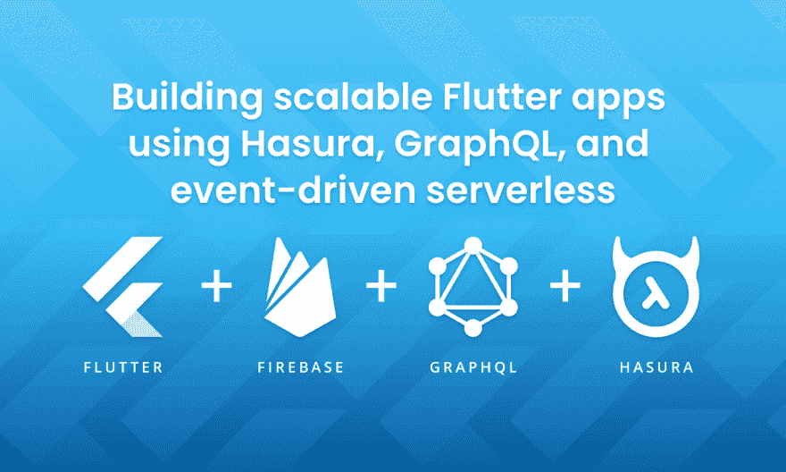

# 使用 GraphQL、Hasura 和事件驱动的无服务器构建可伸缩的 Flutter 应用程序，第 3 部分——构建 Flutter 客户端

> 原文：<https://dev.to/hasurahq/building-scalable-flutter-apps-using-graphql-hasura-and-event-driven-serverless-part-3-building-the-flutter-client-4844>

[](https://res.cloudinary.com/practicaldev/image/fetch/s--KJ5Rr_0---/c_limit%2Cf_auto%2Cfl_progressive%2Cq_auto%2Cw_880/https://blog.hasura.io/conteimg/2019/09/hasura-flutter-wo-border-8.png)

*本教程由*[*Can tap NAR*](https://twitter.com/cntaspinar)*编写，并作为 [Hasura 技术作者计划](https://blog.hasura.io/the-hasura-technical-writer-program/)的一部分发布，该计划旨在支持为开源 Hasura GraphQL 引擎编写指南和教程的作者。*

## 简介

这是“用 Hasura & Firebase 构建一个问答 app”的第三部分。在这最后一部分，我们将创建颤振前端。

> **[第 1 部分](https://blog.hasura.io/build-flutter-app-graphql-hasura-serverless-part1/)** 讲述了如何部署 Hasura 以及如何用权限对关系数据建模。 **[第 2 部分](https://blog.hasura.io/build-flutter-app-hasura-firebase-part2/)** ，介绍了如何通过结合 Hasura 和 Firebase 服务来处理 Auth 和业务逻辑。

为了简单起见，我们不打算覆盖所有的 Flutter 代码。相反，我们将研究重要的部分。你可以在 [GitHub](https://github.com/cantaspinar/hasura_trivia) 上找到完成的项目。

## 制作颤振前端

在 **pubspec.yaml** 文件中需要以下依赖关系。

```
dependencies:
  flutter:
    sdk: flutter
  graphql_flutter: ^1.0.0
  firebase_auth: ^0.11.1+11
  cloud_functions: ^0.4.1 
```

Flutter 应用程序需要一个设置来连接您的 Firebase 项目。你可以按照[这个指南](https://firebase.google.com/docs/flutter/setup)。

该应用程序由 6 个屏幕组成。

*   主要的
*   注册
*   签约雇用
*   玩
*   结果
*   得分

### 主

这是 app 的入口。首先要做的是检查是否有登录的用户。