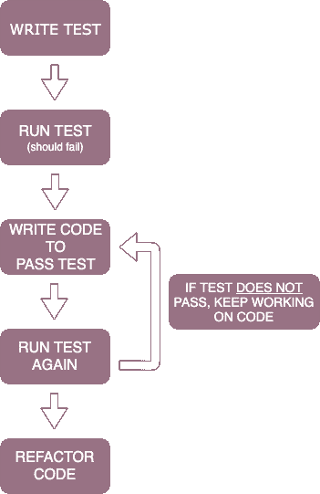
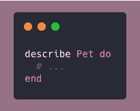
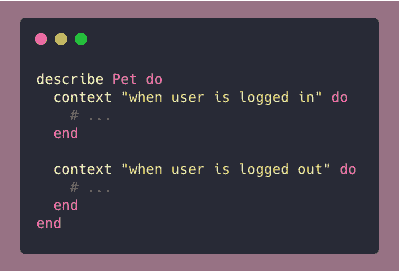
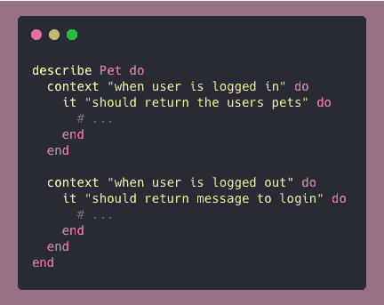
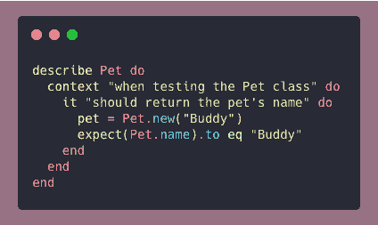

# 用 Ruby 构建测试:基础

> 原文：<https://dev.to/torianne02/building-tests-in-ruby-the-basics-59mo>

在我在 bootcamp 的整个时间里，学习环境是建立在测试之上的，这意味着我通过运行测试、发现我的错误以及调试代码来学习，以了解什么可行，什么不可行。这里的一个大问题是，从来没有人教过美国学生如何构建这些测试。我知道他们长什么样。我隐约明白每一行在做什么，但我从来不明白后台发生了什么。

直到最近，我才决定要接受学习如何构建自己的测试的挑战。我在找工作和参与科技 Twitter 世界时学到的一点是*测试驱动开发是开发人员需要掌握的一项重要技能*。TDD 是我作为 SWE 的第一份工作中最有可能需要学习的技能，所以我想我应该在找工作的时候把它教给自己。

在学习构建自己的测试时，我遇到了相当多有用的教程，但是没有几个能够分解每一行在幕后真正做了什么。这也是我写这个博客系列的原因，*用 Ruby 构建测试*。我想为初学者提供 RSpec 测试的幕后知识。这是本系列的第一篇文章，我将介绍 RSpec 测试的基本结构。我们开始吧！

### 什么是 TDD？

在我们开始构建 RSpec 测试之前，让我们首先定义 TDD。

> 测试驱动开发(TDD)是一个软件开发过程，它依赖于一个非常短的开发周期的重复:首先，开发人员编写一个(最初失败的)自动化测试 cast，定义一个期望的改进或新功能，然后生成最少数量的代码来通过测试，最后根据可接受的标准重构新代码。

*引自[测试驱动开发(TDD):示例演练](https://technologyconversations.com/2013/12/20/test-driven-development-tdd-example-walkthrough/)*

TDD 遵循的一般步骤是

TDD 允许开发人员测试他们对正在构建的特定特性的功能期望。例如，如果一个开发人员想要创建一个用户模型，他们可以构建一个测试来检查以确保用户是用期望的参数创建的。开发人员将首先构建测试，运行这些测试，然后构建用户模型，再次运行测试直到通过，然后重构他们的代码。TDD 就是这么简单！

### 什么是 RSpec？

RSpec 是一个领域特定语言(DSL)工具，用于用 Ruby 编写单元测试。值得注意的是，RSpec 被认为是 BDD(行为驱动开发)，它是作为 TDD 的一个子类创建的。你可以在这里了解更多关于 BDD [的信息。](https://medium.com/javascript-scene/behavior-driven-development-bdd-and-functional-testing-62084ad7f1f2)

### 建筑测试

#### 第一步

构建 RSpec 测试时，您需要做的第一件事是将 [rspec gem](https://github.com/rspec/rspec) 添加到您的`Gemfile`中，然后在您将要编写测试的文件中需要它。

#### 第二步:`describe`屏蔽

现在开始实际编写我们的测试……我们需要编码的第一件事是我们的`describe`块，它允许我们将我们的测试组合在一起作为一个集合。`describe`块允许我们告诉 RSpec 我们将测试哪个类，它接受类名或字符串作为参数。

`describe`块是我们在 Ruby 中测试的父块，这意味着我们所有的其他块和测试组件都将是这个块的子块。

#### 第三步:`context`屏蔽

我们的`describe`块中的第一个子块是`context`块，它也接受类名或字符串作为参数。虽然`context`块不是 RSpec 测试的必要组件，但是它们非常有用，有助于添加更多关于测试的细节。`context`块允许您创建子组。这使得用不同的上下文测试组变得更加容易，例如当用户登录或者当用户未登录时。

#### 第四步:`it`屏蔽

`describe`块的基本子块是`it`块。`it`用于定义测试/测试用例的具体行为。正如前两个块一样，它也接受类名或字符串作为其参数，但习惯上只将一个字符串传递给块参数。通常，使用的字符串参数应该包含单词“should”来描述测试的行为。

换句话说，`it`块描述了预期的结果，这就引出了我的下一个主题，`expect`关键字。`expect`用于定义测试的期望，并验证期望的条件已经满足。

*注意:在这篇文章中，我将讨论与`expect`相关的两个最常见的关键词。在接下来的文章中，我会更详细地介绍其他可以在这里使用的关键词。*

##### `to`和`eql`

`to`和`eql`关键字与`expect`一起使用，以验证测试是否输出预期值。`to`用于我们期望响应/消息**到**是什么的意思。`eql`在这个时候开始发挥作用，因为它帮助我们完成 expect 语句的剩余部分。我们**期望**我们的反应**等于**某事。

`to`和`eql`使得`expect`语句易于阅读，因为它像普通的句子一样流畅。在`expect(message).to eq “Hello World!”`的情况下，听起来就像“期待消息等同于 hello world！”

*注意:要确定等式是假还是真，你可以用关键字`not_to`代替`to`。*

### 最后的想法

是的，我们涵盖了构成 RSpec 测试的最基本的组件。我们讨论了构建 RSpec 测试的三个重要模块，`describe`、`context`和`it`，以及可以在其中使用的关键字。

我希望读完这篇文章后，你能更好地理解为什么我们在测试中使用不同的块和关键字。在本系列即将发布的文章中，我将介绍与关键字`expect`一起使用的其他方法以及其他 RSpec 方法，敬请关注。

注意:本周的封面图片来自爱尔兰的康尼马拉(我的家族/家族的发源地)。

#### 来源

[RSpec 教程](https://www.tutorialspoint.com/rspec/index.htm)
[权威的 RSpec 教程附实例](https://www.rubyguides.com/2018/07/rspec-tutorial/)
[测试驱动开发简介(TDD)](https://hackernoon.com/introduction-to-test-driven-development-tdd-61a13bc92d92)
[面向 Ruby 的行为驱动开发。让 TDD 变得高效和有趣。](https://rspec.info/)